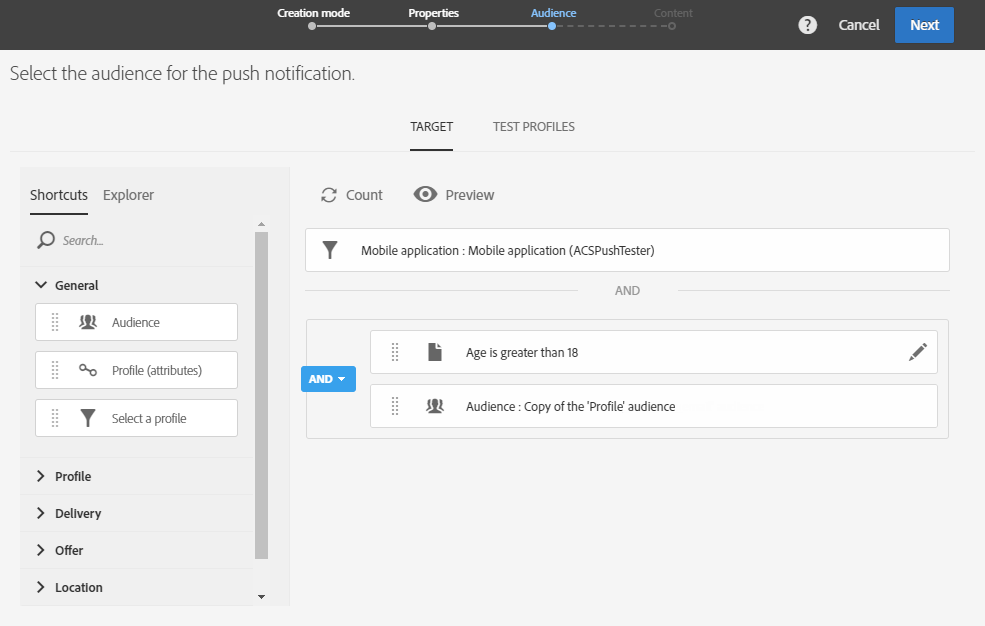

# Preparação e envio de uma notificação por push{#preparing-and-sending-a-push-notification}

## Preparando a notificação {#preparing-the-notification}

As etapas para criar uma notificação por push com o Adobe Campaign são:

1. Na janela **[!UICONTROL Marketing activities]**, [crie uma nova atividade de marketing](../../start/using/marketing-activities.md#creating-a-marketing-activity).

   Observe que uma única notificação por push também pode ser criada a partir de uma [campanha](../../start/using/marketing-activities.md#creating-a-marketing-activity) ou do home page Adobe Campaign [a3/>.](../../start/using/interface-description.md#home-page)

   Você também pode usar uma atividade de delivery de notificação por push em um fluxo de trabalho. Essa atividade é apresentada na seção [delivery de notificação por push](../../automating/using/push-notification-delivery.md).

1. Selecione **[!UICONTROL Push notification]**.
1. Selecione um modelo.

   

   Por padrão, você pode selecionar um dos dois modelos a seguir:

   * **[!UICONTROL Send push to Campaign profiles]**: use este modelo para público alvo dos perfis do Adobe Campaign CRM que se inscreveram em seu aplicativo móvel e opt in receber notificações por push. Você pode inserir os campos [personalization](../../designing/using/personalization.md#inserting-a-personalization-field) na notificação por push, como o nome do recipient.
   * **[!UICONTROL Send push to app subscribers]**: use este modelo para enviar uma notificação por push a todos os usuários conhecidos e anônimos do aplicativo móvel que opt in receber notificações do aplicativo. Você pode personalizar essas mensagens com dados coletados do seu aplicativo móvel.

   Você também pode selecionar modelos multilíngues. Para obter mais informações, consulte [Criação de uma notificação por push multilíngue](../../channels/using/creating-a-multilingual-push-notification.md).

   Para obter mais informações sobre modelos, consulte a seção [Gerenciar modelos](../../start/using/marketing-activity-templates.md).

1. Insira suas propriedades de notificação por push e selecione seu aplicativo móvel no campo **[!UICONTROL Associate a Mobile App to a delivery]**.

   Observe que o menu suspenso exibirá os aplicativos SDK V4 e Experience Platform SDK.

   

   Você pode vincular a notificação por push a uma campanha. Para fazer isso, selecione-o nas campanhas que já foram criadas.

1. Na tela a seguir, você pode especificar uma audiência, por exemplo, todos os clientes VIP que se inscreveram em um aplicativo móvel específico. Para obter mais informações, consulte [Criando audiência](../../audiences/using/creating-audiences.md).

   Sua audiência será filtrada automaticamente com base no aplicativo móvel selecionado na etapa anterior.

   

1. Agora você pode personalizar sua notificação por push. Primeiro, escolha o estilo da mensagem: **[!UICONTROL Alert/Message/Badge]** ou **[!UICONTROL Silent push]**. Os tipos de notificação por push são descritos na seção [Sobre notificações por push](../../channels/using/about-push-notifications.md).

   Edite o conteúdo de sua notificação por push e defina as opções avançadas. Consulte [Personalizando uma notificação por push](../../channels/using/customizing-a-push-notification.md).

   

   O conteúdo e as opções de notificação por push configurados aqui são passados para seu aplicativo móvel na forma de uma carga. A estrutura detalhada da carga é descrita na nota técnica [Noções básicas sobre a estrutura de carga das notificações por push ACS](https://helpx.adobe.com/br/campaign/kb/understanding-campaign-standard-push-notifications-payload-struc.html).

1. Clique em **[!UICONTROL Create]**.

   

1. Antes de enviar a notificação, você pode testá-la com perfis de teste e depois ver exatamente o que seus recipient verão antes de enviar o delivery. Selecione **[!UICONTROL Audiences]** no resumo do delivery e clique na guia **[!UICONTROL Test profiles]**.

   Para obter mais informações sobre como enviar testes, consulte [Testar perfis](../../sending/using/sending-proofs.md).

1. Selecione seus perfis de teste e clique em **[!UICONTROL Preview]** para exibir a notificação: o conteúdo é personalizado com os dados do perfil de teste.
1. Verifique o layout da notificação por push em diferentes dispositivos: selecione iPhone, telefone Android, iPad ou tablet Android para pré-visualização da renderização.

   

1. O **[!UICONTROL Estimated Payload Size]** é uma estimativa baseada nos dados do perfil de teste. O tamanho real da carga pode variar. O limite da mensagem é de 4 KB.

   >[!CAUTION]
   >
   >Se o tamanho da carga exceder o limite de 4 KB, a mensagem não será entregue.

Observe que os dados de personalização afetam o tamanho da mensagem.

## Enviando a notificação {#sending-the-notification}

As notificações por push podem ser enviadas para uma audiência selecionada no Adobe Campaign definindo os critérios de audiência. Por exemplo abaixo, nossa audiência selecionada consiste em 4 assinantes de aplicativos móveis direcionados.

1. Clique em **[!UICONTROL Prepare]** para calcular o público alvo e gerar as notificações.

   

1. Quando a preparação for concluída com êxito, a janela **[!UICONTROL Deployment]** apresentará os seguintes KPIs: **[!UICONTROL Target]** e **[!UICONTROL To deliver]**. Observe que a contagem **[!UICONTROL To deliver]** é inferior à de **[!UICONTROL Targeted]** devido a exclusões que podem ser exibidas clicando no botão  na parte inferior da janela **[!UICONTROL Deployment]**.

   

1. Na guia **[!UICONTROL Exclusion logs]**, você pode encontrar a lista de todas as mensagens excluídas do público alvo enviado e o motivo por trás dessa exclusão.

   Aqui, podemos ver que um de nossos assinantes de aplicativos móveis foi excluído porque o endereço estava na lista de bloqueios e os outros assinantes porque o perfil era um duplicado.

   

1. Clique na guia **[!UICONTROL Exclusion causes]** para exibir o volume de mensagens excluídas.

   

1. Agora você pode clicar em **[!UICONTROL Confirm]** para start de envio de notificações por push.
1. Verifique o status do delivery no painel de mensagens e logs. Para obter mais informações, consulte [Enviar mensagens](../../sending/using/confirming-the-send.md) e [Logs do delivery](../../sending/using/monitoring-a-delivery.md#delivery-logs).

   Neste exemplo, o painel de mensagem exibe que a Adobe Campaign tentou enviar duas notificações por push: um foi entregue com êxito ao dispositivo e outro falhou. Para saber por que o delivery apresenta erros, clique no botão  na parte inferior da janela **[!UICONTROL Deployment]**.

   

1. Na janela **[!UICONTROL Deployment]**, clique na guia **[!UICONTROL Sending logs]** para acessar a lista de notificações por push enviadas e seus status. Para este delivery, uma notificação por push foi enviada com êxito, enquanto a outra falhou devido a um token de dispositivo inválido. Esse assinante será então adicionado à lista de bloqueios a partir de outros delivery.

   >[!NOTE]
   >
   >Os motivos podem ser qualquer falha no Adobe Campaign. No caso de falhas de provedores como apns e fcm, a razão também refletirá isso. Para obter mais informações sobre falhas no provedor, consulte a documentação [Apple](https://developer.apple.com/library/content/documentation/NetworkingInternet/Conceptual/RemoteNotificationsPG/CommunicatingwithAPNs.html) e [Android](https://firebase.google.com/docs/cloud-messaging/http-server-ref).

   

Agora você pode medir o impacto do delivery de notificação por push com relatórios dinâmicos.

**Tópicos relacionados:**

* [Relatório de notificação por push](../../reporting/using/push-notification-report.md)
* [Enviar uma notificação por push em um workflow](../../automating/using/push-notification-delivery.md)
