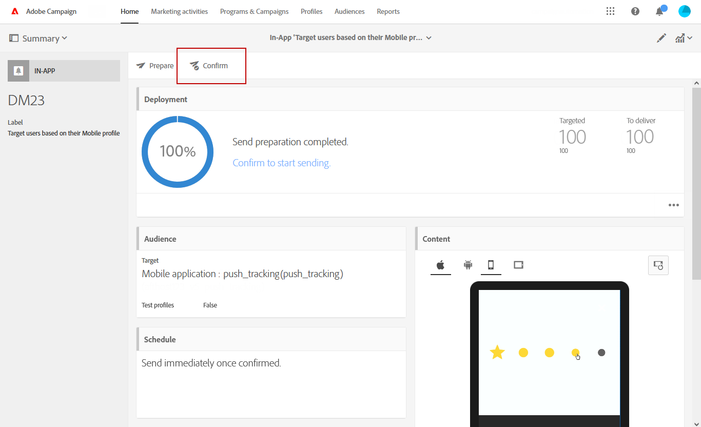

# Preparing and sending an In-App message{#preparing-and-sending-an-in-app-message}

>[!NOTE]
>
>A personalização no aplicativo depende de um campo de ligação que normalmente é uma ID de CRM e/ou ID de logon de aplicativo móvel. Você é o único responsável por proteger esse campo de ligação quando usado em conexão com o Adobe Campaign. Se você não manter seus campos de ligação protegidos, sua mensagem personalizada pode estar vulnerável. A Adobe não será responsável por danos decorrentes de acesso ou uso não autorizado de quaisquer dados de perfil caso você não siga as práticas seguras de composição, gerenciamento e proteção do campo de ligação.

Três tipos de mensagens no aplicativo estão disponíveis no Adobe Campaign:

* **[!UICONTROL Target users based on their Campaign profile (inAppProfile)]**: Esse tipo de mensagem permite que você direcione os perfis do Adobe Campaign (perfis CRM) que assinaram seu aplicativo móvel. Este tipo de mensagem pode ser personalizado com todos os atributos de perfil disponíveis no Adobe Campaign, mas requer um handshake seguro entre o Mobile SDK e o serviço de mensagens no aplicativo da campanha para garantir que as mensagens com informações pessoais e confidenciais sejam usadas apenas por usuários autorizados.

   Para baixar esse tipo de mensagem nos dispositivos dos usuários, o SDK móvel deve enviar campos de ligação usados para conectar um perfil móvel a um perfil de CRM no Adobe Campaign. For more information on SDK APIs required to support In-App, refer to this [page](https://aep-sdks.gitbook.io/docs/using-mobile-extensions/adobe-campaign-standard/adobe-campaign-standard-api-reference).

* **[!UICONTROL Target all users of a Mobile app (inAppBroadcast)]**: Esse tipo de mensagem permite enviar mensagens a todos os usuários (atual ou futuro) do aplicativo móvel mesmo que não tenham um perfil existente no Adobe Campaign. A personalização não é possível, portanto, ao personalizar as mensagens, pois o perfil do usuário pode nem mesmo existir no Adobe Campaign.
* **[!UICONTROL Target users based on their Mobile profile (inApp)]**: Esse tipo de mensagem permite que você direcione todos os usuários conhecidos ou anônimos de um aplicativo móvel que tenha um perfil móvel no Adobe Campaign. Este tipo de mensagens pode ser personalizado usando apenas atributos não pessoais e não relacionados, e não requer handshake seguro entre o SDK móvel e o serviço de mensagens no aplicativo do Adobe Campaign.

   For more information on how to handle personal and sensitive data, refer to [Handling mobile profile fields with personal and sensitive data](../../channels/using/preparing-and-sending-an-in-app-message.md#handling-mobile-profile-fields-with-personal-and-sensitive-data).

## Handling mobile profile fields with personal and sensitive data {#handling-mobile-profile-fields-with-personal-and-sensitive-data}

In Adobe Campaign, mobile profile attributes data sent from mobile device are stored in **[!UICONTROL Subscriptions to an application (appSubscriptionRcp)]** resource which allows you to define the data that you want to collect from your applications' subscribers.

Esse recurso precisa ser estendido para coletar dados que pretende enviar do dispositivo móvel para o Adobe Campaign. To do so, refer to this [page](../../developing/using/extending-the-subscriptions-to-an-application-resource.md) for the detailed steps.

Para permitir a personalização de suas mensagens no aplicativo com mais segurança, os campos do perfil móvel desse recurso precisam ser configurados adequadamente. In your **[!UICONTROL Subscriptions to an application (appSubscriptionRcp)]**, when creating your new mobile profiles fields, check **[!UICONTROL Personal and Sensitive]** to make them unavailable during In-App messages personalization.

>[!NOTE]
>
>Se você tiver uma implementação existente com a extensão de recurso personalizada nesta tabela, recomendamos que rotule os campos adequadamente antes de usá-los para personalizar as mensagens no aplicativo.

Once your **[!UICONTROL Subscriptions to an application]** custom resource is configured and published, you can start preparing your In-App delivery using the **[!UICONTROL Target users based on their Mobile profile (inApp)]** template. Only non-personal and non-sensitive fields will be available from **[!UICONTROL Subscriptions to an application (appSubscriptionRcp)]** resource for personalization.

If you require personalization with **Personal and Sensitive** fields, we recommend using the **[!UICONTROL Target users based on their Campaign profile (inAppProfile)]** template which has additional security mechanism to ensure that your users' PII data remains secure.

## Preparing your In-App message {#preparing-your-in-app-message}

As etapas para criar uma mensagem independente no aplicativo com o Adobe Campaign são:

1. From Adobe Campaign home page, click the **[!UICONTROL In-App messaging]** card.

   You can also create an In-App from the **Marketing activities** tab, by clicking the **[!UICONTROL Create]** button.

   Observe que uma mensagem no aplicativo também pode ser criada a partir de uma campanha ou da página inicial do Adobe Campaign ou em um fluxo de trabalho.

1. Select **In-App message**.

   

1. Selecione um modelo apropriado com base nas suas necessidades de direcionamento de público-alvo.

   

   Por padrão, você pode selecionar um dos três modelos prontos para uso:

   * **[!UICONTROL Target users based on their Campaign CRM profile (inAppProfile)]**
   * **[!UICONTROL Target all users of a Mobile app (inAppBroadcast)]**
   * **[!UICONTROL Target users based on their Mobile profile (inApp)]**

1. Enter the In-App message properties and select your mobile app in the **[!UICONTROL Associate a Mobile App to a delivery]** field.

   

1. Selecione o público-alvo que deseja direcionar para a mensagem no aplicativo. Seu público-alvo é pré-filtrado dependendo do aplicativo móvel associado a esta entrega.

   Note that this step is not needed with the **[!UICONTROL Broadcast an In-App message (inAppBroadcast)]** since it targets all users of a mobile application.

   

1. In the **[!UICONTROL Triggers]** tab, drag and drop the event that will trigger your message. Escolhendo um acionador, escolha uma ação executada pelos usuários que farão com que a mensagem no aplicativo seja exibida.

   Há quatro categorias de eventos disponíveis:

   * **[!UICONTROL Mobile Application events]**: Eventos personalizados implementados em seu aplicativo móvel.

      For more on events creations, refer to this [page](https://helpx.adobe.com/campaign/kb/configuring-app-sdk.html).

   * **[!UICONTROL Life Cycle events]**: Eventos de ciclo de vida prontos para uso compatíveis com o SDK do Adobe Mobile.

      For more on life cycle events, refer to this [page](https://marketing.adobe.com/resources/help/en_US/mobile/android/metrics.html).

   * **[!UICONTROL Analytics Events]**: As três categorias a seguir são suportadas dependendo do que é instrumentado no aplicativo móvel: Adobe Analytics, dados de contexto ou estado exibir.

      Observe que esses eventos estão disponíveis somente se você tiver uma licença do Adobe Analytics.

   * **[!UICONTROL Places]**: As três categorias a seguir aproveitam dados de localização em tempo real para fornecer experiências móveis relevantes contextualmente: Posiciona os dados de contexto, Posiciona metadados personalizados ou o tipo de evento Lugares.

      For more information on Adobe Places, refer to the [Places documentation](https://placesdocs.com/).
   

1. If you use an **[!UICONTROL Analytics Events]**, Adobe Analytics and View state events will be automatically populated based on the report suites configured in the Analytics extension in Adobe Experience Platform Launch whereas Context data events have to be manually added.

   Observe que esses eventos estão disponíveis somente se você tiver uma licença do Adobe Analytics.

   

1. If you use a **[!UICONTROL Places]** trigger, Places context data, Places custom metadata or Places event type will be automatically populated based on all the Libraries and their Points of Interest created in Adobe Places.

   Observe que esse acionador será aplicado no dispositivo somente para os Pontos de interesse das Bibliotecas selecionadas na extensão Locais na Plataforma de experiências Launch Platform. For more information on the Places extension and how to install it, refer to this [documentation](https://aep-sdks.gitbook.io/docs/using-mobile-extensions/places-extension-1/places-extension).

1. In the **[!UICONTROL Frequency & duration]** tab, choose the frequency for your trigger, the start and end date, day of the week and time of the day when your In-App message will be active.

   

1. Edite o conteúdo de sua mensagem e defina as opções avançadas. See [Customizing an In-App message](https://helpx.adobe.com/campaign/standard/channels/using/customizing-a-push-notification.html).

   

1. Click **[!UICONTROL Create]**.

Sua mensagem no aplicativo está pronta para ser enviada para o público-alvo direcionado.

**Tópicos relacionados:**

* [Personalização de uma mensagem no aplicativo](../../channels/using/customizing-an-in-app-message.md)
* [Relatório no aplicativo](../../reporting/using/in-app-report.md)
* [Envio de uma mensagem no aplicativo dentro de um fluxo de trabalho](../../automating/using/in-app-delivery.md)

## Sending your In-App message {#sending-your-in-app-message}

Depois que terminar de preparar a entrega e as etapas de aprovação tiverem sido executadas, você poderá enviar sua mensagem.

1. Click **[!UICONTROL Prepare]** to compute the target and generate the messages.

   

1. Ao concluir com êxito a preparação, a janela **Deployment** apresenta os seguintes KPIs: **Target** e **To deliver**.

   You can check the Deployment window by clicking the  button for potential exclusions or errors in your delivery.

   

1. Click **[!UICONTROL Confirm]** to start sending your In-App message.

   

1. Verifique o status da entrega através do painel de mensagens e logs. For more on this, refer to this [section](../../sending/using/monitoring-a-delivery.md).

   **[!UICONTROL Delivered]** e **[!UICONTROL Sent]** as contagens kpis são baseadas no que é enviado com sucesso do serviço de entrega Campanha para mensagens. Observe que esses kpis não são uma indicação da contagem de dispositivos móveis que receberam ou baixaram a mensagem com sucesso do serviço de entrega de Mensagens.

   

1. Meça o impacto das mensagens no aplicativo com os relatórios de entrega. For more on reporting, refer to [this section](../../reporting/using/in-app-report.md).

**Tópicos relacionados:**

* [Relatório no aplicativo](../../reporting/using/in-app-report.md)
* [Envio de uma mensagem no aplicativo dentro de um fluxo de trabalho](../../automating/using/in-app-delivery.md)

