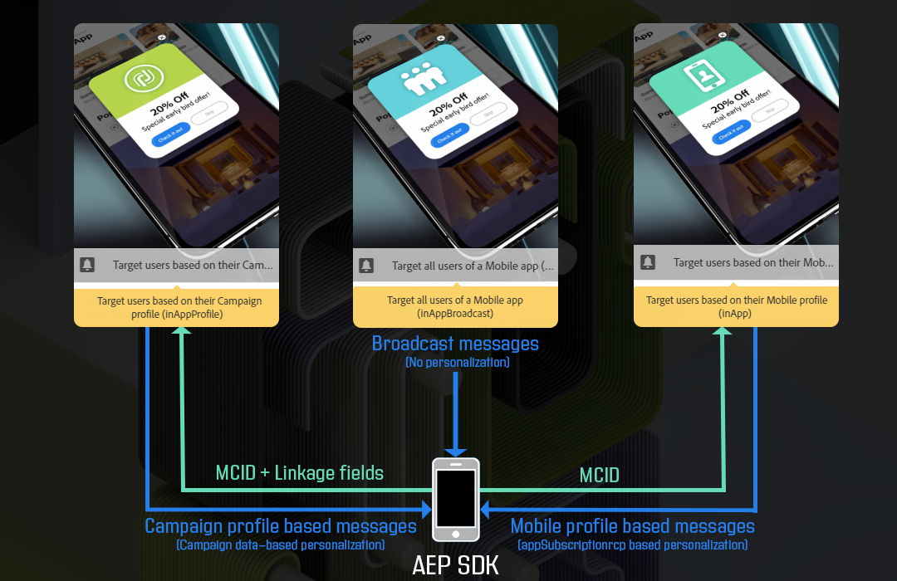

# Preparação e envio de uma mensagem no aplicativo{#preparing-and-sending-an-in-app-message}

>[!NOTE]
>
>A personalização no aplicativo depende de um campo de vinculação que normalmente é uma ID de CRM e/ou ID de logon de aplicativo móvel. Você é o único responsável pela proteção desse campo de vinculação quando usado em conexão com o Adobe Campaign. Se você não conseguir manter os campos de vinculação protegidos, a mensagem personalizada poderá ficar vulnerável. A Adobe não será responsável por danos decorrentes do acesso não autorizado ou do uso de quaisquer dados de perfil se você não seguir as práticas seguras de proteção, gerenciamento e composição de campos de vinculação.

Dois tipos de listas estão disponíveis no Adobe Campaign:

* **[!UICONTROL Target users based on their Campaign profile (inAppProfile)]**: esse tipo de mensagem permite direcionar perfis do Adobe Campaign (perfis CRM) que assinaram seu aplicativo para dispositivos móveis. Esse tipo de mensagem pode ser personalizado com todos os atributos de perfil disponíveis no Adobe Campaign, mas requer um handshake seguro entre o SDK móvel e o serviço de mensagens no aplicativo do Campaign para garantir que mensagens com informações pessoais e confidenciais sejam usadas apenas por usuários autorizados.

   Para baixar esse tipo de mensagem nos dispositivos dos usuários, o Mobile SDK precisa enviar campos de vinculação usados para conectar um perfil móvel a um perfil de CRM no Adobe Campaign. Para obter mais informações sobre APIs do SDK necessárias para oferecer suporte no aplicativo, consulte [esta página](https://aep-sdks.gitbook.io/docs/using-mobile-extensions/adobe-campaign-standard/adobe-campaign-standard-api-reference).

* **[!UICONTROL Target all users of a Mobile app (inAppBroadcast)]**: esse tipo de mensagem permite enviar mensagens para todos os usuários (atuais ou futuros) do seu aplicativo móvel, mesmo que eles não tenham um perfil existente no Adobe Campaign. Assim, a personalização não é possível ao customizar as mensagens, pois o perfil do usuário pode nem mesmo existir no Adobe Campaign.
* **[!UICONTROL Target users based on their Mobile profile (inApp)]**: esse tipo de mensagem permite direcionar todos os usuários conhecidos ou anônimos de um aplicativo móvel que tenha um perfil móvel no Adobe Campaign. Esse tipo de mensagem pode ser personalizado usando apenas atributos não pessoais e não confidenciais e não requer handshake seguro entre o Mobile SDK e o serviço de mensagens no aplicativo do Adobe Campaign.

   Para obter mais informações sobre como lidar com dados pessoais e confidenciais, consulte [Tratamento de campos de perfis móveis com dados pessoais e confidenciais](#handling-mobile-profile-fields-with-personal-and-sensitive-data).

## Tratamento de campos de perfis móveis com dados pessoais e confidenciais {#handling-mobile-profile-fields-with-personal-and-sensitive-data}

No Adobe Campaign, os dados de atributos do perfil móvel enviados de dispositivo móvel são armazenados no recurso **[!UICONTROL Subscriptions to an application (appSubscriptionRcp)]**, que permite definir os dados que você deseja coletar dos assinantes de aplicativos.

Esse recurso precisa ser estendido para coletar os dados que você pretende enviar do dispositivo móvel para o Adobe Campaign. Para fazer isso, consulte esta [página](../../developing/using/extending-the-subscriptions-to-an-application-resource.md) para conhecer as etapas detalhadas.

Para permitir a personalização de suas mensagens no aplicativo com mais segurança, os campos do perfil móvel desse recurso precisam ser configurados adequadamente. Em **[!UICONTROL Subscriptions to an application (appSubscriptionRcp)]**, ao criar os novos campos de perfis móveis, marque a opção **[!UICONTROL Personal and Sensitive]** para deixá-los indisponíveis durante a personalização de mensagens no aplicativo.

>[!NOTE]
>
>Se você tiver uma implementação existente com extensão de recurso personalizada nesta tabela, recomendamos rotular os campos apropriadamente antes de aproveitá-los para personalização de mensagens no aplicativo.

Após a configuração e a publicação do recurso personalizado **[!UICONTROL Subscriptions to an application]**, você pode começar a preparar o delivery no aplicativo usando o template **[!UICONTROL Target users based on their Mobile profile (inApp)]**. Apenas campos não pessoais e não confidenciais estarão disponíveis no recurso **[!UICONTROL Subscriptions to an application (appSubscriptionRcp)]** para personalização.

Se você exigir personalização com campos **Personal and Sensitive**, recomendamos usar o template **[!UICONTROL Target users based on their Campaign profile (inAppProfile)]** que possui mecanismo de segurança adicional para garantir que os dados PII de seus usuários permaneçam seguros.

## Preparação da mensagem no aplicativo {#preparing-your-in-app-message}

As etapas para criar uma mensagem independente no aplicativo com o Adobe Campaign são:

1. No home page do Adobe Campaign, clique no cartão **[!UICONTROL In-App messaging]**.

   Você também pode criar uma mensagem no aplicativo na guia **Marketing activities** clicando no botão **[!UICONTROL Create]**.

   Observe que uma mensagem no aplicativo também pode ser criada a partir de uma campanha ou da home page do Adobe Campaign ou em um workflow.

1. Selecione **In-App message**.

   

1. Selecione um template apropriado com base nas suas necessidades de direcionamento de público-alvo.

   

   Por padrão, você pode selecionar um dos três templates prontos para uso a seguir:

   * **[!UICONTROL Target users based on their Campaign CRM profile (inAppProfile)]**
   * **[!UICONTROL Target all users of a Mobile app (inAppBroadcast)]**
   * **[!UICONTROL Target users based on their Mobile profile (inApp)]**

1. Insira as propriedades de mensagens no aplicativo e selecione o aplicativo móvel no campo **[!UICONTROL Associate a Mobile App to a delivery]**. Observe que, se você não tiver configurado o aplicativo móvel com o Adobe Campaign Standard, ele não aparecerá na lista. Para obter mais informações sobre a configuração de aplicativos móveis, consulte esta [página](https://helpx.adobe.com/br/campaign/kb/configuring-app-sdk.html#ChannelspecificapplicationconfigurationinAdobeCampaign).

   

1. Selecione o público-alvo que você deseja direcionar para sua mensagem no aplicativo. O público-alvo é pré-filtrado dependendo do aplicativo móvel associado a esse delivery.

   Observe que essa etapa não é necessária com o **[!UICONTROL Broadcast an In-App message (inAppBroadcast)]**, pois ele direciona todos os usuários de um aplicativo móvel.

   

1. Na guia **[!UICONTROL Triggers]**, arraste e solte o evento que acionará sua mensagem. Ao escolher um acionador, você escolhe uma ação executada pelos usuários que fará com que a mensagem no aplicativo seja exibida.

   Quatro categorias de eventos estão disponíveis:

   * **[!UICONTROL Mobile Application events]**: eventos personalizados implementados no aplicativo móvel.

      Para obter mais informações sobre a criação de eventos, consulte esta [página](https://helpx.adobe.com/br/campaign/kb/configuring-app-sdk.html).

   * **[!UICONTROL Life Cycle events]**: eventos de ciclo de vida predefinidos com suporte pelo Adobe Mobile SDK.

      Para obter mais informações sobre eventos do ciclo de vida, consulte esta [página](https://docs.adobe.com/content/help/en/mobile-services/android/metrics.html).

   * **[!UICONTROL Analytics Events]**: as três categorias a seguir têm suporte, dependendo do que é instrumentado no aplicativo móvel: Adobe Analytics, Dados de contexto ou estado de Exibição.

      Observe que esses eventos só estarão disponíveis se você tiver uma licença do Adobe Analytics.

   * **[!UICONTROL Places]**: as três categorias a seguir usam os dados de localização em tempo real para fornecer experiências móveis relevantes contextualmente: dados de contexto do Places, metadados personalizados do Places ou tipo de evento do Places.

      Para obter mais informações sobre o Adobe Places, consulte a [documentação do Places](https://placesdocs.com/).
   

1. Se você usar um **[!UICONTROL Analytics Events]**, o Adobe Analytics e eventos de estado de Exibição serão automaticamente preenchidos com base nos conjuntos de relatórios configurados na extensão Analytics do Adobe Experience Platform Launch, enquanto Eventos de dados de contexto precisam ser adicionados manualmente.

   Observe que esses eventos só estarão disponíveis se você tiver uma licença do Adobe Analytics.

   

1. Se você usar um acionador **[!UICONTROL Places]**, dados de contexto do Places, metadados personalizados do Places ou o tipo de evento do Places serão automaticamente preenchidos com base em todas as Bibliotecas e seus Pontos de interesse criados no Adobe Places.

   Observe que esse acionador será aplicado ao dispositivo somente para os Pontos de interesse das Bibliotecas selecionadas na extensão Places do Experience Platform Launch. Para obter mais informações sobre a extensão Places e como instalá-la, consulte esta [documentação](https://docs.adobe.com/content/help/pt-BR/places/using/places-ext-aep-sdks/places-extension/places-extension.translate.html).

1. Na guia **[!UICONTROL Frequency & duration]**, escolha a frequência do acionador, a data de início e de término, o dia da semana e a hora do dia em que a mensagem no aplicativo estará ativa.

   

1. Edite o conteúdo da mensagem e defina as opções avançadas. Consulte [Personalizar uma mensagem no aplicativo](https://helpx.adobe.com/campaign/standard/channels/using/customizing-an-in-app-message.html).

   

1. Clique em **[!UICONTROL Create]**.

A mensagem no aplicativo agora está pronta para ser enviada ao público-alvo direcionado.

**Tópicos relacionados:**

* [Personalização de mensagem no aplicativo](../../channels/using/customizing-an-in-app-message.md)
* [Relatório no aplicativo](../../reporting/using/in-app-report.md)
* [Envio de uma mensagem no aplicativo em um workflow](../../automating/using/in-app-delivery.md)

## Envio de mensagens no aplicativo {#sending-your-in-app-message}

Depois que você terminar de preparar o delivery e as etapas de aprovação tiverem sido executadas, você poderá enviar a mensagem.

1. Clique em **[!UICONTROL Prepare]** para calcular o destino e gerar as mensagens.

   

1. Ao concluir com êxito a preparação, a janela **Implantação** apresenta os seguintes KPIs: **Target** e **To deliver**.

   Você pode verificar a janela Deployment clicando no botão  para possíveis exclusões ou erros no delivery.

   

1. Clique em **[!UICONTROL Confirm]** para enviar a mensagem no aplicativo.

   

1. Verifique o status do delivery no painel de mensagens e logs. Para obter mais informações, consulte esta [seção](../../sending/using/monitoring-a-delivery.md).

   As contagens de KPIs **[!UICONTROL Delivered]** e **[!UICONTROL Sent]** baseiam-se no que é enviado com êxito do Campaign para o serviço de delivery de mensagens. Observe que esses KPIs não são uma indicação da contagem de dispositivos móveis que receberam ou baixaram a mensagem com êxito do serviço de delivery de mensagens.

   

1. Avalie o impacto das mensagens no aplicativo com relatórios do delivery. Para obter mais informações sobre relatórios, consulte [esta seção](../../reporting/using/in-app-report.md).

**Tópicos relacionados:**

* [Relatório no aplicativo](../../reporting/using/in-app-report.md)
* [Envio de uma mensagem no aplicativo em um workflow](../../automating/using/in-app-delivery.md)
