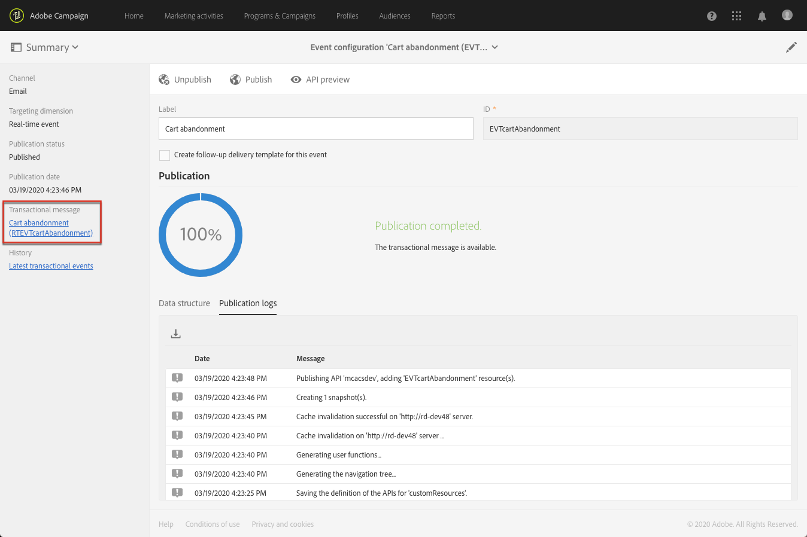

# Publicar um evento transacional {#publishing-transactional-event}

Quando [configuration](../../channels/using/configuring-transactional-event.md) estiver concluído, o evento estará pronto para ser publicado. As etapas para pré-visualização, publicar, cancelar a publicação e excluir um evento estão descritas abaixo.

>[!IMPORTANT]
>
>Somente [Administradores funcionais](../../administration/using/users-management.md#functional-administrators) <!--being part of the **[!UICONTROL All]** [organizational unit](../../administration/using/organizational-units.md) -->têm os direitos apropriados para publicar configurações de eventos.

Um gráfico que ilustra todo o processo de publicação de mensagens transacionais, incluindo as configurações de publicação e despublicação de eventos, está disponível em [esta seção](../../channels/using/publishing-transactional-message.md).

Após a publicação:
* O mensagen transacional correspondente é criado automaticamente. Consulte [Edição de mensagens transacionais](../../channels/using/editing-transactional-message.md).
* A API que será usada pelo desenvolvedor do site é implantada e os eventos transacionais agora podem ser enviados. Consulte [Integrar o evento que dispara](../../channels/using/getting-started-with-transactional-msg.md#integrate-event-trigger).

## Visualizar e publicar um evento {#previewing-and-publishing-the-event}

Antes de poder usar o evento, você deve pré-visualização e publicá-lo.

1. Clique no botão **[!UICONTROL API preview]** para ver uma simulação da REST API que será usada pelo desenvolvedor do seu site antes de ser publicada.

   Depois que o evento é publicado, esse botão também permite que você veja uma pré-visualização da API em produção. Consulte [Integrar o evento que dispara](../../channels/using/getting-started-with-transactional-msg.md#integrate-event-trigger).

   

   >[!NOTE]
   >
   >A API REST varia de acordo com o canal selecionado e o targeting dimension selecionado. Para obter mais detalhes sobre as várias configurações, consulte [esta seção](../../channels/using/configuring-transactional-event.md#transactional-event-specific-configurations).

1. Clique em **[!UICONTROL Publish]** para start da publicação.

   

   A API que será usada pelo desenvolvedor do site é implantada e os eventos transacionais agora podem ser enviados.

1. Você pode visualização os logs de publicação na guia correspondente.

   

   >[!IMPORTANT]
   >
   >Sempre que modificar o evento, clique em **[!UICONTROL Publish]** novamente para gerar a REST API atualizada que será usada pelo desenvolvedor do site.

   Depois que o evento é publicado, um [mensagen transacional](../../channels/using/editing-transactional-message.md) vinculado ao novo evento é criado automaticamente.

1. Você pode acessar esse mensagen transacional diretamente pelo link localizado na área do lado esquerdo.

   

   >[!NOTE]
   >
   >Para que o evento acione o envio de um mensagen transacional, é necessário modificar e publicar a mensagem que acabou de ser criada. Consulte [Edição](../../channels/using/editing-transactional-message.md) e [Publicar um mensagen transacional](../../channels/using/publishing-transactional-message.md) seções. Você também precisa [integrar este evento de disparo](../../channels/using/getting-started-with-transactional-msg.md#integrate-event-trigger) ao seu site.

1. Depois que os start Adobe Campaign receberem eventos relacionados a essa configuração de evento, você poderá clicar no link **[!UICONTROL Latest transactional events]** na seção **[!UICONTROL History]** para acessar os eventos mais recentes enviados por seu serviço de terceiros e processados pela Adobe Campaign.

Os eventos (no formato JSON) são listados do mais recente ao mais antigo. Essa lista permite que você verifique dados como o conteúdo ou o status de um evento para fins de controle e depuração.

## Cancelamento de publicação de um evento {#unpublishing-an-event}

O botão **[!UICONTROL Unpublish]** permite cancelar a publicação do evento, que exclui da REST API o recurso correspondente ao evento criado anteriormente.

Agora, mesmo que o evento seja acionado pelo seu site, as mensagens correspondentes não serão mais enviadas e não serão armazenadas no banco de dados.

>[!NOTE]
>
>Se você já tiver publicado o mensagen transacional correspondente, a publicação do mensagen transacional também será cancelada. Consulte [Cancelar publicação de um mensagen transacional](../../channels/using/publishing-transactional-message.md#unpublishing-a-transactional-message).

Clique no botão **[!UICONTROL Publish]** para gerar uma nova REST API.

<!--## Transactional messaging publication process {#transactional-messaging-pub-process}

The chart below illustrates the transactional messaging publication process.

For more on publishing, pausing and unpublishing a transactional message, see [this section](../../channels/using/publishing-transactional-message.md).-->

## Excluindo um evento {#deleting-an-event}

Depois que um evento for despublicado ou se um evento ainda não tiver sido publicado, você poderá excluí-lo da lista de configuração do evento. Para fazer isso:

1. Clique no logotipo **[!UICONTROL Adobe Campaign]**, no canto superior esquerdo, em seguida selecione **[!UICONTROL Marketing plans]** > **[!UICONTROL Transactional messages]** > **[!UICONTROL Event configuration]**.
1. Passe o mouse sobre a configuração do evento de sua escolha e selecione o botão **[!UICONTROL Delete element]**.

   

   >[!NOTE]
   >
   >Certifique-se de que a configuração do evento tenha o status **[!UICONTROL Draft]**; caso contrário, você não poderá excluí-la. O status **[!UICONTROL Draft]** se aplica a um evento que ainda não foi publicado ou que foi [não publicado](#unpublishing-an-event).

1. Clique no botão **[!UICONTROL Confirm]**.

   

>[!IMPORTANT]
>
>A exclusão de uma configuração de evento que tenha sido publicada e já usada também excluirá os mensagens transacionais correspondentes e seus logs de rastreamento e envio.
