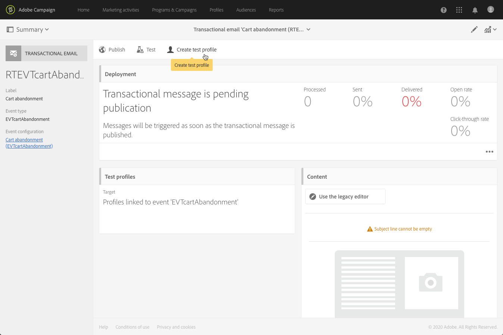

# Ciclo de vida da mensagem transacional {#publishing-transactional-message}

Quando a [mensagem transacional](../../channels/using/editing-transactional-message.md) estiver pronta para ser enviada, ela poderá ser publicada.

As etapas para publicar, pausar, cancelar a publicação e excluir uma mensagem transacional estão detalhadas abaixo.

>[!IMPORTANT]
>
>Somente os usuários com a função [Administration](../../administration/using/users-management.md#functional-administrators) podem acessar e publicar mensagens transacionais.

## Processo de publicação de mensagens transacionais {#transactional-messaging-pub-process}

O gráfico abaixo ilustra o processo geral de publicação de mensagens transacionais.

**Tópicos relacionados:**
* [Publicação de mensagem transacional](#publishing-a-transactional-message)
* [Pausando uma mensagem transacional](#suspending-a-transactional-message-publication)
* [Cancelamento de publicação de uma mensagem transacional](#unpublishing-a-transactional-message)
* [Publicar um evento](../../channels/using/publishing-transactional-event.md)

<!--## Testing a transactional message {#testing-a-transactional-message}

You first need to create a specific test profile that will allow you to properly check the transactional message.

### Defining a specific test profile {#defining-specific-test-profile}

Define a test profile that will be linked to your event, which will allow you to preview your message and send a relevant proof.

1. From the transactional message dashboard, click the **[!UICONTROL Create test profile]** button.

   

1. Specify the information to send in JSON format in the **[!UICONTROL Event data used for personalization]** section. This is the content that will be used when previewing the message and when the test profile receives the proof.

   

   >[!NOTE]
   >
   >You can also enter the information relating to the profile table. See [Enriching the event](../../channels/using/configuring-transactional-event.md#enriching-the-transactional-message-content) and [Personalizing a transactional message](../../channels/using/editing-transactional-message.md#personalizing-a-transactional-message).

1. Once created, the test profile will be pre-specified in the transactional message. Click the **[!UICONTROL Test profiles]** block of the message to check the target of your proof.

   

You can also create a new test profile or use one that already exists in the **[!UICONTROL Test profiles]** menu. To do this:

1. Click the **[!UICONTROL Adobe Campaign]** logo, in the top left corner, then select **[!UICONTROL Profiles & audiences]** > **[!UICONTROL Test profiles]**.
1. In the **[!UICONTROL Event]** section, select the event that you have just created. In this example, select "Cart abandonment (EVTcartAbandonment)".
1. Specify the information to send in JSON format in the **[!UICONTROL Event data]** text box.

   

1. Save your changes.
1. Access the message that you created and select the updated test profile.

**Related topics:**

* [Managing test profiles](../../audiences/using/managing-test-profiles.md)
* [Creating audiences](../../audiences/using/creating-audiences.md)

### Sending the proof {#sending-proof}

Once you have created one or more specific test profiles and saved your transactional message, you can send a proof to test it.

The steps for sending a proof are detailed in the [Sending proofs](../../sending/using/sending-proofs.md) section.-->

## Publicação de mensagem transacional {#publishing-a-transactional-message}

Depois de editar e testar sua mensagem transacional, você pode publicá-la. Basta clicar no botão **[!UICONTROL Publish]**.

Agora, assim que o evento &quot;Abandono do carrinho&quot; for acionado, ele automaticamente solicitará uma mensagem contendo o título e sobrenome do recipient, o URL do carrinho, o último produto consultado ou uma lista de produtos, se você tiver definido uma lista de produtos, e o valor total do carrinho a ser enviado.

Para acessar os relatórios referentes à sua mensagem transacional, use o botão **[!UICONTROL Reports]**. Consulte [Relatórios dinâmicos](../../reporting/using/about-dynamic-reports.md).

**Tópicos relacionados**:
* [Edição de uma mensagem transacional](../../channels/using/editing-transactional-message.md)
* [Teste de mensagem transacional](../../channels/using/testing-transactional-message.md)
* [Integrar o acionamento do evento](../../channels/using/getting-started-with-transactional-msg.md#integrate-event-trigger)

## Suspensão de publicação de mensagem transacional {#suspending-a-transactional-message-publication}

Você pode suspender a publicação da mensagem transacional usando o botão **[!UICONTROL Pause]**, por exemplo, para modificar os dados contidos na mensagem. Portanto, os eventos não são mais processados, mas mantidos em fila no banco de dados do Adobe Campaign.

Os eventos em fila são mantidos durante um período definido na API REST (consulte a [documentação da API REST](../../api/using/managing-transactional-messages.md)) ou no evento de acionador se estiver usando o serviço principal Acionadores (consulte [Sobre o Adobe Experience Cloud Triggers](../../integrating/using/about-adobe-experience-cloud-triggers.md)).

Ao clicar em **[!UICONTROL Resume]**, todos os eventos em fila (desde que não tenham expirado) são processados. Eles agora contêm todas as modificações efetuadas durante a suspensão da publicação do modelo.

## Cancelamento de publicação de uma mensagem transacional {#unpublishing-a-transactional-message}

Clicar em **[!UICONTROL Unpublish]** permite cancelar a publicação da mensagem transacional, mas também a publicação do evento correspondente, que exclui da API REST o recurso correspondente ao evento criado anteriormente.

Agora, mesmo que o evento seja acionado pelo seu site, as mensagens correspondentes não serão mais enviadas e não serão armazenadas no banco de dados.

>[!NOTE]
>
>Para publicar a mensagem novamente, você precisa voltar para a configuração de evento correspondente, [publicar o evento](../../channels/using/publishing-transactional-event.md) e, em seguida, [publicar a mensagem](#publishing-a-transactional-message).

Se você cancelar a publicação de uma mensagem transacional pausada, talvez precise aguardar até 24 horas para poder publicá-la novamente. Isso permite que o fluxo de trabalho da **[!UICONTROL Database cleanup]** limpe todos os eventos enviados para a fila.

As etapas para pausar uma mensagem estão detalhadas na seção [Suspensão de publicação de mensagem transacional](#suspending-a-transactional-message-publication).

O fluxo de trabalho da **[!UICONTROL Database cleanup]**, que é executado todos os dias às 4h da manhã, pode ser acessado por meio de **[!UICONTROL Administration]** > **[!UICONTROL Application settings]** > **[!UICONTROL Workflows]**.

## Exclusão de uma mensagem transacional {#deleting-a-transactional-message}

Depois de cancelada a publicação de uma mensagem transacional, ou se uma mensagem transacional ainda não tiver sido publicada, você poderá excluí-la da lista de mensagens transacionais. Para fazer isso:

1. Clique no logotipo **[!UICONTROL Adobe Campaign]**, no canto superior esquerdo, em seguida selecione **[!UICONTROL Marketing plans]** > **[!UICONTROL Transactional messages]** > **[!UICONTROL Transactional messages]**.
1. Passe o mouse sobre a mensagem de sua escolha.
1. Clique no botão **[!UICONTROL Delete element]**.

No entanto, a exclusão de uma mensagem transacional só pode ser feita sob certas condições:

* Verifique se a mensagem transacional tem o status **[!UICONTROL Draft]**; caso contrário, você não poderá excluí-la. O status **[!UICONTROL Draft]** se aplica a uma mensagem que ainda não foi publicada ou cuja [publicação foi cancelada](#unpublishing-a-transactional-message) (e não [pausada](#suspending-a-transactional-message-publication)).

* **Mensagens transacionais**: a menos que outra mensagem transacional esteja vinculada ao evento correspondente, se a publicação da mensagem transacional for cancelada, a publicação da configuração do evento também precisará ser cancelada para excluir com êxito a mensagem transacional. Para obter mais informações, consulte [Cancelamento de publicação de evento](../../channels/using/publishing-transactional-event.md#unpublishing-an-event).

   >[!IMPORTANT]
   >
   >A exclusão de uma mensagem transacional que já enviou notificações também excluirá seus logs de rastreamento e envios.

* **Mensagens transacionais de um modelo de evento pronto para uso (mensagens transacionais internas)**: se uma mensagem transacional interna for a única associada ao evento interno correspondente, ela não poderá ser excluída. Primeiro, você precisa criar outra mensagem transacional duplicando-a, ou pelo menu **[!UICONTROL Resources]** > **[!UICONTROL Templates]** > **[!UICONTROL Transactional message templates]**.

<!--## Monitoring transactional message delivery {#monitoring-transactional-message-delivery}

Once the message is published and your site integration is done, you can monitor the delivery.

To monitor transactional messaging, you need to access **execution deliveries**. An execution delivery is a non-actionable and non-functional technical message created once a month for each transactional message, and each time a transactional message is edited and published again.

1. To view the message delivery log, click the icon at the bottom right of the **[!UICONTROL Deployment]** block.

   

1. Click the **[!UICONTROL Execution list]** tab.

   

1. Select the execution delivery of your choice.

   

1. Click again the icon at the bottom right of the **[!UICONTROL Deployment]** block.

   

   For each execution delivery, you can consult the delivery logs as you would do for a standard delivery. For more on accessing and using the logs, see [Monitoring a delivery](../../sending/using/monitoring-a-delivery.md).

**Related topics**:
* [Publishing a transactional message](#publishing-a-transactional-message)
* [Integrate the event triggering](../../channels/using/getting-started-with-transactional-msg.md#integrate-event-trigger)

### Profile-based transactional message specificities {#profile-transactional-message-monitoring}

For profile-based transactional messages, you can monitor the following profile information.

Select the **[!UICONTROL Sending logs]** tab. In the **[!UICONTROL Status]** column, **[!UICONTROL Sent]** indicates that a profile has opted in.

Select the **[!UICONTROL Exclusions logs]** tab to view recipients who have been excluded from the message target, such as addresses on denylist.

For any profile that has opted out, the **[!UICONTROL Address on denylist]** typology rule excluded the corresponding recipient.

This rule is part of a specific typology that applies to all transactional messages based on the **[!UICONTROL Profile]** table.

**Related topics**:

* [About typologies and typology rules](../../sending/using/about-typology-rules.md)
* [Monitoring a delivery](../../sending/using/monitoring-a-delivery.md)

## Transactional message retry process {#transactional-message-retry-process}

A temporarily undelivered transactional message is subject to automatic retries that are performed until the delivery expires. For more on the delivery duration, see [Validity period parameters](../../administration/using/configuring-email-channel.md#validity-period-parameters).

When a transactional message fails to be sent, there are two retry systems:

* At the transactional messaging level, a transactional message can fail before the event is assigned to an execution delivery, meaning between the event reception and the delivery preparation. See [Event processing retry process](#event-processing-retry-process).
* At the sending process level, once the event has been assigned to an execution delivery, the transactional message can fail due to a temporary error. See [Message sending retry process](#message-sending-retry-process).

The definition of **execution delivery** can be found in the [Monitoring transactional message delivery](#monitoring-transactional-message-delivery) section.

### Event processing retry process {#event-processing-retry-process}

When an event is triggered, it is assigned to an execution delivery.

If the event cannot be assigned to an execution delivery, the event processing is postponed. Retries are then performed until it is assigned to a new execution delivery.

>[!NOTE]
>
>A postponed event does not appear in the transactional message sending logs, because it is not assigned to an execution delivery yet.

For example, the event could not be assigned to an execution delivery because its content was not correct, there was an issue with access rights or branding, an error was detected on applying typology rules, etc. In this case, you can pause the message, edit it to fix the problem and publish it again. The retry system will then assign it to a new execution delivery.

### Message sending retry process {#message-sending-retry-process}

Once the event has been assigned to an execution delivery, the transactional message can fail due to a temporary error, if the recipient's mailbox is full for example. For more on this, see [Retries after a delivery temporary failure](../../sending/using/understanding-delivery-failures.md#retries-after-a-delivery-temporary-failure).

>[!NOTE]
>
>When an event is assigned to an execution delivery, it appears in the sending logs of this execution delivery, and only at this time. The failed deliveries are displayed in the **[!UICONTROL Execution list]** tab of the transactional message sending logs.

### Retry process limitations {#limitations}

**Sending logs update**

In the retry process, the sending logs of the new execution delivery are not immediately updated (the update is performed through a scheduled workflow). It means that the message could be in **[!UICONTROL Pending]** status even if the transactional event has been processed by the new execution delivery.

**Failed execution delivery**

You cannot stop an execution delivery. However, if the current execution delivery fails, a new one is created as soon as a new event is received, and all new events are processed by this new execution delivery. No new events are processed by the failed execution delivery.

If some events already assigned to an execution delivery have been postponed as part of the retry process and if that execution delivery fails, the retry system does not assign the postponed events to the new execution delivery, which means that these events are lost. Check the [delivery logs](#monitoring-transactional-message-delivery) to see the recipients that may have been impacted.-->
