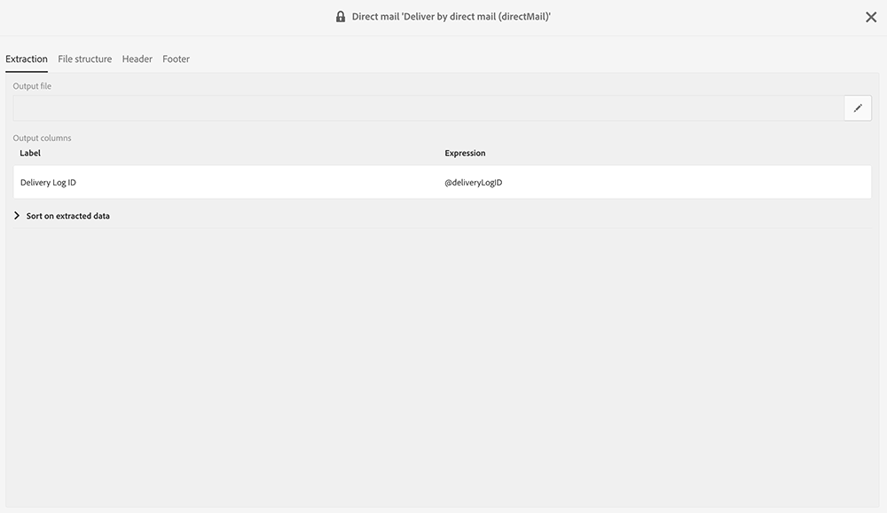
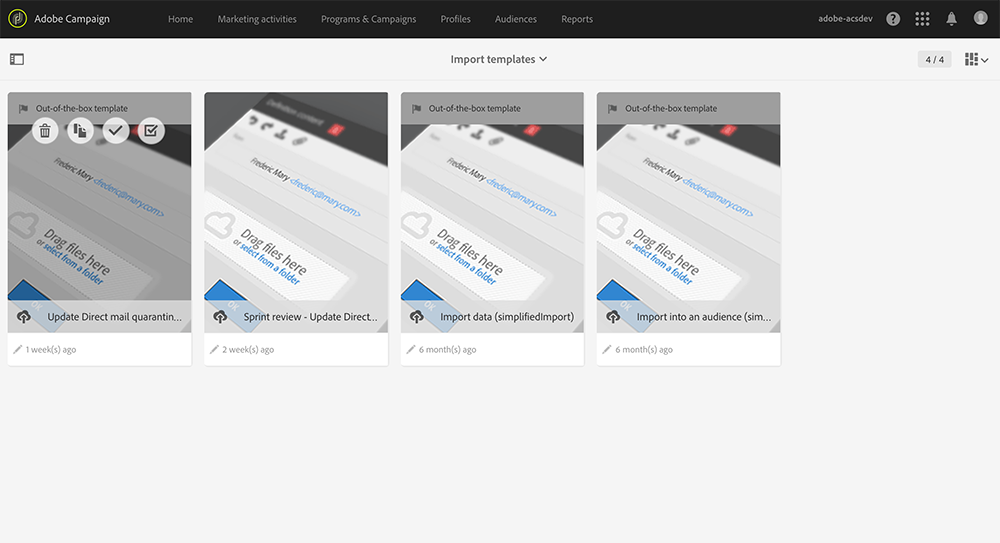

# Retornar ao remetente{#return-to-sender}

São compatíveis trocas de arquivos simples com provedores de Correspondência direta incorporando informações Retornar para o remetente. Isso permite que os endereços postais correspondentes sejam excluídos de comunicações futuras. Isso também permite que você seja notificado sobre um endereço incorreto e interaja com o cliente por meio de outros canais ou incentivá-lo a atualizar seu endereço postal.

Por exemplo, um contato foi movido para um novo local e não forneceu seu novo endereço postal. O provedor recupera a lista de endereços incorretos e envia essas informações à Adobe Campaign, que automaticamente exibe os endereços incorretos.

Para que essa funcionalidade funcione, o template do delivery padrão de correspondência direta inclui, no conteúdo, a ID do log de delivery. Assim, o Adobe Campaign poderá sincronizar o perfil e os dados do delivery com as informações retornadas pelo provedor.

Um modelo de importação está disponível em **[!UICONTROL Adobe Campaign > Resources > Templates > Import templates > Update Direct Mail quarantines and delivery logs]**. Duplique este template para criar o seu próprio template. Para obter mais informações sobre o uso de modelos de importação, consulte [Uso de modelos de importação](../../automating/using/importing-data-with-import-templates.md#setting-up-import-templates).

Quando a importação é concluída, o Adobe Campaign executa automaticamente as seguintes ações:

* Endereços incorretos são adicionados ao incluo na lista de bloqueios no nível do perfil
* Os indicadores principais de delivery (KPIs) são atualizados
* Os logs do delivery são atualizados
