# Configuração de um processo duplo de aceitação{#setting-up-a-double-opt-in-process}

## Sobre a participação dupla {#about-double-opt-in}

O mecanismo de participação dupla é uma prática recomendada para enviar emails. Ele protege a plataforma contra endereços de email incorretos ou inválidos e spambots, além de evitar possíveis reclamações de spam.

O princípio é enviar um email para confirmar o contrato do visitante antes de armazená-lo como &quot;perfis&quot; no banco de dados do Campaign: o visitante preenche uma página de destino online, recebe um email e precisa clicar no link de confirmação para finalizar a assinatura.

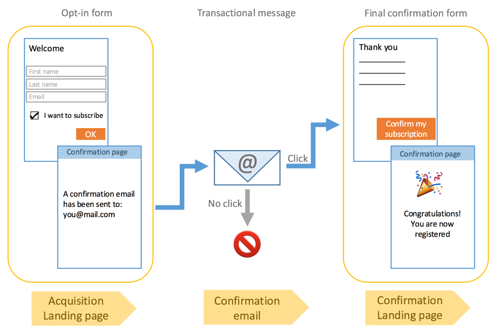

Para configurar, é necessário:

1. Crie e publique uma página de destino para que os visitantes possam se registrar e assinar. Essa página de destino estará disponível em um site. Os visitantes que preencherem e enviarem essa landing page serão armazenados no banco de dados, mas adicionados ao incluo na lista de bloqueios, para não receberem nenhuma comunicação antes da validação final (consulte [Gerenciamento de Inclui na lista de bloqueios no Campaign](../../audiences/using/about-opt-in-and-opt-out-in-campaign.md)).
1. Crie e envie automaticamente o email de participação, com um link de confirmação. Esse email terá como alvo a população que enviou a página de destino. Ele será baseado em um modelo de email que permite direcionar perfis de &quot;recusa de participação&quot;.
1. Redirecione para uma página de destino de confirmação. Essa página de destino final apresentará um botão de confirmação: os visitantes precisam clicar nele. Você pode compor um email de boas-vindas para ser enviado quando a confirmação for feita e, por exemplo, adicionar uma oferta especial no email para novos destinatários.

Essas etapas devem ser configuradas no Adobe Campaign em uma ordem específica para que todos os parâmetros sejam habilitados corretamente.

## Etapa 1: criar a landing page de confirmação {#step-1--create-the-confirmation-landing-page}

O processo para configurar o mecanismo de participação dupla começa com a criação da página de destino de confirmação: essa página será exibida quando os visitantes clicarem no email de confirmação para se registrarem.

Para criar e configurar essa página de destino, faça o seguinte:

1. Projete uma [nova página de destino](../../channels/using/getting-started-with-landing-pages.md) com base no modelo **[!UICONTROL Profile acquisition (acquisition)]**. Insira o rótulo &#39;**CONFIRMATION**&#39;.

   Se você precisar usar [serviços](../../audiences/using/about-subscriptions.md), também poderá usar o modelo **[!UICONTROL Subscription (sub)]**.

1. Edite as propriedades da página de destino e, na seção **[!UICONTROL Access and loading]**, desmarque a opção **[!UICONTROL Authorize unidentified visitors]** e selecione **[!UICONTROL Preload visitor data]** (esta opção não é obrigatória).

   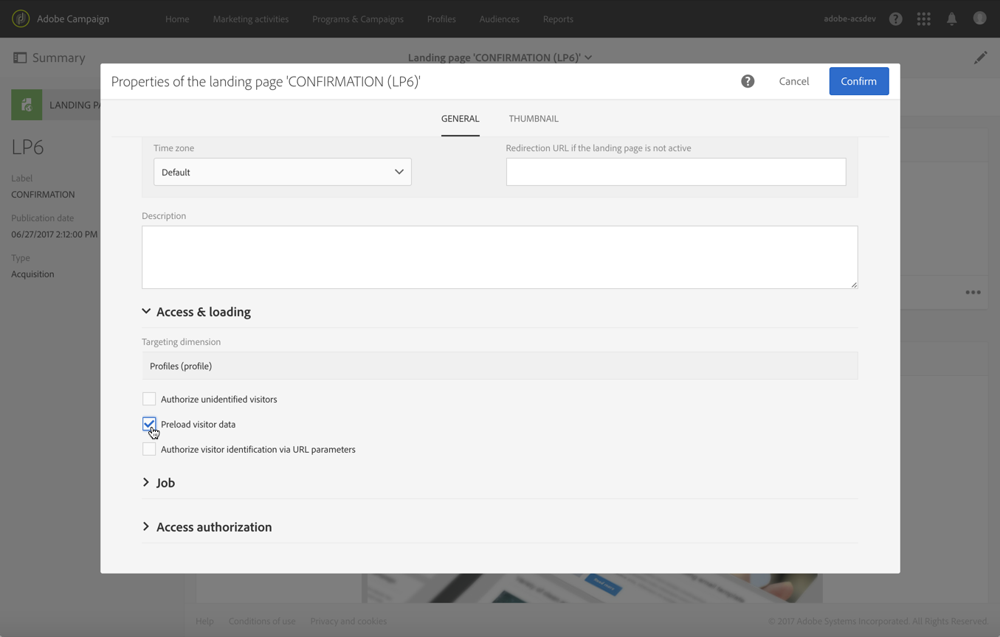

1. Na seção **[!UICONTROL Job]** > **[!UICONTROL Additional data]**, clique em **[!UICONTROL Add an element]** e insira o seguinte caminho de contexto:

   /context/profile/blackList

   Defina o valor como **false** e clique em **[!UICONTROL Add]**.

   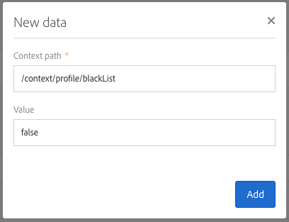

   Esse contexto remove o campo &quot;Na inclui na lista de bloqueios&quot; para poder enviar emails. Veremos mais tarde que a primeira página de destino estava definindo esse campo como **true** antes da confirmação, para evitar o envio de emails a perfis não confirmados. Para obter mais informações, consulte [Etapa 3: criar a página de destino de aquisição](#step-3--create-the-acquisition-landing-page).

1. Personalizar o conteúdo da página de destino: você pode exibir dados personalizados e alterar o rótulo do botão de confirmação para &quot;Clique aqui para confirmar minha assinatura&quot;, por exemplo.

   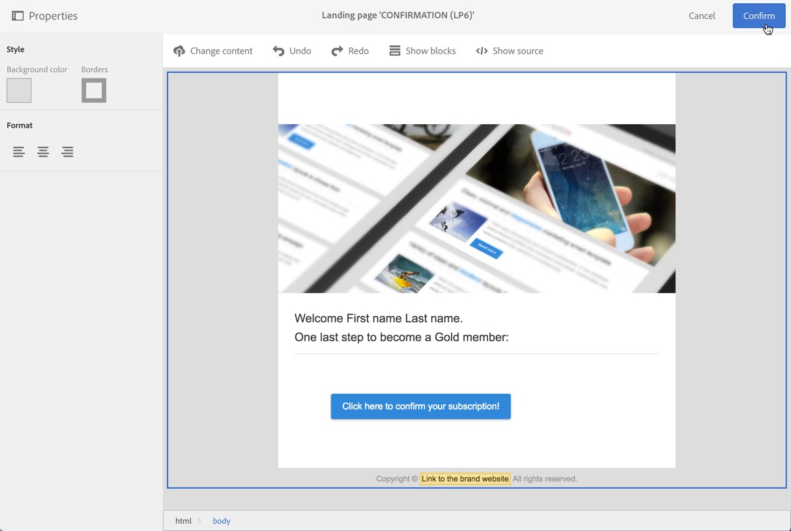

1. Adapte o conteúdo da página de confirmação para informar aos assinantes que eles estão agora registrados.

   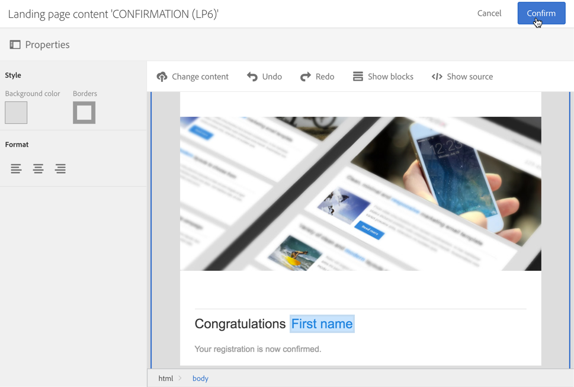

1. [Teste e publique](../../channels/using/testing-publishing-landing-page.md) a página de destino.

## Etapa 2: criar o email de confirmação {#step-2--create-the-confirmation-email}

Assim que a página de destino de confirmação for criada, você poderá criar o email de confirmação: esse email será enviado automaticamente a todos os visitantes que validarem a página de destino de aquisição. Essa validação é considerada um evento, e o email é uma mensagem transacional vinculada a uma regra de tipologia específica que permite o direcionamento a populações que se recusaram a participar.

As etapas para criar esses elementos estão descritas abaixo. É necessário segui-las antes de criar a página de destino de aquisição propriamente dita, pois esse modelo de email será referenciado nela.

### Criar o evento {#create-the-event}

O email de confirmação é uma [mensagem transacional](../../channels/using/getting-started-with-transactional-msg.md), pois reage a um evento: a validação do formulário. Primeiro, você deve criar o evento e depois criar o modelo da mensagem transacional.

1. Crie um evento, no menu **[!UICONTROL Marketing plans]** > **[!UICONTROL Transactional messages]** > **[!UICONTROL Event configuration]**, acessível no logotipo do Adobe Campaign, e insira o rótulo &#39;**CONFIRM**&#39;.
1. Selecione a **[!UICONTROL Profile]** dimensão de direcionamento e clique em **[!UICONTROL Create]**.

   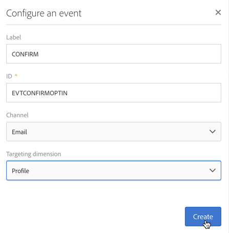

1. Na seção **[!UICONTROL Fields]**, clique em **[!UICONTROL Create element]** e adicione o **[!UICONTROL email]** na estrutura de dados para habilitar a reconciliação.
1. Na seção **[!UICONTROL Enrichment]**, clique em **[!UICONTROL Create element]** e selecione o recurso do público-alvo **[!UICONTROL Profile]**. Em seguida, será possível mapear no campo **[!UICONTROL email]** da seção **[!UICONTROL Join definition]** ou em qualquer outra chave de reconciliação composta, dependendo das suas necessidades.

   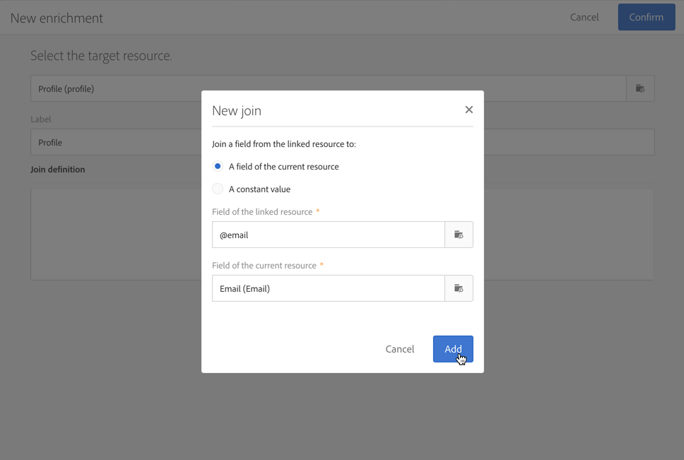

   Se você precisar usar serviços, adicione o recurso de público-alvo **[!UICONTROL Service]** e mapeie no campo **[!UICONTROL serviceName]**. Para obter mais informações, consulte .

1. Selecione **[!UICONTROL Profile]** como o **[!UICONTROL Targeting enrichment]** na lista suspensa.
1. Clique em **[!UICONTROL Publish]** para publicar o evento.

O evento está pronto. Agora, você pode criar o modelo de email. Esse modelo deve incluir um link para a página de destino **CONFIRMATION** criada anteriormente. Para obter mais informações, consulte [Compor a mensagem de confirmação](#design-the-confirmation-message).

### Criar a tipologia {#create-the-typology-rule}

Você precisa criar uma [tipologia](../../sending/using/about-typology-rules.md) específica, duplicando uma tipologia predefinida. A tipologia permitirá o envio de mensagens a perfis que ainda não confirmaram a aceitação e ainda estão em inclui na lista de bloqueios. Por padrão, as tipologias excluem perfis de recusa de participação (ou seja, na inclui na lista de bloqueios). Para criar essa tipologia, siga estas etapas:

1. No logotipo do Adobe Campaign, selecione **[!UICONTROL Administration]** > **[!UICONTROL Channels]** > **[!UICONTROL Typologies]** e clique em **[!UICONTROL Typologies]**.
1. Duplique a tipologia predefinida **[!UICONTROL Transactional message on profile (mcTypologyProfile)]**.
1. Depois que a duplicação for confirmada, edite a nova tipologia e insira o rótulo **TYPOLOGY_PROFILE**.
1. Remova a regra **Endereço na inclui na lista de bloqueios**.
1. Clique em **[!UICONTROL Save]**.

Essa tipologia agora pode ser associada ao email de confirmação.

### Criar a mensagem de confirmação {#design-the-confirmation-message}

O email de confirmação é uma mensagem transacional baseada no evento criado antes. Siga as etapas abaixo para criar essa mensagem:

1. No logotipo do Adobe Campaign, selecione **[!UICONTROL Marketing plans]** > **[!UICONTROL Transactional messages]** e clique em **[!UICONTROL Transactional messages]**.
1. Edite o modelo de email **CONFIRM** e personalize-o. Você pode fazer upload de um conteúdo existente ou usar um modelo predefinido.
1. Adicione um link à página de destino **CONFIRMATION** e clique em **[!UICONTROL Confirm]** para salvar as modificações.

   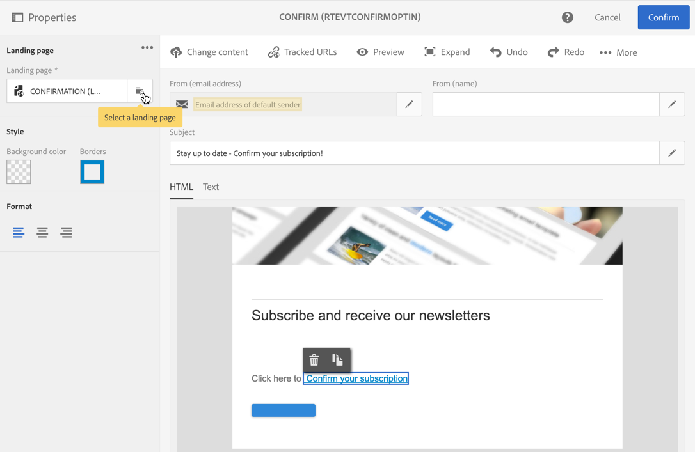

1. Edite as propriedades do modelo de email. Na seção **[!UICONTROL Advanced parameters]** > **[!UICONTROL Preparation]**, selecione a tipologia **TYPOLOGY_PROFILE** criada anteriormente.
1. Salve e publique a mensagem transacional.

## Etapa 3: criar a landing page de aquisição {#step-3--create-the-acquisition-landing-page}

É necessário criar a página de destino de aquisição inicial: esse formulário de participação será publicado no seu site.

Para criar e configurar essa página de destino, faça o seguinte:

1. Projete uma [nova página de destino](../../channels/using/getting-started-with-landing-pages.md) com base no modelo **[!UICONTROL Profile acquisition (acquisition)]**. Insira o rótulo &#39;**ACQUISITION**&#39;.
1. Edite as propriedades da página de destino: na seção **[!UICONTROL Job]** > **[!UICONTROL Additional data]**, clique em **[!UICONTROL Add an element]** e insira o seguinte caminho de contexto:

   /context/profile/blackList

   e defina o valor como **true**.

   Isso é obrigatório para forçar a adição de conteúdo ao incluo na lista de bloqueios e evitar o envio de mensagens a visitantes que não confirmaram a aceitação. A validação da página de destino CONFIRMATION definirá esse campo como **false** após a confirmação. Para obter mais informações, consulte [Etapa 1: criar a página de destino de confirmação](#step-1--create-the-confirmation-landing-page).

1. Na seção **[!UICONTROL Job]** > **[!UICONTROL Specific actions]**, selecione a opção **[!UICONTROL Start sending messages]**.
1. Na lista suspensa associada, escolha o modelo de mensagem transacional **CONFIRM** que você criou.

   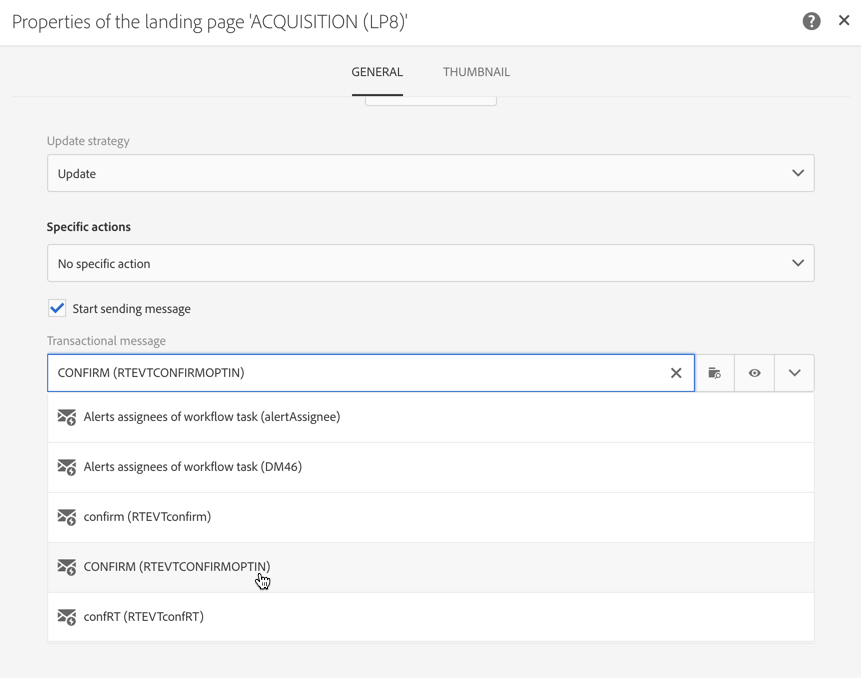

1. Personalize o conteúdo da página de destino, dependendo da sua marca e dos dados que você precisa adquirir. Você pode exibir dados personalizados e alterar o rótulo do botão de confirmação para **Confirmar minha assinatura**, por exemplo.

   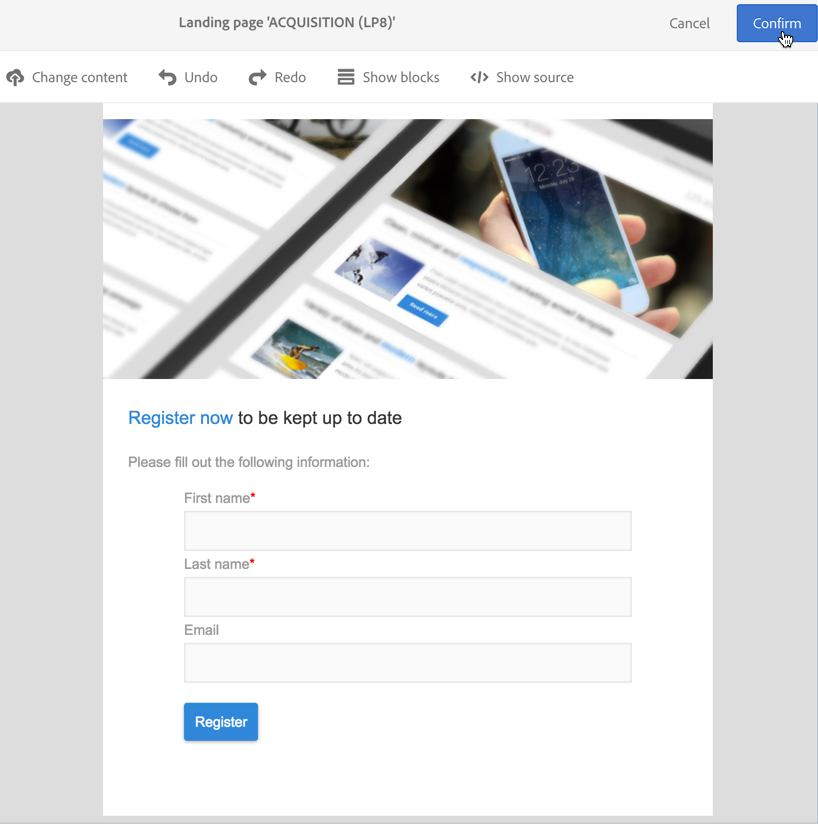

1. Personalize a página de confirmação para informar aos novos assinantes que eles precisam validar suas assinaturas.

   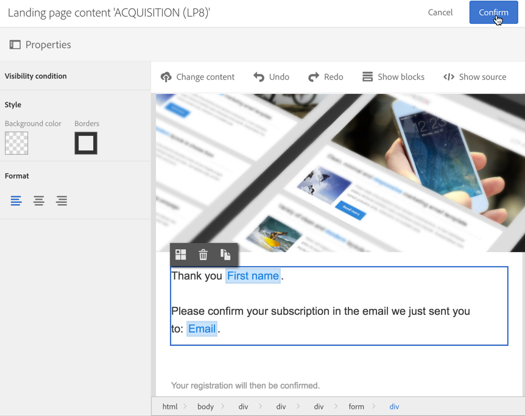

1. [Teste e publique](../../channels/using/testing-publishing-landing-page.md) a página de destino.

O mecanismo de participação dupla agora está configurado. Você pode executar e testar o procedimento de ponta a ponta, começando pelo URL público desta **[!UICONTROL ACQUISITION]** página de destino. Esse URL é exibido no painel da página de destino.
