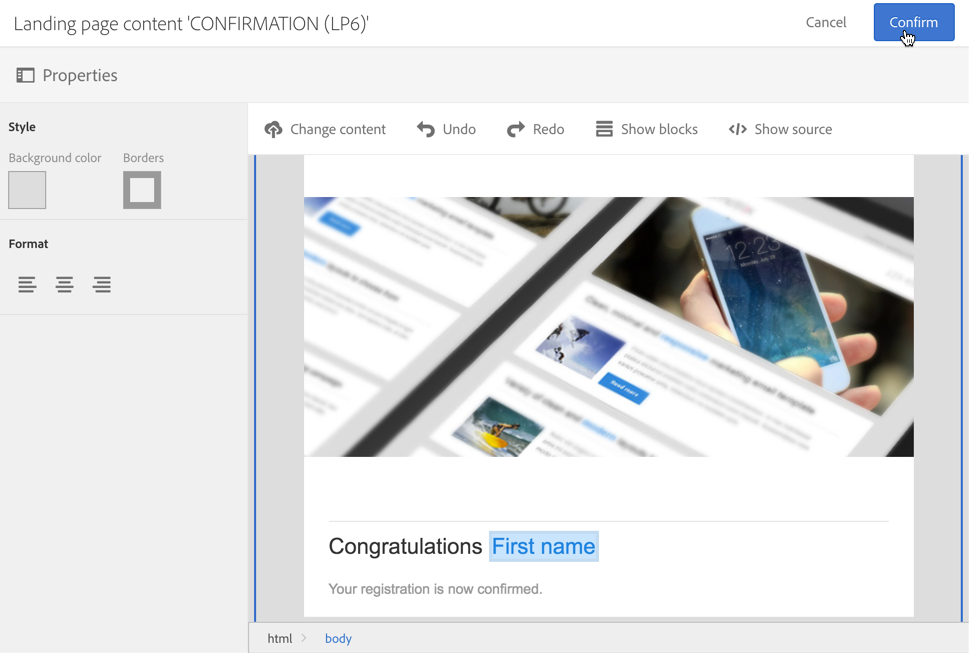
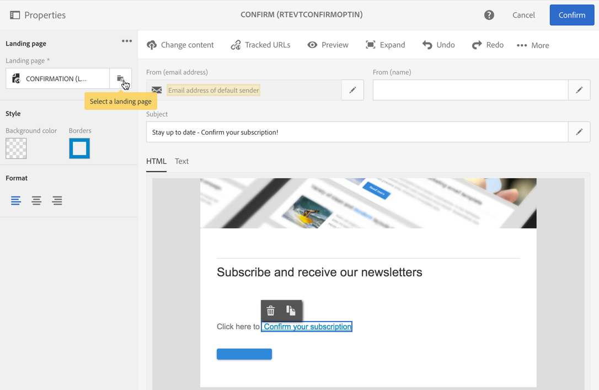

# Configuração de um processo duplo de aceitação{#setting-up-a-double-opt-in-process}

## Sobre a participação dupla {#about-double-opt-in}

O mecanismo de participação dupla é uma prática recomendada para enviar emails. Ele protege a plataforma contra endereços de email incorretos ou inválidos e spambots, além de evitar possíveis reclamações de spam.

O princípio é enviar um email para confirmar o contrato do visitante antes de armazená-lo como &quot;perfis&quot; no banco de dados do Campaign: o visitante preenche uma landing page online, recebe um email e precisa clicar no link de confirmação para finalizar a assinatura.

Para configurar, é necessário:

1. Crie e publique uma landing page para que os visitantes possam se registrar e assinar. Essa landing page estará disponível em um site. Os visitantes que preencherem e enviarem essa landing page serão armazenados no banco de dados, mas adicionados à lista de bloqueios, para não receber nenhuma comunicação antes da validação final (consulte [Lista de bloqueios gerenciamento de  na Campanha](../../audiences/using/about-opt-in-and-opt-out-in-campaign.md)).
1. Crie e envie automaticamente o email de participação, com um link de confirmação. Esse email terá como alvo a população que enviou a landing page. Ele será baseado em um template de email que permite direcionar perfis de &quot;recusa de participação&quot;.
1. Redirecione para uma landing page de confirmação. Essa landing page final apresentará um botão de confirmação: os visitantes precisam clicar nele. Você pode compor um email de boas-vindas para ser enviado quando a confirmação for feita e, por exemplo, adicionar uma oferta especial no email para novos recipients.

Essas etapas devem ser configuradas no Adobe Campaign em uma ordem específica para que todos os parâmetros sejam ativados corretamente.

## Etapa 1: criar a landing page de confirmação {#step-1--create-the-confirmation-landing-page}

O processo para configurar o mecanismo de participação dupla começa com a criação da landing page de confirmação: essa página será exibida quando os visitantes clicarem no email de confirmação para se registrarem.

Para criar e configurar essa landing page, faça o seguinte:

1. Projete uma [nova landing page](../../channels/using/getting-started-with-landing-pages.md) com base no template **[!UICONTROL Profile acquisition (acquisition)]**. Insira o rótulo &#39;**CONFIRMATION**&#39;.

   Se você precisar usar [serviços](../../audiences/using/about-subscriptions.md), também poderá usar o template **[!UICONTROL Subscription (sub)]**.

1. Edite as propriedades da landing page e, na seção **[!UICONTROL Access and loading]**, desmarque a opção **[!UICONTROL Authorize unidentified visitors]** e selecione **[!UICONTROL Preload visitor data]** (esta opção não é obrigatória).

   

1. Na seção **[!UICONTROL Job]** > **[!UICONTROL Additional data]**, clique em **[!UICONTROL Add an element]** e insira o seguinte caminho de contexto:

   /context/profile/blackList

   Defina o valor como **false** e clique em **[!UICONTROL Add]**.

   

   Este contexto remove o campo &quot;Na lista de bloqueios&quot;, para poder enviar emails. Veremos mais tarde que a primeira landing page estava definindo esse campo como **true** antes da confirmação, para evitar o envio de emails a perfis não confirmados. Para obter mais informações, consulte [Etapa 3: criar a landing page de aquisição](#step-3--create-the-acquisition-landing-page).

1. Personalizar o conteúdo da landing page: você pode exibir dados personalizados e alterar o rótulo do botão de confirmação para &quot;Clique aqui para confirmar minha assinatura&quot;, por exemplo.

   

1. Adapte o conteúdo da página de confirmação para informar aos assinantes que eles estão agora registrados.

   

1. [Teste e publique](../../channels/using/testing-publishing-landing-page.md) a landing page.

## Etapa 2: criar o email de confirmação {#step-2--create-the-confirmation-email}

Assim que a landing page de confirmação for criada, você poderá criar o email de confirmação: esse email será enviado automaticamente a todos os visitantes que validarem a landing page de aquisição. Essa validação é considerada um evento, e o email é uma mensagem transacional vinculada a uma regra de tipologia específica que permite o direcionamento a populações que se recusaram a participar.

As etapas para criar esses elementos estão descritas abaixo. É necessário segui-las antes de criar a landing page de aquisição propriamente dita, pois esse template de email será referenciado nela.

### Criar o evento {#create-the-event}

O email de confirmação é uma [mensagem transacional](../../channels/using/getting-started-with-transactional-msg.md), pois reage a um evento: a validação do formulário. Primeiro, você deve criar o evento e depois criar o template da mensagem transacional.

1. Crie um evento, no menu **[!UICONTROL Marketing plans]** > **[!UICONTROL Transactional messages]** > **[!UICONTROL Event configuration]**, acessível no logotipo do Adobe Campaign, e insira o rótulo &#39;**CONFIRM**&#39;.
1. Selecione o **[!UICONTROL Profile]** targeting dimension e clique em **[!UICONTROL Create]**.

   

1. Na seção **[!UICONTROL Fields]**, clique em **[!UICONTROL Create element]** e adicione o **[!UICONTROL email]** na estrutura de dados para ativar a reconciliação.
1. Na seção **[!UICONTROL Enrichment]**, clique em **[!UICONTROL Create element]** e selecione o recurso do público-alvo **[!UICONTROL Profile]**. Em seguida, será possível mapear no campo **[!UICONTROL email]** da seção **[!UICONTROL Join definition]** ou em qualquer outra chave de reconciliação composta, dependendo das suas necessidades.

   

   Se você precisar usar serviços, adicione o recurso de público-alvo **[!UICONTROL Service]** e mapeie no campo **[!UICONTROL serviceName]**. Para obter mais informações, consulte .

1. Selecione **[!UICONTROL Profile]** como o **[!UICONTROL Targeting enrichment]** na lista suspensa.
1. Clique em **[!UICONTROL Publish]** para publicar o evento.

O evento está pronto. Agora, você pode criar o template de email. Esse template deve incluir um link para a landing page **CONFIRMATION** criada anteriormente. Para obter mais informações, consulte [Compor a mensagem de confirmação](#design-the-confirmation-message).

### Criar a tipologia {#create-the-typology-rule}

Você precisa criar uma [tipologia](../../sending/using/about-typology-rules.md) específica, duplicando uma tipologia predefinida. A tipologia permitirá o envio de mensagens a perfis que ainda não confirmaram seu acordo e que ainda estão em lista de bloqueios. Por padrão, as tipologias excluem perfis de opção de não participação (ou seja, na lista de bloqueios). Para criar essa tipologia, siga estas etapas:

1. No logotipo do Adobe Campaign, selecione **[!UICONTROL Administration]** > **[!UICONTROL Channels]** > **[!UICONTROL Typologies]** e clique em **[!UICONTROL Typologies]**.
1. Duplique a tipologia predefinida **[!UICONTROL Transactional message on profile (mcTypologyProfile)]**.
1. Depois que a duplicação for confirmada, edite a nova tipologia e insira o rótulo **TYPOLOGY_PROFILE**.
1. Remova a regra **Endereço lista de bloqueios**.
1. Clique em **[!UICONTROL Save]**.

Essa tipologia agora pode ser associada ao email de confirmação.

### Criar a mensagem de confirmação {#design-the-confirmation-message}

O email de confirmação é uma mensagem transacional baseada no evento criado antes. Siga as etapas abaixo para criar essa mensagem:

1. No logotipo do Adobe Campaign, selecione **[!UICONTROL Marketing plans]** > **[!UICONTROL Transactional messages]** e clique em **[!UICONTROL Transactional messages]**.
1. Edite o template de email **CONFIRM** e personalize-o. Você pode fazer upload de um conteúdo existente ou usar um template predefinido.
1. Adicione um link à landing page **CONFIRMATION** e clique em **[!UICONTROL Confirm]** para salvar as modificações.

   

1. Edite as propriedades do template de email. Na seção **[!UICONTROL Advanced parameters]** > **[!UICONTROL Preparation]**, selecione a tipologia **TYPOLOGY_PROFILE** criada anteriormente.
1. Salve e publique a mensagem transacional.

## Etapa 3: criar a landing page de aquisição {#step-3--create-the-acquisition-landing-page}

É necessário criar a landing page de aquisição inicial: esse formulário de participação será publicado no seu site.

Para criar e configurar essa landing page, faça o seguinte:

1. Projete uma [nova landing page](../../channels/using/getting-started-with-landing-pages.md) com base no template **[!UICONTROL Profile acquisition (acquisition)]**. Insira o rótulo &#39;**ACQUISITION**&#39;.
1. Edite as propriedades da landing page: na seção **[!UICONTROL Job]** > **[!UICONTROL Additional data]**, clique em **[!UICONTROL Add an element]** e insira o seguinte caminho de contexto:

   /context/perfil/blackList

   e defina o valor como **true**.

   Isso é obrigatório para forçar a adição à lista de bloqueios e evitar o envio de mensagens a visitantes que não confirmaram seu acordo. A validação da landing page CONFIRMATION definirá esse campo como **false** após a confirmação. Para obter mais informações, consulte [Etapa 1: criar a landing page de confirmação](#step-1--create-the-confirmation-landing-page).

1. Na seção **[!UICONTROL Job]** > **[!UICONTROL Specific actions]**, selecione a opção **[!UICONTROL Start sending messages]**.
1. Na lista suspensa associada, escolha o template de mensagem transacional **CONFIRM** que você criou.

   

1. Personalize o conteúdo da landing page, dependendo da sua marca e dos dados que você precisa adquirir. Você pode exibir dados personalizados e alterar o rótulo do botão de confirmação para **Confirmar minha assinatura**, por exemplo.

   

1. Personalize a página de confirmação para informar ao novo assinante que ele precisa validar sua assinatura.

   

1. [Teste e publique](../../channels/using/testing-publishing-landing-page.md) a landing page.

O mecanismo de participação dupla agora está configurado. Você pode executar e testar o procedimento de ponta a ponta, começando pelo URL público desta **[!UICONTROL ACQUISITION]** landing page. Esse URL é exibido no painel da landing page.
