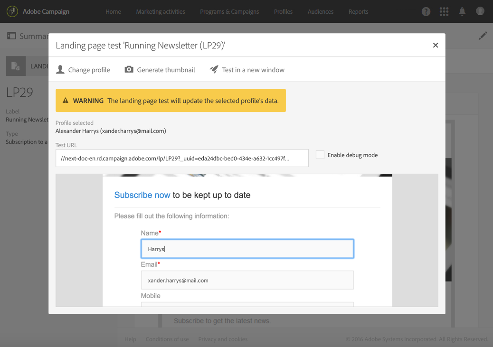
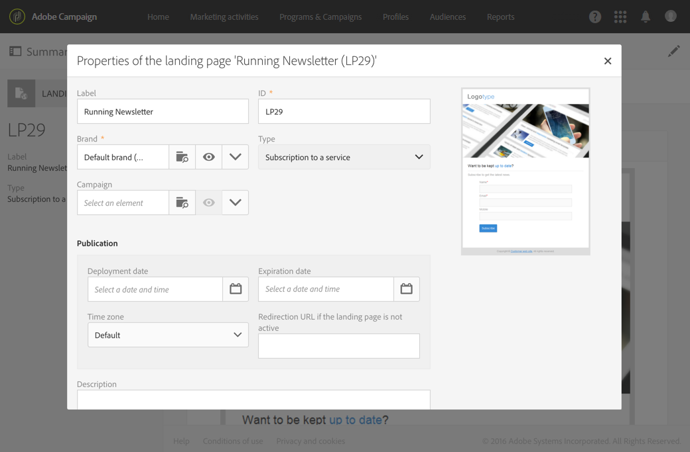

# Teste e publicação de uma página de destino{#testing-publishing--landing-page}

## Sobre publicação de uma landing page {#about-landing-page-publication}

Antes de publicar uma página de destino, faça testes: valide a execução, configure o acesso e configure o fim da vida da página de destino. Essas etapas são pré-requisitos e precisam ser executadas com cuidado.

## Teste da landing page {#testing-the-landing-page-}

Como a página de destino afetará a plataforma e os dados, é necessário testar cuidadosamente a execução. Para fazer isso:

1. Clique no botão **[!UICONTROL Test]** na barra de ação da página de destino.
1. Na tela de teste, selecione um perfil de teste e um serviço de teste se a página de destino for usada para gerenciar assinaturas.

   

1. Insira os dados nos campos e selecione as opções.
1. Envie a página de destino e confira se há atualizações no banco de dados.

   >[!IMPORTANT]
   >
   >Quando o formulário for enviado, o serviço e o perfil usados serão atualizados.

1. Repita isso com vários perfis e dados.

Você também pode gerar a miniatura da página de destino desta tela.

>[!NOTE]
>
>Para exibir a pré-visualização da página de destino na interface do usuário do Campaign, o URL do servidor de aplicativos deve estar protegido. Nesse caso, use https:// em vez de http:// para definir esse URL ao [configurar sua marca](../../administration/using/branding.md#configuring-and-using-brands).

## Configuração de parâmetros de validade {#setting-up-validity-parameters}

Antes da publicação, por motivos de segurança e desempenho da plataforma, recomendamos que você defina uma data de expiração nas propriedades da página de destino. Na data selecionada, a publicação da página de destino será automaticamente desfeita. Para fazer isso:

1. Edite as propriedades de página de destino acessadas pelo botão  no painel da página de destino.

   

1. Configure a data e a hora de expiração na seção **[!UICONTROL Publication]**. A publicação da página de destino será automaticamente desfeita na data especificada e não estará mais disponível.

   Você pode selecionar o fuso horário a ser considerado para essa data e hora.

1. Defina um URL para redirecionar os visitantes quando eles tentarem acessar uma página de destino inativa.

   

>[!IMPORTANT]
>
>Você também pode definir uma data e hora de implantação. A página de destino será publicada automaticamente na data especificada.

## Publicação de uma landing page {#publishing-a-landing-page}

Ao publicar uma página de destino, ela fica ativa e pode ser acessada pelos visitantes.

Você pode desfazer a publicação ou atualizar e republicar a página de destino a qualquer momento usando o botão **[!UICONTROL Publish]**. No entanto, se a republicação falhar e você ainda não tiver desfeito a publicação da página de destino, a primeira versão permanecerá online.
