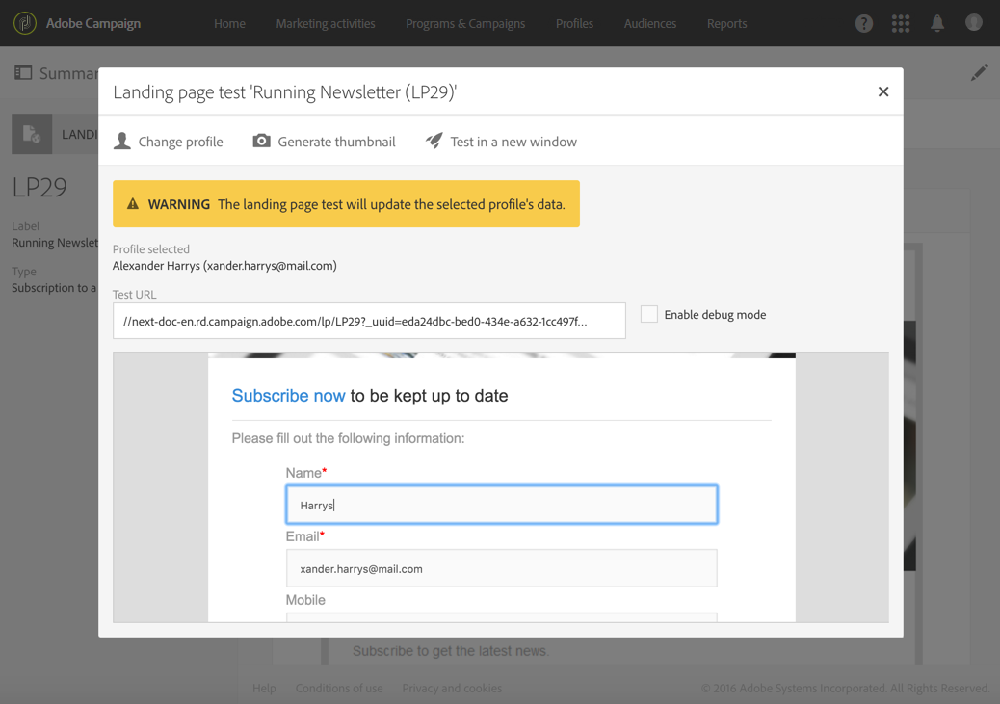

# Teste e publicação de uma página de aterrissagem{#testing-publishing--landing-page}

## Sobre a publicação da página de aterrissagem {#about-landing-page-publication}

Antes de publicar uma página de aterrissagem, é necessário executar testes: valide a execução, configure o acesso e configure o fim da vida útil da página de aterrissagem. Essas etapas são pré-requisitos e precisam ser executadas com cautela.

## Teste da página de aterrissagem {#testing-the-landing-page-}

Como a página de aterrissagem afetará sua plataforma e seus dados, é necessário testar cuidadosamente sua execução. Para fazer isso:

1. Clique no **[!UICONTROL Test]**botão na barra de ação da página de aterrissagem.
1. Na tela de teste, selecione um perfil de teste e um serviço de teste se a página inicial for para gerenciar assinaturas.

   

1. Insira os dados nos campos e selecione as opções.
1. Envie a página inicial e verifique as atualizações no banco de dados.

   >[!IMPORTANT]
   >
   >Quando o formulário é enviado, o serviço e o perfil usados são atualizados.

1. Repita isso com vários perfis e dados.

   Também é possível gerar a miniatura da página inicial a partir dessa tela.

>[!NOTE]
>
>Se o URL do servidor de aplicativos não for seguro (ou seja, se não começar com https://), a visualização da página inicial não poderá ser exibida na interface do usuário do Campaign. Este servidor é definido ao [configurar marcas](../../administration/using/branding.md#configuring-and-using-brands).

## Configuração de parâmetros de validade {#setting-up-validity-parameters}

Antes de publicar, por motivos de segurança e desempenho da plataforma, recomendamos que você defina uma data de expiração nas propriedades da página inicial. Na data selecionada, a página inicial será automaticamente despublicada. Para fazer isso:

1. Edite as propriedades da página inicial acessadas pelo  botão no painel da página inicial.

   

1. Configure a data e a hora de expiração na **[!UICONTROL Publication]**seção: a página inicial será automaticamente despublicada na data especificada e, portanto, não estará mais disponível.

   Você pode selecionar o fuso horário a ser considerado para essa data e hora.

1. Defina um URL de redirecionamento para redirecionar os visitantes ao tentar acessar uma página de aterrissagem não ativa.

   

>[!IMPORTANT]
>
>Você também pode definir uma data e hora de implantação: a página inicial será publicada automaticamente na data especificada.

## Publicar uma página de aterrissagem {#publishing-a-landing-page}

Quando você publica uma página de aterrissagem, ela é colocada ao vivo e pode ser acessada pelos seus visitantes.

Você pode cancelar a publicação ou atualizar e republicar sua página inicial a qualquer momento, por meio do **[!UICONTROL Publish]**botão. No entanto, se a republicação falhar e você ainda não tiver despublicado sua página inicial, a primeira versão permanecerá online.
