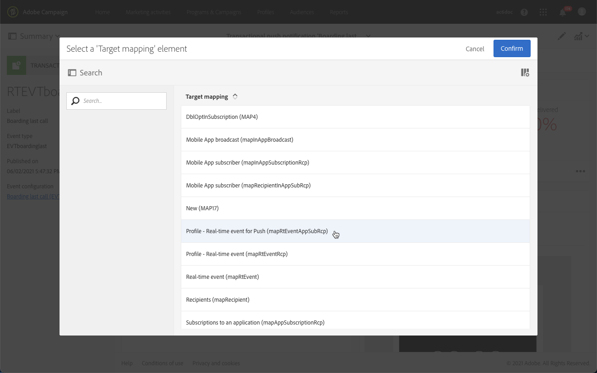

# Notificações por push transacionais{#transactional-push-notifications}

Você pode usar o Adobe Campaign para enviar notificações transacionais por push em dispositivos móveis iOS e Android. Essas mensagens são recebidas nos aplicativos móveis que você configurou no Adobe Campaign por meio do SDK móvel do Experience Cloud.

>[!NOTE]
>
>O canal de push é opcional. Verifique o contrato de licença. Para obter mais informações sobre notificações por push padrão, consulte [Sobre as notificações por push](../../channels/using/about-push-notifications.md).

Para enviar notificações por push transacionais, é necessário configurar o Adobe Campaign adequadamente. Consulte [Configurar um aplicativo para dispositivos móveis](../../administration/using/configuring-a-mobile-application.md).

Você pode enviar dois tipos de notificações transacionais por push:

* [Notificações por push transacionais direcionadas a um evento](#transactional-push-notifications-targeting-an-event)
* [Perfis de direcionamento de notificações por push transacionais](#transactional-push-notifications-targeting-a-profile) do banco de dados do Adobe Campaign

## Notificações por push transacionais direcionadas a um evento {#transactional-push-notifications-targeting-an-event}

Você pode usar o Adobe Campaign para enviar **notificações por push transacionais anônimas para todos os usuários** que optaram por receber notificações do seu aplicativo móvel.

Nesse caso, apenas **os dados contidos no próprio evento são usados para definir o público-alvo do delivery**. Nenhum dado do banco de dados de perfis integrados do Adobe Campaign é aproveitado.

### Configuração de uma notificação por push transacional baseada em eventos {#configuring-event-based-transactional-push-notification}

Para enviar uma notificação por push transacional a todos os usuários que optaram por receber notificações do seu aplicativo móvel, primeiro é necessário criar e configurar um evento direcionado aos dados contidos no próprio evento.

>[!NOTE]
>
>Você ainda pode personalizar o conteúdo de uma notificação por push transacional baseada em eventos usando [atributos de evento](../../channels/using/configuring-transactional-event.md#defining-the-event-attributes) (dados do evento) e [enriquecimento de evento](../../channels/using/configuring-transactional-event.md#enriching-the-transactional-message-content) (dados do banco de dados do Campaign). Consulte [o exemplo abaixo](#sending-event-based-transactional-push-notification).

O evento deve conter os três seguintes elementos:

* A **token de registro**, que é a ID de usuário de um aplicativo móvel e um dispositivo. Ele pode não corresponder a nenhum perfil do banco de dados do Adobe Campaign.
* A **nome do aplicativo móvel** (um para todos os dispositivos - Android e iOS). Esta é a ID do aplicativo móvel configurado no Adobe Campaign que será usada para receber notificações por push nos dispositivos dos usuários. Para obter mais informações, consulte [Configurar um aplicativo para dispositivos móveis](../../administration/using/configuring-a-mobile-application.md).
* A **plataforma de push** (&quot;gcm&quot; para Android ou &quot;apns&quot; para iOS).

Para configurar o evento, siga as etapas abaixo:

1. Ao criar a configuração do evento, selecione a variável **[!UICONTROL Push notification]** e o **[!UICONTROL Real-time event]** targeting dimension (consulte [Criação de um evento](../../channels/using/configuring-transactional-event.md#creating-an-event)).
1. Adicione campos ao evento. Isso permitirá personalizar a mensagem transacional (consulte [Definir os atributos do evento](../../channels/using/configuring-transactional-event.md#defining-the-event-attributes)). Neste exemplo, defina os campos &quot;gateNumber&quot;, &quot;lastname&quot; e &quot;firstname&quot;.
1. Você também pode enriquecer o conteúdo da mensagem. Para fazer isso, adicione campos da tabela vinculada à configuração do evento (consulte [Enriquecimento do evento](../../channels/using/configuring-transactional-event.md#enriching-the-transactional-message-content)).

   <!--Event-based transactional messaging is supposed to use only the data that are in the sent event to define the recipient and the message content personalization. However, you can enrich the content of your transactional message using information from the Adobe Campaign database.-->

1. [Pré-visualizar e publicar o evento](../../channels/using/publishing-transactional-event.md#previewing-and-publishing-the-event).

   Ao visualizar o evento, a API REST contém os atributos &quot;registrationToken&quot;, &quot;application&quot; e &quot;pushPlatform&quot; que serão usados para direcionar o delivery.

   

   Depois que o evento for publicado, uma notificação por push transacional vinculada ao novo evento será criada automaticamente. Agora você pode modificar e publicar a mensagem que acabou de criar (consulte [nesta seção](#sending-event-based-transactional-push-notification)).

1. Integre o evento ao seu site (consulte [Integrar o acionamento de eventos](../../channels/using/getting-started-with-transactional-msg.md#integrate-event-trigger)).

### Envio de uma notificação por push transacional baseada em eventos {#sending-event-based-transactional-push-notification}

Por exemplo, uma companhia aérea deseja convidar seus usuários de aplicativos móveis para prosseguir para o portão relevante para embarque.

A empresa enviará uma notificação por push transacional por usuário (identificada com um token de registro), usando um aplicativo móvel, por meio de um único dispositivo.

1. Acesse a mensagem transacional criada para editá-la. Consulte [Acesso a mensagens transacionais](../../channels/using/editing-transactional-message.md#accessing-transactional-messages).

   

1. Clique em **[!UICONTROL Content]** bloco para modificar o título e o corpo da mensagem.

1. Você pode inserir campos de personalização para adicionar elementos definidos ao criar o evento (consulte [Definir os atributos do evento](../../channels/using/configuring-transactional-event.md#defining-the-event-attributes)).

   

   Para localizar esses campos, clique no lápis ao lado de um item, clique em **[!UICONTROL Insert personalization field]** e selecione **[!UICONTROL Context]** > **[!UICONTROL Real-time event]** > **[!UICONTROL Event context]**.

   

   Para obter mais informações sobre como editar o conteúdo de uma notificação por push, consulte [Preparação e envio de uma notificação por push](../../channels/using/preparing-and-sending-a-push-notification.md).

1. Você também pode enriquecer o conteúdo da mensagem transacional se quiser usar informações adicionais do banco de dados do Adobe Campaign (consulte [Enriquecimento do evento](../../channels/using/configuring-transactional-event.md#enriching-the-transactional-message-content)).

1. Salve as alterações e publique a mensagem. Consulte [Publicação de uma mensagem transacional](../../channels/using/publishing-transactional-message.md#publishing-a-transactional-message).

1. Usando a API REST do Adobe Campaign Standard, envie um evento para um token de registro (ABCDEF123456789), usando um aplicativo móvel (WeFlight), no Android (gcm), com os dados de embarque:

   ```
   {
     "registrationToken":"ABCDEF123456789",
     "application":"WeFlight",
     "pushPlatform":"gcm",
     "ctx":
     {
       "gateNumber":"Gate B18",
       "lastname":"Green",
       "firstname":"Jane"
     }
   }
   ```

   Para obter mais informações sobre como integrar o acionamento de um evento a um sistema externo, consulte [Integrar o acionamento de eventos](../../channels/using/getting-started-with-transactional-msg.md#integrate-event-trigger).

Se o token de registro existir, o usuário correspondente receberá uma notificação por push transacional incluindo o seguinte conteúdo:

*&quot;Olá Jane Green, o embarque acabou de começar! Por favor, prossiga para a Porta B18.&quot;*

## Notificações por push transacionais direcionadas a um perfil {#transactional-push-notifications-targeting-a-profile}

Você pode enviar uma notificação por push transacional **aos perfis do Adobe Campaign que assinaram seu aplicativo para dispositivos móveis**. Este delivery pode conter [campos de personalização](../../designing/using/personalization.md#inserting-a-personalization-field), como o nome do recipient, recuperado diretamente do banco de dados do Adobe Campaign.

Nesse caso, o evento deve conter alguns campos **permitindo a reconciliação com um perfil do banco de dados do Adobe Campaign**.

Quando o direcionamento de perfis, uma notificação por push transacional é enviada por aplicativo móvel e por dispositivo. Por exemplo, se um usuário do Adobe Campaign tiver assinado dois aplicativos, ele receberá duas notificações. Se um usuário tiver assinado o mesmo aplicativo com dois dispositivos diferentes, ele receberá uma notificação em cada dispositivo.

Os aplicativos móveis que um perfil se inscreveu estão listados na variável **[!UICONTROL Mobile App Subscriptions]** deste perfil. Para acessar essa guia, selecione um perfil e clique no link **[!UICONTROL Edit profile properties]** botão à direita.


Para obter mais informações sobre acesso e edição de perfis, consulte [Sobre perfis](../../audiences/using/about-profiles.md).

### Configuração de uma notificação por push transacional baseada em perfil {#configuring-profile-based-transactional-push-notification}

Para enviar uma notificação por push transacional aos perfis do Adobe Campaign que assinaram seu aplicativo para dispositivos móveis, primeiro é necessário criar e configurar um evento direcionado ao banco de dados do Adobe Campaign.

1. Ao criar a configuração do evento, selecione a variável **[!UICONTROL Push notification]** e o **[!UICONTROL Profile]** targeting dimension (consulte [Criação de um evento](../../channels/using/configuring-transactional-event.md#creating-an-event)).

   Por padrão, a notificação por push transacional será enviada para todos os aplicativos móveis nos quais os recipients se inscreveram. Para enviar a notificação por push para um aplicativo móvel específico, selecione-a na lista. Os outros aplicativos móveis serão direcionados pela mensagem, mas serão excluídos do envio.

   

1. Adicione campos ao evento se quiser personalizar a mensagem transacional (consulte [Definir os atributos do evento](../../channels/using/configuring-transactional-event.md#defining-the-event-attributes)).

   >[!NOTE]
   >
   >É necessário adicionar pelo menos um campo para criar um enriquecimento. Não é necessário criar outros campos, como **Nome** e **Sobrenome** como você poderá usar campos de personalização do banco de dados do Adobe Campaign.

1. Crie um enriquecimento para vincular o evento à variável **[!UICONTROL Profile]** recurso (consulte [Enriquecimento do evento](../../channels/using/configuring-transactional-event.md#enriching-the-transactional-message-content)) e selecione esse enriquecimento como a opção **[!UICONTROL Targeting enrichment]**.

   >[!IMPORTANT]
   >
   >Esta etapa é obrigatória para eventos baseados em perfil.

1. [Pré-visualizar e publicar o evento](../../channels/using/publishing-transactional-event.md#previewing-and-publishing-the-event).

   Ao visualizar o evento, a API REST não contém um atributo que especifique o token de registro, o nome do aplicativo e a plataforma de push como eles serão recuperados do **[!UICONTROL Profile]** recurso.

   Depois que o evento for publicado, uma notificação por push transacional vinculada ao novo evento será criada automaticamente. Agora você pode modificar e publicar a mensagem que acabou de criar (consulte [nesta seção](#sending-profile-based-transactional-push-notification)).

1. Integre o evento ao seu site (consulte [Integrar o acionamento de eventos](../../channels/using/getting-started-with-transactional-msg.md#integrate-event-trigger)).

### Envio de uma notificação por push transacional baseada em perfil {#sending-profile-based-transactional-push-notification}

Por exemplo, uma companhia aérea deseja enviar uma última chamada de embarque para todos os usuários do Adobe Campaign que assinaram seu aplicativo móvel.

1. Acesse a mensagem transacional criada para editá-la. Consulte [Acesso a mensagens transacionais](../../channels/using/editing-transactional-message.md#accessing-transactional-messages).

1. Clique em **[!UICONTROL Content]** bloco para modificar o título e o corpo da mensagem.

   Ao contrário das configurações baseadas em eventos em tempo real, você tem acesso direto a todas as informações do perfil para personalizar a mensagem. Consulte [Inserção de um campo de personalização](../../designing/using/personalization.md#inserting-a-personalization-field).

   Para obter mais informações sobre como editar o conteúdo de uma notificação por push, consulte [Preparação e envio de uma notificação por push](../../channels/using/preparing-and-sending-a-push-notification.md).

1. Salve as alterações e publique a mensagem. Consulte [Publicação de uma mensagem transacional](../../channels/using/publishing-transactional-message.md#publishing-a-transactional-message).
1. Usando a API REST do Adobe Campaign Standard, envie um evento para um perfil:

   ```
   {
     "ctx":
     {
       "email":"janegreen@email.com",
       "gateNumber":"D16",
     }
   }
   ```

Para obter mais informações sobre como integrar o acionamento de um evento a um sistema externo, consulte [Integrar o acionamento de eventos](../../channels/using/getting-started-with-transactional-msg.md#integrate-event-trigger).

O usuário correspondente recebe uma notificação por push transacional incluindo todos os elementos de personalização recuperados do banco de dados do Adobe Campaign.

>[!NOTE]
>
>Não há campos de token de registro, aplicativo e plataforma de push. Neste exemplo, a reconciliação é executada com o campo de email.

## Alteração do target mapping em uma notificação por push transacional {#change-target-mapping}

As notificações por push transacionais usam um [target mapping](../../administration/using/target-mappings-in-campaign.md) que contém as configurações técnicas necessárias para enviar esse tipo de delivery.

Para alterar esse target mapping, siga as etapas abaixo:

1. Na lista de mensagens transacionais, selecione uma notificação por push.

1. No painel da mensagem, clique na guia **[!UICONTROL Edit properties]** botão.

   

1. Expanda a **[!UICONTROL Advanced parameters]** seção.

1. Clique em **[!UICONTROL Select a 'Target mapping' element]**.

   

1. Selecione um target mapping na lista.

   >[!NOTE]
   >
   >Para obter o tempo e o desempenho ideais de preparação do delivery ao enviar **baseado em perfil** notificações por push transacionais, use o **[!UICONTROL Profile - Real-time event for Push (mapRtEventAppSubRcp)]** target mapping.

   

1. Confirme sua alteração e publique a mensagem. Consulte [Publicação de uma mensagem transacional](../../channels/using/publishing-transactional-message.md#publishing-a-transactional-message).

   >[!IMPORTANT]
   >
   >Publique a mensagem novamente para que a alteração seja aplicada, caso contrário, o target mapping anterior ainda será usado.


