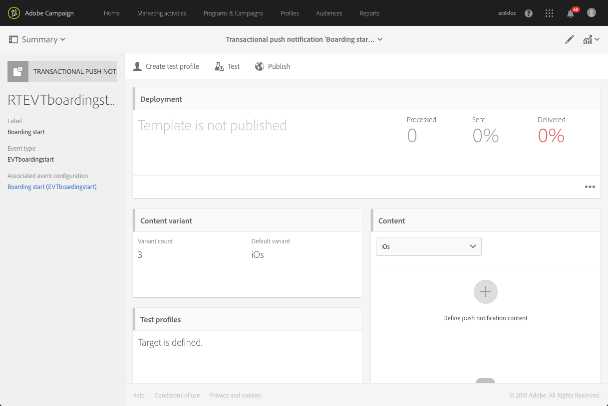
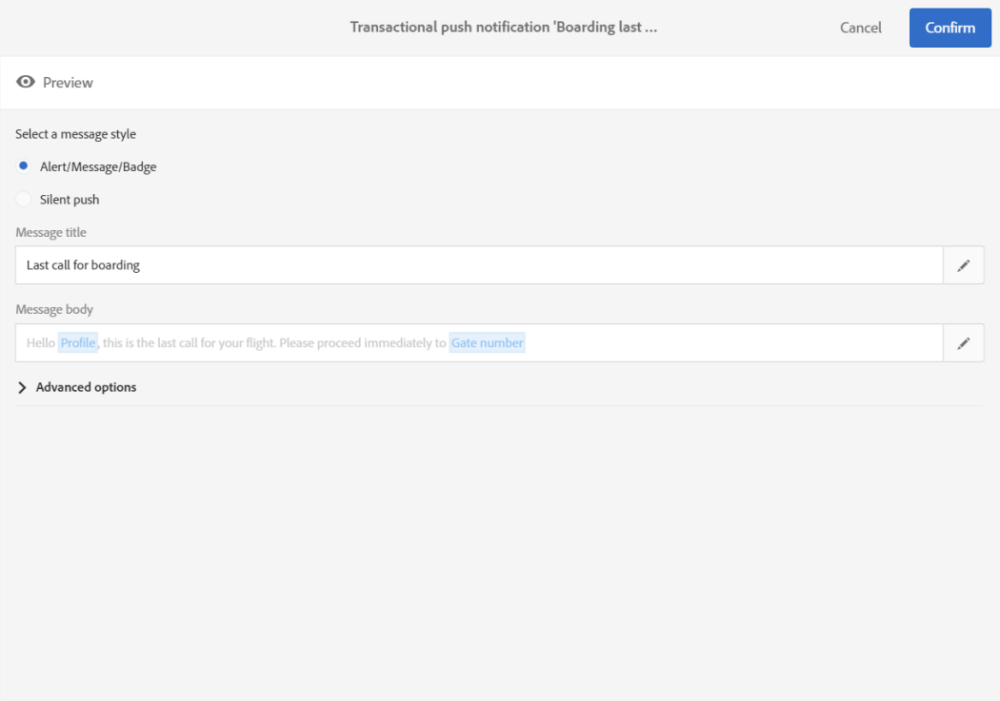

# Notificações por push transacionais{#transactional-push-notifications}

Você pode usar o Adobe Campaign para enviar notificações por push transacionais em dispositivos móveis iOS e Android. Essas mensagens são recebidas em aplicativos móveis configurados no Adobe Campaign por meio do SDK do Experience Cloud Mobile.

>[!NOTE]
>
>O canal push é opcional. Verifique o contrato de licença. Para obter mais informações sobre notificações por push padrão, consulte Notificações por [push](../../channels/using/about-push-notifications.md).

Você pode enviar dois tipos de notificações por push transacionais:

* Notificações por push transacionais direcionadas a um evento.
* Notificações por push transacionais direcionando perfis do banco de dados Adobe Campaign.

Once you have created and published an event (the cart abandonment explained in [this section](../../channels/using/getting-started-with-transactional-msg.md#transactional-messaging-operating-principle)), the corresponding transactional push notification is created automatically.

The configuration steps are presented in the [Configuring an event to send a transactional push notification](../../administration/using/configuring-transactional-messaging.md#use-case--configuring-an-event-to-send-a-transactional-message) section.

Para que o evento acione o envio de uma mensagem transacional, é necessário personalizar a mensagem, testá-la e publicá-la.

>[!NOTE]
>
>Para acessar mensagens transacionais, você deve fazer parte do grupo de segurança **[!UICONTROL Administrators (all units)]**.

## Notificações por push transacionais direcionadas a um evento {#transactional-push-notifications-targeting-an-event}

Você pode enviar uma notificação por push transacional anônima para todos os usuários que opt in receber notificações do seu aplicativo móvel.

Nesse caso, somente os dados contidos no próprio evento são usados para definir o público alvo do delivery. Nenhum dado do banco de dados do perfil integrado da Adobe Campaign é aproveitado.

### Envio de uma notificação por push transacional direcionada a um evento {#sending-a-transactional-push-notification-targeting-an-----------event}

Por exemplo, uma empresa de companhia aérea deseja convidar seus usuários de aplicativos móveis a seguir para a porta de embarque relevante.

A empresa enviará uma notificação por push transacional por usuário (identificada com um token de registro), usando um aplicativo móvel, por meio de um único dispositivo.

1. Acesse a mensagem transacional criada para editá-la. Consulte [Mensagens transacionais de evento](../../channels/using/event-transactional-messages.md).

   

1. Click the **[!UICONTROL Content]** block to modify your message&#39;s title and body.

   Você pode inserir campos de personalização para adicionar elementos definidos ao criar o evento.

   

   Para localizar esses campos, clique no lápis ao lado de um item, clique em **[!UICONTROL Insert personalization field]** e selecione **[!UICONTROL Context]** > **[!UICONTROL Real-time event]** > **[!UICONTROL Event context]**.

   

   Para obter mais informações sobre como editar um conteúdo de notificação por push, consulte [Criar uma notificação](../../channels/using/preparing-and-sending-a-push-notification.md)por push.

1. Salve as alterações e publique a mensagem. Consulte [Publicação de uma mensagem transacional](../../channels/using/event-transactional-messages.md#publishing-a-transactional-message).
1. Usando a API REST da Adobe Campaign Standard, envie um evento para um token de registro (ABCDEF123456789), usando um aplicativo móvel (WeFlight), no Android (gcm), que contém os dados de embarque.

   ```
   {
     "registrationToken":"ABCDEF123456789",
     "application":"WeFlight",
     "pushPlatform":"gcm",
     "ctx":
     {
       "gateNumber":"Gate B18",
       "lastname":"Green",
       "firstname":"Jane"
     }
   }
   ```

   Para obter mais informações sobre a integração do acionamento de um evento em um sistema externo, consulte Integração [do](../../administration/using/configuring-transactional-messaging.md#integrating-the-triggering-of-the-event-in-a-website)site.

Se o token de registro existir, o usuário correspondente receberá uma notificação por push transacional incluindo o seguinte conteúdo:

&quot;Olá Jane Green, o embarque acabou de começar! Prossiga para o portão B18.&quot;

## Notificações por push transacionais direcionadas a um perfil {#transactional-push-notifications-targeting-a-profile}

Você pode enviar uma notificação por push transacional para os perfis Adobe Campaign que se inscreveram no seu aplicativo móvel. Esse delivery pode conter campos de [personalização](../../designing/using/personalization.md#inserting-a-personalization-field) , como o nome do recipient.

Nesse caso, o evento deve conter alguns campos que permitem a reconciliação com um perfil do banco de dados Adobe Campaign.

Ao direcionar perfis, uma notificação por push transacional é enviada por aplicativo móvel e por dispositivo. Por exemplo, se um usuário do Adobe Campaign se inscreveu em dois aplicativos, esse usuário receberá duas notificações. Se um usuário se inscreveu no mesmo aplicativo com dois dispositivos diferentes, esse usuário receberá uma notificação em cada dispositivo.

Os aplicativos móveis aos quais um perfil se inscreveu são listados na guia **[!UICONTROL Mobile App Subscriptions]** desse perfil. Para acessar essa guia, selecione um perfil e clique no **[!UICONTROL Edit profile properties]** botão à direita.


Para obter mais informações sobre como acessar e editar perfis, consulte [Perfis](../../audiences/using/creating-profiles.md).

### Envio de uma notificação por push transacional direcionada a um perfil {#sending-a-transactional-push-notification-targeting-a-----------profile}

Por exemplo, uma empresa aérea deseja enviar uma última chamada de embarque para todos os usuários do Adobe Campaign que se inscreveram em seu aplicativo móvel.

1. Acesse a mensagem transacional criada para editá-la. Consulte [Mensagens transacionais de evento](../../channels/using/event-transactional-messages.md).

   <!---->

1. Click the **[!UICONTROL Content]** block to modify your message&#39;s title and body.

   Ao contrário das configurações baseadas em eventos em tempo real, você tem acesso direto a todas as informações do perfil para personalizar sua mensagem. Consulte [Inserção de um campo de personalização](../../designing/using/personalization.md#inserting-a-personalization-field).

   <!---->

   Para obter mais informações sobre como editar um conteúdo de notificação por push. Consulte [Criação de uma notificação](../../channels/using/preparing-and-sending-a-push-notification.md)por push.

1. Salve as alterações e publique a mensagem. Consulte [Publicação de uma mensagem transacional](../../channels/using/event-transactional-messages.md#publishing-a-transactional-message).
1. Usando a API REST da Adobe Campaign Standard, envie um evento para um perfil.

   ```
   {
     "ctx":
     {
       "email":"janegreen@email.com",
       "gateNumber":"D16",
     }
   }
   ```

   Para obter mais informações sobre a integração do acionamento de um evento em um sistema externo, consulte Integração [do](../../administration/using/configuring-transactional-messaging.md#integrating-the-triggering-of-the-event-in-a-website)site.

   >[!NOTE]
   >
   >Não há campos de token de registro, aplicativo e plataforma de push. Neste exemplo, a reconciliação é executada com o campo de email.

