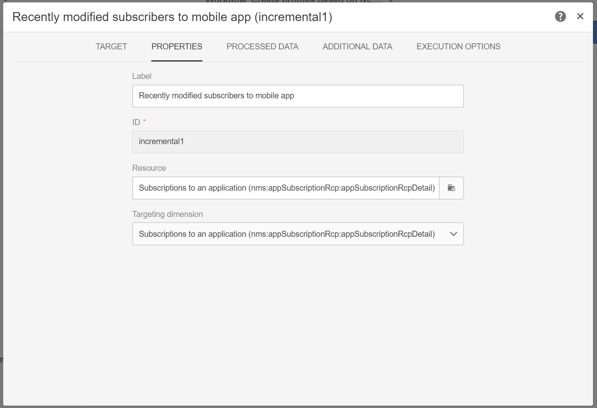

# Criação e atualização de informações de perfil com base em dados de aplicativo móvel

## Visão geral

Esta página descreve as etapas para desenvolver um fluxo de trabalho que crie/atualize os dados do perfil depois que um Aplicativo móvel enviar Coletar dados PII, de forma programada.

* **** PIIs significa &quot;Informações pessoais identificáveis&quot;. Pode ser qualquer dado, incluindo informações que não aparecem na tabela Perfil do banco de dados do Campaign como, por exemplo, Analytics for Mobile [Points of Interest](../../integrating/using/about-campaign-points-of-interest-data-integration.md). A PII é definida pelo desenvolvedor de aplicativos móveis, geralmente com um profissional de marketing.
* **Coletar** PIIs é uma operação HTTP-POST para uma Rest API no Adobe Campaign Standard de um aplicativo móvel.

O objetivo desse caso de uso é criar ou atualizar um perfil de Campaign Standard, se os dados de PII retornados por um aplicativo móvel contiverem dados relacionados ao perfil.

## Pré-requisitos

Há várias etapas de configuração a seguir para ativar as notificações por push no Campaign Standard, antes que os Perfis possam ser criados ou atualizados com base nos dados de assinatura do aplicativo móvel:

1. [Criar um aplicativo móvel](../../administration/using/configuring-a-mobile-application.md)
1. [Integre o SDK do Adobe Mobile ao seu aplicativo](https://helpx.adobe.com/br/campaign/kb/integrate-mobile-sdk.html) móvel.
1. [Configure o Adobe Campaign para enviar notificações](https://helpx.adobe.com/br/campaign/kb/configuring-app-sdkv4.html) por push.

## Etapa 1 - Estender o recurso de perfil para notificações/assinaturas por push

Para criar ou atualizar o recurso de Perfil com dados PII, primeiro deve-se estender o recurso de Perfil com os campos desejados. Para fazer isso:

* Identifique os campos PII enviados pelo Aplicativo móvel.
* Identifique o campo a ser usado para reconciliação para associar os dados PII aos dados do perfil.

Neste exemplo, a seção **[!UICONTROL Fields]** reflete os dados de PII enviados pelo Aplicativo móvel. A seção **[!UICONTROL Link to profiles]** indica o campo usado para associar a PII aos Dados do Perfil, onde **cusEmail** mapeia para **@email**.

O mapeamento para Dados de perfil ao estender o recurso **[!UICONTROL Subscriptions to an Application]** é SOMENTE LEITURA. É usado para reconciliação. O perfil deve ser inserido no sistema com os dados necessários para reconciliar o perfil com os dados PII. No nosso caso, um endereço de email do perfil deve corresponder a um email da PII de coleta para que a reconciliação ocorra:

* A PII de coleta é recebida de um Aplicativo móvel para um usuário que tenha seu Nome como &quot;Jane, Last Name é &quot;Doe&quot; e seu endereço de email é janedoe@doe.com.
* Separadamente, os Dados do perfil devem existir (por exemplo, os dados devem ser inseridos manualmente ou já vêm de algum outro recurso), onde o endereço de email do perfil é janedoe@doe.com.

**Tópicos relacionados:**

* [Extensão das assinaturas para um recurso de aplicativo](../../developing/using/extending-the-subscriptions-to-an-application-resource.md).
* [Criar ou estender um recurso](../../developing/using/key-steps-to-add-a-resource.md) existente.

## Etapa 2 - Criar o workflow

Usar um fluxo de trabalho no Campaign Standard permite que um administrador identifique e sincronize exclusivamente os dados entre os dados do AppSubscription (Assinante) e os dados do Perfil ou do destinatário. Embora uma atualização baseada em workflow não sincronize os dados do perfil em tempo real, ela não deve causar bloqueios ou sobrecarga indevidas do banco de dados.

As principais etapas para criar o workflow são:

1. Use uma atividade **[!UICONTROL Query]** ou **[!UICONTROL Incremental query]** para obter uma lista das assinaturas mais recentes.
1. Use uma atividade **[!UICONTROL Reconciliation]** para mapear os dados de PII com o perfil.
1. Adicione algum processo de verificação.
1. Use um **[!UICONTROL Update data]** para atualizar ou criar o perfil com os dados de PII.

Os seguintes requisitos são assumidos neste workflow:

* Todos os campos/Todos que foram estendidos devem estar disponíveis para criar/atualizar a Tabela de perfil.
* A tabela Perfil pode ser estendida para oferecer suporte a campos que não são nativamente aceitos (por exemplo, Tamanho da camisa T).
* Qualquer campo da tabela AppSubscription que esteja em branco não deve ser atualizado na Tabela de perfis.
* Qualquer registro que tenha sido atualizado na tabela AppSubscription deve ser incluído na próxima execução do fluxo de trabalho.

Para criar o workflow, arraste e solte as seguintes atividades no espaço de trabalho e vincule-as: **[!UICONTROL Start]**, **[!UICONTROL Scheduler]**, **[!UICONTROL Incremental query]**, **[!UICONTROL Update data]**.

Siga as etapas abaixo para configurar cada atividade.

### Configurar a atividade **[!UICONTROL Scheduler]**

Na guia **[!UICONTROL General]**, defina o **[!UICONTROL Execution frequency]** (por exemplo, &quot;Diariamente&quot;), o **[!UICONTROL Time]** (por exemplo, &quot;1:00:00 AM&quot;) e o **[!UICONTROL Start]** (por exemplo, a Data de hoje).

### Configure a atividade **[!UICONTROL Incremental query]**.

1. Na guia **[!UICONTROL Properties]**, clique no ícone **[!UICONTROL Select an element]** do campo **[!UICONTROL Resource]** e selecione o elemento **[!UICONTROL Subscriptions to an application (nms:appSubscriptionRcp:appSubscriptionRcpDetail)]**.

   

1. Na guia **[!UICONTROL Target]** , arraste o filtro **[!UICONTROL Mobile application]** e selecione um nome de aplicativo móvel.

   

1. Na guia **[!UICONTROL Processed data]**, selecione **[!UICONTROL Use a date field]** e adicione o campo **[!UICONTROL Last modified (lastModified)]** como **[!UICONTROL Path to the date field]**.

   

### Configure a atividade **[!UICONTROL Update data]**.

1. Na guia **[!UICONTROL Identification]**, verifique se o campo **[!UICONTROL Dimension to update]** está definido como &quot;Profiles (profile)&quot; e clique no botão **[!UICONTROL Create element]** para adicionar um campo como critério de reconciliação.

   

1. No campo **[!UICONTROL Source]** , selecione um campo da tabela appSubscriptionRcp como um campo de reconciliação. Pode ser o email do perfil, crmId, marketingCloudId etc. Nesse caso de exemplo, usaremos o campo &quot;Email (cusEmail)&quot;.

1. No campo **[!UICONTROL Destination]**, selecione um campo na tabela de perfil para reconciliar os dados da tabela appSubscriptionRcp . Pode ser o email do perfil ou qualquer campo estendido, como crmId, marketingCloudId etc. Neste exemplo, precisamos selecionar o campo &quot;Email (email)&quot; para mapeá-lo com o campo &quot;Email (cusEmail)&quot; da tabela appSubscriptionRcp .

   

1. Na guia **[!UICONTROL Fields to update]**, clique no botão **[!UICONTROL Create element]** e mapeie os campos que vêm da tabela appSubscriptionRcp (campo **[!UICONTROL Source]**) com os campos que deseja atualizar na tabela Profile (campo **[!UICONTROL Destination]** ).

1. No campo **[!UICONTROL Enabled if]** , adicione uma expressão para garantir que o campo correspondente na tabela Perfil seja atualizado somente se o campo de origem contiver um valor. Para fazer isso, selecione o campo na lista e adicione o &quot;!=&#39;&#39;&quot; (se o campo Source for `[target/@cusEmail]` no Editor de expressão, digite `[target/@cusEmail] != ''"`).

   

>[!NOTE]
>
>Nesse caso, o Workflow executa um UPSERT, mas como se baseia em um dado **[!UICONTROL Incremental query]** só é inserido. Alterar a Consulta pode afetar quais dados são inseridos ou atualizados.
>Além disso, as configurações na guia Fields to update determinam quais campos são inseridos ou atualizados em condições específicas. Essas configurações podem ser exclusivas para cada aplicativo ou cliente.
>Tenha cuidado ao definir essas configurações, pois pode haver consequências não intencionais, pois a atualização de registros no Perfil com base nos dados appSubscriptionRcp pode alterar as informações pessoais dos usuários sem validação.

Quando todos os campos a serem inseridos/atualizados no Perfil tiverem sido adicionados, clique em **[!UICONTROL Confirm]**.

Salve o workflow e clique em **[!UICONTROL Start]** para executar o Workflow.

