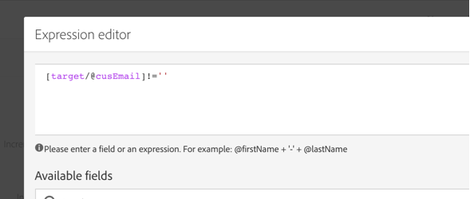

# Criação e atualização de informações de perfil com base em dados de aplicativo para dispositivos móveis

## Visão geral

Esta página descreve as etapas para desenvolver um fluxo de trabalho que cria/atualiza dados de perfil depois que um aplicativo móvel envia Coletar dados PII, de forma programada.

* **PII** significa &quot;Informações de identificação pessoal&quot;. Podem ser quaisquer dados, incluindo informações que não aparecem na tabela Perfil do banco de dados do Campaign como, por exemplo, Analytics para dispositivos móveis [Pontos de interesse](../../integrating/using/about-campaign-points-of-interest-data-integration.md). As PII são definidas pelo desenvolvedor de aplicativos móveis, geralmente com um profissional de marketing.
* **Coletar PII** é uma operação HTTP-POST para uma API Rest no Adobe Campaign Standard de um aplicativo móvel.

O objetivo desse caso de uso é criar ou atualizar um perfil de Campaign Standard, se os dados PII retornados por um aplicativo móvel contiverem dados relacionados ao perfil.

## Pré-requisitos

Há várias etapas de configuração a serem seguidas para habilitar notificações por push no Campaign Standard, antes que os perfis possam ser criados ou atualizados com base nos dados de assinatura de aplicativos móveis:

1. [Criar um aplicativo para dispositivos móveis](../../administration/using/configuring-a-mobile-application.md)
1. [Integre o SDK do Adobe Mobile ao seu aplicativo móvel](../../administration/using/supported-mobile-use-cases.md).
1. [Configure o Adobe Campaign para enviar notificações por push](../../administration/using/configuring-a-mobile-application.md).

## Etapa 1 - Estender o recurso de Perfil para Notificações/Assinaturas por push

Para criar ou atualizar o recurso de Perfil com dados PII, primeiro é necessário estender o recurso de Perfil com os campos desejados. Para fazer isso:

* Identifique os campos PII enviados pelo Aplicativo móvel.
* Identifique o campo que será usado para reconciliação para associar os dados de PII aos dados do perfil.

Neste exemplo, a seção **[!UICONTROL Fields]** reflete os dados de PII enviados pelo Aplicativo Móvel. A seção **[!UICONTROL Link to profiles]** indica o campo usado para associar a PII aos Dados de Perfil, onde **cusEmail** mapeia para **@email**.

O mapeamento dos Dados do Perfil ao estender o recurso **[!UICONTROL Subscriptions to an Application]** é SOMENTE LEITURA. É usado para reconciliação. O perfil deve ser inserido no sistema com os dados necessários para reconciliar o perfil com os dados PII. Em nosso caso, um endereço de email para o perfil deve corresponder a um email do Coletar PII para que a reconciliação ocorra:

* A Coleta de PII é recebida de um aplicativo móvel para um usuário cujo Nome é &quot;Jane, Sobrenome é &quot;Doe&quot; e Endereço de email é janedoe@doe.com.
* Separadamente, os Dados do perfil devem existir (por exemplo, os dados devem ser inseridos manualmente ou já vir de algum outro recurso), onde o Endereço de email do perfil é janedoe@doe.com.

**Tópicos relacionados:**

* [Estendendo as assinaturas para um recurso de aplicativo](../../developing/using/extending-the-subscriptions-to-an-application-resource.md).
* [Criando ou estendendo um recurso existente](../../developing/using/key-steps-to-add-a-resource.md).

## Etapa 2 - Criar o fluxo de trabalho

Usar um fluxo de trabalho no Campaign Standard permite que um administrador identifique e sincronize de maneira exclusiva os dados do AppSubscription (Assinante) e os dados do Perfil ou do Destinatário. Embora uma atualização baseada em fluxo de trabalho não sincronize os dados do perfil em tempo real, ela não deve causar bloqueios indevidos no banco de dados nem sobrecarga.

As principais etapas para criar o workflow são:

1. Use uma atividade **[!UICONTROL Query]** ou **[!UICONTROL Incremental query]** para obter uma lista das assinaturas mais recentes.
1. Use uma atividade **[!UICONTROL Reconciliation]** para mapear os dados de PII com o perfil.
1. Adicione algum processo de verificação.
1. Use um **[!UICONTROL Update data]** para atualizar ou criar o perfil com os dados de PII.

Os seguintes requisitos são assumidos neste workflow:

* Todos/quaisquer campos que foram estendidos devem estar disponíveis para criar/atualizar a Tabela de perfis.
* A tabela Perfil pode ser estendida para suportar campos que não são suportados nativamente (por exemplo, Tamanho da camiseta).
* Nenhum campo da tabela AppSubscription que estiver em branco deverá ser atualizado na Tabela de Perfis.
* Qualquer registro que tenha sido atualizado na tabela AppSubscription deve ser incluído na próxima execução do fluxo de trabalho.

Para criar o fluxo de trabalho, arraste e solte as seguintes atividades no espaço de trabalho e vincule-as: **[!UICONTROL Start]**, **[!UICONTROL Scheduler]**, **[!UICONTROL Incremental query]**, **[!UICONTROL Update data]**.

Siga as etapas abaixo para configurar cada atividade.

### Configurar a atividade **[!UICONTROL Scheduler]**

Na guia **[!UICONTROL General]**, defina o **[!UICONTROL Execution frequency]** (por exemplo, &quot;Diariamente&quot;), o **[!UICONTROL Time]** (por exemplo, &quot;1:00:00 AM&quot;) e o **[!UICONTROL Start]** (por exemplo, a data de Hoje).

### Configure a atividade **[!UICONTROL Incremental query]**.

1. Na guia **[!UICONTROL Properties]**, clique no ícone **[!UICONTROL Select an element]** do campo **[!UICONTROL Resource]** e selecione o elemento **[!UICONTROL Subscriptions to an application (`nms:appSubscriptionRcp:appSubscriptionRcpDetail`)]**.

   

1. Na guia **[!UICONTROL Target]**, arraste o filtro **[!UICONTROL Mobile application]** e selecione um nome de aplicativo móvel.

   

1. Na guia **[!UICONTROL Processed data]**, selecione **[!UICONTROL Use a date field]** e adicione o campo **[!UICONTROL Last modified (lastModified)]** como **[!UICONTROL Path to the date field]**.

   

### Configure a atividade **[!UICONTROL Update data]**.

1. Na guia **[!UICONTROL Identification]**, verifique se o campo **[!UICONTROL Dimension to update]** está definido como &quot;Perfis (perfil)&quot; e clique no botão **[!UICONTROL Create element]** para adicionar um campo como critério de reconciliação.

   

1. No campo **[!UICONTROL Source]**, selecione um campo da tabela appSubscriptionRcp como campo de reconciliação. Pode ser o email do perfil, crmId, marketingCloudId etc. Neste exemplo, use o campo &quot;Email (cusEmail)&quot;.

1. No campo **[!UICONTROL Destination]**, selecione um campo da tabela de perfil para reconciliar os dados da tabela appSubscriptionRcp. Pode ser o email do perfil ou qualquer campo estendido, como crmId, marketingCloudId etc. Neste exemplo, precisamos selecionar o campo &quot;Email (email)&quot; para mapeá-lo com o campo &quot;Email (cusEmail)&quot; da tabela appSubscriptionRcp.

   

1. Na guia **[!UICONTROL Fields to update]**, clique no botão **[!UICONTROL Create element]** e mapeie os campos provenientes da tabela appSubscriptionRcp (campo **[!UICONTROL Source]**) com os campos que deseja atualizar na tabela de Perfil (campo **[!UICONTROL Destination]**).

1. No campo **[!UICONTROL Enabled if]**, adicione uma expressão para garantir que o campo correspondente na tabela de Perfil seja atualizado somente se o campo de origem contiver um valor. Para fazer isso, selecione o campo na lista e adicione o caractere &quot;!expressão =&#39;&#39; (se o campo Source for `[target/@cusEmail]` no Editor de expressão, certifique-se de digitar `[target/@cusEmail] != ''"`).

   

>[!NOTE]
>
>Nesse caso, o Fluxo de Trabalho executa um UPSERT, mas como ele é baseado em um **[!UICONTROL Incremental query]** dados são apenas inseridos. Alterar o Query pode afetar quais dados são inseridos ou atualizados.
>Além disso, as configurações na guia Fields to update determinam quais campos são inseridos ou atualizados sob condições específicas. Essas configurações podem ser exclusivas para cada aplicativo ou cliente.
>Tenha cuidado ao definir essas configurações, pois pode haver consequências não intencionais, pois atualizar registros no Perfil com base nos dados appSubscriptionRcp pode alterar as informações pessoais dos usuários sem validação.

Quando todos os campos a serem inseridos/atualizados no Perfil tiverem sido adicionados, clique em **[!UICONTROL Confirm]**.

Salve o fluxo de trabalho e clique em **[!UICONTROL Start]** para executá-lo.

