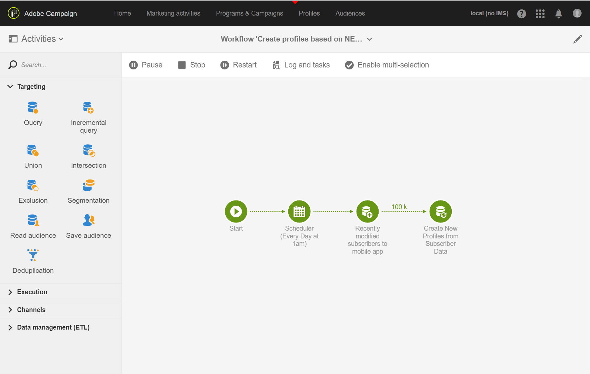

# Criação e atualização de informações de perfil com base em dados de aplicativo móvel

## Visão geral

Esta página descreve as etapas para desenvolver um fluxo de trabalho que crie/atualize dados do perfil depois que um aplicativo móvel enviar Coletar dados PII, de forma programada.

* **** PII significa &quot;Informações pessoais identificáveis&quot;. Pode ser qualquer dado, incluindo informações que não aparecem na tabela de Perfis do banco de dados de Campanhas como, por exemplo, Analytics para Mobile [Points of Interest](../../integrating/using/about-campaign-points-of-interest-data-integration.md). A PII é definida pelo desenvolvedor do aplicativo móvel, geralmente com um profissional de marketing.
* **Coletar** PIIs é uma operação POST HTTP para uma API Rest no Adobe Campaign Standard a partir de um aplicativo móvel.

O objetivo desse caso de uso é criar ou atualizar um perfil Campaign Standard, se os dados PII retornados por um aplicativo móvel contiverem dados relacionados ao perfil.

## Pré-requisitos

Existem várias etapas de configuração a seguir para ativar notificações por push no Campaign Standard, antes que Perfis possam ser criados ou atualizados com base nos dados de Subscrição do aplicativo móvel:

1. [Criar um aplicativo móvel](../../administration/using/configuring-a-mobile-application.md)
1. [Integre o SDK do Adobe Mobile ao seu aplicativo](https://helpx.adobe.com/br/campaign/kb/integrate-mobile-sdk.html) móvel.
1. [Configure o Adobe Campaign para enviar notificações](https://helpx.adobe.com/br/campaign/kb/configuring-app-sdkv4.html) por push.

## Etapa 1 - Estender o recurso de Perfil para notificações por push/Subscrições

Para poder criar ou atualizar o recurso de Perfil com dados PII, é necessário estender o recurso de Perfil primeiro com os campos desejados. Para fazer isso:

* Identifique os campos PII enviados pelo aplicativo móvel.
* Identifique o campo a ser usado para reconciliação para associar os dados PII aos dados do Perfil.

Neste exemplo, a seção **[!UICONTROL Fields]** reflete os dados PII enviados pelo aplicativo móvel. A seção **[!UICONTROL Link to profiles]** indica o campo usado para associar a PII aos Dados do Perfil, onde **cusEmail** mapeia para **@email**.

O mapeamento de Dados de Perfil ao estender o recurso **[!UICONTROL Subscriptions to an Application]** é SOMENTE LEITURA. É usado para reconciliação. O perfil deve ser inserido no sistema com os dados necessários para reconciliar o perfil com os dados de PII. Em nosso caso, um endereço de e-mail do perfil deve corresponder a um e-mail da PII de coleta para que a reconciliação ocorra:

* A PII de coleta é recebida de um aplicativo móvel para um usuário cujo nome é &quot;Jane&quot;, Sobrenome &quot;Doe&quot; e endereço de email é janedoe@doe.com.
* Separadamente, os Dados do Perfil devem existir (por exemplo, os dados devem ser inseridos manualmente ou já vêm de algum outro recurso), onde o endereço de email do perfil é janedoe@doe.com.

**Tópicos relacionados:**

* [Extensão das assinaturas para um recurso de aplicativo](../../developing/using/extending-the-subscriptions-to-an-application-resource.md).
* [Criação ou extensão de um recurso](../../developing/using/key-steps-to-add-a-resource.md) existente.

## Etapa 2 - Criar o fluxo de trabalho

Usar um fluxo de trabalho no Campaign Standard permite que um administrador identifique e sincronize dados de forma exclusiva entre os dados do AppSubscription (Assinante) e os dados do Perfil ou do Recipient. Embora uma atualização baseada no fluxo de trabalho não sincronize os dados do perfil em tempo real, ela não deve causar bloqueios ou sobrecarga indevidos do banco de dados.

As principais etapas para criar o fluxo de trabalho são:

1. Use uma atividade **[!UICONTROL Query]** ou **[!UICONTROL Incremental query]** para obter uma lista das subscrições mais recentes.
1. Use uma atividade **[!UICONTROL Reconciliation]** para mapear os dados de PII com o perfil.
1. Adicione algum processo de verificação.
1. Use um **[!UICONTROL Update data]** para atualizar ou criar o perfil com os dados de PII.

Os seguintes requisitos são assumidos neste fluxo de trabalho:

* Todos/Todos os campos que foram estendidos devem estar disponíveis para criar/atualizar a Tabela de Perfis.
* A tabela de Perfis pode ser estendida para suportar campos que não são nativamente suportados (por exemplo, Tamanho da Camisa T).
* Nenhum campo da tabela AppSubscription que esteja em branco deve ser atualizado na Tabela de Perfis.
* Qualquer registro que tenha sido atualizado na tabela AppSubscription deve ser incluído na próxima execução do Fluxo de trabalho.

Para criar o fluxo de trabalho, arraste e solte as seguintes atividades na área de trabalho e vincule-as: **[!UICONTROL Start]**, **[!UICONTROL Scheduler]**, **[!UICONTROL Incremental query]**, **[!UICONTROL Update data]**.

Siga as etapas abaixo para configurar cada atividade.

### Configure a atividade **[!UICONTROL Scheduler]**

Na guia **[!UICONTROL General]**, defina **[!UICONTROL Execution frequency]** (por exemplo, &quot;Diariamente&quot;), **[!UICONTROL Time]** (por exemplo, &quot;1:00:00 AM&quot;) e **[!UICONTROL Start]** (por exemplo, Data de hoje).

### Configure a atividade **[!UICONTROL Incremental query]**.

1. Na guia **[!UICONTROL Properties]**, clique no ícone **[!UICONTROL Select an element]** do campo **[!UICONTROL Resource]** e selecione o elemento **[!UICONTROL Subscriptions to an application (nms:appSubscriptionRcp:appSubscriptionRcpDetail)]**.

   

1. Na guia **[!UICONTROL Target]**, arraste o filtro **[!UICONTROL Mobile application]** e selecione o nome de um aplicativo móvel.

   

1. Na guia **[!UICONTROL Processed data]**, selecione **[!UICONTROL Use a date field]** e adicione o campo **[!UICONTROL Last modified (lastModified)]** como **[!UICONTROL Path to the date field]**.

   

### Configure a atividade **[!UICONTROL Update data]**.

1. Na guia **[!UICONTROL Identification]**, verifique se o campo **[!UICONTROL Dimension to update]** está definido como &quot;Perfis (perfil)&quot; e clique no botão **[!UICONTROL Create element]** para adicionar um campo como um critério de reconciliação.

   

1. No campo **[!UICONTROL Source]**, selecione um campo na tabela appSubscriptionRcp como um campo de reconciliação. Pode ser o email do perfil, crmId, marketingCloudId etc. Nesse caso, usaremos o campo &quot;Email (cusEmail)&quot;.

1. No campo **[!UICONTROL Destination]**, selecione um campo na tabela do perfil para reconciliar os dados da tabela appSubscriptionRcp. Pode ser o email do perfil ou qualquer campo estendido, como crmId, marketingCloudId etc. Neste exemplo, precisamos selecionar o campo &quot;Email (email)&quot; para mapeá-lo com o campo &quot;Email (cusEmail)&quot; na tabela appSubscriptionRcp.

   

1. Na guia **[!UICONTROL Fields to update]**, clique no botão **[!UICONTROL Create element]** e mapeie os campos que vêm da tabela appSubscriptionRcp (**[!UICONTROL Source]** campo) com os campos que deseja atualizar na tabela de Perfis (**[!UICONTROL Destination]** campo).

1. No campo **[!UICONTROL Enabled if]**, adicione uma expressão para garantir que o campo correspondente na tabela do Perfil seja atualizado somente se o campo de origem contiver um valor. Para fazer isso, selecione o campo na lista e adicione o &quot;!=&#39;&quot;&quot; expressão (se o campo Origem for `[target/@cusEmail]` no editor de Expressões, certifique-se de digitar `[target/@cusEmail] != ''"`).

   

>[!NOTE]
>
>Nesse caso, o Fluxo de trabalho executa um UPSERT, mas, como é baseado em dados **[!UICONTROL Incremental query]**, somente são inseridos. A alteração do Query pode afetar os dados inseridos ou atualizados.
>Além disso, as configurações na guia Campos para atualizar determinam quais campos são inseridos ou atualizados sob condições específicas. Essas configurações podem ser exclusivas para cada aplicativo ou cliente.
>Tenha cuidado ao definir essas configurações, pois pode haver consequências não intencionais, já que a atualização de registros no Perfil com base nos dados appSubscriptionRcp pode alterar as informações pessoais dos usuários sem validação.

Quando todos os campos a serem inseridos/atualizados no Perfil forem adicionados, clique em **[!UICONTROL Confirm]**.

Salve o fluxo de trabalho e clique em **[!UICONTROL Start]** para executar o Fluxo de trabalho.

