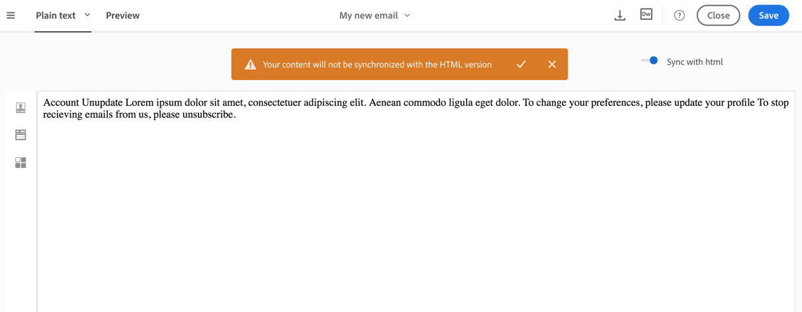

# About email content design{#about-email-content-design}

Use a interface de arrastar e soltar do Designer de emails para criar e modificar o conteúdo de seus e-mails no Adobe Campaign.

Esta seção descreve as especificidades do Designer de email:

* [Sobre o Designer de email](../../designing/using/about-email-content-design.md#about-the-email-designer)
* [Definição da estrutura de email](../../designing/using/defining-the-email-structure.md)
* [Edição de estilos de e-mail](../../designing/using/editing-email-styles.md)

Para saber mais sobre ações comuns a uma ou mais atividades de marketing, consulte as seguintes seções:

* For more on personalizing an email content, see [Inserting a personalization field](../../designing/using/inserting-a-personalization-field.md) and [Adding a content block](../../designing/using/adding-a-content-block.md).
* For more on importing another email content, see [Selecting an existing content](../../designing/using/selecting-an-existing-content.md).
* For more on defining dynamic content in an email, see [Defining dynamic content in an email](../../designing/using/defining-dynamic-content-in-an-email.md).
* For more on inserting links in an email, see [Inserting a link](../../designing/using/inserting-a-link.md).
* For more on inserting images in an email, see [Inserting images](../../designing/using/inserting-images.md).

Also check the [general best practices for content design](../../designing/using/content-design-best-practices.md).

## About the Email Designer {#about-the-email-designer}

O Designer de email permite que você crie conteúdo de email e modelos de conteúdo de email. Ele é compatível com emails simples, emails transacionais, E/B de teste A/B, emails multilíngues e emails recorrentes.

To get started with the Email Designer, watch this [set of videos](https://helpx.adobe.com/campaign/kt/acs/using/acs-email-designer-tutorial.html#GettingStarted) that explain the general functionality of the Email Designer and how to design an email from scratch or using templates.

### Email Designer home page {#email-designer-home-page}

When [creating an email](../../channels/using/creating-an-email.md), the **[!UICONTROL Email Designer]** home page automatically displays upon selecting the email content.


The **[!UICONTROL Properties]** tab enables you to edit the email details such as the label, the sender's address and name, or the email subject. Também é possível acessar essa guia clicando no rótulo do email na parte superior da tela.


The **[!UICONTROL Templates]** tab enables you to choose from the out-of-the-box HTML contents or the templates that you already created to quickly start designing your email. See [Content templates](../../start/using/about-templates.md#content-templates).


The **[!UICONTROL Learn & support]** tab gives you easy access to the related documentation and tutorials.


Se você não selecionar um modelo, a página inicial do Designer de email também permite escolher como você deseja começar a criar seu conteúdo:

* Click the **[!UICONTROL Create]** button to start a new content from scratch. See [Designing an email content from scratch](../../designing/using/about-email-content-design.md#designing-an-email-content-from-scratch).
* Click the **[!UICONTROL Upload]** button to upload a file from your computer. See [Importing content from a file](../../designing/using/importing-content-from-a-file.md).
* Click the **[!UICONTROL Import from URL]** button to retrieve existing content form a URL. See [Importing content from a URL](../../designing/using/importing-content-from-a-url.md).

### Email Designer interface {#email-designer-interface}

O Designer de email oferece muitas opções que permitem criar, editar e personalizar cada aspecto do seu conteúdo.

A interface é composta de várias áreas oferecendo funcionalidades diferentes:


From the elements available in the **Palette** (1), drag and drop structure components and content fragments into the main **Workspace** (2). Select a component or element in the **Workspace** (2) and customize its main styling and display characteristics from the **Settings** pane (3).

Access more general options and settings from the main **Toolbar** (4).

>[!NOTE]
>
>The **Settings** pane can move to the left according to your screen resolution and display.


The **Contextual toolbar** of the editor interface offers various functionalities depending on the zone selected. Ele contém botões de ação e botões que permitem alterar o estilo do texto. As modificações executadas sempre se aplicam à zona selecionada.

### General recommendations for using the Email Designer {#general-recommendations-for-using-the-email-designer}

Para usar o uso correto do Email do Designer e criar os melhores e-mails o mais rápido possível, recomendamos aplicar os seguintes princípios:

* Use o estilo em linha em vez de um CSS e CSS separados na seção &lt; head &gt; do HTML. Ao usar estilo inline, é possível otimizar o salvamento e a reutilização do fragmento do conteúdo.

   See [Adding inline styling attributes](../../designing/using/editing-email-styles.md#adding-inline-styling-attributes).

* Agende sua marca facilmente criando e reutilizando fragmentos do conteúdo para manter a consistência em suas campanhas de marketing.

   See [Creating a content fragment](../../designing/using/defining-the-email-structure.md#creating-a-content-fragment).

Also check the [general best practices for content design](../../designing/using/content-design-best-practices.md).

### Email Designer compatibility mode {#email-designer-compatibility-mode}

Ao carregar um conteúdo, ele deve conter marcação específica para ser totalmente compatível e editável com o editor WYSIWYG do Designer de email.

Se parte ou parte do HTML carregado não for compatível com a marcação esperada, o conteúdo será carregado em'modo de compatibilidade ', o que limita a edição de possibilidades por meio da interface do usuário.

Quando um conteúdo é carregado no modo de compatibilidade, você ainda pode executar as seguintes modificações por meio da interface (ações indisponíveis ficam ocultas):

* Alteração do texto ou alteração de uma imagem
* Inserção de links e campos de personalização
* Editar algumas opções de estilo no bloco HTML selecionado
* Definição de conteúdo condicional


Outras modificações, como adicionar novas seções ao seu e-mail ou estilo avançado, devem ser feitas diretamente no código-fonte do e-mail por meio do modo HTML.

For more on converting an existing email into an Email Designer-compatible email, see [this section](../../designing/using/about-email-content-design.md#designing-an-email-using-existing-contents).

### Email Designer limitations {#email-designer-limitations}

* Não é possível usar campos de personalização em um fragmento. For more on fragments, see [this section](../../designing/using/defining-the-email-structure.md#about-fragments).
* Não é possível salvar diretamente como um fragmento em algum conteúdo de um email que você está editando no Designer de email. É necessário copiar o HTML correspondente a esse conteúdo em um novo fragmento. For more on this, see [Saving content as a fragment](../../designing/using/defining-the-email-structure.md#saving-content-as-a-fragment).
* Ao editar estilos, apenas as fontes da Web oficialmente suportadas pela maioria dos clientes de email estão disponíveis.
* Os estilos não podem ser salvos como um tema para reutilização futura. No entanto, o estilo CSS pode ser salvo em um modelo de conteúdo ou em um e-mail. For more on styles, see [this section](../../designing/using/editing-email-styles.md).

### Email Designer updates {#email-designer-updates}

O Designer de email está em constante melhoria. Se você criou um conteúdo de email do zero, de um modelo predefinido ou se criou fragmentos, você receberá a seguinte mensagem de atualização na próxima vez que abrir seu conteúdo:


A Adobe recomenda atualizar seu conteúdo para a versão mais recente para evitar problemas como problemas de colisão de CSS. Click **[!UICONTROL Update now]**.

Se ocorrer um erro durante a atualização do conteúdo, verifique seu HTML e resolva-o antes de executar esta atualização novamente.

Quando chegar a fragmentos, observe o seguinte:

* Se você quiser adicionar um fragmento a um novo e-mail ou modelo, e se receber essa mensagem, é necessário atualizar esse fragmento primeiro.

* Se você tiver vários fragmentos, precisará atualizar cada fragmento que deseja usar em um conteúdo de email.

* Para evitar o impacto nas mensagens de email atuais, já que alguns deles podem estar na fase de preparação ou em uma campanha específica na qual você não deseja alterar, você pode optar por não atualizar alguns fragmentos.

* Ainda é possível enviar emails onde um fragmento que não foi atualizado já está sendo usado, mas esse fragmento não é editável.

## Designing an email content from scratch {#designing-an-email-content-from-scratch}

Estas são as etapas principais para criar e desenvolver um conteúdo de email do zero usando o Designer de email:

1. Crie um email e abra seu conteúdo.
1. Adicione componentes de estrutura para formar o e-mail. See [Editing the email structure](../../designing/using/defining-the-email-structure.md#editing-the-email-structure).
1. Insira componentes e fragmentos de conteúdo nos componentes da estrutura. See [Adding fragments and content components](../../designing/using/defining-the-email-structure.md#adding-fragments-and-content-components).
1. Adicione imagens e edite o texto do email. See [Inserting images](../../designing/using/inserting-images.md).
1. Personalize seu email adicionando campos de personalização, links etc. See [Inserting a personalization field](../../designing/using/inserting-a-personalization-field.md), [Inserting a link](../../designing/using/inserting-a-link.md) and [Defining dynamic content in an email](../../designing/using/defining-dynamic-content-in-an-email.md).
1. Defina a linha de assunto do seu e-mail. See [Personalizing the subject line of an email](../../designing/using/personalizing-the-subject-line-of-an-email.md).
1. Visualize seu e-mail.
1. Salve o conteúdo e prossiga com a mensagem depois de certificar-se de que definiu um público-alvo e programe corretamente o envio.

You can also check out this [introduction video](https://video.tv.adobe.com/v/22771/?autoplay=true&hidetitle=true&captions=por_br).

>[!NOTE]
>
>Para evitar o desenvolvimento de conteúdo de email do zero, você pode usar modelos de conteúdo prontos. For more on this, see [Content templates](../../start/using/about-templates.md#content-templates).

**Tópicos relacionados**:

* [Criação de um email](../../channels/using/creating-an-email.md)
* [Seleção de um conteúdo existente](../../designing/using/selecting-an-existing-content.md)
* [Seleção de um público-alvo em uma mensagem](../../audiences/using/selecting-an-audience-in-a-message.md)
* [Mensagens de agendamento](../../sending/using/about-scheduling-messages.md)
* [Visualização de mensagens](../../sending/using/previewing-messages.md)
* [Renderização por email](../../sending/using/email-rendering.md)

## Designing an email using existing contents {#designing-an-email-using-existing-contents}

Esta seção explica como converter um email existente em um email compatível com o Designer do email.

By default, if you just upload any HTML (see [Importing content from a file](../../designing/using/importing-content-from-a-file.md)), the content is loaded in '[compatibility mode](../../designing/using/about-email-content-design.md#email-designer-compatibility-mode)', which limits the edition possibilities through the UI (only in-place edition, no drag-and-drop).

No entanto, se você quiser criar uma estrutura de modelos modulares e fragmentos que possam ser combinados a serem reutilizados em vários emails, você deve considerar converter seu HTML de email em um modelo do Designer de email.

Ao projetar conteúdo com o Designer de email, você tem três opções:

* [Criar conteúdo a partir de um modelo predefinido](../../designing/using/about-email-content-design.md#building-content-from-an-out-of-the-box-template)
* [Usar fragmentos e componentes](../../designing/using/about-email-content-design.md#using-fragments-and-components), começar do zero e recriar um design HTML
* [Converter um e-mail de conteúdo](../../designing/using/about-email-content-design.md#converting-an-html-content) HTML em um conteúdo de email modular do Designer

### Building content from an out-of-the-box template {#building-content-from-an-out-of-the-box-template}

1. Crie um email e abra seu conteúdo. For more on this, see [Creating an email](../../channels/using/creating-an-email.md).
1. Click the home icon to access the **[!UICONTROL Email Designer]** home page.
1. Click the **[!UICONTROL Templates]** tab.
1. Escolha um modelo HTML predefinido.

   Os diferentes modelos apresentam diversas combinações de vários tipos de elementos. Por exemplo, os modelos «Difusão» têm margens enquanto os modelos «Astro» não têm essas margens. For more on this, see [Content templates](../../start/using/about-templates.md#content-templates).

1. É possível combinar esses elementos para criar diversas variantes de e-mail. For example, you can duplicate an email section by selecting a structure component and clicking **[!UICONTROL Duplicate]** from the contextual toolbar.
1. É possível mover os elementos por meio da seta azul à esquerda para arrastar um componente de estrutura abaixo ou acima de outro. For more on this, see [Editing the email structure](../../designing/using/defining-the-email-structure.md#editing-the-email-structure).
1. Você também pode mover componentes para alterar a organização de cada elemento de estrutura. For more on this, see [Adding fragments and components](../../designing/using/defining-the-email-structure.md#adding-fragments-and-content-components).
1. Modifique o conteúdo de cada elemento de acordo com suas necessidades: imagens, texto, links.
1. Adapte as opções de estilo ao seu conteúdo, se necessário. For more on this, see [Editing email styles](../../designing/using/editing-email-styles.md).

### Using fragments and components {#using-fragments-and-components}

Para tornar um conteúdo externo compatível com o Designer de emails, a Adobe recomenda criar uma mensagem do zero e copiar o conteúdo do seu e-mail existente em fragmentos e componentes.

When you have a content that cannot be recreated, you can copy-paste the HTML code from the original email using the **[!UICONTROL Html]** content component. Verifique se você está familiarizado com o HTML antes de prosseguir.

Um exemplo completo é apresentado abaixo.

>[!NOTE]
>
>O novo conteúdo não será a cópia exata do seu e-mail original, mas as etapas abaixo guiarão você pela criação de uma mensagem que será o mais próximo possível.

Considere que você deseja usar um boletim informativo existente criado fora do Adobe Campaign.

Você quiser ter o mesmo cabeçalho e rodapé em todos os emails que serão enviados com o Adobe Campaign. O corpo do e-mail será alterado de acordo com o conteúdo que você pretende exibir em cada boletim informativo.

**Pré-requisitos**

1. No email original, identifique as seções reutilizáveis das seções que serão exclusivas para cada email que você enviará.
1. Salve todas as imagens e ativos que você deseja usar.
1. Se você estiver familiarizado com o HTML, divida o conteúdo HTML original em partes diferentes.

**Criação de fragmentos para seu conteúdo reutilizável**

Usando o Designer de emails, crie um fragmento para cada seção reutilizável. Neste exemplo, você criará dois fragmentos: uma para o cabeçalho e outra para o rodapé. Em seguida, é possível copiar as partes relevantes do conteúdo existente nesses fragmentos.

Para fazer isso, siga as etapas abaixo:

1. In Adobe Campaign, go to **[!UICONTROL Resources]** &gt; **[!UICONTROL Content templates & fragments]** and create a fragment for your header. For more on this, see [Creating a content fragment](../../designing/using/defining-the-email-structure.md#creating-a-content-fragment).
1. Adicione quantos componentes de estrutura forem necessários ao seu fragmento.

   

1. Insira os componentes de imagem e texto na sua estrutura.

   

1. Faça upload da imagem correspondente, digite o texto e ajuste as configurações.

   For more on managing style settings and inline attributes, see [Editing email styles](../../designing/using/editing-email-styles.md).

   

1. Salve o fragmento.
1. Prossiga de forma semelhante para criar seu rodapé e salvá-lo.

   

   If you are familiar with HTML, you can copy-paste the HTML code from the original footer using the **[!UICONTROL Html]** content component. For more on this, see [About content components](../../designing/using/defining-the-email-structure.md#about-content-components).

   

Seus fragmentos estão prontos para serem usados em um modelo.

**Inserção de fragmentos e componentes no modelo**

Agora você pode criar um modelo de email com o Designer de email. Use os componentes do conteúdo para refletir as diferentes seções do seu email e ajuste as configurações para torná-las o mais próximo possível do boletim original. Por fim, insira os fragmentos que você acabou de criar.

1. Usando o Designer de emails, crie um modelo. For more on this, see [Content templates](../../start/using/about-templates.md#content-templates).
1. Insira vários componentes de estrutura no modelo - correspondendo ao cabeçalho, rodapé e ao corpo do seu e-mail. For more on adding structure components, see [Editing the email structure with the Email Designer](../../designing/using/defining-the-email-structure.md#editing-the-email-structure).
1. Insira quantos componentes de conteúdo forem necessários para criar o corpo do seu boletim informativo. Esse será o conteúdo editável do seu email que será atualizado todos os meses.

   

   If you are familiar with HTML code, Adobe recommends leveraging **[!UICONTROL Html]** components where you can copy-paste the more complex elements of the original email. Use other components such as **[!UICONTROL Button]**, **[!UICONTROL Image]** or **[!UICONTROL Text]** for the rest of the content. For more on this, see [About content components](../../designing/using/defining-the-email-structure.md#about-content-components).

   >[!NOTE]
   >
   >Using the **[!UICONTROL Html]** component results in creating components that are editable with limited options. Certifique-se de saber como lidar com o código HTML antes de selecionar este componente.

1. Ajuste os componentes de conteúdo para que correspondam ao seu email original o quanto você puder.

   

   For more on managing style settings and inline attributes, see [Editing email styles](../../designing/using/editing-email-styles.md).

1. Insira os dois fragmentos (cabeçalho e rodapé) criados anteriormente na estrutura desejada.

   

1. Salve o modelo.

Agora você pode gerenciar completamente este modelo no Designer de email para criar e atualizar o informativo que você enviará todos os meses para seus destinatários.

Para usá-lo, crie um email e selecione o modelo de conteúdo que você acabou de criar.

**Tópico relacionado**:

* [Criação de um email](../../channels/using/creating-an-email.md)
* [Vídeo de introdução ao email do Designer](https://video.tv.adobe.com/v/22771/?autoplay=true&hidetitle=true&captions=por_br)
* [Criar um conteúdo de email do zero](../../designing/using/about-email-content-design.md#designing-an-email-content-from-scratch)

### Converting an HTML content {#converting-an-html-content}

Esse caso de uso oferece uma maneira rápida de converter um email HTML em componentes de Email do Designer.

>[!CAUTION]
>
>Esta seção é para usuários avançados que estão familiarizados com o código HTML.

>[!NOTE]
>
>Como o modo de compatibilidade, um componente HTML é editável com opções limitadas: só é possível executar a edição no local.

Fora do Designer de email, verifique se o HTML original está dividido em seções reutilizáveis.

Se esse não for o caso, recorte os diferentes blocos de seu HTML. Por exemplo:

```
<!-- 3 COLUMN w/CTA (SCALED) -->
<table width="100%" align="center" cellspacing="0" cellpadding="0" border="0" role="presentation" style="max-width:680px;">
<tbody>
<tr>
<td class="padh10" align="center" valign="top" style="padding:0 5px 20px 5px;">
<table width="100%" cellspacing="0" cellpadding="0" border="0" role="presentation">
<tbody>
<tr>
...
</tr>
</tbody>
</table>
</td>
</tr>
</tbody>
</table>
<!-- //3 COLUMN w/CTA (SCALED) -->
```

Depois de identificar todos os seus blocos, no Designer de emails, repita o procedimento a seguir para cada seção de seu e-mail existente:

1. Abra o Designer de email para criar um conteúdo de email vazio.
1. Defina os atributos de nível de corpo: cores de plano de fundo, largura etc. For more on this, see [Editing email styles](../../designing/using/editing-email-styles.md).
1. Adicione um componente de estrutura. For more on this, see [Editing the email structure](../../designing/using/defining-the-email-structure.md#editing-the-email-structure).
1. Adicionar um componente HTML. For more on this, see [Adding fragments and components](../../designing/using/defining-the-email-structure.md#adding-fragments-and-content-components).
1. Copie o HTML para este componente.
1. Alternar para visualização móvel. For more on this, see [this section](../../designing/using/about-email-content-design.md#switching-to-mobile-view).

   A exibição responsiva é interrompida, pois o CSS está ausente.

1. Para corrigir isso, alterne para o modo de código fonte e copie a seção de estilo em uma nova seção de estilo. Por exemplo:

   ```
   <style type="text/css">
   a {text-decoration:none;}
   body {min-width:100% !important; margin:0 auto !important; padding:0 !important;}
   img {line-height:100%; text-decoration:none; -ms-interpolation-mode:bicubic;}
   ...
   </style>
   ```

   >[!NOTE]
   >
   >Do not modify the CSS generated by the Email Designer: `<style acrite-template-css="true">` and `<style acrite-custom-styles="" type="text/css">`. Certifique-se de adicionar seu estilo depois disso.

1. Volte para a exibição móvel para verificar se o conteúdo é exibido corretamente e salve suas alterações.

## Switching to mobile view {#switching-to-mobile-view}

Você pode ajustar o design responsivo de um email editando separadamente todas as opções de estilo para exibição móvel. Por exemplo, você pode adaptar margens e preenchimento, usar tamanhos de fonte menores ou maiores, alterar botões ou aplicar cores de plano de fundo diferentes que serão específicas para a versão móvel do seu e-mail.

Todas as opções de estilo estão disponíveis na exibição móvel. The Email Designer style settings are presented in the [Editing email styles](../../designing/using/editing-email-styles.md) section.

1. Crie um email e comece a editar o conteúdo. For more on this, see [Designing an email content from scratch](../../designing/using/about-email-content-design.md#designing-an-email-content-from-scratch).
1. To access the dedicated mobile view, select the **[!UICONTROL Switch to mobile view]** button.

   

   A versão móvel do email é exibida. Contém todos os componentes e estilos definidos na exibição da área de trabalho.

1. Edite independentemente todas as configurações de estilo, como cor de fundo, alinhamento, preenchimento, margem, família da fonte, cor do texto e assim por diante.

   

1. Ao editar qualquer configuração de estilo na exibição móvel, as modificações são aplicadas somente à exibição móvel.

   Por exemplo, reduza o tamanho de uma imagem, adicione um plano de fundo verde e altere o preenchimento na exibição móvel.

   

1. É possível ocultar um componente quando exibido em um dispositivo móvel. To do this, select **[!UICONTROL Show only on desktop devices]** from the **[!UICONTROL Display options]**.
Você também pode ocultar esse componente em dispositivos de desktop, o que significa que ela será exibida apenas em dispositivos móveis. To do this, select **[!UICONTROL Show only on mobile devices]**.
Por exemplo, essa opção permite exibir uma imagem específica em dispositivos móveis e outra imagem em dispositivos de desktop.
Você pode definir essa opção da exibição para dispositivos móveis ou para desktop.

   

1. Click again the **[!UICONTROL Switch to mobile view]** button to go back to the standard desktop view. As alterações de estilo que você acabou de fazer não são refletidas.

   

   >[!NOTE]
   >
   >The only exception is the **[!UICONTROL Style inline]** settings. Qualquer alteração de configuração de linha em linha também é aplicada à exibição padrão de desktop.

1. Qualquer outra alteração na estrutura ou no conteúdo do email, como edições de texto, upload de uma nova imagem, adição de um novo componente etc. também é aplicado à exibição padrão.

   Por exemplo, alternar de volta para a exibição móvel, editar algum texto e substituir uma imagem.

   

   Click again the **[!UICONTROL Switch to mobile view]** button to go back to the standard desktop view. As alterações são refletidas.

   

1. Remover um estilo na exibição móvel leva você de volta ao estilo aplicado no modo de desktop.

   Por exemplo, na exibição móvel, aplique uma cor de plano de fundo verde a um botão.

   

1. Alternar para a exibição de área de trabalho e aplicar um plano de fundo cinza ao mesmo botão.

   

1. Switch again to mobile view, and now disable the **[!UICONTROL Background color]** setting.

   

   A cor de fundo definida na exibição da área de trabalho agora é aplicada: torna-se cinza (não em branco).

   The only exception is the **[!UICONTROL Border color]** setting. Quando desativado na exibição móvel, nenhuma borda é aplicada, mesmo se uma cor da borda estiver definida na exibição da área de trabalho.

## Plain text and HTML modes {#plain-text-and-html-modes}

### Generating a text version of the email {#generating-a-text-version-of-the-email}

By default, the **[!UICONTROL Plain text]** version of your email is automatically generated and synchronized with the **[!UICONTROL Edit]** version.

Os campos de personalização e os blocos de conteúdo adicionados à versão HTML também são sincronizados com a versão de texto simples.

>[!NOTE]
>
>Para usar blocos de conteúdo na versão de texto simples, verifique se eles não contêm código HTML.

To have a plain text version different from the HTML version, you can disable this synchronization by clicking the **[!UICONTROL Sync with HTML]** switch from the **[!UICONTROL Plain text]** view of your email.



Em seguida, você pode editar a versão de texto simples, conforme desejado.

>[!NOTE]
>
>If you edit the **[!UICONTROL Plain text]** version while synchronization is disabled, the next time you enable the **[!UICONTROL Sync with HTML]** option, all the changes you made in the plain text version will be replaced with the HTML version. The changes made in **[!UICONTROL Plain text]** view cannot be reflected in **[!UICONTROL HTML]** view.

### Editing an email content source in HTML {#editing-an-email-content-source-in-html}

Para os usuários mais avançados e a depuração, você pode visualizar e editar o conteúdo de email diretamente em HTML.

Há duas maneiras de editar a versão HTML do email:

* Select **[!UICONTROL Edit]** &gt; **[!UICONTROL HTML]** to open the HTML version of the entire email.

   

* From the WYSIWYG interface, select an element and click the **[!UICONTROL Source code]** icon.

   Apenas a fonte do elemento selecionado é exibida. You can edit the source code if the selected element is a **[!UICONTROL HTML]** content component. Outros componentes estão no modo somente leitura, mas ainda podem ser editados na versão HTML completa do email.

   

Se você modificar o HTML do código, a capacidade de resposta do email poderá ser interrompida. Make sure to test it using the **[!UICONTROL Preview]** button. See [Previewing messages](../../sending/using/previewing-messages.md).

## Design through Adobe Campaign integrations {#design-through-adobe-campaign-integrations}

### Editing content in Dreamweaver {#editing-content-in-dreamweaver}

A integração do Adobe Campaign Standard com o Dreamweaver permite editar o conteúdo de um email na interface do Dreamweaver. Você tem acesso à interface avançada do Dreamweaver para projetar e desenvolver conteúdo de email responsivo.

* **Sincronização bidirecional**

   Sempre que uma edição é feita em um produto, ela é atualizada em tempo real no outro. Se você quiser alterar a cor do texto no Dreamweaver, assim que essa edição for feita, a cor do texto fica ativa no Campaign. Além disso, quando você seleciona o código no Dreamweaver ou Campaign, visto que os números de linha são os mesmos, a seleção permanece entre os dois produtos, o que é muito útil ao procurar algo específico no código.

* **Carregar imagens locais para AC por meio do Dreamweaver**

   Ao criar ou editar um e-mail no Dreamweaver, basta selecionar uma imagem no computador ou na máquina local. Embora o Dreamweaver sempre permita que você faça isso, quando o Dreamweaver e a Campanha são conectados, o arquivo local é carregado imediatamente no servidor do Adobe Campaign: não é necessário carregar manualmente imagens como alterações de conteúdo. Além disso, isso garante que as imagens mais recentes estejam sempre ativas no Campaign.

* **Adicionar personalização de campanha no Dreamweaver**

   For the email developer there is no longer a need to add text like ```[[FIRSTNAME_PLACEHOLDER]]``` nor to look up the syntax of your data model’s tables. A barra de ferramentas Campanha no Dreamweaver se conecta diretamente ao modelo de dados da sua instância Campanha. Isso significa que você pode obter qualquer dado que desejar para personalização de algo como o Primeiro nome como Endereço. Se você tiver criado Blocos de conteúdo dentro da campanha, também poderá puxá-los diretamente para o Dreamweaver.

This capability is detailed in the Dreamweaver Documentation accessible [here](https://helpx.adobe.com/dreamweaver/using/working-with-dreamweaver-and-campaign.html). A demonstration [video](https://helpx.adobe.com/campaign/kt/acs/using/acs-dreamweaver-integration-feature-video-use.html) is also available.

### Editing content in Experience Manager {#editing-content-in-experience-manager}

O conteúdo de email pode ser editado no Experience Manager e, em seguida, usado para uma ou várias mensagens de email no Adobe Campaign Standard. Refer to [this document](../../integrating/using/integrating-with-experience-manager.md).

### Email design options comparison {#email-design-options-comparison}

O Adobe Campaign oferece várias opções de criação de email. A tabela abaixo mostra as principais possibilidades, benefícios e limitações para cada um deles.

<table> 
 <thead> 
  <tr> 
   <th> </th> 
   <th> Email Designer<br /> </th> 
   <th> Experience Manager<br /> </th> 
   <th> Dreamweaver<br /> </th> 
  </tr> 
 </thead> 
 <tbody> 
  <tr> 
   <td> <strong>Iniciar e-mail em branco</strong><br /> </td> 
   <td> Supported<br /> </td> 
   <td> Supported<br /> </td> 
   <td> Supported<br /> </td> 
  </tr> 
  <tr> 
   <td> <strong>Escrever HTML</strong><br /> </td> 
   <td> Supported<br /> </td> 
   <td> Not supported<br /> </td> 
   <td> Supported<br /> </td> 
  </tr> 
  <tr> 
   <td> <strong>Atualizar HTML</strong><br /> </td> 
   <td> Only inside an HTML component<br /> </td> 
   <td> Not supported<br /> </td> 
   <td> Supported<br /> </td> 
  </tr> 
  <tr> 
   <td> <strong>Personalização básica</strong><br /> </td> 
   <td> Supported<br /> </td> 
   <td> Supported<br /> </td> 
   <td> Supported<br /> </td> 
  </tr> 
  <tr> 
   <td> <strong>Personalização avançada</strong><br /> </td> 
   <td> Supported<br /> </td> 
   <td> Not supported<br /> </td> 
   <td> Not supported<br /> </td> 
  </tr> 
  <tr> 
   <td> <strong>Prova/visualização</strong><br /> </td> 
   <td> Supported<br /> </td> 
   <td> Preview in AEM<br /> Proof in Campaign<br /> </td> 
   <td> Preview and proof in Campaign<br /> </td> 
  </tr> 
  <tr> 
   <td> <strong>Listagens de produto</strong><br /> </td> 
   <td> Supported in email transactional messages<br /> </td> 
   <td> Not supported<br /> </td> 
   <td> Not supported<br /> </td> 
  </tr> 
  <tr> 
   <td> <strong>Benefícios</strong><br /> </td> 
   <td> 
     - Easy email building through drag-and-drop experience<br/>
     - Functionalities similar to legacy content editor<br/>
     - Reusable content with fragments
  </td> 
   <td> 
     - Reusing assets from website in emails<br/>
     - Leveraging the power of Experience Manager in email contents
    </td> 
   <td> 
    - Capability for a developer to directly code an email<br/>
    - Bi-directional synchronization<br/>
    - Editing offline in Dreamweaver and synchronizing later<br/>
    - Uploading images to Adobe Campaign through Dreamweaver
  </td> 
  </tr> 
  <tr> 
   <td> <strong>Limitações</strong><br /> </td> 
   <td> 
     - No conditional content within fragments<br/>
     - Using Experience Manager fragments not possible
  </td> 
   <td> 
     - Advanced personalization difficult to implement<br/>
     - Need to send tests in Adobe Campaign
  </td> 
   <td> Dynamic content not supported<br /> </td> 
  </tr> 
  <tr> 
   <td> <strong>Público-alvo</strong><br /> </td> 
   <td> Marketers who want to keep the flexibility to use HTML components in combination with drag-and-drop features<br /> </td> 
   <td> Marketers already using Experience Manager who want to use standard email templates with little personalization<br /> </td> 
   <td> Developers who want to code email contents and integrate directly with Adobe Campaign<br /> </td> 
  </tr> 
  <tr> 
   <td> <strong>Para saber mais</strong><br /> </td> 
   <td> See <a href="../../designing/using/about-email-content-design.md#about-the-email-designer">About the Email Designer</a><br /> </td> 
   <td> See <a href="../../integrating/using/integrating-with-experience-manager.md">Integrating with Experience Manager</a><br /> </td> 
   <td> See <a href="https://helpx.adobe.com/dreamweaver/using/working-with-dreamweaver-and-campaign.html">Dreamweaver and Campaign</a> and watch this <a href="https://helpx.adobe.com/campaign/kt/acs/using/acs-dreamweaver-integration-feature-video-use.html">video</a><br /> </td> 
  </tr> 
 </tbody> 
</table>

