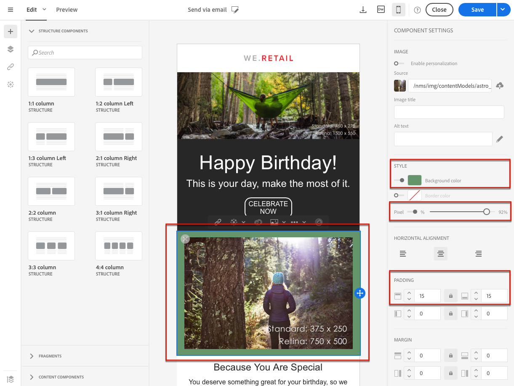

# Sobre o design de conteúdo de email{#about-email-content-design}

Use a interface de arrastar e soltar do Designer de emails para criar e modificar o conteúdo de seus e-mails no Adobe Campaign.

Esta seção descreve as especificidades do Designer de email:

* [Sobre o Designer de email](../../designing/using/about-email-content-design.md#about-the-email-designer)
* [Definição da estrutura de email](../../designing/using/defining-the-email-structure.md)
* [Edição de estilos de e-mail](../../designing/using/editing-email-styles.md)

Para saber mais sobre ações comuns a uma ou mais atividades de marketing, consulte as seguintes seções:

* Para obter mais informações sobre como personalizar um conteúdo de email, consulte [Inserir um campo de personalização](../../designing/using/inserting-a-personalization-field.md) e [Adicionar um bloco de conteúdo](../../designing/using/adding-a-content-block.md).
* Para obter mais informações sobre como importar outro conteúdo de email, consulte [Seleção de um conteúdo existente](../../designing/using/selecting-an-existing-content.md).
* Para obter mais informações sobre como definir conteúdo dinâmico em um email, consulte [Definição do conteúdo dinâmico em um e-mail](../../designing/using/defining-dynamic-content-in-an-email.md).
* Para obter mais informações sobre como inserir links em um email, consulte [Inserir um link](../../designing/using/inserting-a-link.md).
* Para obter mais informações sobre como inserir imagens em um email, consulte [Inserir imagens](../../designing/using/inserting-images.md).

Verifique também as [práticas recomendadas gerais para o design de conteúdo](../../designing/using/content-design-best-practices.md).

## Sobre o Designer de email {#about-the-email-designer}

O Designer de email permite que você crie conteúdo de email e modelos de conteúdo de email. Ele é compatível com emails simples, emails transacionais, E/B de teste A/B, emails multilíngues e emails recorrentes.

Para começar a usar o Designer de emails, assista a este [conjunto de vídeos](https://helpx.adobe.com/campaign/kt/acs/using/acs-email-designer-tutorial.html#GettingStarted) que explicam a funcionalidade geral do Designer e como projetar um e-mail do zero ou usando modelos.

### Página inicial do Designer de email {#email-designer-home-page}

Ao [criar um email](../../channels/using/creating-an-email.md), a página **[!UICONTROL Email Designer]** inicial é exibida automaticamente após a seleção do conteúdo de email.


A **[!UICONTROL Properties]** guia permite que você edite os detalhes de e-mail, como o rótulo, o endereço e o nome do remetente ou o assunto do e-mail. Também é possível acessar essa guia clicando no rótulo do email na parte superior da tela.


A **[!UICONTROL Templates]** guia permite que você escolha entre o conteúdo HTML predefinido e os modelos criados para iniciar rapidamente a criação de seu e-mail. Consulte [Modelos de conteúdo](../../start/using/about-templates.md#content-templates).


A **[!UICONTROL Learn & support]** guia fornece acesso fácil à documentação e aos tutoriais relacionados.


Se você não selecionar um modelo, a página inicial do Designer de email também permite escolher como você deseja começar a criar seu conteúdo:

* Clique no **[!UICONTROL Create]** botão para iniciar um novo conteúdo do zero. Consulte [Criar um conteúdo de email do zero](../../designing/using/about-email-content-design.md#designing-an-email-content-from-scratch).
* Clique no **[!UICONTROL Upload]** botão para carregar um arquivo do seu computador. Consulte [Importar conteúdo de um arquivo](../../designing/using/importing-content-from-a-file.md).
* Clique no **[!UICONTROL Import from URL]** botão para recuperar o conteúdo existente do URL. Consulte [Importar conteúdo de um URL](../../designing/using/importing-content-from-a-url.md).

### Interface de email do Designer {#email-designer-interface}

O Designer de email oferece muitas opções que permitem criar, editar e personalizar cada aspecto do seu conteúdo.

A interface é composta de várias áreas oferecendo funcionalidades diferentes:


Dos elementos disponíveis na **Paleta** (1), arraste e solte os componentes da estrutura e fragmentos de conteúdo no **Workspace principal** (2). Selecione um componente ou elemento no **Workspace** (2) e personalize suas características principais de estilo e exibição no painel **Configurações** (3).

Acesse mais opções gerais e configurações da **barra de ferramentas principal** (4).

>[!NOTE]
>
>O painel **Configurações** pode ser movido para a esquerda de acordo com sua resolução de tela e exibição.


A barra de ferramentas **Contextual** da interface do editor oferece várias funcionalidades dependendo da zona selecionada. Ele contém botões de ação e botões que permitem alterar o estilo do texto. As modificações executadas sempre se aplicam à zona selecionada.

### Recomendações gerais para usar o Designer de email {#general-recommendations-for-using-the-email-designer}

Para usar o uso correto do Email do Designer e criar os melhores e-mails o mais rápido possível, recomendamos aplicar os seguintes princípios:

* Use o estilo em linha em vez de um CSS e CSS separados na seção &lt; head &gt; do HTML. Ao usar estilo inline, é possível otimizar o salvamento e a reutilização do fragmento do conteúdo.

   Consulte [Adicionar atributos de estilo em linha](../../designing/using/editing-email-styles.md#adding-inline-styling-attributes).

* Agende sua marca facilmente criando e reutilizando fragmentos do conteúdo para manter a consistência em suas campanhas de marketing.

   Consulte [Criar um fragmento do conteúdo](../../designing/using/defining-the-email-structure.md#creating-a-content-fragment).

Verifique também as [práticas recomendadas gerais para o design de conteúdo](../../designing/using/content-design-best-practices.md).

### Modo de compatibilidade do Designer de email {#email-designer-compatibility-mode}

Ao carregar um conteúdo, ele deve conter marcação específica para ser totalmente compatível e editável com o editor WYSIWYG do Designer de email.

Se parte ou parte do HTML carregado não for compatível com a marcação esperada, o conteúdo será carregado em'modo de compatibilidade ', o que limita a edição de possibilidades por meio da interface do usuário.

Quando um conteúdo é carregado no modo de compatibilidade, você ainda pode executar as seguintes modificações por meio da interface (ações indisponíveis ficam ocultas):

* Alteração do texto ou alteração de uma imagem
* Inserção de links e campos de personalização
* Editar algumas opções de estilo no bloco HTML selecionado
* Definição de conteúdo condicional


Outras modificações, como adicionar novas seções ao seu e-mail ou estilo avançado, devem ser feitas diretamente no código-fonte do e-mail por meio do modo HTML.

Para obter mais informações sobre como converter um e-mail existente em um email compatível com o Designer, consulte [esta seção](../../designing/using/about-email-content-design.md#designing-an-email-using-existing-contents).

### Limitações do Designer de email {#email-designer-limitations}

* Não é possível usar campos de personalização em um fragmento. Para mais em fragmentos, consulte [esta seção](../../designing/using/defining-the-email-structure.md#about-fragments).
* Não é possível salvar diretamente como um fragmento em algum conteúdo de um email que você está editando no Designer de email. É necessário copiar o HTML correspondente a esse conteúdo em um novo fragmento. Para obter mais informações sobre isso, consulte [Salvar conteúdo como um fragmento](../../designing/using/defining-the-email-structure.md#saving-content-as-a-fragment).
* Ao editar estilos, apenas as fontes da Web oficialmente suportadas pela maioria dos clientes de email estão disponíveis.
* Os estilos não podem ser salvos como um tema para reutilização futura. No entanto, o estilo CSS pode ser salvo em um modelo de conteúdo ou em um e-mail. Para obter mais informações sobre estilos, consulte [esta seção](../../designing/using/editing-email-styles.md).

### Atualizações de email do Designer {#email-designer-updates}

O Designer de email está em constante melhoria. Se você criou um conteúdo de email do zero, de um modelo predefinido ou se criou fragmentos, você receberá a seguinte mensagem de atualização na próxima vez que abrir seu conteúdo:


A Adobe recomenda atualizar seu conteúdo para a versão mais recente para evitar problemas como problemas de colisão de CSS. Click **[!UICONTROL Update now]**.

Se ocorrer um erro durante a atualização do conteúdo, verifique seu HTML e resolva-o antes de executar esta atualização novamente.

Quando chegar a fragmentos, observe o seguinte:

* Se você quiser adicionar um fragmento a um novo e-mail ou modelo, e se receber essa mensagem, é necessário atualizar esse fragmento primeiro.

* Se você tiver vários fragmentos, precisará atualizar cada fragmento que deseja usar em um conteúdo de email.

* Para evitar o impacto nas mensagens de email atuais que ainda não estão preparadas, você pode optar por não atualizar alguns fragmentos.

* Ainda é possível enviar emails onde um fragmento que não foi atualizado já está sendo usado, mas esse fragmento não é editável.

* Atualizar fragmentos usados em emails que já estão preparados não afeta esses e-mails.

## Criar um conteúdo de email do zero {#designing-an-email-content-from-scratch}

Estas são as etapas principais para criar e desenvolver um conteúdo de email do zero usando o Designer de email:

1. Crie um email e abra seu conteúdo.
1. Adicione componentes de estrutura para formar o e-mail. Consulte [Editando a estrutura de e-mail](../../designing/using/defining-the-email-structure.md#editing-the-email-structure).
1. Insira componentes e fragmentos de conteúdo nos componentes da estrutura. Consulte [Adicionar fragmentos e componentes de conteúdo](../../designing/using/defining-the-email-structure.md#adding-fragments-and-content-components).
1. Adicione imagens e edite o texto do email. Consulte [Inserir imagens](../../designing/using/inserting-images.md).
1. Personalize seu email adicionando campos de personalização, links etc. Consulte [Inserir um campo de personalização](../../designing/using/inserting-a-personalization-field.md), [Inserir um link](../../designing/using/inserting-a-link.md) e [Definir conteúdo dinâmico em um e-mail](../../designing/using/defining-dynamic-content-in-an-email.md).
1. Defina a linha de assunto do seu e-mail. Consulte [Personalização da linha de assunto de um email](../../designing/using/personalizing-the-subject-line-of-an-email.md).
1. Visualize seu e-mail.
1. Salve o conteúdo e prossiga com a mensagem depois de certificar-se de que definiu um público-alvo e programe corretamente o envio.

Você também pode marcar este [vídeo de introdução](https://video.tv.adobe.com/v/22771/?autoplay=true&hidetitle=true&captions=por_br).

>[!NOTE]
>
>Para evitar o desenvolvimento de conteúdo de email do zero, você pode usar modelos de conteúdo prontos. Para saber mais sobre isso, consulte [Modelos de conteúdo](../../start/using/about-templates.md#content-templates).

**Tópicos relacionados**:

* [Criação de um email](../../channels/using/creating-an-email.md)
* [Seleção de um conteúdo existente](../../designing/using/selecting-an-existing-content.md)
* [Seleção de um público-alvo em uma mensagem](../../audiences/using/selecting-an-audience-in-a-message.md)
* [Mensagens de agendamento](../../sending/using/about-scheduling-messages.md)
* [Visualização de mensagens](../../sending/using/previewing-messages.md)
* [Renderização por email](../../sending/using/email-rendering.md)

## Criar um email usando conteúdos existentes {#designing-an-email-using-existing-contents}

Esta seção explica como converter um email existente em um email compatível com o Designer do email.

Por padrão, se você apenas fizer upload de qualquer HTML (consulte [Importar conteúdo de um arquivo](../../designing/using/importing-content-from-a-file.md)), o conteúdo será carregado no «[modo de compatibilidade](../../designing/using/about-email-content-design.md#email-designer-compatibility-mode)», o que limita a edição por meio da interface do usuário (apenas na edição no local, sem arrastar e soltar).

No entanto, se você quiser criar uma estrutura de modelos modulares e fragmentos que possam ser combinados a serem reutilizados em vários emails, você deve considerar converter seu HTML de email em um modelo do Designer de email.

Ao projetar conteúdo com o Designer de email, você tem três opções:

* [Criar conteúdo a partir de um modelo predefinido](../../designing/using/about-email-content-design.md#building-content-from-an-out-of-the-box-template)
* [Usar fragmentos e componentes](../../designing/using/about-email-content-design.md#using-fragments-and-components), começar do zero e recriar um design HTML
* [Converter um e-mail de conteúdo](../../designing/using/about-email-content-design.md#converting-an-html-content) HTML em um conteúdo de email modular do Designer

### Criar conteúdo a partir de um modelo predefinido {#building-content-from-an-out-of-the-box-template}

1. Crie um email e abra seu conteúdo. Para saber mais sobre isso, consulte [Criar um e-mail](../../channels/using/creating-an-email.md).
1. Clique no ícone inicial para acessar a **[!UICONTROL Email Designer]** página inicial.
1. Clique na **[!UICONTROL Templates]** guia.
1. Escolha um modelo HTML predefinido.

   Os diferentes modelos apresentam diversas combinações de vários tipos de elementos. Por exemplo, os modelos «Difusão» têm margens enquanto os modelos «Astro» não têm essas margens. Para saber mais sobre isso, consulte [Modelos de conteúdo](../../start/using/about-templates.md#content-templates).

1. É possível combinar esses elementos para criar diversas variantes de e-mail. Por exemplo, é possível duplicar uma seção de email selecionando um componente de estrutura e clicando **[!UICONTROL Duplicate]** na barra de ferramentas contextual.
1. É possível mover os elementos por meio da seta azul à esquerda para arrastar um componente de estrutura abaixo ou acima de outro. Para saber mais sobre isso, consulte [Editar a estrutura de email](../../designing/using/defining-the-email-structure.md#editing-the-email-structure).
1. Você também pode mover componentes para alterar a organização de cada elemento de estrutura. Para obter mais informações sobre isso, consulte [Adicionar fragmentos e componentes](../../designing/using/defining-the-email-structure.md#adding-fragments-and-content-components).
1. Modifique o conteúdo de cada elemento de acordo com suas necessidades: imagens, texto, links.
1. Adapte as opções de estilo ao seu conteúdo, se necessário. Para saber mais sobre isso, consulte [Edição de estilos de email](../../designing/using/editing-email-styles.md).

### Uso de fragmentos e componentes {#using-fragments-and-components}

Para tornar um conteúdo externo compatível com o Designer de emails, a Adobe recomenda criar uma mensagem do zero e copiar o conteúdo do seu e-mail existente em fragmentos e componentes.

Quando você tem um conteúdo que não pode ser recriado, é possível copiar o código HTML do email original usando o **[!UICONTROL Html]** componente de conteúdo. Verifique se você está familiarizado com o HTML antes de prosseguir.

Um exemplo completo é apresentado abaixo.

>[!NOTE]
>
>O novo conteúdo não será a cópia exata do seu e-mail original, mas as etapas abaixo guiarão você pela criação de uma mensagem que será o mais próximo possível.

Considere que você deseja usar um boletim informativo existente criado fora do Adobe Campaign.

Você quiser ter o mesmo cabeçalho e rodapé em todos os emails que serão enviados com o Adobe Campaign. O corpo do e-mail será alterado de acordo com o conteúdo que você pretende exibir em cada boletim informativo.

**Pré-requisitos**

1. No email original, identifique as seções reutilizáveis das seções que serão exclusivas para cada email que você enviará.
1. Salve todas as imagens e ativos que você deseja usar.
1. Se você estiver familiarizado com o HTML, divida o conteúdo HTML original em partes diferentes.

**Criação de fragmentos para seu conteúdo reutilizável**

Usando o Designer de emails, crie um fragmento para cada seção reutilizável. Neste exemplo, você criará dois fragmentos: uma para o cabeçalho e outra para o rodapé. Em seguida, é possível copiar as partes relevantes do conteúdo existente nesses fragmentos.

Para fazer isso, siga as etapas abaixo:

1. No Adobe Campaign, vá **[!UICONTROL Resources]** para &gt; **[!UICONTROL Content templates & fragments]** e crie um fragmento para o cabeçalho. Para saber mais sobre isso, consulte [Criar um fragmento do conteúdo](../../designing/using/defining-the-email-structure.md#creating-a-content-fragment).
1. Adicione quantos componentes de estrutura forem necessários ao seu fragmento.

   

1. Insira os componentes de imagem e texto na sua estrutura.

   

1. Faça upload da imagem correspondente, digite o texto e ajuste as configurações.

   Para obter mais informações sobre como gerenciar configurações de estilo e atributos em linha, consulte [Editar estilos de e-mail](../../designing/using/editing-email-styles.md).

   

1. Salve o fragmento.
1. Prossiga de forma semelhante para criar seu rodapé e salvá-lo.

   

   Se você estiver familiarizado com o HTML, copie o código HTML do rodapé original usando o componente **[!UICONTROL Html]** de conteúdo. Para saber mais sobre isso, consulte [Sobre componentes de conteúdo](../../designing/using/defining-the-email-structure.md#about-content-components).

   

Seus fragmentos estão prontos para serem usados em um modelo.

**Inserção de fragmentos e componentes no modelo**

Agora você pode criar um modelo de email com o Designer de email. Use os componentes do conteúdo para refletir as diferentes seções do seu email e ajuste as configurações para torná-las o mais próximo possível do boletim original. Por fim, insira os fragmentos que você acabou de criar.

1. Usando o Designer de emails, crie um modelo. Para saber mais sobre isso, consulte [Modelos de conteúdo](../../start/using/about-templates.md#content-templates).
1. Insira vários componentes de estrutura no modelo - correspondendo ao cabeçalho, rodapé e ao corpo do seu e-mail. Para obter mais informações sobre como adicionar componentes de estrutura, consulte [Editar a estrutura de e-mail com o Designer de e-mail](../../designing/using/defining-the-email-structure.md#editing-the-email-structure).
1. Insira quantos componentes de conteúdo forem necessários para criar o corpo do seu boletim informativo. Esse será o conteúdo editável do seu email que será atualizado todos os meses.

   

   Se você estiver familiarizado com o código HTML, a Adobe recomenda alavancar **[!UICONTROL Html]** os componentes, onde você pode copiar os elementos mais complexos do email original. Use outros componentes, como **[!UICONTROL Button]** ou **[!UICONTROL Image]****[!UICONTROL Text]** para o resto do conteúdo. Para saber mais sobre isso, consulte [Sobre componentes de conteúdo](../../designing/using/defining-the-email-structure.md#about-content-components).

   >[!NOTE]
   >
   >O uso do **[!UICONTROL Html]** componente resulta em criar componentes editáveis com opções limitadas. Certifique-se de saber como lidar com o código HTML antes de selecionar este componente.

1. Ajuste os componentes de conteúdo para que correspondam ao seu email original o quanto você puder.

   

   Para obter mais informações sobre como gerenciar configurações de estilo e atributos em linha, consulte [Editar estilos de e-mail](../../designing/using/editing-email-styles.md).

1. Insira os dois fragmentos (cabeçalho e rodapé) criados anteriormente na estrutura desejada.

   

1. Salve o modelo.

Agora você pode gerenciar completamente este modelo no Designer de email para criar e atualizar o informativo que você enviará todos os meses para seus destinatários.

Para usá-lo, crie um email e selecione o modelo de conteúdo que você acabou de criar.

**Tópico relacionado**:

* [Criação de um email](../../channels/using/creating-an-email.md)
* [Vídeo de introdução ao email do Designer](https://video.tv.adobe.com/v/22771/?autoplay=true&hidetitle=true&captions=por_br)
* [Criar um conteúdo de email do zero](../../designing/using/about-email-content-design.md#designing-an-email-content-from-scratch)

### Conversão de um conteúdo HTML {#converting-an-html-content}

Esse caso de uso oferece uma maneira rápida de converter um email HTML em componentes de Email do Designer.

>[!CAUTION]
>
>Esta seção é para usuários avançados que estão familiarizados com o código HTML.

>[!NOTE]
>
>Como o modo de compatibilidade, um componente HTML é editável com opções limitadas: só é possível executar a edição no local.

Fora do Designer de email, verifique se o HTML original está dividido em seções reutilizáveis.

Se esse não for o caso, recorte os diferentes blocos de seu HTML. Por exemplo:

```
<!-- 3 COLUMN w/CTA (SCALED) -->
<table width="100%" align="center" cellspacing="0" cellpadding="0" border="0" role="presentation" style="max-width:680px;">
<tbody>
<tr>
<td class="padh10" align="center" valign="top" style="padding:0 5px 20px 5px;">
<table width="100%" cellspacing="0" cellpadding="0" border="0" role="presentation">
<tbody>
<tr>
...
</tr>
</tbody>
</table>
</td>
</tr>
</tbody>
</table>
<!-- //3 COLUMN w/CTA (SCALED) -->
```

Depois de identificar todos os seus blocos, no Designer de emails, repita o procedimento a seguir para cada seção de seu e-mail existente:

1. Abra o Designer de email para criar um conteúdo de email vazio.
1. Defina os atributos de nível de corpo: cores de plano de fundo, largura etc. Para saber mais sobre isso, consulte [Edição de estilos de email](../../designing/using/editing-email-styles.md).
1. Adicione um componente de estrutura. Para saber mais sobre isso, consulte [Editar a estrutura de email](../../designing/using/defining-the-email-structure.md#editing-the-email-structure).
1. Adicionar um componente HTML. Para obter mais informações sobre isso, consulte [Adicionar fragmentos e componentes](../../designing/using/defining-the-email-structure.md#adding-fragments-and-content-components).
1. Copie o HTML para este componente.
1. Alternar para visualização móvel. Para saber mais sobre isso, consulte [esta seção](../../designing/using/about-email-content-design.md#switching-to-mobile-view).

   A exibição responsiva é interrompida, pois o CSS está ausente.

1. Para corrigir isso, alterne para o modo de código fonte e copie a seção de estilo em uma nova seção de estilo. Por exemplo:

   ```
   <style type="text/css">
   a {text-decoration:none;}
   body {min-width:100% !important; margin:0 auto !important; padding:0 !important;}
   img {line-height:100%; text-decoration:none; -ms-interpolation-mode:bicubic;}
   ...
   </style>
   ```

   >[!NOTE]
   >
   >Não modifique o CSS gerado pelo E-mail do Designer: `<style acrite-template-css="true">` e `<style acrite-custom-styles="" type="text/css">`. Certifique-se de adicionar seu estilo depois disso.

1. Volte para a exibição móvel para verificar se o conteúdo é exibido corretamente e salve suas alterações.

## Alternando para a exibição móvel {#switching-to-mobile-view}

Você pode ajustar o design responsivo de um email editando separadamente todas as opções de estilo para exibição móvel. Por exemplo, você pode adaptar margens e preenchimento, usar tamanhos de fonte menores ou maiores, alterar botões ou aplicar cores de plano de fundo diferentes que serão específicas para a versão móvel do seu e-mail.

Todas as opções de estilo estão disponíveis na exibição móvel. As configurações de estilo de Email do Designer são apresentadas na seção [Editar estilos de e-mail](../../designing/using/editing-email-styles.md) .

1. Crie um email e comece a editar o conteúdo. Para saber mais sobre isso, consulte [Criar um conteúdo de email do zero](../../designing/using/about-email-content-design.md#designing-an-email-content-from-scratch).
1. Para acessar a exibição móvel dedicada, selecione o **[!UICONTROL Switch to mobile view]** botão.

   

   A versão móvel do email é exibida. Contém todos os componentes e estilos definidos na exibição da área de trabalho.

1. Edite independentemente todas as configurações de estilo, como cor de fundo, alinhamento, preenchimento, margem, família da fonte, cor do texto e assim por diante.

   

1. Ao editar qualquer configuração de estilo na exibição móvel, as modificações são aplicadas somente à exibição móvel.

   Por exemplo, reduza o tamanho de uma imagem, adicione um plano de fundo verde e altere o preenchimento na exibição móvel.

   

1. É possível ocultar um componente quando exibido em um dispositivo móvel. Para fazer isso, selecione **[!UICONTROL Show only on desktop devices]** a partir **[!UICONTROL Display options]**do.
Você também pode ocultar esse componente em dispositivos de desktop, o que significa que ela será exibida apenas em dispositivos móveis. Para fazer isso, selecione **[!UICONTROL Show only on mobile devices]**.
Por exemplo, essa opção permite exibir uma imagem específica em dispositivos móveis e outra imagem em dispositivos de desktop.
Você pode definir essa opção da exibição para dispositivos móveis ou para desktop.

   

1. Clique novamente no **[!UICONTROL Switch to mobile view]** botão para voltar para a exibição padrão de desktop. As alterações de estilo que você acabou de fazer não são refletidas.

   

   >[!NOTE]
   >
   >A única exceção é as **[!UICONTROL Style inline]** configurações. Qualquer alteração de configuração de linha em linha também é aplicada à exibição padrão de desktop.

1. Qualquer outra alteração na estrutura ou no conteúdo do email, como edições de texto, upload de uma nova imagem, adição de um novo componente etc. também é aplicado à exibição padrão.

   Por exemplo, alternar de volta para a exibição móvel, editar algum texto e substituir uma imagem.

   

   Clique novamente no **[!UICONTROL Switch to mobile view]** botão para voltar para a exibição padrão de desktop. As alterações são refletidas.

   

1. Remover um estilo na exibição móvel leva você de volta ao estilo aplicado no modo de desktop.

   Por exemplo, na exibição móvel, aplique uma cor de plano de fundo verde a um botão.

   

1. Alternar para a exibição de área de trabalho e aplicar um plano de fundo cinza ao mesmo botão.

   

1. Alterne novamente para a exibição móvel e desative a **[!UICONTROL Background color]** configuração.

   

   A cor de fundo definida na exibição da área de trabalho agora é aplicada: torna-se cinza (não em branco).

   A única exceção é **[!UICONTROL Border color]** a configuração. Quando desativado na exibição móvel, nenhuma borda é aplicada, mesmo se uma cor da borda estiver definida na exibição da área de trabalho.

## Texto simples e modos HTML {#plain-text-and-html-modes}

### Geração de uma versão de texto do email {#generating-a-text-version-of-the-email}

Por padrão, **[!UICONTROL Plain text]** a versão do seu e-mail é gerada e sincronizada automaticamente com a **[!UICONTROL Edit]** versão.

Os campos de personalização e os blocos de conteúdo adicionados à versão HTML também são sincronizados com a versão de texto simples.

>[!NOTE]
>
>Para usar blocos de conteúdo na versão de texto simples, verifique se eles não contêm código HTML.

Para ter uma versão de texto simples diferente da versão HTML, desative essa sincronização clicando na **[!UICONTROL Sync with HTML]** alternância **[!UICONTROL Plain text]** do seu e-mail.


Em seguida, você pode editar a versão de texto simples, conforme desejado.

>[!NOTE]
>
>Se você editar **[!UICONTROL Plain text]** a versão enquanto a sincronização estiver desativada, na próxima vez que ativar a **[!UICONTROL Sync with HTML]** opção, todas as alterações efetuadas na versão de texto sem formatação serão substituídas pela versão HTML. As alterações feitas na **[!UICONTROL Plain text]** visualização não podem ser refletidas na **[!UICONTROL HTML]** visualização.

### Editar uma fonte de conteúdo de email em HTML {#editing-an-email-content-source-in-html}

Para os usuários mais avançados e a depuração, você pode visualizar e editar o conteúdo de email diretamente em HTML.

Há duas maneiras de editar a versão HTML do email:

* Selecione **[!UICONTROL Edit]** &gt; **[!UICONTROL HTML]** para abrir a versão HTML do email inteiro.

   

* Na interface WYSIWYG, selecione um elemento e clique no **[!UICONTROL Source code]** ícone.

   Apenas a fonte do elemento selecionado é exibida. É possível editar o código-fonte se o elemento selecionado for um **[!UICONTROL HTML]** componente de conteúdo. Outros componentes estão no modo somente leitura, mas ainda podem ser editados na versão HTML completa do email.

   

Se você modificar o HTML do código, a capacidade de resposta do email poderá ser interrompida. Certifique-se de testá-lo usando o **[!UICONTROL Preview]** botão. Consulte [Visualizar mensagens](../../sending/using/previewing-messages.md).

## Design por meio de integrações do Adobe Campaign {#design-through-adobe-campaign-integrations}

### Edição de conteúdo no Dreamweaver {#editing-content-in-dreamweaver}

A integração do Adobe Campaign Standard com o Dreamweaver permite editar o conteúdo de um email na interface do Dreamweaver. Você tem acesso à interface avançada do Dreamweaver para projetar e desenvolver conteúdo de email responsivo.

* **Sincronização bidirecional**

   Sempre que uma edição é feita em um produto, ela é atualizada em tempo real no outro. Se você quiser alterar a cor do texto no Dreamweaver, assim que essa edição for feita, a cor do texto fica ativa no Campaign. Além disso, quando você seleciona o código no Dreamweaver ou Campaign, visto que os números de linha são os mesmos, a seleção permanece entre os dois produtos, o que é muito útil ao procurar algo específico no código.

* **Carregar imagens locais para AC por meio do Dreamweaver**

   Ao criar ou editar um e-mail no Dreamweaver, basta selecionar uma imagem no computador ou na máquina local. Embora o Dreamweaver sempre permita que você faça isso, quando o Dreamweaver e a Campanha são conectados, o arquivo local é carregado imediatamente no servidor do Adobe Campaign: não é necessário carregar manualmente imagens como alterações de conteúdo. Além disso, isso garante que as imagens mais recentes estejam sempre ativas no Campaign.

* **Adicionar personalização de campanha no Dreamweaver**

   Para o desenvolvedor de e-mail não há mais a necessidade de adicionar texto, como ```[[FIRSTNAME_PLACEHOLDER]]``` a sintaxe das tabelas de modelo de dados. A barra de ferramentas Campanha no Dreamweaver se conecta diretamente ao modelo de dados da sua instância Campanha. Isso significa que você pode obter qualquer dado que desejar para personalização de algo como o Primeiro nome como Endereço. Se você tiver criado Blocos de conteúdo dentro da campanha, também poderá puxá-los diretamente para o Dreamweaver.

Este recurso é detalhado na Documentação do Dreamweaver acessível [aqui](https://helpx.adobe.com/dreamweaver/using/working-with-dreamweaver-and-campaign.html). Um vídeo de demonstração [também](https://helpx.adobe.com/campaign/kt/acs/using/acs-dreamweaver-integration-feature-video-use.html) está disponível.

### Edição de conteúdo no Experience Manager {#editing-content-in-experience-manager}

O conteúdo de email pode ser editado no Experience Manager e, em seguida, usado para uma ou várias mensagens de email no Adobe Campaign Standard. Consulte [este documento](../../integrating/using/integrating-with-experience-manager.md).

### Comparação de opções de design de email {#email-design-options-comparison}

O Adobe Campaign oferece várias opções de criação de email. A tabela abaixo mostra as principais possibilidades, benefícios e limitações para cada um deles.

<table> 
 <thead> 
  <tr> 
   <th> </th> 
   <th> Designer de emails<br /> </th> 
   <th> Experience Manager<br /> </th> 
   <th> Dreamweaver<br /> </th> 
  </tr> 
 </thead> 
 <tbody> 
  <tr> 
   <td> <strong>Iniciar e-mail em branco</strong><br /> </td> 
   <td> Suportado<br /> </td> 
   <td> Suportado<br /> </td> 
   <td> Suportado<br /> </td> 
  </tr> 
  <tr> 
   <td> <strong>Escrever HTML</strong><br /> </td> 
   <td> Suportado<br /> </td> 
   <td> Não suportado<br /> </td> 
   <td> Suportado<br /> </td> 
  </tr> 
  <tr> 
   <td> <strong>Atualizar HTML</strong><br /> </td> 
   <td> Somente dentro de um componente HTML<br /> </td> 
   <td> Não suportado<br /> </td> 
   <td> Suportado<br /> </td> 
  </tr> 
  <tr> 
   <td> <strong>Personalização básica</strong><br /> </td> 
   <td> Suportado<br /> </td> 
   <td> Suportado<br /> </td> 
   <td> Suportado<br /> </td> 
  </tr> 
  <tr> 
   <td> <strong>Personalização avançada</strong><br /> </td> 
   <td> Suportado<br /> </td> 
   <td> Não suportado<br /> </td> 
   <td> Não suportado<br /> </td> 
  </tr> 
  <tr> 
   <td> <strong>Prova/visualização</strong><br /> </td> 
   <td> Suportado<br /> </td> 
   <td> Visualização na<br /> prova do AEM na campanha<br /> </td> 
   <td> Visualizar e provar no Campaign<br /> </td> 
  </tr> 
  <tr> 
   <td> <strong>Listagens de produto</strong><br /> </td> 
   <td> Suportado nas mensagens transacionais por email<br /> </td> 
   <td> Não suportado<br /> </td> 
   <td> Não suportado<br /> </td> 
  </tr> 
  <tr> 
   <td> <strong>Benefícios</strong><br /> </td> 
   <td> 
     - Fácil criação de email por meio da experiência
 de arrastar e soltar<br/>- Funcionalidades semelhantes ao editor
 de conteúdo herdado<br/>- Conteúdo reutilizável com fragmentos
  </td> 
   <td> 
     - Reutilizando ativos do site em emails<br/>
 - Aproveitando a potência do Experience Manager no conteúdo de email
    </td> 
   <td> 
    - Recurso para um desenvolvedor codificar diretamente um e-mail<br/>
 - sincronização
 bi-direcional<br/>- Edição off-line no Dreamweaver e sincronizar mais tarde<br/>
 - Carregar imagens no Adobe Campaign por meio do Dreamweaver
  </td> 
  </tr> 
  <tr> 
   <td> <strong>Limitações</strong><br /> </td> 
   <td> 
     - Nenhum conteúdo condicional em fragmentos<br/>
 - Não é possível usar fragmentos do Experience Manager
  </td> 
   <td> 
     - Personalização avançada difícil de implementar<br/>
 - Precisa enviar testes no Adobe Campaign
  </td> 
   <td> Conteúdo dinâmico não suportado<br /> </td> 
  </tr> 
  <tr> 
   <td> <strong>Público-alvo</strong><br /> </td> 
   <td> Comerciantes que desejam manter a flexibilidade para usar componentes HTML em combinação com recursos de arrastar e soltar<br /> </td> 
   <td> Comerciantes que já usam o Experience Manager que desejam usar modelos de e-mail padrão com pouca personalização<br /> </td> 
   <td> Desenvolvedores que desejam codificar conteúdo de email e se integrar diretamente com o Adobe Campaign<br /> </td> 
  </tr> 
  <tr> 
   <td> <strong>Para saber mais</strong><br /> </td> 
   <td> Consulte <a href="../../designing/using/about-email-content-design.md#about-the-email-designer">Sobre o Designer de email</a><br /> </td> 
   <td> Consulte <a href="../../integrating/using/integrating-with-experience-manager.md">Integração com o Experience Manager</a><br /> </td> 
   <td> Consulte <a href="https://helpx.adobe.com/dreamweaver/using/working-with-dreamweaver-and-campaign.html">Dreamweaver e Campaign</a> e assista a este <a href="https://helpx.adobe.com/campaign/kt/acs/using/acs-dreamweaver-integration-feature-video-use.html">vídeo</a><br /> </td> 
  </tr> 
 </tbody> 
</table>

