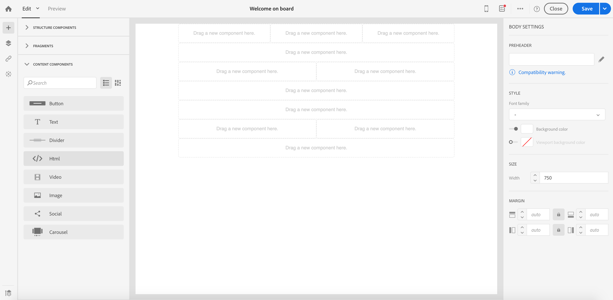

# Conversão de conteúdo de email do editor herdado {#converting-an-html-content}

Comece a trabalhar com o Designer de email e crie modelos e fragmentos reutilizáveis a partir do HTML de email criado no Editor herdado.

Esse caso de uso permite criar um modelo de Designer de email usando um email de HTML e dividindo-o em componentes de HTML no Designer de email.

>[!NOTE]
>
>Como o modo de compatibilidade, um componente HTML é editável com opções limitadas: você só pode executar a edição no local.

>[!IMPORTANT]
>
>Esta seção é para usuários avançados familiarizados com o código HTML.

## Preparação do conteúdo de email

1. Selecione um email HTML.
1. Identifique seções para dividir o email HTML.
1. Cortar os diferentes blocos de seu HTML.

## Criar sua estrutura de email

1. Abra o **[!UICONTROL Email Designer]** para criar um conteúdo de email vazio.
1. Defina os atributos do nível do corpo: cores do plano de fundo, largura etc. Para obter mais informações, consulte [Edição de estilos de email](../../designing/using/styles.md).
1. Adicione quantos componentes de estrutura você tiver seções. Para obter mais informações, consulte [Edição da estrutura do email](../../designing/using/designing-from-scratch.md#defining-the-email-structure).

## Adicionar conteúdo de HTML

1. Adicione um componente HTML a cada componente de estrutura. Para obter mais informações, consulte [Inclusão de fragmentos e componentes](../../designing/using/designing-from-scratch.md#defining-the-email-structure).
1. Copie e cole seu HTML em todos os componentes.

## Gerenciar o estilo do email {#manage-the-style-of-your-email}

1. Mudar para **[!UICONTROL Mobile view]**. Para obter mais informações, consulte [esta seção](../../designing/using/plain-text-html-modes.md#switching-to-mobile-view).

1. Para corrigir isso, alterne para o modo de código-fonte e copie e cole sua seção de estilo em uma nova seção de estilo. Por exemplo:

   ```
   <style type="text/css">
   a {text-decoration:none;}
   body {min-width:100% !important; margin:0 auto !important; padding:0 !important;}
   img {line-height:100%; text-decoration:none; -ms-interpolation-mode:bicubic;}
   ...
   </style>
   ```

   >[!NOTE]
   >
   >Certifique-se de adicionar o estilo depois disso em outra tag de estilo personalizada.
   >
   >Não modifique o CSS gerado pelo Designer de email:
   >
   >* `<style data-name="default" type="text/css">(##)</style>`
   >* `<style data-name="supportIOS10" type="text/css">(##)</style>`
   >* `<style data-name="mediaIOS8" type="text/css">(##)</style>`
   >* `<style data-name="media-default-max-width-500px" type="text/css">(##)</style>`
   >* `<style data-name="media-default--webkit-min-device-pixel-ratio-0" type="text/css">(##)</style>`

1. Retorne à exibição para dispositivos móveis para verificar se o conteúdo é exibido corretamente e salve as alterações.

## Caso de uso

Vamos tentar converter esse email, criado no editor herdado, em um modelo **[!UICONTROL Email Designer]**.

### Identifique a seção do seu email

Podemos identificar 11 seções neste email.


Para identificar qual elemento é qual seção do HTML, você pode selecioná-lo.


Para ver a versão do HTML do email, clique em **[!UICONTROL Show source]**.

### Criar o modelo de email e sua estrutura

1. Arraste e solte **[!UICONTROL Structure components]** refletindo o layout do nosso email.

1. Repita quantas vezes forem necessárias. Precisamos criar 11 componentes de estrutura.

   

### Inserção de componentes de conteúdo de HTML

1. Insira um **[!UICONTROL HTML component]** em cada **[!UICONTROL Structure component]**.

   

1. Para cada seção, clique em **[!UICONTROL Show source code]**.

   

1. Insira a seção HTML.

1. Clique em **[!UICONTROL Save]**.

Agora você pode verificar a renderização do seu email.


### Gerenciamento de estilos para se adequar à exibição móvel

1. Insira elementos CSS para garantir que o email seja adequado para visualização móvel.

1. Alterne para o código-fonte e copie e cole sua seção de estilo em uma nova seção de estilo.

Para obter mais informações, consulte [Gerenciar o estilo do seu email](#manage-the-style-of-your-email).

Seu email herdado agora está disponível no Designer de email.
