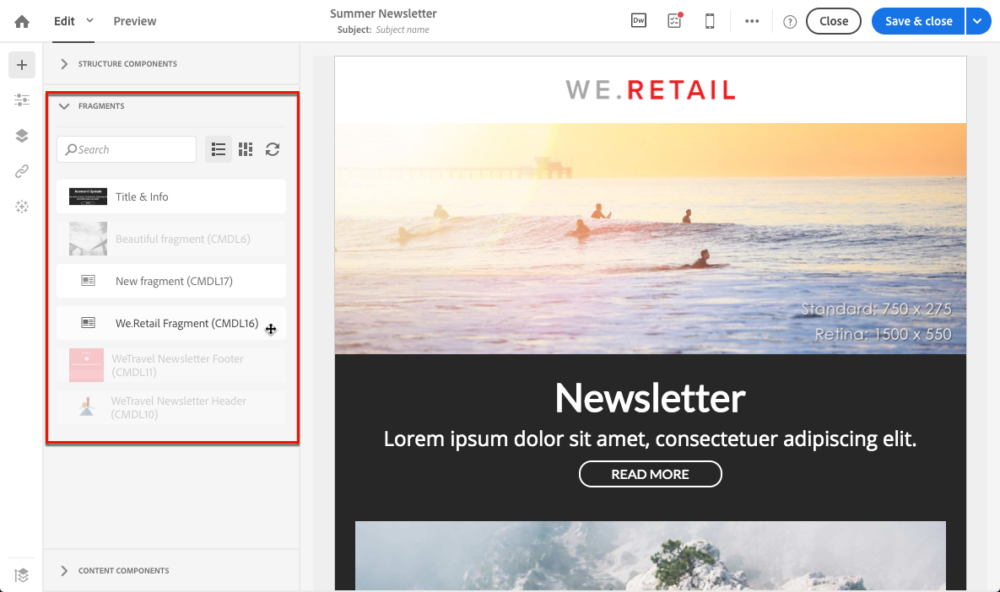

# Definição da estrutura de email{#defining-the-email-structure}

## Editar a estrutura de email {#editing-the-email-structure}

O Designer de email permite que você defina facilmente a estrutura do seu e-mail. Ao adicionar e mover elementos estruturais com ações simples de arrastar e soltar, você pode projetar a forma de seu email em segundos.

Para editar a estrutura de um e-mail:

1. Abra um conteúdo existente ou crie um novo conteúdo de email.
1. Acesse o **[!UICONTROL Structure components]** ícone **+** selecionado à esquerda.

   

1. Arraste e solte os componentes da estrutura necessários para formar seu e-mail.

   

   Uma linha azul materializa a localização exata dos componentes da estrutura antes de soltar. É possível soltá-la acima, entre ou abaixo de qualquer outro componente, mas não dentro.

   >[!NOTE]
   >
   >Depois de colocado no email, não será possível mover nem remover seus componentes, a menos que já exista um componente de conteúdo ou um fragmento colocado dentro.

1. Vários componentes de estrutura compostos de uma ou mais colunas estão disponíveis.

   Selecione o **[!UICONTROL n:n column]** componente para definir o número de colunas de sua escolha (entre 3 e 10). Você também pode definir a largura de cada coluna movendo as setas na parte inferior de cada coluna.

   

   >[!NOTE]
   >
   >Cada tamanho de coluna não pode ultrapassar 10% da largura total do componente de estrutura. Não é possível remover uma coluna que não esteja vazia.

Quando a estrutura estiver definida, você poderá adicionar fragmentos de conteúdo e componentes ao seu e-mail.

## Adição de fragmentos e componentes de conteúdo {#adding-fragments-and-content-components}

Com o Designer de email, depois de adicionar componentes de estrutura ao seu e-mail, você pode definir seu conteúdo. Para fazer isso, você precisa adicionar elementos dentro de cada componente de estrutura.

Há duas categorias de elementos de conteúdo que podem ser usados: **fragmentos** e **componentes de conteúdo**.

### Sobre fragmentos {#about-fragments}

Um fragmento é um componente reutilizável que pode ser referenciado em um ou mais emails.

Para aproveitar o melhor uso de fragmentos no Designer de email:

* Crie seus próprios fragmentos. Consulte [Criar um fragmento do conteúdo](../../designing/using/defining-the-email-structure.md#creating-a-content-fragment) e [Salvar conteúdo como um fragmento](../../designing/using/defining-the-email-structure.md#saving-content-as-a-fragment).
* Use-os quantas vezes forem necessárias em seus e-mails. Consulte [Inserir elementos em um email](../../designing/using/defining-the-email-structure.md#inserting-elements-into-an-email).
* Ao editar um fragmento, as alterações são sincronizadas: são propagados automaticamente para todos os emails (desde que ainda não tenham sido preparados ou enviados) contendo esse fragmento.

Quando adicionados a um e-mail, os fragmentos são bloqueados por padrão. Se quiser modificar um fragmento para um e-mail específico, é possível quebrar a sincronização com o fragmento original desbloqueando-o no e-mail onde ele é usado. As alterações não serão mais sincronizadas.

Para desbloquear um fragmento dentro de um e-mail, selecione-o e clique no ícone de bloqueio na barra de ferramentas contextual.

Esse fragmento se torna um componente independente que não é mais vinculado ao fragmento original. Ele pode ser editado como qualquer outro componente de conteúdo. Consulte [Sobre componentes de conteúdo](../../designing/using/defining-the-email-structure.md#about-content-components).

### Sobre os componentes de conteúdo {#about-content-components}

Os componentes de conteúdo são componentes brutos e vazios que podem ser editados uma vez em um e-mail.

Você pode adicionar quantos componentes de conteúdo quiser em um componente de estrutura. Também é possível movê-los dentro do componente de estrutura ou para outro componente de estrutura.

Esta é a lista de componentes disponíveis no Email do Designer:

* **[!UICONTROL Button]**

   Se você precisar usar vários botões, em vez de editar cada botão do zero, poderá duplicar o **[!UICONTROL Button]** componente usando a barra de ferramentas contextual.

   Também é possível salvar botões em fragmentos que podem ser reutilizados. Para obter mais informações sobre isso, consulte [Criar um fragmento](../../designing/using/defining-the-email-structure.md#creating-a-content-fragment) de conteúdo e [Salvar conteúdo como um fragmento](../../designing/using/defining-the-email-structure.md#saving-content-as-a-fragment).

* **[!UICONTROL Carousel]**

   Para saber mais sobre isso, consulte [Usando o componente de carrossel](../../designing/using/defining-the-email-structure.md#using-the-carousel-component).

* **[!UICONTROL Divider]**
* **[!UICONTROL Html]**

   Use este componente para copiar as diferentes partes do HTML existente. Isso permite criar componentes HTML modulares gratuitos.

   >[!NOTE]
   >
   >Um componente HTML gratuito é editável com opções limitadas. Se todos os estilos não estiverem alinhados, certifique-se de adicionar o CSS apropriado na seção **de cabeçalho** do código HTML; caso contrário, o e-mail não responderá. Use o **[!UICONTROL Preview]** botão para testar a responsividade do seu conteúdo (consulte [Visualizar mensagens](../../sending/using/previewing-messages.md)).

* **[!UICONTROL Image]**
* **[!UICONTROL Social]**
* **[!UICONTROL Text]**

#### Uso do componente carrossel {#using-the-carousel-component}

1. Arraste e solte o **[!UICONTROL Carousel]** componente dentro de um componente de estrutura.
1. Navegue para selecionar imagens do seu computador.

   

1. No **[!UICONTROL Settings]** painel, defina o número de miniaturas que você deseja no carrossel.
1. Selecione uma imagem de fallback de seu computador.

   

   O componente carrossel não é compatível com todos os programas de email. Carregue um fallback para exibir uma imagem em vez de quando o carrossel não for suportado no e-mail.

   >[!NOTE]
   >
   >O componente de carrossel é compatível com as seguintes plataformas de email: Apple Mail 7, Apple Mail 8, Outlook 2011 para Mac, Outlook 2016 para Mac, Mozilla Thunderbird, ipad e ipad mini iOS, iphone iOS, Android, AOL (Chrome, Firefox e Safari).

1. Selecione **[!UICONTROL Fallback view]** para exibir a imagem de fallback no Designer de email.

### Inserir elementos em um email {#inserting-elements-into-an-email}

Para definir o conteúdo do seu e-mail, você pode adicionar elementos de conteúdo aos componentes de estrutura inseridos anteriormente. Consulte [Editando a estrutura de e-mail](../../designing/using/defining-the-email-structure.md#editing-the-email-structure).

1. Acesse os elementos do conteúdo selecionando o **ícone +** à esquerda. Selecione [Fragmentos](../../designing/using/defining-the-email-structure.md#about-fragments) ou [Componentes de conteúdo](../../designing/using/defining-the-email-structure.md#about-content-components).
1. Se você já conhece o rótulo ou parte do rótulo do fragmento que deseja adicionar, você pode pesquisá-lo.

   

1. Arraste e solte um fragmento ou componente de conteúdo da paleta até um componente de estrutura do email.

   

   Depois que um elemento é adicionado ao email, ele pode ser movido dentro do componente de estrutura ou para outro componente de estrutura no email.

   

1. Edite o elemento para corresponder às necessidades exatas desse email. Você pode adicionar texto, links, imagens e assim por diante.

   >[!NOTE]
   >
   >Os fragmentos são bloqueados por padrão quando adicionados a um e-mail. É possível quebrar a sincronização com o fragmento original se quiser modificar o fragmento para um e-mail específico ou fazer sua alteração diretamente no fragmento. Consulte [Sobre fragmentos](../../designing/using/defining-the-email-structure.md#about-fragments).

1. Repita esse procedimento para todos os elementos que você precisa adicionar ao seu e-mail.
1. Salve seu email.

Agora que a estrutura de email é preenchida, é possível editar o estilo de cada elemento de conteúdo. Consulte [Editando um elemento](../../designing/using/editing-email-styles.md#editing-an-element).

>[!NOTE]
>
>Se um fragmento for modificado, as alterações serão propagadas automaticamente nos emails onde são usadas. Para saber mais sobre isso, consulte [Sobre fragmentos](../../designing/using/defining-the-email-structure.md#about-fragments).

### Criação de um fragmento de conteúdo {#creating-a-content-fragment}

Você pode criar seus próprios fragmentos de conteúdo para usá-los conforme necessário em um ou mais emails.

1. Vá **[!UICONTROL Resources]** para &gt; **[!UICONTROL Content templates & fragments]** e clique **[!UICONTROL Create]** em.
1. Clique no rótulo do email para acessar **[!UICONTROL Properties]** a guia do Designer de email.
1. Especifique um rótulo reconhecível e selecione os seguintes parâmetros para encontrar o fragmento ao editar o conteúdo de e-mail:

   * Como os fragmentos são compatíveis apenas com emails, selecione **[!UICONTROL Delivery]** na lista **[!UICONTROL Content type]** suspensa.
   * Selecione **[!UICONTROL Fragment]** na lista **[!UICONTROL HTML type]** suspensa para poder usar esse conteúdo como um fragmento.
   

1. Se necessário, é possível definir uma imagem que será usada como miniatura do fragmento. Selecione-o na **[!UICONTROL Thumbnail]** guia das propriedades do modelo.

   

   Essa miniatura será exibida ao lado do rótulo do fragmento ao editar um e-mail.

1. Feche a **[!UICONTROL Properties]** guia para retornar à área de trabalho principal.
1. Adicione componentes de estrutura e componentes de conteúdo que você pode personalizar, conforme necessário.

   >[!NOTE]
   >
   >Os fragmentos não podem incluir campos de personalização, conteúdo dinâmico ou outro fragmento.
   >A exibição [móvel não](../../designing/using/about-email-content-design.md#switching-to-mobile-view) está disponível em fragmentos.

1. Depois de editado, salve o fragmento.

Esse fragmento agora pode ser usado em qualquer email criado com o Designer de email. Ela aparece na **[!UICONTROL Fragments]** seção da paleta.

>[!NOTE]
>
>Não é possível inserir campos de personalização dentro de um fragmento, a menos que seja usado em um e-mail e desbloqueado. Consulte [Sobre fragmentos](../../designing/using/defining-the-email-structure.md#about-fragments).

### Salvar conteúdo como um fragmento {#saving-content-as-a-fragment}

Ao editar um email com o Designer de email, você pode salvar diretamente parte desse email como um fragmento.

* Não é possível salvar como fragmento uma estrutura contendo campos de personalização, conteúdo dinâmico ou outro fragmento.
* Apenas é possível selecionar estruturas adjacentes entre si.
<!--* You cannot select an empty structure.-->

1. Ao editar um email no Email do Designer, selecione **[!UICONTROL Save as fragment]** a partir da barra de ferramentas principal.

   

1. No espaço de trabalho, selecione as estruturas que compõem o fragmento.

   

   >[!NOTE]
   >
   >Certifique-se de selecionar estruturas adjacentes entre si e que não incluam campos de personalização, conteúdo dinâmico ou outro fragmento.
   <!--You cannot select an empty structure.-->

1. Click **[!UICONTROL Create]**.

1. Adicione um rótulo e uma descrição, se necessário, e clique **[!UICONTROL Save]** em.

   

1. Para localizar o fragmento recém-criado, vá **[!UICONTROL Resources]** para &gt; **[!UICONTROL Content templates & fragments]**.

   

1. Para usar o novo fragmento, abra qualquer conteúdo de email e selecione-o na lista de fragmentos.

>[!NOTE]
>A exibição [móvel não](../../designing/using/about-email-content-design.md#switching-to-mobile-view) está disponível em fragmentos. Se quiser editar uma exibição móvel por email, faça-a antes de salvar seu conteúdo como um fragmento.

<!--You need to copy-paste the HTML corresponding to the section that you want to save into a new fragment.

>[!NOTE]
>
>To do this, you need to be familiar with HTML code.

To save as a fragment some email content that you created, follow the steps below.

1. When editing an email in the Email Designer, select **[!UICONTROL Edit]** > **[!UICONTROL HTML]** to open the HTML version of that email.
1. Select and copy the HTML corresponding to the part that you want to save.
1. Go to **[!UICONTROL Resources]** > **[!UICONTROL Content templates & fragments]** and click **[!UICONTROL Create]**.
1. Click the email label to access the **[!UICONTROL Properties]** tab of the Email Designer and select **[!UICONTROL Fragment]** from the **[!UICONTROL HTML type]** drop-down list.
1. Select **[!UICONTROL Edit]** > **[!UICONTROL HTML]** to open the HTML version of the fragment.
1. Paste the HTML that you copied where appropriate.
1. Switch back to the **[!UICONTROL Edit]** view to check the result and save the new fragment.-->

