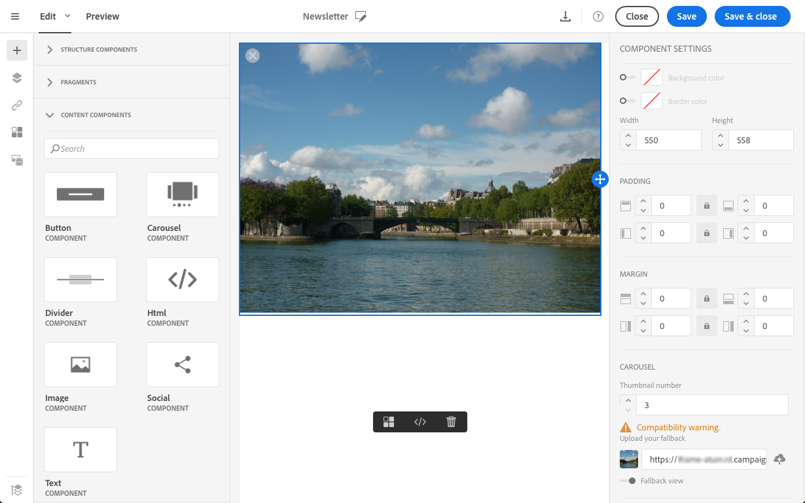

# Criar e-mails do zero {#designing-an-email-content-from-scratch}

Saiba mais sobre como dominar a edição de conteúdo de email. Com o Email Designer, você pode criar emails e modelos começando com ou sem seu próprio conteúdo predefinido.

## Etapas principais para criar seu email {#key-steps-to-create-your-email}

Estas são as etapas principais para criar e projetar um conteúdo de email do zero usando o Designer de email:

1. Crie um email e abra seu conteúdo.
1. Adicione componentes de estrutura para moldar o email. See [Editing the email structure](#defining-the-email-structure).
1. Insira componentes de conteúdo e fragmentos nos componentes da estrutura. Consulte [Adicionar fragmentos e componentes](#defining-the-email-structure)de conteúdo.
1. Adicione imagens e edite o texto do email. Consulte [Inserção de imagens](../../designing/using/images.md#inserting-images).
1. Personalize seu email adicionando campos de personalização, links e assim por diante. Consulte [Inserir um campo](../../designing/using/personalization.md#inserting-a-personalization-field)de personalização, [Inserir um link](../../designing/using/links.md#inserting-a-link) e [Definir conteúdo dinâmico em um email](../../designing/using/personalization.md#defining-dynamic-content-in-an-email).
1. Defina a linha de assunto do seu email. See [Personalizing the subject line of an email](../../designing/using/subject-line.md#defining-the-subject-line-of-an-email).
1. Pré-visualização seu email.
1. Salve o conteúdo e prossiga com a mensagem depois de certificar-se de que definiu uma audiência e agendou corretamente o envio.

Você também pode conferir este vídeo [de](https://video.tv.adobe.com/v/22771/?autoplay=true&hidetitle=true&captions=por_br)introdução.

>[!NOTE]
>
>Para evitar a criação de conteúdo de email do zero, você pode usar modelos de conteúdo prontos para uso. Para obter mais informações, consulte Modelos [de](../../designing/using/using-reusable-content.md#content-templates)conteúdo.

### Defining Email Structure {#defining-the-email-structure}

O Designer de e-mail permite que você defina facilmente a estrutura de seu e-mail. Ao adicionar e mover elementos estruturais com ações simples de arrastar e soltar, você pode projetar a forma do seu email em segundos.

Para editar a estrutura de um email:

1. Abra um conteúdo existente ou crie um novo conteúdo de email.
1. Acesse o navegador **[!UICONTROL Structure components]** selecionando o ícone **+** à esquerda.

   

1. Arraste e solte os componentes de estrutura necessários para moldar seu email.

   

   Uma linha azul materializa o local exato dos componentes da estrutura antes de soltá-la. Você pode soltá-lo acima, entre ou abaixo de qualquer outro componente, mas não dentro.

   >[!NOTE]
   >
   >Once placed in the email, you cannot move nor remove your components unless there is already a content component or a fragment placed inside.

1. Estão disponíveis vários componentes de estrutura compostos por uma ou mais colunas.

   Selecione o **[!UICONTROL n:n column]** componente para definir o número de colunas de sua escolha (entre 3 e 10). Você também pode definir a largura de cada coluna movendo as setas na parte inferior de cada coluna.

   

   >[!NOTE]
   >
   >Cada tamanho de coluna não pode estar abaixo de 10% da largura total do componente de estrutura. Não é possível remover uma coluna que não esteja vazia.

Depois que a estrutura for definida, você poderá adicionar fragmentos de conteúdo e componentes ao seu email.

### Uso de componentes de conteúdo {#about-content-components}

Content components are raw, empty components that you can edit once placed in an email.

You can add as many content components as you want in a structure component. You can also move them inside the structure component or to another structure component.

Here is the list of the available components in the Email Designer:

- **[!UICONTROL Button]**

   If you need to use multiple buttons, rather than editing each button from scratch, you can duplicate the **[!UICONTROL Button]** component using the contextual toolbar.

   You can also save buttons into fragments that can be reused. For more on this, see [Creating a content fragment](../../designing/using/using-reusable-content.md#creating-a-content-fragment) and [Saving content as a fragment](../../designing/using/using-reusable-content.md#saving-content-as-a-fragment).

Selecione **[!UICONTROL Fallback view]** para exibir a imagem de fallback no Designer de e-mail.

- **[!UICONTROL Text]**

   Use este componente para inserir texto em seu email. You can adjust the color, style and size of your text in **[!UICONTROL Component Settings]**.

- **[!UICONTROL Divider]**

   Use este componente para inserir uma linha divisória em seu email. Você pode selecionar a cor, o estilo e o tamanho da linha de quebra em **[!UICONTROL Component Settings]**.

- **[!UICONTROL Html]**

   Use esse componente para copiar e colar as diferentes partes do seu HTML existente. Isso permite que você crie componentes HTML modulares gratuitos.

   >[!NOTE]
   >
   >Um componente HTML gratuito é editável com opções limitadas. Se todos os estilos não estiverem incorporados, certifique-se de adicionar o CSS correto na seção **head** do código HTML; caso contrário, o e-mail não responderá. Use o **[!UICONTROL Preview]** botão para testar a capacidade de resposta do seu conteúdo (consulte [Visualizar mensagens](../../sending/using/previewing-messages.md)).

   Para simplesmente tornar um conteúdo externo compatível com o Email Designer, a Adobe recomenda criar uma mensagem do zero e copiar o conteúdo do seu email existente em fragmentos e componentes.

   Quando você tem um conteúdo que não pode ser recriado, é possível copiar e colar o código HTML do email original usando o componente de **[!UICONTROL Html]** conteúdo. Make sure you are familiar with HTML before proceeding.

   <!-- A full example is presented below. -->

   >[!NOTE]
   >
   >O novo conteúdo não será a cópia exata do seu email original, mas as etapas abaixo o guiarão pela criação de uma mensagem que estará o mais próxima possível.

   **Antes de copiar o conteúdo**

   1. Em seu email original, identifique as seções reutilizáveis das seções que serão exclusivas para cada email que você enviará.
   1. Save all the images and assets that you want to use.
   1. If you are familiar with HTML, split your original HTML content into different parts.

- **[!UICONTROL Video]**

   Use this component to insert a video in your email.

   Insert the video component into a structure component of your email and enter the video link in the **[!UICONTROL Component Settings]**.

- **[!UICONTROL Image]**

   Use this component to insert an image in your email.

   Insert the image component into a structure component and click browse to upload an image file from your computer.

- **[!UICONTROL Social]**

   Use this component to insert links to social media pages in your email. You can select which links you want to display and the size of their icon in **[!UICONTROL Component Settings]**.

- **[!UICONTROL Carousel]**

   1. Drag and drop the **[!UICONTROL Carousel]** component inside a structure component.
   1. Navegue para selecionar imagens do seu computador.
   

   1. No **[!UICONTROL Settings]** painel, defina o número de miniaturas que deseja usar no carrossel.
   1. Selecione uma imagem de fallback do seu computador.
   

   O componente carrossel não é compatível com todos os programas de email. Carregue um fallback para exibir uma imagem em vez disso, quando o carrossel não for suportado no email.

   >[!NOTE]
   >
   >O componente carrossel é compatível com as seguintes plataformas de email: Apple Mail 7, Apple Mail 8, Outlook 2011 para Mac, Outlook 2016 para Mac, Mozilla Thunderbird, iPad e iPad mini iOS, iPhone iOS, Android, AOL (Chrome, Firefox e Safari).

**Tópicos relacionados**:

- [Criação de um de email](../../channels/using/creating-an-email.md)
- [Selecionar um público-alvo em uma mensagem](../../audiences/using/selecting-an-audience-in-a-message.md)
- [Agendamento de mensagens](../../sending/using/about-scheduling-messages.md)
- [Visualizar mensagens](../../sending/using/previewing-messages.md)
- [Renderização de email](../../sending/using/email-rendering.md)
