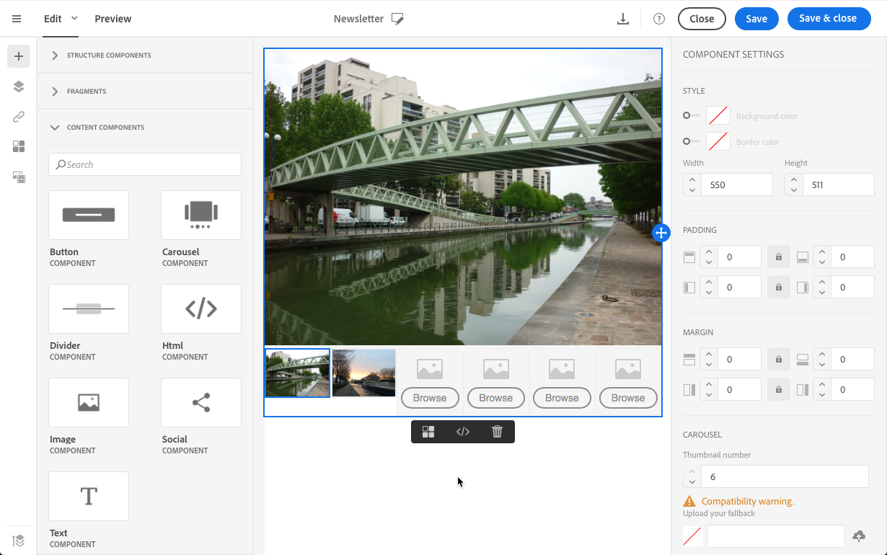

# Criar e-mails do zero {#designing-an-email-content-from-scratch}

Saiba como principal a edição de conteúdo de email. Com o Email Designer, você pode criar emails e modelos começando com ou sem seu próprio conteúdo predefinido.

Estas são as etapas principais para criar e projetar um conteúdo de email do zero usando o Designer de email:

1. Crie um email e abra seu conteúdo.
1. Adicione componentes de estrutura para moldar o email. Consulte [Editar a estrutura](#defining-the-email-structure)de email.
1. Insira componentes de conteúdo e fragmentos nos componentes da estrutura. Consulte [Adicionar fragmentos e componentes](#defining-the-email-structure)de conteúdo.
1. Adicione imagens e edite o texto do email. Consulte [Inserção de imagens](../../designing/using/images.md#inserting-images).
1. Personalize seu email adicionando campos de personalização, links e assim por diante. Consulte [Inserir um campo](../../designing/using/personalization.md#inserting-a-personalization-field)de personalização, [Inserir um link](../../designing/using/links.md#inserting-a-link) e [Definir conteúdo dinâmico em um email](../../designing/using/personalization.md#defining-dynamic-content-in-an-email).
1. Defina a linha de assunto do seu email. See [Personalizing the subject line of an email](../../designing/using/subject-line.md#defining-the-subject-line-of-an-email).
1. Pré-visualizar seu email.
1. Salve o conteúdo e prossiga com a mensagem depois de certificar-se de que definiu uma audiência e agendou corretamente o envio.

Você também pode conferir este vídeo [de](https://video.tv.adobe.com/v/22771/?autoplay=true&hidetitle=true&captions=por_br)introdução.

>[!NOTE]
>
>Para evitar a criação de conteúdo de email do zero, você pode usar modelos de conteúdo prontos para uso. Para obter mais informações, consulte Modelos [de](../../designing/using/using-reusable-content.md#content-templates)conteúdo.

## Definição da estrutura do email {#defining-the-email-structure}

>[!CONTEXTUALHELP]
>id="ac_structure_components"
>title="Sobre os componentes da Estrutura"
>abstract="Os componentes da estrutura definem o layout do email."

>[!CONTEXTUALHELP]
>id="ac_edition_columns"
>title="Definição de colunas de email"
>abstract="O Designer de e-mail permite que você defina facilmente o layout de seu e-mail definindo a estrutura da coluna."

O Designer de e-mail permite que você defina facilmente a estrutura de seu e-mail. Ao adicionar e mover elementos estruturais com ações simples de arrastar e soltar, você pode projetar a forma do seu email em segundos.

Para editar a estrutura de um email:

1. Abra um conteúdo existente ou crie um novo conteúdo de email.
1. Acesse o navegador **[!UICONTROL Structure components]** selecionando o ícone **+** à esquerda.

   

1. Arraste e solte os componentes de estrutura necessários para moldar seu email.

   

   Uma linha azul materializa o local exato dos componentes da estrutura antes de soltá-la. Você pode soltá-lo acima, entre ou abaixo de qualquer outro componente, mas não dentro.

   >[!NOTE]
   >
   >Observe que a pilha de colunas não é compatível com todos os programas de email. Quando não houver suporte, as colunas não serão empilhadas.
   >
   >Depois de inserido no email, não é possível mover nem remover seus componentes, a menos que já exista um componente de conteúdo ou um fragmento inserido dentro dele.

1. Estão disponíveis vários componentes de estrutura compostos por uma ou mais colunas.

   Selecione o **[!UICONTROL n:n column]** componente para definir o número de colunas de sua escolha (entre 3 e 10). Também é possível definir a largura de cada coluna movendo as setas na parte inferior de cada coluna.

   

   >[!NOTE]
   >
   >Cada tamanho de coluna não pode estar abaixo de 10% da largura total do componente de estrutura. Não é possível remover uma coluna que não esteja vazia.

Depois que a estrutura for definida, você poderá adicionar fragmentos de conteúdo e componentes ao seu email.

## Uso de um precabeçalho {#preheader}

>[!CONTEXTUALHELP]
>id="ac_edition_preheader"
>title="Uso de um precabeçalho"
>abstract="O precabeçalho permite configurar um texto resumido curto que fornecerá uma taxa de abertura mais alta para seu email."

Um precabeçalho é um breve texto de resumo que segue a linha de assunto ao exibir um email da sua caixa de entrada. O pré-cabeçalho oferece uma taxa de abertura mais alta.

Selecione a caixa de **[!UICONTROL Preheader]** edição e preencha o conteúdo.

Você pode adicionar um **[!UICONTROL Content block]**, um **[!UICONTROL Dynamic content]** ou um **[!UICONTROL Personalization fields]** no conteúdo do cabeçalho.

>[!NOTE]
>
>Observe que o preheader não é compatível com todos os programas de email. Quando não houver suporte, o pré-cabeçalho não será exibido.

## Uso de componentes de conteúdo {#about-content-components}

>[!CONTEXTUALHELP]
>id="ac_content_components"
>title="Sobre os componentes do conteúdo"
>abstract="Os componentes do conteúdo são espaços reservados para conteúdo vazio que você pode editar para criar um email."

Os componentes do conteúdo são componentes brutos e vazios que podem ser editados depois de enviados por email.

Você pode adicionar quantos componentes de conteúdo desejar em um componente de estrutura. Também é possível movê-los dentro do componente de estrutura ou para outro componente de estrutura.

Esta é a lista dos componentes disponíveis no Email Designer:

### **[!UICONTROL Button]**

Se precisar usar vários botões, em vez de editar cada botão do zero, você pode duplicado o **[!UICONTROL Button]** componente usando a barra de ferramentas contextual.

Também é possível salvar botões em fragmentos que podem ser reutilizados. Para obter mais informações, consulte [Criar um fragmento](../../designing/using/using-reusable-content.md#creating-a-content-fragment) de conteúdo e [Salvar conteúdo como um fragmento](../../designing/using/using-reusable-content.md#saving-content-as-a-fragment).

Selecione **[!UICONTROL Fallback view]** para exibir a imagem de fallback no Designer de e-mail.

### **[!UICONTROL Text]**

    Use este componente para inserir texto em seu email. Você pode ajustar a cor, o estilo e o tamanho do seu texto em **[!UICONTROL Component Settings]**.

### **[!UICONTROL Divider]**

    Use este componente para inserir uma linha divisória em seu email. Você pode selecionar a cor, o estilo e o tamanho da linha de quebra em **[!UICONTROL Component Settings]**.

### **[!UICONTROL Html]**

Use esse componente para copiar e colar as diferentes partes do seu HTML existente. Isso permite que você crie componentes HTML modulares gratuitos.

>[!NOTE]
>
>Um componente HTML gratuito é editável com opções limitadas. Se todos os estilos não estiverem incorporados, certifique-se de adicionar o CSS correto na seção **head** do código HTML; caso contrário, o e-mail não responderá. Use o **[!UICONTROL Preview]** botão para testar a capacidade de resposta do seu conteúdo (consulte [Visualizar mensagens](../../sending/using/previewing-messages.md)).

Para simplesmente tornar um conteúdo externo compatível com o Email Designer, o Adobe recomenda criar uma mensagem do zero e copiar o conteúdo do seu email existente em fragmentos e componentes.

Quando você tem um conteúdo que não pode ser recriado, é possível copiar e colar o código HTML do email original usando o componente de **[!UICONTROL Html]** conteúdo. Conheça o HTML antes de continuar.

<!-- A full example is presented below. -->

>[!NOTE]
>
>O novo conteúdo não será a cópia exata do seu email original, mas as etapas abaixo o guiarão pela criação de uma mensagem que estará o mais próxima possível.

    **Antes de copiar seu conteúdo**
    
    1. Em seu email original, identifique as seções reutilizáveis das seções que serão exclusivas para cada email que você enviará.
    1. Salve todas as imagens e ativos que deseja usar.
    1. Se você estiver familiarizado com HTML, divida seu conteúdo HTML original em diferentes partes.

### Vídeo {#video-settings}

>[!CONTEXTUALHELP]
>id="ac_edition_video"
>title="Configurações de vídeo"
>abstract="Use este componente para inserir um vídeo em seu email. Observe que os vídeos não funcionam em todos os clientes de email. Recomendamos definir uma imagem de fallback."
>additional-url="https://www.emailonacid.com/blog/article/email-development/a_how_to_guide_to_embedding_html5_video_in_email/" text="Informações adicionais"

Insira o componente de vídeo em um componente de estrutura do email e insira o link de vídeo no **[!UICONTROL Component Settings]**.

>[!NOTE]
>
>Observe que o vídeo não é compatível com todos os programas de email. Quando não houver suporte, o fallback será exibido.

### Imagem

Use este componente para inserir uma imagem em seu email.

Insira o componente de imagem em um componente de estrutura e clique em Procurar para carregar um arquivo de imagem do computador.

### **[!UICONTROL Social]**

Use este componente para inserir links para páginas de mídia social em seu email. Você pode selecionar em quais links deseja exibir e o tamanho do ícone deles em **[!UICONTROL Component Settings]**.

### Carrossel {#carousel-settings}

>[!CONTEXTUALHELP]
>id="ac_edition_carousel"
>title="Configurações do carrossel"
>abstract="Saiba como inserir e configurar um carrossel em seu conteúdo.Observe que o carrossel não funciona em todos os clientes de email e a imagem de fallback será exibida caso não seja compatível."

1. Arraste e solte o **[!UICONTROL Carousel]** componente dentro de um componente de estrutura.
1. Navegue para selecionar imagens do seu computador.

   

1. No **[!UICONTROL Settings]** painel, defina o número de miniaturas que deseja usar no carrossel.
1. Selecione uma imagem de fallback do seu computador.

   

O componente carrossel não é compatível com todos os programas de email. Carregue um fallback para exibir uma imagem em vez disso, quando o carrossel não for suportado no email.

>[!NOTE]
>
>O componente carrossel é compatível com as seguintes plataformas de email: Apple Mail 7, Apple Mail 8, Outlook 2011 para Mac, Outlook 2016 para Mac, Mozilla Thunderbird, iPad e iPad mini iOS, iPhone iOS, Android, AOL (Chrome, Firefox e Safari).

**Tópicos relacionados**:

- [Criação de email](../../channels/using/creating-an-email.md)
- [Seleção de um público-alvo em uma mensagem](../../audiences/using/selecting-an-audience-in-a-message.md)
- [Agendamento de mensagens](../../sending/using/about-scheduling-messages.md)
- [Visualização de mensagens](../../sending/using/previewing-messages.md)
- [Renderização de email](../../sending/using/email-rendering.md)
