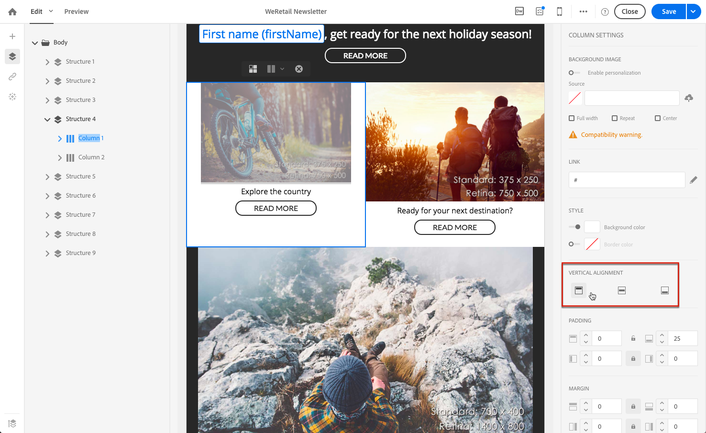
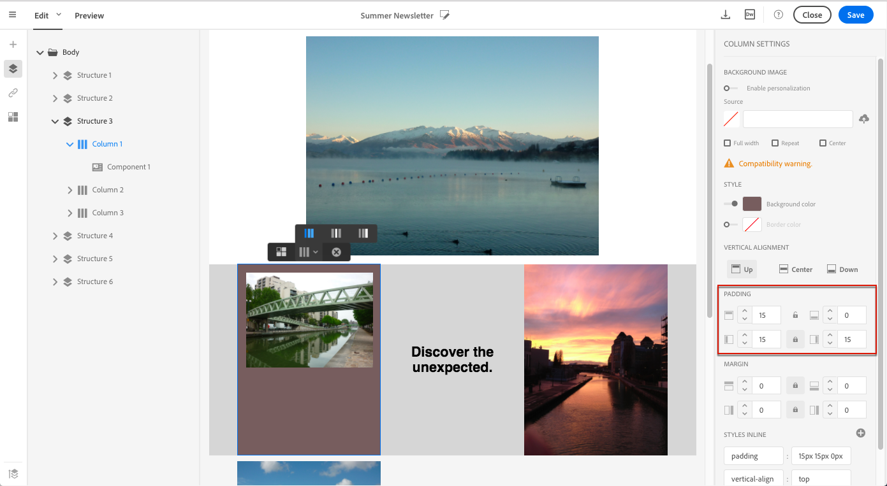

# Editing email styles{#editing-email-styles}

## Editing an element {#editing-an-element}

In the Email Designer, when selecting an element, several options specific to the type of content selected are displayed in the **[!UICONTROL Settings]** pane. Você pode usar essas opções para alterar facilmente o estilo do seu e-mail.

### Selecting an element {#selecting-an-element}

Para selecionar um elemento na interface do Designer de email, você pode:

* clique diretamente no email,
* or browse the structure tree available from the options located in the left **Palette**.

Navegar pela árvore de estrutura permite que você faça uma seleção mais precisa. Você pode selecionar:

* o componente de estrutura inteiro,
* uma das colunas que compõem o componente de estrutura,
* ou apenas um componente localizado dentro de uma coluna.

Para selecionar uma coluna, você também pode fazer o seguinte:

1. Select a structure component (directly in the email or using the structure tree available from the left **Palette**).
1. From the **contextual toolbar**, click **[!UICONTROL Select a column]** to choose the desired column.

See an example in [this section](../../designing/using/editing-email-styles.md#example--adjusting-vertical-alignment-and-padding).

### Adjusting style settings {#adjusting-style-settings}

1. Selecione um elemento em seu email. For more on this, see [Selecting an element](../../designing/using/editing-email-styles.md#selecting-an-element).
1. Ajuste as configurações de acordo com suas necessidades. Cada elemento selecionado oferece um conjunto diferente de configurações.

   You can insert backgrounds, change sizes, modify horizontal or vertical alignment, manage colors, add [padding or margin](../../designing/using/editing-email-styles.md#about-padding-and-margin), and so on.

   To do this, use the options displayed in the **[!UICONTROL Settings]** pane or [add inline styling attributes](../../designing/using/editing-email-styles.md#adding-inline-styling-attributes).

   

1. Salve o conteúdo.

### About padding and margin {#about-padding-and-margin}

A interface do Designer de email permite ajustar rapidamente as configurações de preenchimento e margem.

**[!UICONTROL Padding]**: essa configuração permite gerenciar o espaço localizado dentro da borda de um elemento.

Por exemplo:

* Use o preenchimento para definir margens nos lados esquerdo e direito de uma imagem.
* Use top and bottom padding to add more spacing to a **[!UICONTROL Text]** or a **[!UICONTROL Divider]** component.
* Para definir bordas entre colunas dentro de um elemento de estrutura, defina o preenchimento para cada coluna.

**[!UICONTROL Margin]**: essa configuração permite gerenciar o espaço entre a borda do elemento e o elemento seguinte.

>[!NOTE]
>
>Dependendo da sua seleção (componente de estrutura, coluna ou componente de conteúdo), o resultado não será o mesmo. Adobe recommends setting the **[!UICONTROL Padding]** and **[!UICONTROL Margin]** parameters at the column level.

For both **[!UICONTROL Padding]** and **[!UICONTROL Margin]**, click the lock icon to break synchronization between top and bottom or right and left parameters. Isso permite ajustar cada parâmetro separadamente.

### About alignment {#about-alignment}

* **Alinhamento de texto**: coloque o cursor do mouse em algum texto e use a barra de ferramentas contextual para alinhá-lo.

   

* **O alinhamento horizontal** pode ser aplicado a textos, imagens e botões, atualmente não para os **[!UICONTROL Divider]** e **[!UICONTROL Social]** os componentes.

   

* To set **vertical alignment**, select a column inside a structure component and choose an option from the Settings pane.

   

### About backgrounds {#about-backgrounds}

Ao definir planos de fundo com o Designer de email, a Adobe recomenda o seguinte:

1. Aplique uma cor de plano de fundo ao corpo do seu e-mail, se exigido pelo seu design.
1. Na maioria dos casos, defina as cores do plano de fundo no nível da coluna.
1. Tente não usar cores de fundo na imagem ou nos componentes de texto, pois eles são difíceis de gerenciar.

Abaixo estão as configurações de plano de fundo disponíveis que podem ser usadas.

* Set a **[!UICONTROL Background color]** for the whole email. Certifique-se de selecionar as configurações de corpo na árvore de navegação acessíveis a partir da paleta esquerda.

   

* Set the same background color for all structure components by selecting **[!UICONTROL Viewport background color]**. Essa opção permite que você selecione uma configuração diferente da cor de fundo.

   

* Defina uma cor de plano de fundo diferente para cada componente de estrutura. Selecione uma estrutura na árvore de navegação acessível à paleta esquerda para aplicar uma cor de plano de fundo específica somente a essa estrutura.

   

   Certifique-se de não definir uma cor de fundo do visor, pois ela pode ocultar as cores de fundo da estrutura.

* Set a **[!UICONTROL Background image]** for the content of a structure component.

   

   >[!NOTE]
   >
   >Alguns programas de email não suportam imagens de fundo. Certifique-se de selecionar uma cor de fundo de fallback apropriada caso a imagem não possa ser exibida.

* Defina uma cor de plano de fundo no nível da coluna.

   

   >[!NOTE]
   >
   >Esse é o caso de uso mais comum. A Adobe recomenda definir cores de fundo no nível da coluna, pois isso permite mais flexibilidade ao editar todo o conteúdo de email.

   Você também pode definir uma imagem de plano de fundo no nível da coluna, mas isso é raramente usado.

### Example: adjusting vertical alignment and padding {#example--adjusting-vertical-alignment-and-padding}

Você deseja ajustar o preenchimento e o alinhamento vertical dentro de um componente de estrutura composto de três colunas. Para fazer isso, siga as etapas abaixo:

1. Select the structure component directly in the email or using the structure tree available from the left **Palette**.
1. From the **contextual toolbar**, click **[!UICONTROL Select a column]** and choose the one that you want to edit. Você também pode selecioná-lo na árvore de estrutura.

   

   The editable parameters for that column are displayed in the **[!UICONTROL Settings]** pane on the right.

1. Under **[!UICONTROL Vertical alignment]**, select **[!UICONTROL Up]**.

   

   O componente de conteúdo é exibido na parte superior da coluna.

1. Under **[!UICONTROL Padding]**, define the top padding inside the column. Clique no ícone de bloqueio para quebrar a sincronização com o preenchimento inferior.

   Defina o preenchimento esquerdo e direito para essa coluna.

   

1. Prossiga de forma semelhante para ajustar o alinhamento e o preenchimento das outras colunas.

   

1. Salve as alterações.

## Adding inline styling attributes {#adding-inline-styling-attributes}

Na interface do Designer de email, ao selecionar um elemento e exibir suas configurações no painel lateral, você pode personalizar os atributos em linha e seu valor para aquele elemento específico.

1. Selecione um elemento no seu conteúdo.
1. On the side panel, look for the **[!UICONTROL Styles Inline]** settings.

   

1. Modify the values of the existing attributes, or add new ones using the **+** button. Você pode adicionar qualquer atributo e valor que seja compatível com CSS.

O estilo é aplicado ao elemento selecionado. Se os elementos filho não tiverem atributos de estilo específicos definidos, o estilo do elemento pai será herdado.
