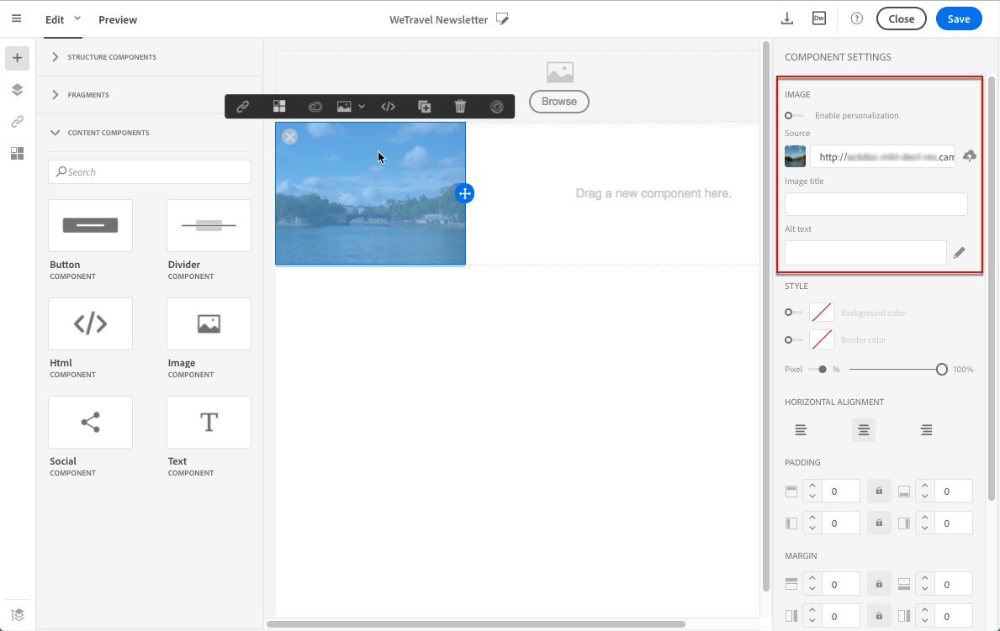

# Trabalhar com imagens {#images}

## Inserção de imagens{#inserting-images}

Você pode inserir imagens em seus emails e landings page.

Os seguintes tipos de imagens estão disponíveis, dependendo de sua configuração:

* Imagens locais
* Imagens compartilhadas da Adobe Experience Cloud - consulte [Trabalhar com a Campanha e os ativos Principais serviços](../../integrating/using/working-with-campaign-and-assets-core-service.md) / Ativos sob demanda
* Imagens dinâmicas do Adobe Target - consulte [Trabalhar com Campanha e Público alvo](../../integrating/using/about-campaign-target-integration.md)

>[!CAUTION]
>
>Se você optar por adicionar uma imagem diretamente editando a versão HTML do email, não deverá chamar arquivos **externos em uma tag** &lt;script> da página HTML. Esses arquivos não serão importados para o servidor do Adobe Campaign.

### Inserting images in an email {#inserting-images-in-an-email}

1. Adicione um componente de estrutura. Para obter mais informações, consulte [Edição da estrutura do email](../../designing/using/designing-from-scratch.md#defining-the-email-structure).
1. Dentro desse componente de estrutura, adicione um componente de **[!UICONTROL Image]** conteúdo.

   

1. Clique em **[!UICONTROL Browse]**. Arraste e solte uma imagem ou clique para selecionar um arquivo de seu computador.

   

1. Selecione o componente de conteúdo que você acabou de adicionar.
1. Verifique as propriedades da imagem e ajuste-as, se necessário.

   

## Configuração de propriedades de imagem{#setting-up-image-properties}

Quando um bloco que contém uma imagem é selecionado, as seguintes propriedades são oferecidas na paleta:

* **Ativar personalização** permite personalizar a fonte de imagem. Consulte [Personalização de uma fonte](../../designing/using/personalization.md#personalizing-an-image-source)de imagem.
* **Título** da imagem permite definir um título para a imagem.
* **O texto** alternativo (email) ou **Legenda** (landing page) permite que você defina a legenda vinculada à imagem (corresponde ao atributo HTML **alternativo** ).
* Ao editar um email, o **Estilo** permite especificar o tamanho da imagem, o plano de fundo e a borda.
* Ao editar uma landing page, as **Dimension** permitem que você especifique o tamanho da imagem em pixels.

O editor permite trabalhar com **todos os tipos** de imagem cujos formatos são compatíveis com os navegadores. Para serem compatíveis com o editor, as animações **do tipo** &quot;Flash&quot; devem ser inseridas em uma página HTML da seguinte forma:

```
<object type="application/x-shockwave-flash" data="http://www.mydomain.com/flash/your_animation.swf" width="200" height="400">
 <param name="movie" value="http://www.mydomain.com/flash/your_animation.swf" />
 <param name="quality" value="high" />
 <param name="play" value="true"/>
 <param name="loop" value="true"/> 
</object>
```

<!--
## Modifying images with the Adobe Creative SDK{#modifying-images-with-the-adobe-creative-sdk}

You can edit images and use a complete set of features powered by the Adobe Creative SDK to enhance your images directly in the content editor when editing emails or landing pages.

The image editor offers a powerful, full-featured image editing UI component that allows you to edit images and apply effects and frames, original high-quality stickers, beautiful overlays, fun features like tilt shift and color splash, pro-level adjustments and more.

To modify an image with the Adobe Creative SDK:

1. Select the image.
1. In the toolbar, click the Creative Cloud icon.

   

1. Select the tool you want to use through the icons on the top of the window to modify the image.

   

1. Click **[!UICONTROL Save]** when modifications are done. The updated image is saved on Adobe Campaign server and ready to be used.

>[!NOTE]
>
>Tools offered in the image editor cannot be customized.
-->