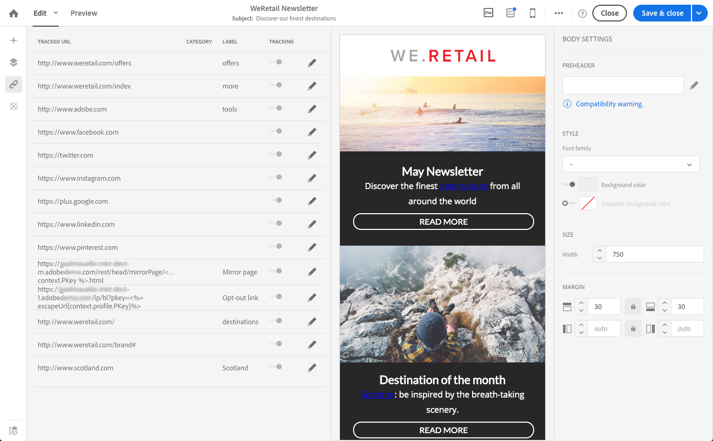

# Adição de links {#links}

## Inserção de um link {#inserting-a-link}

O editor permite personalizar um email ou uma landing page inserindo links nos elementos de conteúdo do HTML.

Você pode inserir um link em qualquer elemento de página: imagem, palavra, grupo de palavras, bloco de texto, etc.

>[!NOTE]
>
>As imagens abaixo mostram como inserir um link usando o [Designer de email](../../designing/using/designing-content-in-adobe-campaign.md) em um email.

1. Selecione um elemento e clique em **[!UICONTROL Insert link]** na barra de ferramentas contextual.

   

1. Escolha o tipo de link que deseja criar:

   * **Link externo**: inserir um link para uma URL externa.

     Você pode definir a personalização de seus URLs. Consulte [Personalizar URLs](personalization.md#personalizing-urls).

   * **Página de aterrissagem**: conceda acesso a uma página de aterrissagem do Adobe Campaign.
   * **Link de assinatura**: insira um link para assinar um serviço do Adobe Campaign.
   * **Link de cancelamento de assinatura**: insira um link para cancelar a assinatura de um serviço Adobe Campaign.
   * **Link que define uma ação**: defina uma ação quando um elemento na página de aterrissagem for clicado.

     >[!NOTE]
     >
     >Esse tipo de link só está disponível para landing pages.

1. Você pode modificar o texto exibido para o recipient.
1. Você pode definir o comportamento do navegador quando o usuário clicar no link (por exemplo, abrir uma nova janela).

   >[!NOTE]
   >
   >A definição do comportamento do navegador se aplica somente às landing pages.

1. Salve as alterações.

Depois que o link for criado, você ainda poderá modificá-lo no painel Configurações. Clique no ícone de lápis para editar seus parâmetros.

Ao editar um email com a [Designer de Email](../../designing/using/designing-content-in-adobe-campaign.md), você pode acessar e modificar facilmente os links criados na tabela que lista todas as URLs incluídas no email. Essa lista permite ter uma visualização centralizada e localizar cada URL no conteúdo de email. Para acessá-lo, consulte [Sobre URLs rastreadas](#about-tracked-urls).

>[!NOTE]
>
>URLs personalizados, como o link **Mirror page URL** ou **Unsubscription**, não podem ser modificados nesta lista. Todos os outros links são editáveis.

**Tópicos relacionados**:

* [Inserção de um campo de personalização](../../designing/using/personalization.md#inserting-a-personalization-field)
* [Adição de blocos de conteúdo](../../designing/using/personalization.md#adding-a-content-block)
* [Definição do conteúdo dinâmico](../../designing/using/personalization.md#defining-dynamic-content-in-an-email)

## Sobre URLs rastreados {#about-tracked-urls}

O Adobe Campaign permite rastrear o comportamento dos recipients quando clicam em um URL incluído em um email. Para obter mais informações sobre rastreamento, consulte [esta seção](../../sending/using/tracking-messages.md#about-tracking).

O ícone **[!UICONTROL Links]** na barra de ações exibe automaticamente a lista de todas as URLs do seu conteúdo que serão rastreadas.

>[!NOTE]
>
>O rastreamento é ativado por padrão. Essa funcionalidade só estará disponível para emails se o rastreamento tiver sido ativado no Adobe Campaign. Para obter mais informações sobre parâmetros de rastreamento, consulte [esta seção](../../administration/using/configuring-email-channel.md#tracking-parameters).

O URL, a categoria, o rótulo e o tipo de rastreamento de cada link podem ser modificados nesta lista. Para editar um link, clique no ícone de lápis correspondente.

Para cada URL rastreado, é possível definir o modo de rastreamento para um destes valores:

* **Rastreado**: ativa o rastreamento nesta URL.
* **Mirror page**: considera esta URL como sendo de mirror page.
* **Nunca**: nunca ativa o rastreamento desta URL. Essas informações são salvas: se o URL aparecer novamente em uma mensagem futura, o rastreamento será desativado automaticamente.
* **Opt-out**: considera esta URL como recusa ou cancelamento de assinatura.

Você também pode desativar ou ativar o rastreamento para cada URL.

>[!NOTE]
>
>Por padrão, no Adobe Campaign, todas as URLs de conteúdo são rastreadas, exceto o link **URL da mirror page** e **Unsubscription**.

Você pode reagrupar suas URLs editando o campo **[!UICONTROL Category]**, dependendo das URLs usadas na mensagem. Essas categorias podem ser relatórios, como em [URLs e fluxos de clique](../../reporting/using/urls-and-click-streams.md).

Ao criar um relatório, na guia **[!UICONTROL Components]**, selecione **[!UICONTROL Dimension]** e role para baixo na lista para acessar os componentes de rastreamento. Por exemplo, arraste e solte **[!UICONTROL Tracking URL Category]** no espaço de trabalho para exibir resultados de acordo com a categoria de rastreamento de cada URL clicado.

Para obter mais informações sobre criação de relatórios personalizados, consulte [esta seção](../../reporting/using/about-dynamic-reports.md).
