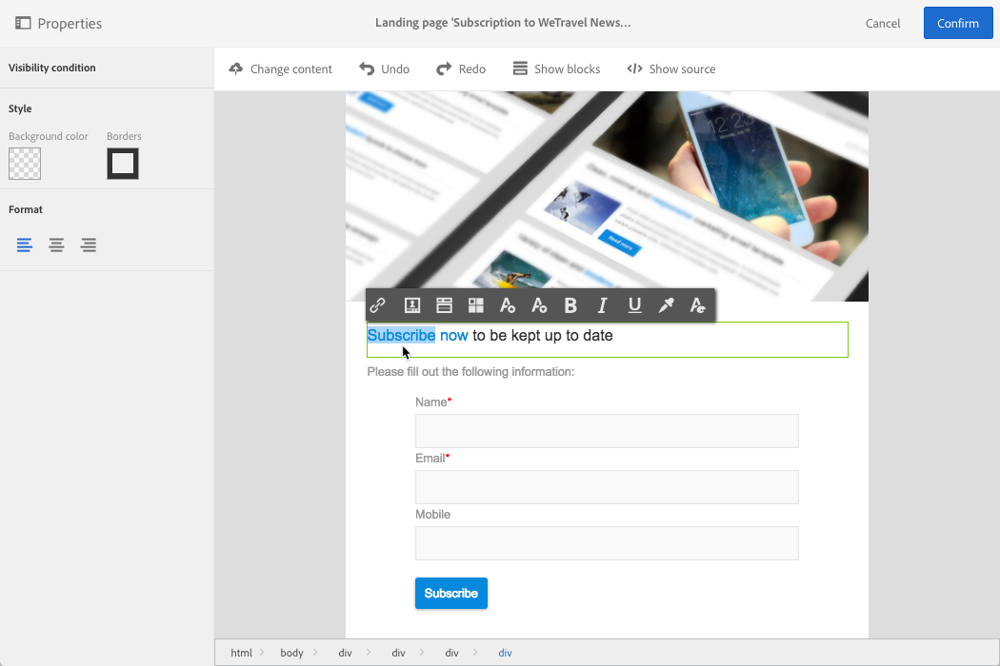

# Managing landing page structure and style{#managing-landing-page-structure-and-style}

## Managing blocks in the content editor {#managing-blocks-in-the-content-editor}

The different HTML content elements are displayed in the landing page as blocks, corresponding to the **&lt;div&gt;** **&lt;/div&gt;** tag.

Selecione um bloco para interagir com ele. Em seguida, ela será cercada por uma caixa azul.

Se um bloco for selecionado, os objetos pai do elemento HTML correspondente serão exibidos em uma navegação estrutural localizada na parte inferior da zona de edição.

Quando o mouse passa sobre um dos elementos de navegação estrutural, o elemento em questão é destacado. Você pode, portanto, navegar facilmente entre os diferentes blocos e selecionar exatamente o elemento HTML que deseja modificar.

Use as opções da paleta e a barra de ferramentas contextual para modificar, excluir ou duplicar o bloco.

Para os blocos que contêm texto, clique novamente no bloco para ativar o modo de edição de texto. O quadro em torno do bloco fica verde. Você pode selecionar ou inserir texto. Use as opções da paleta e da barra de ferramentas contextual para adicionar um link ou modificar a formatação do texto.

Os parâmetros definidos para um elemento em um bloco (links, campos de personalização, blocos de conteúdo etc.) pode ser modificada a qualquer momento da paleta.

## Adding a border and a background in the content editor {#adding-a-border-and-a-background-in-the-content-editor}

You can also define a **background color** by selecting a color from the chart. Essa cor é aplicada ao bloco selecionado.

You can add a **border** to the selected block.

## Changing the text style in the content editor {#changing-the-text-style-in-the-content-editor}

Para alterar o estilo do texto, é necessário clicar em dentro de um bloco de texto.

Para alterar o alinhamento do texto, selecione um dos três ícones a seguir na paleta à esquerda:

* **Alinha à esquerda**: alinha o texto à esquerda do bloco selecionado (adiciona estilo = "text-align: left; ").
* **Centro**: centraliza o texto no bloco selecionado (adiciona estilo = "text-align: center; ").
* **Alinhamento à direita**: alinha o texto à direita do bloco selecionado (adiciona estilo = "text-align: right; ").

Também é possível usar a barra de ferramentas para alterar os atributos de fonte: adaptar o tamanho da fonte, tornar o texto negrito ou itálico, sublinhado ou alterar a cor do texto. Refer to [this section](../../designing/using/landing-page-content-editor-interface.md#landing-page-editor-toolbar).
