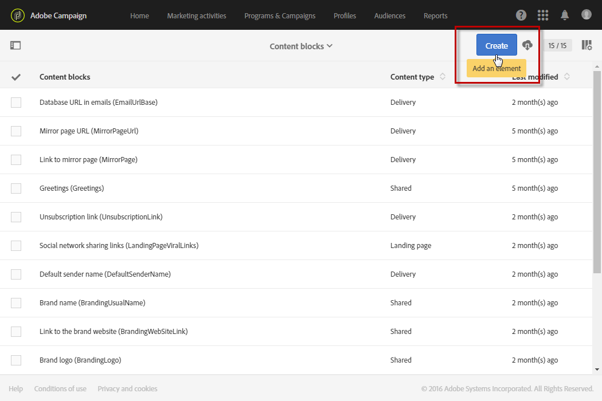
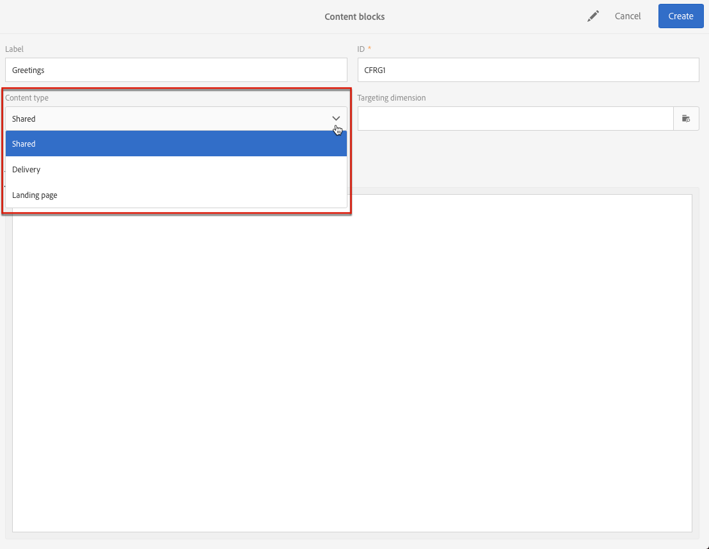

# Personalização de conteúdo de email {#personalization}

O conteúdo e a exibição de mensagens entregues pelo Adobe Campaign podem ser personalizados de várias maneiras diferentes. Essas maneiras podem ser combinadas de acordo com critérios dependendo dos perfis. Em geral, o Adobe Campaign permite:

* Inserir campos de personalização dinâmicos. Consulte [Inserção de um campo de personalização](#inserting-a-personalization-field).
* Inserir blocos de personalização predefinidos. Consulte [Adição de um bloco de conteúdo](#adding-a-content-block).
* Personalizar o remetente de um email. Consulte [Personalização do remetente](#personalizing-the-sender).
* Personalize o assunto de um email. Consulte [Personalização da linha de assunto de um email](../../designing/using/subject-line.md#subject-line).
* Criar conteúdo condicional. Consulte [Definição de conteúdo dinâmico em um email](#defining-dynamic-content-in-an-email).

## Personalização do remetente {#personalizing-the-sender}

Para definir o nome do remetente que aparecerá no cabeçalho das mensagens enviadas, vá para a **[!UICONTROL Properties]** da página inicial do Email Designer (acessível por meio do ícone de página inicial). Para obter mais informações, consulte [Definição do remetente de um email](../../designing/using/subject-line.md#email-sender).

É possível alterar o nome do remetente clicando no ícone **Nome do remetente** bloco. O campo torna-se editável e você pode inserir o nome que deseja usar.

Esse campo pode ser personalizado. Para fazer isso, você pode adicionar campos de personalização, blocos de conteúdo e conteúdo dinâmico clicando nos ícones abaixo do nome do remetente.

>[!NOTE]
>
>Os parâmetros do cabeçalho não devem ficar vazios. O endereço do remetente é obrigatório para possibilitar o envio de um email (padrão RFC). O Adobe Campaign verifica a sintaxe dos endereços de email inseridos.

## Personalização de URLs{#personalizing-urls}

O Adobe Campaign permite personalizar um ou vários URLs em sua mensagem adicionando campos de personalização, blocos de conteúdo ou conteúdo dinâmico a eles. Para fazer isso:

1. Insira um URL externo e especifique os parâmetros. Consulte [Inserção de um link](../../designing/using/links.md#inserting-a-link).
1. Se não for exibido, clique no lápis ao lado do URL selecionado no painel Configurações para acessar as opções de personalização.
1. Adicione os campos de personalização, blocos de conteúdo e conteúdo dinâmico que deseja usar.

   

1. Salve as alterações.

>[!NOTE]
>
>Quando o mecanismo de assinatura do URL para links de rastreamento está desativado, não é possível aplicar URLs de personalização ao nome do domínio nem à extensão do URL. Se a personalização estiver incorreta, uma mensagem de erro será exibida durante a análise da mensagem.
>
>Ao selecionar um bloco de conteúdo, não é permitido selecionar elementos como **Link para a mirror page**. Esse tipo de bloco é proibido em um link.

## Inserção de um campo de personalização{#inserting-a-personalization-field}

O Adobe Campaign permite inserir um campo do banco de dados na página, como o nome do perfil.

>[!NOTE]
>
>As imagens abaixo mostram como inserir um campo de personalização usando o [Email Designer](../../designing/using/designing-content-in-adobe-campaign.md) para um email.

Para adicionar um campo de personalização ao conteúdo:

1. Clique dentro de um bloco de texto, clique no **[!UICONTROL Personalize]** na barra de ferramentas contextual e selecione **[!UICONTROL Insert personalization field]**. Para obter mais informações sobre a interface do Designer de email, consulte [nesta seção](../../designing/using/designing-content-in-adobe-campaign.md#email-designer-interface).

   

1. Selecione o campo que deseja inserir no conteúdo da página.

   

1. Clique em **[!UICONTROL Confirm]**.

O nome do campo aparece no editor e é realçado.

Quando a personalização for gerada (ao visualizar e preparar o email, por exemplo), esse campo será substituído pelo valor correspondente ao perfil direcionado.

>[!NOTE]
>
>Se o email for criado a partir de um workflow, os dados adicionais calculados no workflow também estarão disponíveis nos campos de personalização. Para obter mais informações sobre como adicionar dados adicionais de um workflow, consulte o [Enriquecimento de dados](../../automating/using/about-targeting-activities.md#enriching-data) seção.

## Inclusão de um bloco de conteúdo{#adding-a-content-block}

O Adobe Campaign oferece uma lista de blocos de conteúdo pré-configurados. Esses blocos de conteúdo são dinâmicos, personalizados e têm uma renderização específica. Por exemplo, você pode adicionar uma saudação ou um link para a mirror page.

>[!NOTE]
>
>As imagens abaixo mostram como inserir um bloco de conteúdo usando o [Email Designer](../../designing/using/designing-content-in-adobe-campaign.md) para um email.

Para adicionar um bloco de conteúdo:

1. Clique dentro de um bloco de texto, clique no **[!UICONTROL Personalize]** na barra de ferramentas contextual e selecione **[!UICONTROL Insert content block]**. Para obter mais informações sobre a interface do Designer de email, consulte [nesta seção](../../designing/using/designing-content-in-adobe-campaign.md#email-designer-interface).

   

1. Selecione o bloco de conteúdo que deseja inserir. Os blocos disponíveis variam dependendo do contexto (email ou landing page).

   

1. Clique em **[!UICONTROL Save]**.

O nome do bloco de conteúdo aparece no editor e é realçado em amarelo. Ele se adaptará automaticamente ao perfil quando a personalização for gerada.

Os blocos de conteúdo prontos para uso são:

* **[!UICONTROL Database URL in emails (EmailUrlBase)]**: este bloco de conteúdo só pode ser usado em um **delivery**.
* **[!UICONTROL Mirror page URL (MirrorPageUrl)]**: este bloco de conteúdo só pode ser usado em um **delivery**.
* **[!UICONTROL Link to mirror page (MirrorPage)]**: este bloco de conteúdo só pode ser usado em um **delivery**.
* **[!UICONTROL Greetings (Greetings)]**
* **[!UICONTROL Unsubscription link (UnsubscriptionLink)]**: este bloco de conteúdo só pode ser usado em um **delivery**.
* **[!UICONTROL Social network sharing links (LandingPageViralLinks)]**: este bloco de conteúdo só pode ser usado em um **landing page**.
* **[!UICONTROL Default sender name (DefaultSenderName)]**: este bloco de conteúdo só pode ser usado em um **delivery**.
* **[!UICONTROL Name of default reply-to email address (DefaultReplyName)]**: este bloco de conteúdo só pode ser usado em um **delivery**.
* **[!UICONTROL Email address of default sender (DefaultSenderAddress)]**: este bloco de conteúdo só pode ser usado em um **delivery**.
* **[!UICONTROL Default error email address (DefaultErrorAddress)]**: este bloco de conteúdo só pode ser usado em um **delivery**.
* **[!UICONTROL Default reply-to email address (DefaultReplyAddress)]**: este bloco de conteúdo só pode ser usado em um **delivery**.
* **[!UICONTROL Brand name (BrandingUsualName)]**
* **[!UICONTROL Link to the brand website (BrandingWebSiteLink)]**
* **[!UICONTROL Brand logo (BrandingLogo)]**
* **[!UICONTROL Notification style (notificationStyle)]**

### Criação de blocos de conteúdo personalizados {#creating-custom-content-blocks}

Você pode definir novos blocos de conteúdo que serão inseridos em uma mensagem ou landing page.

Para criar um bloco de conteúdo, siga estas etapas:

1. Clique em **[!UICONTROL Resources > Content blocks]** no menu avançado para acessar a lista de blocos de conteúdo.
1. Clique em **[!UICONTROL Create]** ou duplicar um bloco de conteúdo preexistente.

   

1. Insira um rótulo.
1. Selecione o do bloco **[!UICONTROL Content type]**. Há três opções disponíveis:

   * **[!UICONTROL Shared]**: o bloco de conteúdo pode ser usado em um delivery ou uma landing page.
   * **[!UICONTROL Delivery]**: o bloco de conteúdo só pode ser usado em um delivery.
   * **[!UICONTROL Landing page]**: o bloco de conteúdo só pode ser usado em uma landing page.

   

1. É possível selecionar um **[!UICONTROL Targeting dimension]**. Para obter mais informações, consulte [Sobre o targeting dimension](#about-targeting-dimension).

   

1. É possível selecionar a variável **[!UICONTROL Depends on format]** opção para definir dois blocos diferentes: um para emails de HTML e um para emails em formato de texto. Duas guias serão exibidas no editor (HTML e Text) para definir o conteúdo correspondente.

   

1. Insira o conteúdo do(s) bloco(s) de conteúdo e clique no **[!UICONTROL Create]** botão.

Seu bloco de conteúdo agora pode ser usado no editor de conteúdo de uma mensagem ou uma landing page.

>[!CAUTION]
>
>Ao editar o conteúdo de um bloco, verifique se não há espaços em branco adicionais entre o início e o fim do *se* declarações. Em HTML, os espaços em branco são exibidos na tela e, portanto, afetarão o layout do conteúdo.

### Sobre o targeting dimension {#about-targeting-dimension}

O targeting dimension permite definir em qual tipo de mensagem você pode usar o bloco de conteúdo. Isso evita o uso de blocos inadequados em uma mensagem, o que pode levar a erros.

Na verdade, ao editar uma mensagem, você só pode selecionar blocos de conteúdo com um targeting dimension compatível com esse targeting dimension da mensagem.

Por exemplo, a variável **[!UICONTROL Unsubscription link]** o targeting dimension do bloco é **[!UICONTROL Profiles]** porque contém campos de personalização específicos ao **[!UICONTROL Profiles]** recurso. Portanto, não é possível usar um **[!UICONTROL Unsubscription link]** bloquear em um [mensagem transacional de evento](../../channels/using/getting-started-with-transactional-msg.md#transactional-message-types), pois o targeting dimension desse tipo de mensagem é **[!UICONTROL Real-time events]**. No entanto, você pode usar a variável **Link de cancelamento de subscrição** bloco em um [mensagem transacional de perfil](../../channels/using/getting-started-with-transactional-msg.md#transactional-message-types), pois o targeting dimension desse tipo de mensagem é **Perfis**. Por último, a **[!UICONTROL Link to mirror page]** O bloco não tem um targeting dimension, portanto, você pode usá-lo em qualquer mensagem.

Se você deixar esse campo vazio, o bloco de conteúdo será compatível com todas as mensagens, independentemente do targeting dimension. Se você definir um targeting dimension, esse bloco só será compatível com mensagens que tenham o mesmo targeting dimension.

Para saber mais, consulte [Targeting dimensions e recursos](../../automating/using/query.md#targeting-dimensions-and-resources).

**Tópicos relacionados:**

* [Inserção de um campo de personalização](#inserting-a-personalization-field)
* [Inclusão de um bloco de conteúdo](#adding-a-content-block)
* [Definição de conteúdo dinâmico em um email](#defining-dynamic-content-in-an-email)

## Personalização de uma fonte de imagem{#personalizing-an-image-source}

O Adobe Campaign permite personalizar uma ou várias imagens em sua mensagem de acordo com um critério específico ou usar o rastreamento. Isso é feito inserindo campos de personalização, blocos de conteúdo ou conteúdo dinâmico na fonte de imagem. Para fazer isso:

1. Insira uma imagem no conteúdo da mensagem ou selecione uma imagem que já esteja presente.
1. Na paleta de propriedades da imagem, marque a opção **[!UICONTROL Enable personalization]** opção.

   

   A variável **[!UICONTROL Source]** é exibido e a imagem selecionada é mostrada como **personalizado** no editor.

1. Clique no lápis ao lado da **[!UICONTROL Source]** para acessar as opções de personalização.
1. Depois de adicionar a fonte de imagem, adicione os campos de personalização, blocos de conteúdo e conteúdo dinâmico que desejar.

   

   >[!NOTE]
   >
   >O nome de domínio (http://mydomain.com) não pode ser personalizado, ele deve ser inserido manualmente. O restante do URL pode ser personalizado. Por exemplo: http://mydomain.com/ `[Gender]` .jpg

1. Confirme as alterações.

## Conteúdo condicional {#conditional-content}

### Definição de uma condição de visibilidade{#defining-a-visibility-condition}

Você pode especificar uma condição de visibilidade em qualquer elemento. Só será visível se a condição for respeitada.

Para adicionar uma condição de visibilidade, selecione um bloco e insira a condição a ser respeitada na variável **[!UICONTROL Visibility condition]** das suas configurações.

Essa opção só está disponível para os seguintes elementos: ADDRESS, BLOCKQUOTE, CENTER, DIR, DIV, DL, FIELDSET, FORM, H1, H2, H3, H4, H5, H6, NOSCRIPT, OL, P, PRE, UL, TR, TD.

O editor de expressão é apresentado na variável [Edição de expressão avançada](../../automating/using/editing-queries.md#about-query-editor) seção.

Essas condições adotam a sintaxe da expressão XTK (por exemplo, **context.perfil.email!=&#39;&#39;** ou **context.profile.status=&#39;0&#39;**). Por padrão, todos os campos são visíveis.

>[!NOTE]
>
>Uma condição não pode ser definida para um bloco que já contém um subelemento com um conteúdo dinâmico ou um bloco que já compõe um conteúdo dinâmico. Blocos dinâmicos não visíveis como listas suspensas não podem ser editados.

### Definição de conteúdo dinâmico em um email{#defining-dynamic-content-in-an-email}

>[!CONTEXTUALHELP]
>id="ac_dynamic_content"
>title="Definição do conteúdo dinâmico"
>abstract="Defina conteúdos diferentes que serão exibidos para alguns perfis somente de acordo com as condições que você definirá."

Em um email, é possível definir diferentes conteúdos que serão exibidos dinamicamente para os recipients de acordo com as condições definidas por meio do editor de expressão. Por exemplo, no mesmo email, você pode garantir que cada perfil receba uma mensagem diferente de acordo com sua faixa etária.

A definição de conteúdo dinâmico é diferente de [definição das condições de visibilidade](#defining-a-visibility-condition).

1. Selecione um fragmento, um componente ou um elemento. Neste exemplo, selecione uma imagem.
1. Clique em **[!UICONTROL Dynamic content]** ícone na barra de ferramentas contextual.

   

   A variável **[!UICONTROL Dynamic content]** aparece na paleta à esquerda.

   

   Por padrão, essa seção contém dois elementos: a variante padrão e uma nova variante.

   >[!NOTE]
   >
   >O conteúdo sempre deve ter uma variante padrão. Não é possível excluí-lo.

1. Clique em **[!UICONTROL Edit]** botão para definir as condições de exibição da primeira variante alternativa.

   

1. Especifique um rótulo e selecione os campos que deseja definir como condições. Por exemplo, no campo **[!UICONTROL General]** selecione o **[!UICONTROL Age]** campo

   

1. Defina as condições de filtragem. Por exemplo, você deseja que um conteúdo diferente seja exibido para pessoas com idade entre 18 e 25 anos.

   

1. Depois que todas as condições forem definidas, defina a ordem de prioridade na qual a condição será aplicada e salve as alterações.

   

   O conteúdo será exibido na paleta em ordem de prioridade, de cima para baixo. Para obter mais informações sobre prioridades, consulte [nesta seção](#defining-dynamic-content-in-an-email).

1. Carregue uma nova imagem para a variante que você acabou de definir.

   

   Os recipients com idade entre 18 e 25 anos verão a nova imagem.

   

1. Clique em **[!UICONTROL Add a condition]** para adicionar um novo conteúdo e sua regra vinculada.

   

   Por exemplo, você pode adicionar uma imagem diferente para ser exibida a pessoas entre 26 e 35 anos.

1. Continue de forma semelhante para qualquer outro elemento do seu email que você deseja exibir dinamicamente. Pode ser texto, botão, fragmento etc. Salve as alterações.

>[!CAUTION]
>
>Depois de preparar a mensagem e antes de enviá-la, teste-a usando uma prova. Se você não fizer isso, alguns erros poderão não ser detectados e o email poderá não ser enviado.

**Tópicos relacionados:**

* [Envio de provas](../../sending/using/sending-proofs.md)
* [Edição de expressão avançada](../../automating/using/editing-queries.md#about-query-editor)

### Ordem de prioridade {#order-of-priority}

No editor de expressão, ao definir um conteúdo dinâmico, a ordem de prioridade é a seguinte.

1. Você define dois conteúdos dinâmicos diferentes com **duas condições diferentes**, por exemplo:

   **Condição 1:** o gênero do perfil é masculino,

   **Condição 2:** o perfil tem entre 20 e 30 anos.

   

   Alguns perfis no seu banco de dados correspondem às duas condições, mas somente um email com um conteúdo dinâmico pode ser enviado.

1. Portanto, é necessário definir a prioridade do conteúdo dinâmico. Uma condição com uma ordem de prioridade **1** (e, portanto, o conteúdo dinâmico correspondente) será enviado a um perfil mesmo se outra condição cuja ordem de prioridade seja **2** ou **3** O também é atendido por esse perfil.

   

Você só pode definir uma ordem de prioridade por conteúdo dinâmico.

## Exemplo: Personalização de email{#example-email-personalization}

Neste exemplo, um membro da equipe de serviço de marketing criou um email para informar a alguns de seus clientes que há uma oferta especial apenas para eles. O membro da equipe decidiu personalizar o email de acordo com as respectivas idades dos clientes. Os clientes com idade entre 18 e 27 anos receberão um email contendo uma imagem e um slogan diferentes daqueles que os clientes com mais de 27 anos receberão.

O email é criado da seguinte maneira:

* Os conteúdos dinâmicos são aplicados à imagem e esses conteúdos dinâmicos são configurados de acordo com a faixa etária.

   

   A adição e configuração de conteúdo dinâmico está detalhada na [Definição de conteúdo dinâmico em um email](#defining-dynamic-content-in-an-email) seção.

* Campos de personalização e conteúdo dinâmico são aplicados ao texto. Dependendo da faixa etária do perfil, o email começa com o nome do perfil ou com o título e sobrenome do perfil.

   

   A adição e configuração dos campos de personalização é detalhada na [Inserção de um campo de personalização](#inserting-a-personalization-field) seção.

### Configuração de imagens {#configuring-images}

>[!CONTEXTUALHELP]
>id="ac_dynamic_image"
>title="Gerenciamento de imagens dinâmicas"
>abstract="Personalize seu email com imagens dinâmicas de acordo com as condições que você definirá."

Neste exemplo, o conteúdo dinâmico aplicado às imagens é configurado da seguinte maneira:

**Para segmentar jovens de 18-27 anos:**

1. Selecione o conteúdo dinâmico no **[!UICONTROL Properties]** e clique no botão **[!UICONTROL Edit]** botão.

   

1. Edite o rótulo e selecione a variável **[!UICONTROL Age]** do campo **[!UICONTROL Profile]** nó.

   

1. Selecione o **Maior que ou igual a** operador, então insira **18** para criar o **mais de 18** expressão.

   

1. Adicionar um novo **[!UICONTROL Age]** condição.

   Selecione o **Menor que ou igual a** operador seguido por 27 no campo de valor para criar o **menos de 27** expressão.

   

1. Confirme as alterações.

**Para direcionar perfis com 27 anos ou mais:**

1. Selecione o conteúdo dinâmico na paleta e edite-o.
1. Edite o rótulo e selecione a variável **[!UICONTROL Age]** do campo **[!UICONTROL Profile]** nó.
1. Adicione o **Maior que** operador seguido por 27 no campo de valor para criar o **mais de 27** expressão.

   

1. Confirme as alterações.

O conteúdo dinâmico está configurado corretamente.

### Configuração de texto {#configuring-text}

Neste exemplo, o conteúdo dinâmico aplicado aos textos é configurado da seguinte maneira:

**Para direcionar perfis entre 18 e 27 anos:**

1. Selecione o componente de estrutura desejado e adicione um conteúdo dinâmico.
1. Edite o conteúdo dinâmico e configure as expressões de direcionamento. Consulte [Configuração de imagens](#configuring-images).
1. No componente de estrutura, na posição desejada, clique no botão **[!UICONTROL Personalize]** na barra de ferramentas contextual e selecione **[!UICONTROL Insert personalization field]**.

   

1. Na lista exibida, selecione a variável **[!UICONTROL First name]** e confirme.

   

1. O campo de personalização é então perfeitamente inserido no conteúdo dinâmico selecionado.

**Para direcionar perfis com 27 anos ou mais:**

1. Selecione o componente de estrutura desejado e adicione um conteúdo dinâmico.
1. Edite o conteúdo dinâmico e configure as expressões de direcionamento. Consulte [Configuração de imagens](#configuring-images).
1. No componente de estrutura, na posição desejada, clique no botão **[!UICONTROL Personalize]** na barra de ferramentas contextual e selecione **[!UICONTROL Insert personalization field]**.
1. Selecionar **[!UICONTROL Title]** na lista suspensa.
1. Continue da mesma forma para adicionar o **[!UICONTROL Last name]** campo.

   

Seus campos de personalização agora devem ser perfeitamente inseridos no conteúdo dinâmico escolhido.

### Pré-visualização de emails {#previewing-emails}

A pré-visualização permite verificar se os campos de personalização e o conteúdo dinâmico estão configurados corretamente antes de enviar a **[!UICONTROL Proofs]**. Durante a pré-visualização, é possível selecionar diferentes perfis de teste correspondentes aos destinos de email.

Sem perfis de teste, o email que aparece por padrão é:

O slogan não contém campos de personalização e a imagem padrão é usada.

O primeiro perfil de teste corresponde a um cliente entre 18 e 27 anos. Ao selecionar esse perfil, o email a seguir é exibido:

O campo de personalização que corresponde à expressão de 18-27 anos, especificamente o nome do perfil, está configurado corretamente e a imagem também foi alterada de acordo com o perfil.

O segundo perfil corresponde a um cliente com mais de 27 anos e gera o seguinte email:

A imagem mudou graças ao conteúdo dinâmico, e o slogan que aparece é o slogan mais formal definido para este público-alvo.

**Tópicos relacionados:**

* [Criação de públicos-alvo](../../audiences/using/creating-audiences.md)
* [Preparação do envio](../../sending/using/preparing-the-send.md)
