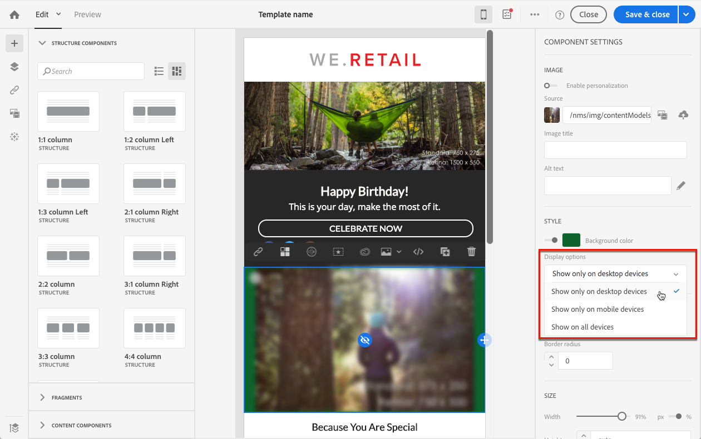
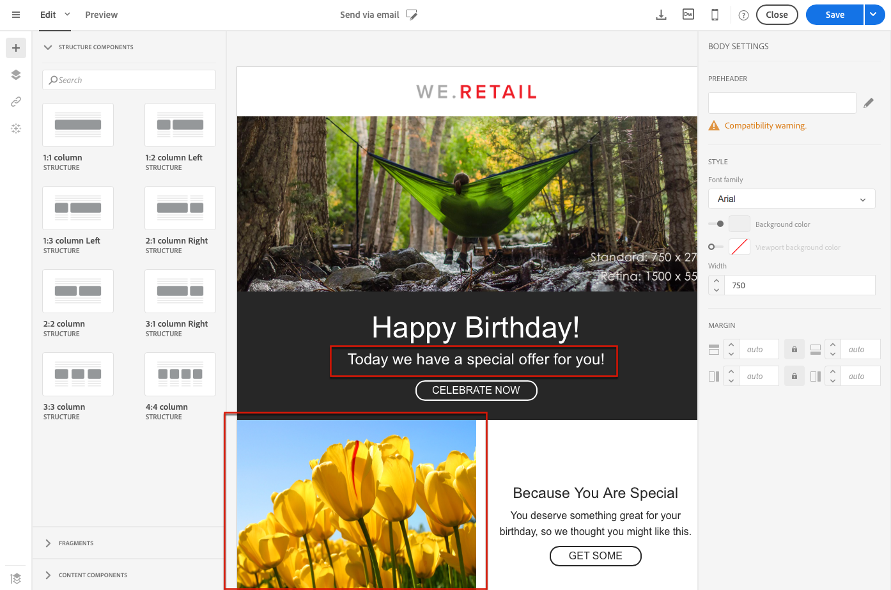

# Edição de texto sem formatação, HTML e formatos do email móveis {#plain-text-and-html-modes}

O Designer de e-mail permite que você edite várias renderizações de seus e-mails. Você pode gerar uma versão de texto do seu email, editar a fonte HTML de um email e criar emails para visualizações móvel.

## Gerando uma versão de texto do email {#generating-a-text-version-of-the-email}

Por padrão, a **[!UICONTROL Plain text]** versão do seu email é gerada e sincronizada automaticamente com a **[!UICONTROL Edit]** versão.

Campos de personalização e blocos de conteúdo adicionados à versão HTML também são sincronizados com a versão em texto simples.

>[!NOTE]
>
>Para usar blocos de conteúdo em uma versão de texto sem formatação, verifique se eles não contêm código HTML.

Para ter uma versão de texto simples diferente da versão HTML, você pode desativar essa sincronização clicando na **[!UICONTROL Sync with HTML]** opção da **[!UICONTROL Plain text]** visualização do seu email.

Em seguida, é possível editar a versão de texto sem formatação, conforme desejado.

>[!NOTE]
>
>Se você editar a **[!UICONTROL Plain text]** versão enquanto a sincronização estiver desativada, na próxima vez que você ativar a **[!UICONTROL Sync with HTML]** opção, todas as alterações feitas na versão em texto simples serão substituídas pela versão em HTML. As alterações feitas na **[!UICONTROL Plain text]** visualização não podem ser refletidas na **[!UICONTROL HTML]** visualização.

## Editar uma fonte de conteúdo de email em HTML {#editing-an-email-content-source-in-html}

Para os usuários mais avançados e a depuração, você pode visualização e editar o conteúdo de email diretamente em HTML.

Você tem duas maneiras de editar a versão HTML do email:

* Selecione **[!UICONTROL Edit]** > **[!UICONTROL HTML]** para abrir a versão HTML do email inteiro.

   

* Na interface WYSIWYG, selecione um elemento e clique no **[!UICONTROL Source code]** ícone.

   Somente a fonte do elemento selecionado é exibida. Você pode editar o código fonte se o elemento selecionado for um componente **[!UICONTROL HTML]** de conteúdo. Outros componentes estão no modo somente leitura, mas ainda podem ser editados na versão HTML completa do email.

   

Se você modificar o código HTML, a capacidade de resposta do e-mail poderá ser interrompida. Teste usando o **[!UICONTROL Preview]** botão. Consulte [Pré-visualização de mensagens](../../sending/using/previewing-messages.md).

## Criar emails para renderização móvel {#switching-to-mobile-view}

Você pode ajustar o design responsivo de um email editando separadamente todas as opções de estilo para exibição móvel. Por exemplo, você pode adaptar margens e preenchimento, usar tamanhos de fonte menores ou maiores, alterar botões ou aplicar cores de plano de fundo diferentes que serão específicas para a versão móvel do seu email.

Todas as opções de estilo estão disponíveis na visualização móvel. As configurações de estilo do Email Designer são apresentadas anteriormente nesta página.

1. Crie um email e um start editando o conteúdo. Para obter mais informações, consulte [Criar um conteúdo de email do zero](../../designing/using/designing-from-scratch.md#designing-an-email-content-from-scratch).
1. Para acessar a visualização para dispositivos móveis dedicados, selecione o **[!UICONTROL Switch to mobile view]** botão.

   

   A versão móvel do email é exibida. Ele contém todos os componentes e estilos definidos na visualização da área de trabalho.

1. Edite independentemente todas as configurações de estilo, como cor do plano de fundo, alinhamento, preenchimento, margem, família de fontes, cor do texto e assim por diante.

   

1. Ao editar qualquer configuração de estilo na visualização móvel, as modificações são aplicadas somente à exibição móvel.

   Por exemplo, reduza o tamanho de uma imagem, adicione um plano de fundo verde e altere o preenchimento na visualização móvel.

   

1. Você pode ocultar um componente quando exibido em um dispositivo móvel. Para fazer isso, selecione **[!UICONTROL Show only on desktop devices]** no **[!UICONTROL Display options]**.

   Você também pode ocultar esse componente em dispositivos de desktop, o que significa que ele será exibido somente em dispositivos móveis. Para fazer isso, selecione **[!UICONTROL Show only on mobile devices]**.

   Por exemplo, essa opção permite que você exiba uma imagem específica em dispositivos móveis e outra imagem em dispositivos desktop.

   É possível definir essa opção a partir da visualização móvel ou desktop.

   

1. Clique novamente no **[!UICONTROL Switch to mobile view]** botão para voltar à visualização padrão da área de trabalho. As mudanças de estilo que você acabou de fazer não são refletidas.

   

   >[!NOTE]
   >
   >A única exceção são as **[!UICONTROL Style inline]** configurações. Qualquer alteração na configuração em linha de estilo também é aplicada à visualização padrão da área de trabalho.

1. Qualquer outra alteração na estrutura ou no conteúdo do email, como edições de texto, upload de uma nova imagem, adição de um novo componente etc. também é aplicada à visualização padrão.

   Por exemplo, volte para a visualização móvel, edite algum texto e substitua uma imagem.

   

1. Clique novamente no **[!UICONTROL Switch to mobile view]** botão para voltar à visualização padrão da área de trabalho. As mudanças são refletidas.

   

1. Remover um estilo na visualização móvel leva você de volta ao estilo aplicado no modo desktop.

   Por exemplo, na visualização móvel, aplique uma cor de plano de fundo verde a um botão.

   

1. Alterne para a visualização da área de trabalho e aplique um plano de fundo cinza ao mesmo botão.

   

1. Alterne novamente para visualização móvel e desative a **[!UICONTROL Background color]** configuração.

   

   A cor de fundo definida na visualização da área de trabalho agora é aplicada: fica cinza (não em branco).

   A única exceção é a **[!UICONTROL Border color]** configuração. Quando desativada na visualização móvel, nenhuma borda é mais aplicada, mesmo se uma cor de borda for definida na visualização da área de trabalho.

>[!NOTE]
>
>A visualização móvel não está disponível em [fragmentos](../../designing/using/using-reusable-content.md#about-fragments).
