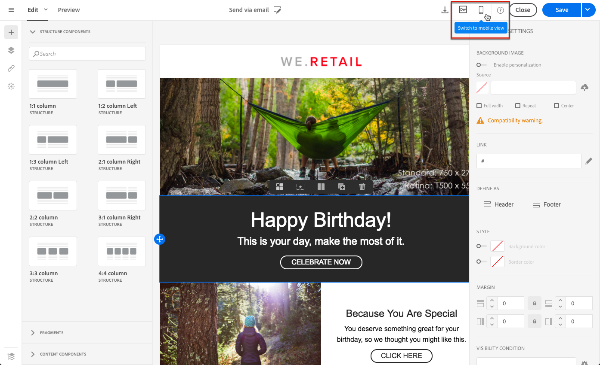

# Edição de texto sem formatação, HTML e formatos de email para dispositivos móveis {#plain-text-and-html-modes}

O Designer de email permite editar várias renderizações de seus emails. Você pode gerar uma versão em texto do email, editar a fonte de HTML de um email e criar emails para exibição em dispositivos móveis.

## Gerar uma versão de texto do email {#generating-a-text-version-of-the-email}

Por padrão, a variável **[!UICONTROL Plain text]** sua versão do email é gerada e sincronizada automaticamente com o **[!UICONTROL Edit]** versão.

Campos de personalização e blocos de conteúdo adicionados à versão do HTML também são sincronizados com a versão de texto simples.

>[!NOTE]
>
>Para usar blocos de conteúdo na versão de texto sem formatação, verifique se eles não contêm o código HTML.

Para ter uma versão de texto sem formatação diferente da versão do HTML, você pode desativar essa sincronização clicando no **[!UICONTROL Sync with HTML]** alternar do **[!UICONTROL Plain text]** exibição do seu email.

Em seguida, é possível editar a versão de texto sem formatação conforme desejado.

>[!NOTE]
>
>Se você editar a variável **[!UICONTROL Plain text]** enquanto a sincronização estiver desativada, na próxima vez que você ativar a **[!UICONTROL Sync with HTML]** , todas as alterações feitas na versão em texto sem formatação serão substituídas pela versão do HTML. As alterações efetuadas no **[!UICONTROL Plain text]** a exibição não pode ser refletida no **[!UICONTROL HTML]** exibição.

## Edição de uma fonte de conteúdo de email no HTML {#editing-an-email-content-source-in-html}

Para os usuários e a depuração mais avançados, é possível visualizar e editar o conteúdo do email diretamente no HTML.

Há duas maneiras de editar a versão HTML do email:

* Selecionar **[!UICONTROL Edit]** > **[!UICONTROL HTML]** para abrir a versão HTML do email inteiro.

  

* Na interface WYSIWYG, selecione um elemento e clique no **[!UICONTROL Source code]** ícone.

  Somente a origem do elemento selecionado é exibida. Você pode editar o código-fonte se o elemento selecionado for um **[!UICONTROL HTML]** componente de conteúdo. Outros componentes estão no modo somente leitura, mas ainda podem ser editados na versão HTML completa do email.

  

Se você modificar o HTML do código, a capacidade de resposta do email poderá ser interrompida. Teste-o usando o **[!UICONTROL Preview]** botão. Consulte [Pré-visualização de mensagens](../../sending/using/previewing-messages.md).

## Criação de emails para renderização móvel {#switching-to-mobile-view}

É possível ajustar o design responsivo de um email editando separadamente todas as opções de estilo para exibição em dispositivos móveis. Por exemplo, você pode adaptar margens e preenchimento, usar tamanhos de fonte menores ou maiores, alterar botões ou aplicar cores de fundo diferentes que serão específicas à versão móvel do email.

Todas as opções de estilo estão disponíveis na exibição móvel. As configurações de estilo do Designer de email são apresentadas anteriormente nesta página.

1. Crie um email e comece a editar o conteúdo. Para obter mais informações, consulte [Criar um conteúdo de email do zero](../../designing/using/designing-from-scratch.md#designing-an-email-content-from-scratch).
1. Para acessar a visualização móvel dedicada, selecione a **[!UICONTROL Switch to mobile view]** botão.

   

   A versão móvel do email é exibida. Ele contém todos os componentes e estilos que foram definidos na exibição da área de trabalho.

1. Edite independentemente todas as configurações de estilo, como cor de fundo, alinhamento, preenchimento, margem, família de fontes, cor do texto e assim por diante.

   

1. Ao editar qualquer configuração de estilo na exibição móvel, as modificações são aplicadas somente à exibição móvel.

   Por exemplo, reduza o tamanho de uma imagem, adicione um plano de fundo verde e altere o preenchimento na exibição móvel.

   

1. Você pode ocultar um componente quando exibido em um dispositivo móvel. Para fazer isso, selecione **[!UICONTROL Show only on desktop devices]** do **[!UICONTROL Display options]**.

   Você também pode optar por ocultar esse componente em dispositivos desktop, o que significa que ele será exibido apenas em dispositivos móveis. Para fazer isso, selecione **[!UICONTROL Show only on mobile devices]**.

   Por exemplo, essa opção permite exibir uma imagem específica em dispositivos móveis e outra imagem em dispositivos desktop.

   Você pode definir essa opção na exibição para dispositivos móveis ou desktop.

   

1. Clique novamente em **[!UICONTROL Switch to mobile view]** botão para voltar para a exibição padrão da área de trabalho. As alterações de estilo que você acabou de fazer não são refletidas.

   

   >[!NOTE]
   >
   >A única exceção é a **[!UICONTROL Style inline]** configurações. Qualquer alteração de configuração inline de estilo também é aplicada à exibição padrão da área de trabalho.

1. Qualquer outra alteração na estrutura ou no conteúdo do email, como edições de texto, upload de uma nova imagem, adição de um novo componente etc. também é aplicado à exibição padrão.

   Por exemplo, volte para a exibição móvel, edite algum texto e substitua uma imagem.

   

1. Clique novamente em **[!UICONTROL Switch to mobile view]** botão para voltar para a exibição padrão da área de trabalho. As alterações são refletidas.

   

1. A remoção de um estilo na exibição móvel leva você de volta ao estilo que foi aplicado no modo de desktop.

   Por exemplo, na exibição móvel, aplique uma cor de fundo verde a um botão.

   

1. Alternar para o modo de exibição de desktop e aplicar um plano de fundo cinza ao mesmo botão.

   

1. Alterne novamente para a exibição móvel e desative a **[!UICONTROL Background color]** configuração.

   

   A cor do plano de fundo definida na visualização da área de trabalho agora é aplicada: ele fica cinza (não está em branco).

   A única exceção é a **[!UICONTROL Border color]** configuração. Quando desativado na exibição móvel, nenhuma borda é aplicada mais, mesmo se uma cor de borda for definida na exibição da área de trabalho.

>[!NOTE]
>
>A visualização para dispositivos móveis não está disponível no [fragmentos](../../designing/using/using-reusable-content.md#about-fragments).
