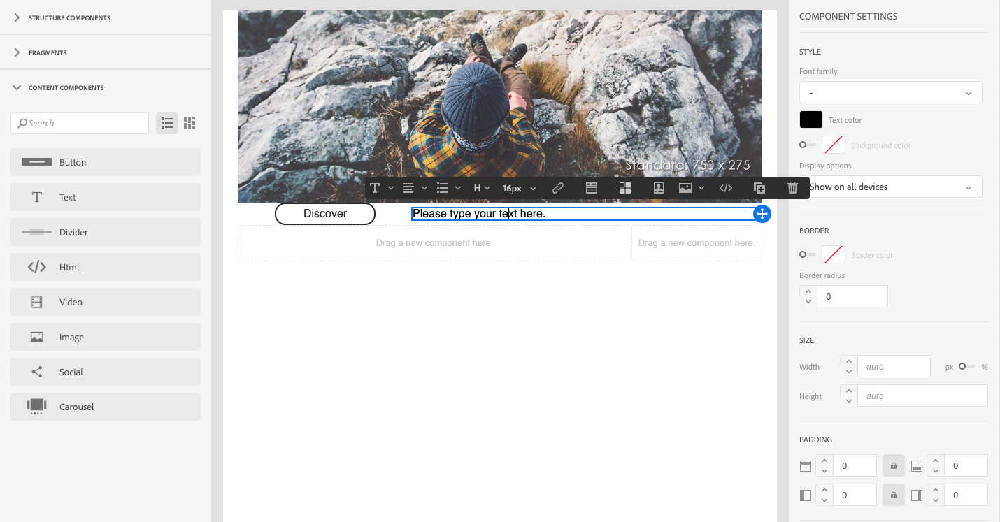
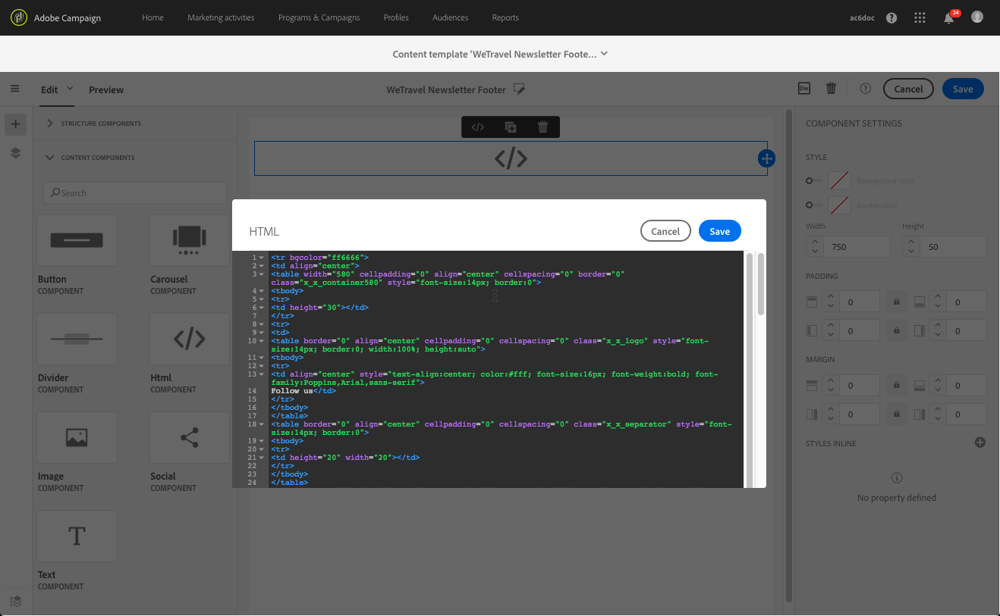

# Introdução ao Email Designer {#quick-start}

O Designer de email fornece quatro maneiras de criar emails.

Você pode criar um email [iniciando no Designer](#without-existing-content)de email:

* Você pode criar um email a partir de uma tela em branco adicionando facilmente a estrutura e os componentes de conteúdo e personalize seu conteúdo para enviar um delivery rapidamente. Você também pode gerenciar totalmente os elementos de estilo. Para obter mais informações, [comece rapidamente](#from-scratch-email) ou consulte a documentação [](../../designing/using/designing-from-scratch.md#designing-an-email-content-from-scratch)completa.

* Você pode criar um email a partir de modelos predefinidos selecionando um modelo e criando seu novo conteúdo de email aqui. [Saiba mais](#building-content-from-an-out-of-the-box-template)

Você também pode criar um email [com conteúdo](#with-existing-content)existente:

* É possível converter um conteúdo HTML existente (criado externamente ou no editor herdado). [Saiba mais](#converting-an-html-content)
* É possível importar um conteúdo HTML existente imediatamente no modo de compatibilidade. [Saiba mais](#compatibility-mode)

| Sem conteúdo | Com conteúdo |
|---|---|
| [Criação de um email do zero](#from-scratch-email) | [Converter um conteúdo HTML existente](#converting-an-html-content) |
| [Criação de conteúdo a partir de um modelo pronto para uso](#building-content-from-an-out-of-the-box-template) | [Importação de um HTML existente](#compatibility-mode) |

## Criação de emails com o editor {#without-existing-content}

>[!NOTE]
>
>Em ambas as estratégias de criação, é crucial preencher a linha de assunto antes de enviar seu email. Saiba como [adicionar uma linha](#add-a-subject-line)de assunto.

### Criação de um email do zero {#from-scratch-email}

Você pode criar um email com facilidade, adicionar componentes e personalizar seu conteúdo para enviar um delivery rapidamente. Você pode adaptar as opções de estilização ao seu conteúdo, se necessário. Para obter mais informações sobre como gerenciar configurações de estilo e atributos incorporados, consulte [Edição de estilos](../../designing/using/styles.md)de email.

1. Crie um email.
1. Fechar a página inicial.

### Adicionar uma linha de assunto {#add-a-subject-line}

As linhas de assunto são obrigatórias ao enviar um email. Para obter mais informações, consulte [Definição da linha de assunto de um email](../../designing/using/subject-line.md).

1. Vá para a **[!UICONTROL Properties]** guia do home page do Email Designer (acessível pelo ícone inicial) e preencha a **[!UICONTROL Subject]** seção.


### Adicionar componentes de estrutura {#add-structure-components}

Os componentes da estrutura definirão o layout do seu email. Para obter mais informações, consulte [Definição da estrutura de um email](../../designing/using/designing-from-scratch.md#defining-the-email-structure).

Nos componentes da Estrutura, arraste e solte os componentes para o layout que deseja usar.

>[!NOTE]
>
>Você pode selecionar diferentes layouts de conteúdo que serão adicionados ao seu email.


### Adicionar componentes de conteúdo {#add-content-components}

Você pode adicionar vários componentes de conteúdo ao seu email, como imagem, texto e botões. Para obter mais informações, consulte Componentes [](../../designing/using/designing-from-scratch.md#about-content-components)de conteúdo.

* **Imagem**

1. Em Componentes **** de conteúdo, arraste e solte a imagem em um dos componentes da sua estrutura.
1. Clique em **Procurar**.
1. Selecione o arquivo de imagem do computador.


* **Texto com personalização**

1. Em Componentes **** de conteúdo, arraste e solte o texto em um dos componentes da sua estrutura.
1. Clique no componente e insira seu texto.
1. Para adicionar um campo de personalização, clique em **Inserir campo** de personalização na barra de ferramentas.
1. Selecione o campo necessário, como Nome.



* **HTML**

1. Em Componentes **** de conteúdo, arraste e solte o HTML em um dos componentes da sua estrutura.
1. Clique em **Mostrar o código** fonte.
1. Insira seu conteúdo HTML.
1. Clique em **Save**.


Se você estiver familiarizado com o HTML, poderá copiar e colar o código HTML do rodapé original usando o componente de **[!UICONTROL Html]** conteúdo. Para obter mais informações, consulte [Sobre componentes](../../designing/using/designing-from-scratch.md#about-content-components)de conteúdo.



### Estilo do componente de email

Você pode ajustar o estilo do seu email, por exemplo, alterando o preenchimento de um componente. Para obter mais informações sobre como gerenciar configurações de estilo e atributos incorporados, consulte [Edição de estilos](../../designing/using/styles.md)de email.

1. Clique em seu componente **de** texto.
1. À direita, na paleta, vá para **Preenchimento**.
1. Clique no ícone de bloqueio para quebrar a sincronização entre os parâmetros superior e inferior ou direito e esquerdo.
1. Ajuste o **Preenchimento** conforme necessário.
1. Clique em **Save**.


Agora você pode salvar e enviar seu email.

### Criação de conteúdo a partir de um modelo pronto para uso {#building-content-from-an-out-of-the-box-template}

Você pode criar um e-mail a partir de modelos prontos para uso, como mensagens de boas-vindas do cliente, boletins informativos e e-mails de reenvolvimento e personalizá-los.

1. Crie um email e abra seu conteúdo. For more on this, see [Creating an email](../../channels/using/creating-an-email.md).
1. Clique no ícone inicial para acessar o **[!UICONTROL Email Designer]** home page.
1. Click the **[!UICONTROL Templates]** tab.
1. Escolha um modelo HTML pronto para uso.
Os diferentes modelos apresentam várias combinações de vários tipos de elementos. Por exemplo, os modelos &#39;Difusão&#39; têm margens, enquanto os modelos &#39;Astro&#39; não têm. Para obter mais informações, consulte Modelos [de](../../designing/using/using-reusable-content.md#content-templates)conteúdo.
1. Vá para a **[!UICONTROL Properties]** guia do home page do Email Designer (acessível pelo ícone inicial) e preencha a **[!UICONTROL Subject]** seção.
1. É possível combinar esses elementos para criar várias variantes de email. Por exemplo, você pode duplicado uma seção de email selecionando um componente de estrutura e clicando **[!UICONTROL Duplicate]** na barra de ferramentas contextual.
1. É possível mover os elementos ao redor usando a seta azul à esquerda para arrastar um componente de estrutura abaixo ou acima de outro. Para obter mais informações, consulte [Edição da estrutura](../../designing/using/designing-from-scratch.md#defining-the-email-structure)de email.
1. Você também pode mover componentes para alterar a organização de cada elemento de estrutura. Para obter mais informações, consulte [Adicionar fragmentos e componentes](../../designing/using/designing-from-scratch.md#defining-the-email-structure).
1. Modifique o conteúdo de cada elemento de acordo com suas necessidades: imagens, texto, links.
1. Adapte as opções de estilo ao seu conteúdo, se necessário. Para obter mais informações, consulte [Edição de estilos](../../designing/using/styles.md)de email.

## Usar um conteúdo de email existente {#with-existing-content}

Se quiser criar uma estrutura de modelos modulares e fragmentos que podem ser combinados para reutilização em vários emails, considere converter seu HTML de email em um modelo do Designer de email.

### Conversão de conteúdo HTML {#converting-an-html-content}

Esse caso de uso oferta uma maneira rápida de converter emails HTML em componentes do Email Designer.

>[!CAUTION]
>
>Esta seção destina-se a usuários familiarizados com o código HTML.

>[!NOTE]
>
>Como o modo de compatibilidade, um componente HTML é editável com opções limitadas: você só pode executar edição no local.

Fora do Designer de email, verifique se o HTML original está dividido em seções reutilizáveis.

1. Abra o Designer de email para criar um conteúdo de email vazio.
1. Defina os atributos de nível de corpo: cores de fundo, largura, etc. Para obter mais informações, consulte [Edição de estilos](../../designing/using/styles.md)de email.

Se esse não for o caso, recorte os diferentes blocos do seu HTML. Por exemplo, esta é uma seção claramente identificada:

```
<!-- 3 COLUMN w/CTA (SCALED) -->
<table width="100%" align="center" cellspacing="0" cellpadding="0" border="0" role="presentation" style="max-width:680px;">
<tbody>
<tr>
<td class="padh10" align="center" valign="top" style="padding:0 5px 20px 5px;">
<table width="100%" cellspacing="0" cellpadding="0" border="0" role="presentation">
<tbody>
<tr>
...
</tr>
</tbody>
</table>
</td>
</tr>
</tbody>
</table>
<!-- //3 COLUMN w/CTA (SCALED) -->
```

Depois de identificar todos os blocos, no Designer de email, repita o seguinte procedimento para cada seção do email existente:

1. Adicione um componente de estrutura. Para obter mais informações, consulte [Edição da estrutura](../../designing/using/designing-from-scratch.md#defining-the-email-structure)de email.
1. Adicione um componente HTML. Para obter mais informações, consulte [Adicionar fragmentos e componentes](../../designing/using/designing-from-scratch.md#defining-the-email-structure).
1. Copie e cole seu HTML nesse componente.
1. Mude para visualização móvel. Para obter mais informações, consulte [esta seção](../../designing/using/plain-text-html-modes.md#switching-to-mobile-view).

   A visualização responsiva está quebrada, pois seu CSS está ausente.

1. Para corrigir isso, alterne para o modo de código fonte e copie e cole sua seção de estilo em uma nova seção de estilo. Por exemplo:

   ```
   <style type="text/css">
   a {text-decoration:none;}
   body {min-width:100% !important; margin:0 auto !important; padding:0 !important;}
   img {line-height:100%; text-decoration:none; -ms-interpolation-mode:bicubic;}
   ...
   </style>
   ```

   >[!NOTE]
   >
   >Depois disso, adicione seu estilo em outra tag de estilo personalizada.
   >
   >Não modifique o CSS gerado pelo Designer de email:
   >
   >* `<style data-name="default" type="text/css">(##)</style>`
   >* `<style data-name="supportIOS10" type="text/css">(##)</style>`
   >* `<style data-name="mediaIOS8" type="text/css">(##)</style>`
   >* `<style data-name="media-default-max-width-500px" type="text/css">(##)</style>`
   >* `<style data-name="media-default--webkit-min-device-pixel-ratio-0" type="text/css">(##)</style>`


1. Volte para a visualização móvel para verificar se o conteúdo é exibido corretamente e salvar as alterações.

### Importação e edição de um email HTML {#compatibility-mode}

Quando você carrega um conteúdo, ele deve conter uma marcação específica para ser totalmente compatível e editável com o editor WYSIWYG do Designer de e-mail.

Se todo ou parte do HTML carregado não for compatível com a marcação esperada, o conteúdo será carregado em &quot;modo de compatibilidade&quot;, o que limita as possibilidades de edição por meio da interface do usuário.

Quando um conteúdo é carregado no modo de compatibilidade, você ainda pode executar as seguintes modificações por meio da interface (as ações não disponíveis estão ocultas):

* Alteração do texto ou alteração de uma imagem
* Inserir links e campos de personalização
* Editar algumas opções de estilização no bloco HTML selecionado
* Definição de conteúdo condicional


Outras modificações, como adicionar novas seções ao seu email ou estilo avançado, devem ser feitas diretamente no código-fonte do email por meio do modo HTML.
Embora o modo de compatibilidade não permita o uso de arrastar e soltar, ele garante o mesmo conjunto de recursos que o editor herdado.

Para obter mais informações sobre como converter um email existente em um email compatível com o Designer de email, consulte [esta seção](../../designing/using/using-existing-content.md).
