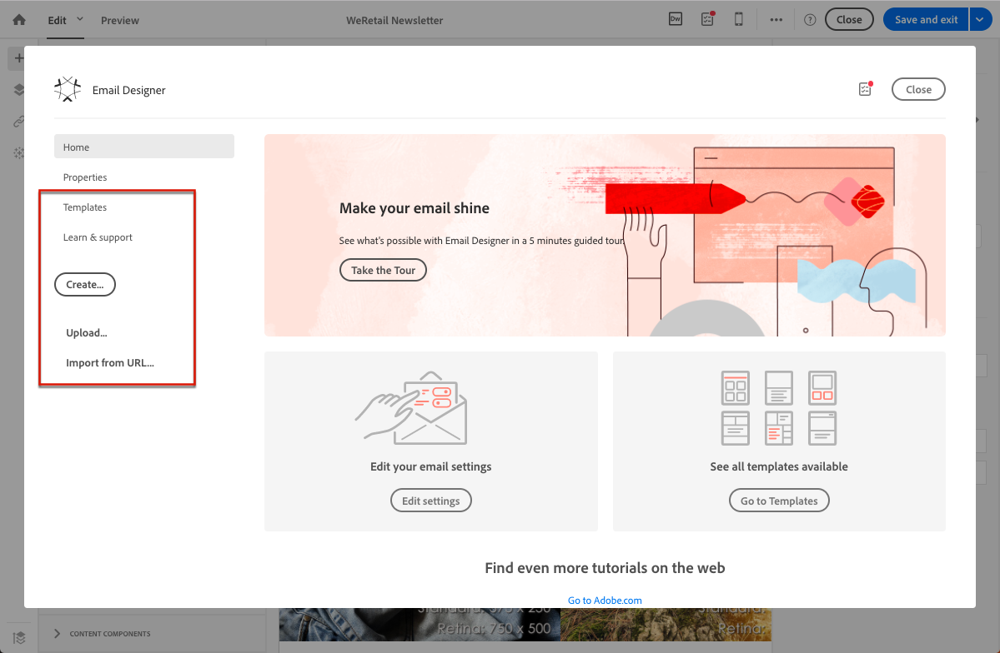

# Selecting an existing content{#selecting-an-existing-content}

O Adobe Campaign vem com um conjunto de conteúdos predefinidos para ajudá-lo a começar. Você pode usar um desses valores ou, se o conteúdo da mensagem que precisa enviar estiver sendo preparado fora do Adobe Campaign, poderá importá-lo de seu computador ou de um URL.

Ao criar um email ou uma página de aterrissagem, você pode optar por carregar um conteúdo existente de outra fonte.

>[!NOTE]
>
>The images below show how to load an existing content using the [Email Designer](../../designing/using/about-email-content-design.md#about-the-email-designer).

1. Depois de criar o email ou a página de aterrissagem, abra seu conteúdo.
1. Click the home icon to access the **[!UICONTROL Email Designer]** home page.

   

1. Selecione a fonte do conteúdo que deseja carregar:

   * [Modelos de conteúdo](../../start/using/about-templates.md#content-templates): clique na **[!UICONTROL Templates]** guia.
   * [Conteúdo do zero](../../designing/using/about-email-content-design.md#designing-an-email-content-from-scratch), para começar a ser novo: clique no **[!UICONTROL Create]** botão.
   * [Conteúdo do seu computador como um arquivo ZIP ou HTML](../../designing/using/importing-content-from-a-file.md): clique no **[!UICONTROL Upload]** botão.
   * [Conteúdo de um URL existente](../../designing/using/importing-content-from-a-url.md) (apenas para emails): clique no **[!UICONTROL Import from URL]** botão.
   

1. Carregue o conteúdo. O conteúdo selecionado substitui o conteúdo atual.

   Após a importação, o conteúdo pode ser editado e personalizado.

   >[!NOTE]
   >
   >The [Email Designer](../../designing/using/about-email-content-design.md#about-the-email-designer) uses specific tagging. O conteúdo HTML padrão carregado na Campanha deve corresponder à marcação esperada para ser totalmente compatível e editável no Designer de email. If not matching, your content is uploaded in [compatibility mode](../../designing/using/about-email-content-design.md#email-designer-compatibility-mode). To make existing contents compatible, see [this section](../../designing/using/editing-existing-contents-with-the-email-designer.md).

**Tópicos relacionados:**

* [Criação de um email](../../channels/using/creating-an-email.md)
* [Gerenciamento de páginas de aterrissagem](../../channels/using/about-landing-pages.md)

