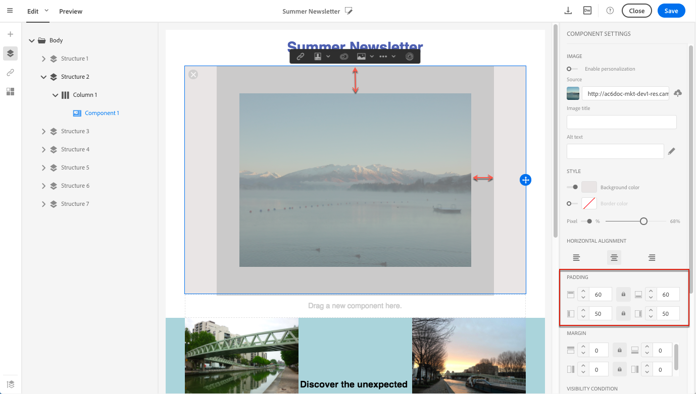

# Gerenciamento de estilos de email {#managing-styles}

No Designer de email, ao selecionar um elemento, várias opções específicas para o tipo de conteúdo selecionado são exibidas no **[!UICONTROL Settings]** painel. Você pode usar essas opções para alterar facilmente o estilo do seu email.

## Selecionar um elemento {#selecting-an-element}

Para selecionar um elemento na interface do Email Designer, é possível:

* clique diretamente no email,
* ou procure a árvore de estrutura disponível nas opções localizadas na **Paleta** esquerda.

A navegação na árvore de estrutura permite que você faça uma seleção mais precisa. Você pode selecionar:

* toda a componente da estrutura,
* uma das colunas que compõe o componente de estrutura,
* ou somente um componente localizado dentro de uma coluna.

Para selecionar uma coluna, você também pode fazer o seguinte:

1. Selecione um componente de estrutura (diretamente no email ou usando a árvore de estrutura disponível na **Paleta** esquerda).
1. Na barra de ferramentas **contextual**, clique **[!UICONTROL Select a column]** para escolher a coluna desejada.

Veja um exemplo [nesta seção](#example--adjusting-vertical-alignment-and-padding).

## Ajustar configurações de estilo {#adjusting-style-settings}

1. Selecione um elemento no seu email. For more on this, see [Selecting an element](#selecting-an-element).
1. Ajuste as configurações de acordo com suas necessidades. Cada elemento selecionado oferta um conjunto diferente de configurações.

   Você pode inserir planos de fundo, alterar tamanhos, modificar o alinhamento horizontal ou vertical, gerenciar cores, adicionar [preenchimento ou margem](#selecting-an-element)e assim por diante.

   Para fazer isso, use as opções exibidas no **[!UICONTROL Settings]** painel ou [adicione atributos](#adding-inline-styling-attributes)de estilização em linha.

   

1. Salve o conteúdo.

## Ajuste do preenchimento e da margem {#about-padding-and-margin}

A interface do Designer de email permite que você ajuste rapidamente as configurações de preenchimento e margem.

**[!UICONTROL Padding]**: essa configuração permite gerenciar o espaço localizado dentro da borda de um elemento.

Por exemplo:

* Use o preenchimento para definir margens nos lados esquerdo e direito de uma imagem.
* Use o preenchimento superior e inferior para adicionar mais espaçamento a um componente **[!UICONTROL Text]** ou a um **[!UICONTROL Divider]** .
* Para definir bordas entre colunas dentro de um elemento de estrutura, defina o preenchimento para cada coluna.

**[!UICONTROL Margin]**: essa configuração permite gerenciar o espaço entre a borda do elemento e o próximo elemento.

>[!NOTE]
>
>Dependendo da sua seleção (componente de estrutura, coluna ou componente de conteúdo), o resultado não será o mesmo. O Adobe recomenda definir os parâmetros **[!UICONTROL Padding]** e **[!UICONTROL Margin]** no nível da coluna.

Para ambos **[!UICONTROL Padding]** e **[!UICONTROL Margin]**, clique no ícone de cadeado para quebrar a sincronização entre os parâmetros superior e inferior ou direito e esquerdo. Isso permite que você ajuste cada parâmetro separadamente.

## Alinhamento de estilo {#about-alignment}

* **Alinhamento** do texto: coloque o cursor do mouse sobre um texto e use a barra de ferramentas contextual para alinhá-lo.

   

* **O alinhamento** horizontal pode ser aplicado ao texto, imagens e botões - atualmente não aos componentes **[!UICONTROL Divider]** e **[!UICONTROL Social]** .

   

* Para definir o alinhamento **** vertical, selecione uma coluna dentro de um componente de estrutura e escolha uma opção no painel Configurações.

   

## Configuração de planos de fundo {#about-backgrounds}

>[!CONTEXTUALHELP]
>id="ac_edition_backgroundimage"
>title="Configurações de plano de fundo"
>abstract="O Designer de e-mail permite que você personalize a cor do plano de fundo ou a imagem de plano de fundo para o seu conteúdo.Observe que a imagem de plano de fundo não é suportada por todos os clientes de e-mail."
>additional-url="https://docs.google.com/spreadsheets/d/1TLo62YKm3tThUWDOIliCQFWs3dpNjpDfw6DdTr1oGOw/edit#gid=0" text="Informações adicionais"

Quando se trata de configurar planos de fundo com o Email Designer, o Adobe recomenda o seguinte:

1. Aplique uma cor de plano de fundo ao corpo do seu email, se exigido pelo seu design.
1. Na maioria dos casos, defina as cores do plano de fundo no nível da coluna.
1. Tente não usar as cores de plano de fundo em componentes de imagem ou texto, pois elas são difíceis de gerenciar.

Abaixo estão as configurações de plano de fundo disponíveis que você pode usar.

* Defina um **[!UICONTROL Background color]** para o email inteiro. Certifique-se de selecionar as configurações de corpo na árvore de navegação acessível na paleta esquerda.

   

* Defina a mesma cor de plano de fundo para todos os componentes da estrutura selecionando **[!UICONTROL Viewport background color]**. Essa opção permite que você selecione uma configuração diferente da cor do plano de fundo.

   

* Defina uma cor de plano de fundo diferente para cada componente de estrutura. Selecione uma estrutura na árvore de navegação acessível na paleta esquerda para aplicar uma cor de plano de fundo específica somente a essa estrutura.

   

   Certifique-se de não definir uma cor de plano de fundo do visor, pois ela pode ocultar as cores de plano de fundo da estrutura.

* Defina uma configuração **[!UICONTROL Background image]** para o conteúdo de um componente de estrutura.

   

   >[!NOTE]
   >
   >Alguns programas de e-mail não suportam imagens de fundo. Quando não houver suporte, a cor de plano de fundo da linha será usada. Certifique-se de selecionar uma cor de plano de fundo de fallback apropriada caso a imagem não possa ser exibida.

* Defina uma cor de plano de fundo no nível da coluna.

   

   >[!NOTE]
   >
   >Este é o caso de uso mais comum. O Adobe recomenda configurar as cores de fundo no nível da coluna, pois isso permite mais flexibilidade ao editar todo o conteúdo do email.

   Também é possível definir uma imagem de plano de fundo no nível da coluna, mas isso raramente é usado.

### Exemplo: ajuste do alinhamento vertical e do preenchimento {#example--adjusting-vertical-alignment-and-padding}

Você deseja ajustar o preenchimento e o alinhamento vertical dentro de um componente de estrutura composto de três colunas. Para fazer isso, siga as etapas abaixo:

1. Selecione o componente de estrutura diretamente no email ou usando a árvore de estrutura disponível na **Paleta** esquerda.
1. Na barra de ferramentas **contextual**, clique **[!UICONTROL Select a column]** e escolha a que deseja editar. Também é possível selecioná-lo na árvore de estrutura.

   

   Os parâmetros editáveis para essa coluna são exibidos no **[!UICONTROL Settings]** painel à direita.

1. Em **[!UICONTROL Vertical alignment]**, selecione **[!UICONTROL Up]**.

   

   O componente de conteúdo é exibido na parte superior da coluna.

1. Em **[!UICONTROL Padding]**, defina o preenchimento superior dentro da coluna. Clique no ícone de cadeado para interromper a sincronização com o preenchimento inferior.

   Defina o preenchimento à esquerda e à direita para essa coluna.

   

1. Proceda de forma semelhante para ajustar o alinhamento e o preenchimento das outras colunas.

   

1. Salve as alterações.

## Links de estilo {#about-styling-links}

Você pode sublinhar um link e selecionar sua cor e público alvo no Designer de email.

1. Em um componente onde um link é inserido, selecione o texto do rótulo do link.

1. Nas configurações do componente, marque **[!UICONTROL Underline link]** para sublinhar o texto da etiqueta do link.

   

1. Para selecionar em qual contexto de navegação seu link será aberto, selecione um **[!UICONTROL Target]**.

   

1. Para alterar a cor do link, clique em **[!UICONTROL Link color]**.

   

1. Escolha a cor de que precisa.

   

1. Salve as alterações.

## Adding inline styling attributes {#adding-inline-styling-attributes}

Na interface do Email Designer, ao selecionar um elemento e exibir suas configurações no painel lateral, você pode personalizar os atributos em linha e seus valores para esse elemento específico.

1. Selecione um elemento no seu conteúdo.
1. No painel lateral, procure as **[!UICONTROL Styles Inline]** configurações.

   

1. Modifique os valores dos atributos existentes ou adicione novos usando o botão **+** . Você pode adicionar qualquer atributo e valor que seja compatível com CSS.

O estilo é aplicado ao elemento selecionado. Se os elementos filho não tiverem atributos de estilo específicos definidos, o estilo do elemento pai será herdado.
