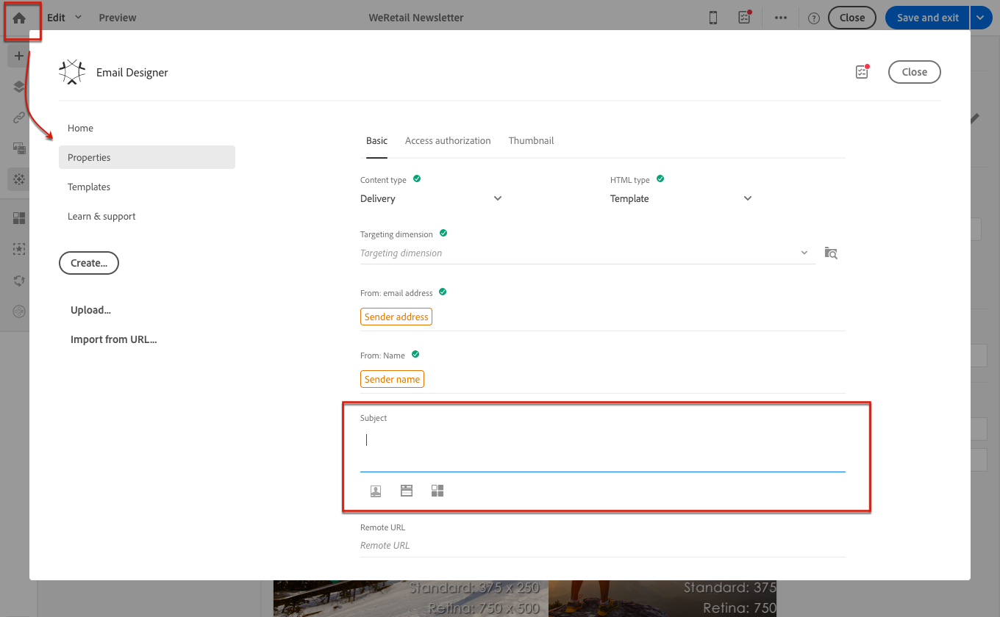
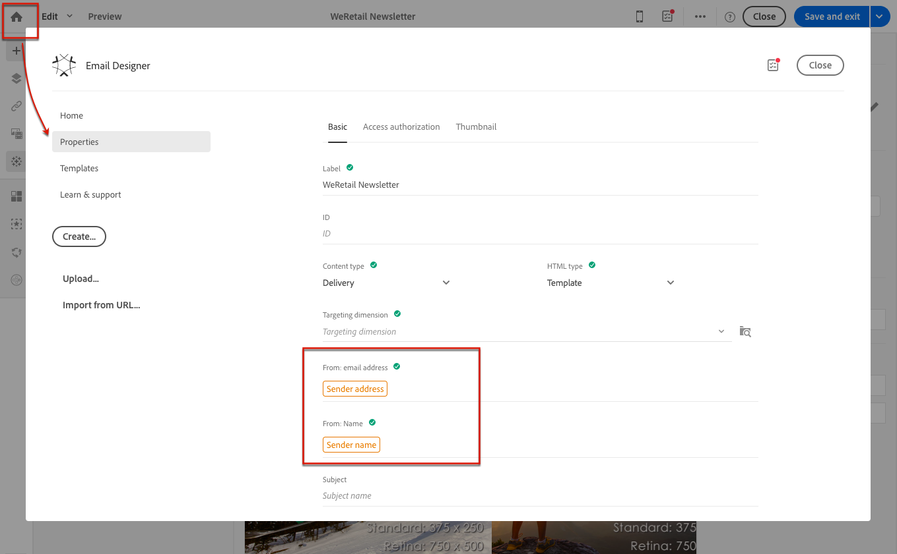

# Definição da linha de assunto e do remetente de um email{#defining-the-subject-line-of-an-email}

## Definição da linha de assunto de um email {#subject-line}

O assunto da mensagem é obrigatório para preparar e enviar a mensagem.

>[!NOTE]
>
>Se a linha de assunto estiver vazia, um aviso será exibido no painel da mensagem e no Designer de email.

1. Crie um email.
1. Vá para a guia **[!UICONTROL Properties]** da página inicial do Email Designer (acessível por meio do ícone de página inicial).
1. Preencha a seção **[!UICONTROL Subject]**.

   

1. Você também pode adicionar campos de personalização, blocos de conteúdo e conteúdo dinâmico à linha de assunto clicando nos ícones correspondentes. Para obter mais informações, consulte [Personalization](../../designing/using/personalization.md).

## Definição do remetente de email de um email {#email-sender}

Para definir o nome do remetente que aparecerá no cabeçalho das mensagens enviadas, vá para a guia **[!UICONTROL Properties]** da página inicial do Designer de Email (acessível por meio do ícone de início).

* O campo **[!UICONTROL From: name]** permite inserir o nome do remetente. Por padrão, o bloco **Nome do remetente** padrão é inserido automaticamente no campo. O endereço de email e o nome do remetente padrão do remetente são definidos no **[!UICONTROL Brands]**, acessível por meio do logotipo do Adobe Campaign no menu avançado **[!UICONTROL Administration > Instance settings > Brand configuration]**.

  Você pode alterar o nome do remetente clicando no bloco **Nome do remetente**. O campo torna-se editável e você pode inserir o nome que deseja usar.

  Esse campo pode ser personalizado. Para fazer isso, você pode adicionar campos de personalização, blocos de conteúdo e conteúdo dinâmico clicando nos ícones abaixo do nome do remetente. Para obter mais informações, consulte [Personalization](../../designing/using/personalization.md).

* O campo **[!UICONTROL From: email address]** não pode ser editado desta seção. Você pode alterá-lo editando as propriedades do email no painel. Para obter mais informações, consulte [Lista de parâmetros avançados de email](../../administration/using/configuring-email-channel.md#advanced-parameters).

>[!NOTE]
>
>Os parâmetros do cabeçalho não devem ficar vazios. O endereço do remetente é obrigatório para possibilitar o envio de um email (padrão RFC). O Adobe Campaign verifica a sintaxe dos endereços de email inseridos.

**Tópicos relacionados:**

* [Inserção de um campo de personalização](../../designing/using/personalization.md#inserting-a-personalization-field)
* [Adição de um bloco de conteúdo](../../designing/using/personalization.md#adding-a-content-block)
* [Definição de conteúdo dinâmico em um email](../../designing/using/personalization.md#defining-dynamic-content-in-an-email)
