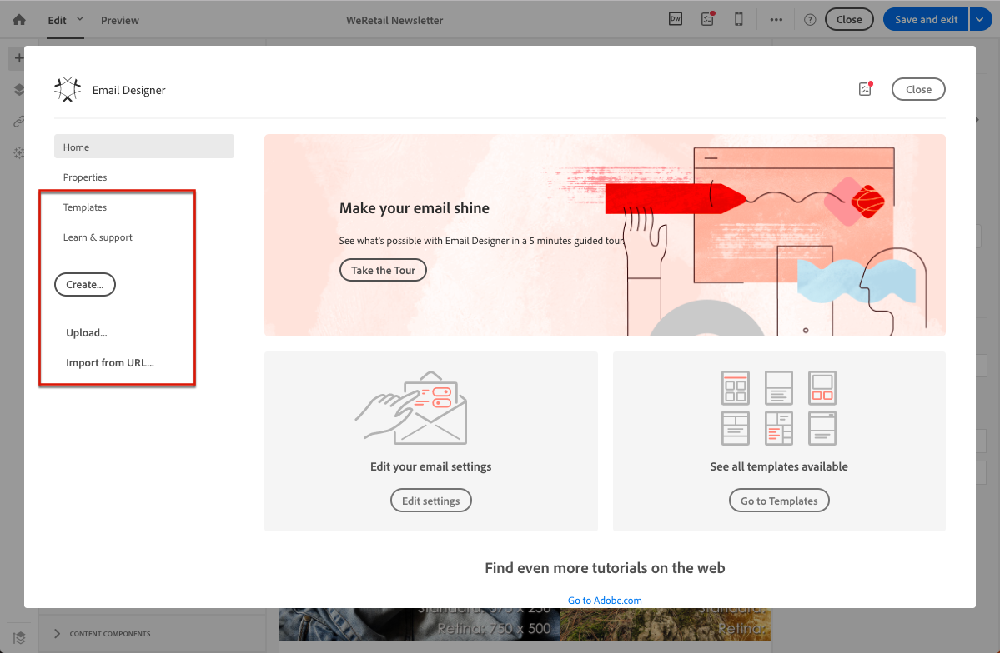

# Criação usando conteúdo existente {#designing-using-existing-content}

## Seleção de um conteúdo existente{#selecting-an-existing-content}

O Adobe Campaign vem com um conjunto de conteúdos predefinidos para ajudá-lo a começar. Você pode usar uma dessas opções ou, se o conteúdo da mensagem que você precisa enviar estiver sendo preparado fora do Adobe Campaign, poderá importá-lo do seu computador ou de um URL.

Ao criar um email ou uma landing page, você pode optar por carregar um conteúdo existente de outra fonte.

>[!NOTE]
>
>As imagens abaixo mostram como carregar um conteúdo existente usando o [Email Designer](../../designing/using/designing-content-in-adobe-campaign.md).

1. Após criar o email ou a landing page, abra o conteúdo.
1. Clique no ícone inicial para acessar a página inicial **[!UICONTROL Email Designer]**.

   

1. Selecione a fonte do conteúdo que deseja carregar:

   * [Modelos](../../designing/using/using-reusable-content.md#content-templates) de conteúdo: clique na  **[!UICONTROL Templates]** guia .
   * [Conteúdo do zero](../../designing/using/designing-from-scratch.md#designing-an-email-content-from-scratch), para começar fresco: clique no  **[!UICONTROL Create]** botão .
   * [Conteúdo do seu computador como um arquivo](#importing-content-from-a-file) ZIP ou HTML: clique no  **[!UICONTROL Upload]** botão .
   * [Conteúdo de um URL existente](#importing-content-from-a-url)  (somente para emails): clique no  **[!UICONTROL Import from URL]** botão .

   

1. Carregue o conteúdo. O conteúdo selecionado substitui o conteúdo atual.

   Depois de importado, o conteúdo pode ser editado e personalizado.

   >[!NOTE]
   >
   >O [Email Designer](../../designing/using/designing-content-in-adobe-campaign.md) usa marcação específica. O conteúdo HTML padrão carregado no Campaign deve corresponder à marcação esperada para ser totalmente compatível e editável no Designer de email. Se não for correspondente, seu conteúdo será carregado no [modo de compatibilidade](#compatibility-mode). Para tornar o conteúdo existente compatível, consulte [esta seção](#editing-existing-contents-with-the-email-designer).

**Tópicos relacionados:**

* [Criar email](../../channels/using/creating-an-email.md)
* [Gerenciamento de landing pages](../../channels/using/getting-started-with-landing-pages.md)

## Edição de conteúdo existente com o Designer de email{#editing-existing-contents-with-the-email-designer}

Para aproveitar totalmente as possibilidades de edição do [Email Designer](../../designing/using/designing-content-in-adobe-campaign.md), o HTML carregado deve conter uma marcação específica que o torne compatível com o editor WYSIWYG.

Se todo o HTML ou parte dele não tiver essa marcação, o conteúdo será carregado no &#39; [modo de compatibilidade](#compatibility-mode)&#39;.

Para tornar um conteúdo externo existente totalmente editável no Designer de email, consulte a seção [Criação de email usando conteúdo existente](../../designing/using/using-existing-content.md) .

## Importar um conteúdo de email existente {#importing}

### Importar conteúdo de um arquivo {#importing-content-from-a-file}

Na página inicial do Designer de email, clique no botão **[!UICONTROL Upload]** para fazer upload de um arquivo de seu computador e, em seguida, confirme.

Não há restrições na estrutura do arquivo zip. No entanto, a referência a arquivos HTML deve ser relativa e respeitar a estrutura de árvore da pasta zip.

Os formatos a seguir são suportados para importação:

* Um arquivo HTML com uma folha de estilos incorporada
* Uma pasta .zip contendo o arquivo HTML, a folha de estilos (.CSS) e as imagens

>[!NOTE]
>
>Para conteúdo de email, recomendamos que você importe arquivos HTML únicos com uma folha de estilos incorporada.

#### Importar conteúdo de um URL {#importing-content-from-a-url}

Antes de importar o conteúdo de um URL, verifique se ele cumpre os requisitos abaixo:

* O conteúdo precisa estar disponível publicamente através deste URL.
* Por motivos de segurança, somente os URLs que começam com **[!UICONTROL https]** são permitidos.
* Certifique-se de que todos os recursos (imagens, CSS) estejam definidos em links absolutos e em HTTPS. Caso contrário, após o envio do email, a mirror page seria exibida sem seus recursos. Este é um exemplo de uma definição de link absoluta:

   ```
   <a href="https://www.mywebsite.com/images/myimage.png">
   ```

>[!NOTE]
>
>O carregamento de conteúdo de um URL está disponível somente para o canal de email.

Para recuperar o conteúdo existente de um URL, siga as etapas abaixo:

1. Na página inicial do Designer de email, selecione o botão **[!UICONTROL Import from URL]**.

   

1. Defina o URL do qual o conteúdo será recuperado.
1. Clique em **[!UICONTROL Confirm]**.

Descubra este recurso no vídeo.

>[!VIDEO](https://video.tv.adobe.com/v/25926?quality=12)

Os vídeos de instruções adicionais do Campaign Standard estão disponíveis [aqui](https://experienceleague.adobe.com/docs/campaign-standard-learn/tutorials/overview.html?lang=pt-BR).

### Recuperar conteúdo de um URL automaticamente no momento de preparação {#retrieving-content-from-a-url-automatically-at-preparation-time}

Importar conteúdo de um URL durante a preparação da mensagem permite recuperar o conteúdo HTML mais recente sempre que o email for preparado. Dessa forma, o conteúdo de emails recorrentes é sempre atualizado no momento do envio. Esse recurso também permite que você crie uma mensagem agendada em uma data específica, mesmo se o conteúdo ainda não estiver pronto.

Para recuperar o conteúdo no momento da preparação, siga as etapas abaixo:

1. Selecione a opção **[!UICONTROL Content imported during preparation]**.

   

1. O conteúdo do URL é exibido no editor como somente leitura.

   >[!CAUTION]
   >
   >Nesta etapa, a exibição de HTML no editor de conteúdo não deve ser levada em conta. Ele será recuperado na fase de preparação.

1. Para visualizar o conteúdo do URL que foi recuperado, abra a mensagem depois de criada e clique no botão **[!UICONTROL Preview]** .

É possível personalizar a URL remota da qual o conteúdo será recuperado. Para fazer isso, siga as etapas abaixo:

1. Clique no rótulo do email na parte superior da tela para acessar a guia **[!UICONTROL Properties]** do Designer de email.
1. Encontre o campo **[!UICONTROL Remote URL]** .

   

1. Insira o campo de personalização, o bloco de conteúdo ou o texto dinâmico desejado.

   O bloco de conteúdo **[!UICONTROL Current date - YYYYMMDD]**, por exemplo, permite inserir a data do dia.

   >[!NOTE]
   >
   >Os campos de personalização disponíveis são vinculados somente aos atributos **Delivery** (data de criação do email, status, rótulo da campanha...).

### Modo de compatibilidade {#compatibility-mode}

Ao fazer upload de um conteúdo, ele deve conter uma marcação específica para ser totalmente compatível e editável com o editor WYSIWYG do Designer de email.

Se todo ou parte do HTML carregado não for compatível com a marcação esperada, o conteúdo será carregado no &quot;modo de compatibilidade&quot;, o que limita as possibilidades de edição por meio da interface do usuário.

Quando um conteúdo é carregado no modo de compatibilidade, você ainda pode executar as seguintes modificações por meio da interface (as ações não disponíveis estão ocultas):

* Alteração do texto ou alteração de uma imagem
* Inserção de links e campos de personalização
* Editar algumas opções de estilo no bloco HTML selecionado
* Definição do conteúdo condicional


Outras modificações, como adicionar novas seções ao seu email ou estilo avançado, devem ser feitas diretamente no código-fonte do email por meio do modo HTML.

Para obter mais informações sobre como converter um email existente em um email compatível com o Designer de email, consulte [esta seção](../../designing/using/using-existing-content.md).

**Tópicos relacionados**:

* [Criar email](../../channels/using/creating-an-email.md)
* [Vídeo de introdução ao Email Designer](../../designing/using/designing-content-in-adobe-campaign.md#video)
* [Criar um conteúdo de email do zero](../../designing/using/designing-from-scratch.md#designing-an-email-content-from-scratch)

## Conversão de conteúdo HTML {#converting-an-html-content}

Se quiser criar uma estrutura de modelos e fragmentos modulares que podem ser combinados para reutilização em vários emails, considere converter seu HTML de email em um modelo do Designer de email.

Esse caso de uso oferece uma maneira rápida de converter emails HTML em componentes do Designer de email.

>[!CAUTION]
>
>Esta seção é para usuários avançados familiarizados com o código HTML.

>[!NOTE]
>
>Como o modo de compatibilidade, um componente HTML é editável com opções limitadas: só é possível executar edição no local.

Fora do Designer de email, verifique se o HTML original está dividido em seções reutilizáveis.

Se esse não for o caso, corte os diferentes blocos do seu HTML. Por exemplo:

```
<!-- 3 COLUMN w/CTA (SCALED) -->
<table width="100%" align="center" cellspacing="0" cellpadding="0" border="0" role="presentation" style="max-width:680px;">
<tbody>
<tr>
<td class="padh10" align="center" valign="top" style="padding:0 5px 20px 5px;">
<table width="100%" cellspacing="0" cellpadding="0" border="0" role="presentation">
<tbody>
<tr>
...
</tr>
</tbody>
</table>
</td>
</tr>
</tbody>
</table>
<!-- //3 COLUMN w/CTA (SCALED) -->
```

Depois de identificar todos os blocos, no Email Designer, repita o seguinte procedimento para cada seção do email existente:

1. Abra o Designer de email para criar um conteúdo de email vazio.
1. Defina os atributos de nível de corpo: cores de fundo, largura, etc. Para obter mais informações, consulte [Edição de estilos de email](../../designing/using/styles.md).
1. Adicione um componente de estrutura. Para obter mais informações, consulte [Edição da estrutura do email](../../designing/using/designing-from-scratch.md#defining-the-email-structure).
1. Adicione um componente HTML. Para obter mais informações, consulte [Inclusão de fragmentos e componentes](../../designing/using/designing-from-scratch.md#defining-the-email-structure).
1. Copie e cole seu HTML nesse componente.
1. Alternar para exibição móvel. Para obter mais informações, consulte [esta seção](../../designing/using/plain-text-html-modes.md#switching-to-mobile-view).

   A exibição responsiva está quebrada, pois seu CSS está ausente.

1. Para corrigir isso, alterne para o modo de código-fonte e copie e cole sua seção de estilo em uma nova seção de estilo. Por exemplo:

   ```
   <style type="text/css">
   a {text-decoration:none;}
   body {min-width:100% !important; margin:0 auto !important; padding:0 !important;}
   img {line-height:100%; text-decoration:none; -ms-interpolation-mode:bicubic;}
   ...
   </style>
   ```

   >[!NOTE]
   >
   >Adicione seu estilo depois disso em outra tag de estilo personalizada.
   >
   >Não modifique o CSS gerado pelo Email Designer:
   >
   >* `<style data-name="default" type="text/css">(##)</style>`
   >* `<style data-name="supportIOS10" type="text/css">(##)</style>`
   >* `<style data-name="mediaIOS8" type="text/css">(##)</style>`
   >* `<style data-name="media-default-max-width-500px" type="text/css">(##)</style>`
   >* `<style data-name="media-default--webkit-min-device-pixel-ratio-0" type="text/css">(##)</style>`


1. Retorne à visualização móvel para verificar se o conteúdo é exibido corretamente e salvar as alterações.
