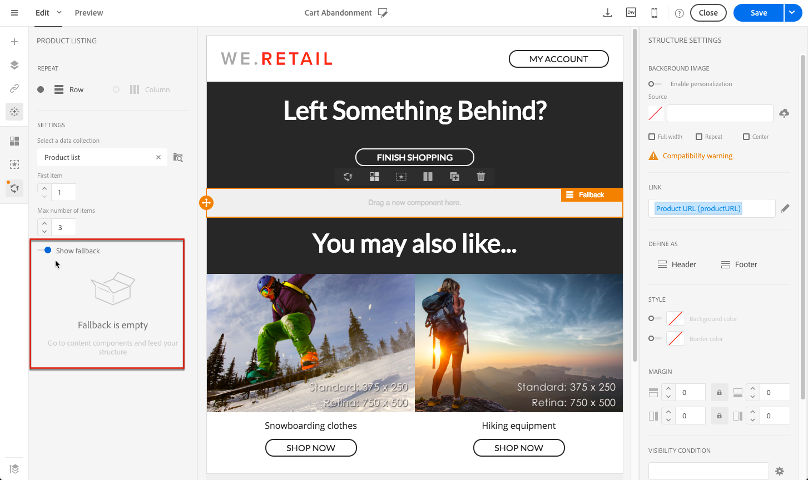

# Uso de listas de produtos em uma mensagem transacional {#using-product-listings}

>[!IMPORTANT]
>
>As listas de produtos só estão disponíveis para **mensagens de email transacionais** por meio da interface [Email Designer](../../designing/using/designing-content-in-adobe-campaign.md#email-designer-interface).

Ao editar o conteúdo de um email transacional, é possível criar listas de produtos que façam referência a uma ou mais coleções de dados. Por exemplo, em um email de abandono de carrinho, você pode incluir uma lista de todos os produtos que estavam nos carrinhos dos usuários quando eles saíram do site, com uma imagem, o preço e um link para cada produto.

Para adicionar uma lista de produtos abandonados em uma mensagem transacional, siga as etapas abaixo.

Você também pode assistir [a este conjunto de vídeos](https://experienceleague.adobe.com/docs/campaign-standard-learn/tutorials/designing-content/product-listings-in-transactional-email.html?lang=en#configure-product-listings-in-transactional-emails) explicando as etapas necessárias para configurar as listas de produtos em um email transacional.

>[!NOTE]
>
>O Adobe Campaign não é compatível com listas de produtos aninhados, o que significa que não é possível incluir uma lista de produtos dentro de outra.

## Definição de uma lista de produtos {#defining-a-product-listing}

Antes de usar uma lista de produtos em uma mensagem transacional, é necessário definir no nível do evento a lista de produtos e os campos para cada produto da lista que você deseja exibir. Para obter mais informações, consulte [Definição de coleções de dados](../../channels/using/configuring-transactional-event.md#defining-data-collections).

1. Na mensagem transacional, clique no bloco **[!UICONTROL Content]** para modificar o conteúdo do email.
1. Arraste e solte um componente de estrutura no espaço de trabalho. Para obter mais informações, consulte [Definição da estrutura do email](../../designing/using/designing-from-scratch.md#defining-the-email-structure).

   Por exemplo, selecione um componente de estrutura de uma coluna e adicione um componente de texto, um componente de imagem e um componente de botão. Para obter mais informações, consulte [Uso de componentes de conteúdo](../../designing/using/designing-from-scratch.md#about-content-components).

1. Selecione o componente de estrutura que você acabou de criar e clique no ícone **[!UICONTROL Enable product listing]**, na barra de ferramentas contextual.

   

   O componente de estrutura está realçado com um quadro laranja e as configurações da **[!UICONTROL Product listing]** são exibidas na paleta esquerda.

   

1. Selecione como os elementos da coleção serão exibidos:

   * **[!UICONTROL Row]**: horizontalmente, o que significa cada elemento em uma linha abaixo da outra.
   * **[!UICONTROL Column]**: verticalmente, o que significa cada elemento ao lado do outro na mesma linha.

   >[!NOTE]
   >
   >A opção **[!UICONTROL Column]** só está disponível ao usar um componente de estrutura de várias colunas ( **[!UICONTROL 2:2 column]**, **[!UICONTROL 3:3 column]** e **[!UICONTROL 4:4 column]** ). Ao editar a lista de produtos, preencha apenas a primeira coluna: as outras colunas não serão consideradas. Para obter mais informações sobre a seleção de componentes de estrutura, consulte [Definição da estrutura do email](../../designing/using/designing-from-scratch.md#defining-the-email-structure).

1. Selecione a coleção de dados criada ao configurar o evento relacionado à mensagem transacional. Você pode encontrá-la no nó **[!UICONTROL Context]** > **[!UICONTROL Real-time event]** > **[!UICONTROL Event context]**.

   

   Para obter mais informações sobre como configurar o evento, consulte [Definição de coleções de dados](../../channels/using/configuring-transactional-event.md#defining-data-collections).

1. Use a lista suspensa **[!UICONTROL First item]** para selecionar qual elemento iniciará a lista exibida no email.

   Por exemplo, se você selecionar 2, o primeiro item da coleção não será exibido no email. A lista de produtos iniciará no segundo item.

1. Selecione o número máximo de itens que serão exibidos na lista.

   >[!NOTE]
   >
   >Se quiser que os elementos da lista sejam exibidos verticalmente ( **[!UICONTROL Column]** ), o número máximo de itens é limitado de acordo com o componente de estrutura selecionado (2, 3 ou 4 colunas). Para obter mais informações sobre como selecionar componentes de estrutura, consulte [Edição da estrutura do email](../../designing/using/designing-from-scratch.md#defining-the-email-structure).

## Preenchimento da lista de produtos {#populating-the-product-listing}

Para exibir uma lista de produtos provenientes do evento vinculado ao email transacional, siga as etapas abaixo.

Para obter mais informações sobre como criar uma coleção e campos relacionados ao configurar o evento, consulte [Definição de coleções de dados](../../channels/using/configuring-transactional-event.md#defining-data-collections).

1. Selecione o componente de imagem inserido, selecione **[!UICONTROL Enable personalization]** e clique no lápis, no painel Configurações.

   

1. Selecione **[!UICONTROL Add personalization field]** na janela **[!UICONTROL Image source URL]** que será aberta.

   No nó **[!UICONTROL Context]** > **[!UICONTROL Real-time event]** > **[!UICONTROL Event context]**, abra o nó correspondente à coleção que você criou (aqui **[!UICONTROL Product list]** ) e selecione o campo de imagem definido (aqui **[!UICONTROL Product image]** ). Clique em **[!UICONTROL Save]**.

   

   O campo de personalização selecionado agora é exibido no painel Settings.

1. Na posição desejada, selecione **[!UICONTROL Insert personalization field]** na barra de ferramentas contextual.

   

1. No nó **[!UICONTROL Context]** > **[!UICONTROL Real-time event]** > **[!UICONTROL Event context]**, abra o nó correspondente à coleção que você criou (aqui **[!UICONTROL Product list]** ) e selecione o campo que você criou (aqui **[!UICONTROL Product name]** ). Clique em **[!UICONTROL Confirm]**.

   

   O campo de personalização selecionado agora é exibido na posição desejada no conteúdo de email.

1. Proceda da mesma forma para inserir o preço.
1. Selecione algum texto e selecione **[!UICONTROL Insert link]** na barra de ferramentas contextual.

   

1. Selecione **[!UICONTROL Add personalization field]** na janela **[!UICONTROL Insert link]** que será aberta.

   No nó **[!UICONTROL Context]** > **[!UICONTROL Real-time event]** > **[!UICONTROL Event context]**, abra o nó correspondente à coleção que você criou (aqui **[!UICONTROL Product list]** ) e selecione o campo URL que você criou (aqui **[!UICONTROL Product URL]** ). Clique em **[!UICONTROL Save]**.

   >[!IMPORTANT]
   >
   >Por motivos de segurança, insira o campo de personalização dentro de um link que comece com um nome de domínio estático apropriado.

   

   O campo de personalização selecionado agora é exibido no painel Settings.

1. Selecione o componente de estrutura no qual a lista de produtos é aplicada e selecione **[!UICONTROL Show fallback]** para definir um conteúdo padrão.

   

1. Arraste um ou mais componentes de conteúdo e edite-os conforme necessário.

   

   O conteúdo de fallback será exibido se a coleção estiver vazia quando o evento for acionado. Por exemplo, se um cliente não tiver nada em seu carrinho.

1. No painel Configurações, edite os estilos para a lista de produtos. Para obter mais informações, consulte [Gerenciamento de estilos de email](../../designing/using/styles.md).
1. Pré-visualize o email usando um perfil de teste vinculado ao evento transacional relevante e para o qual você definiu os dados da coleta. Por exemplo, adicione as seguintes informações na seção **[!UICONTROL Event data]** para o perfil de teste que você deseja usar:

   

   Para obter mais informações sobre como definir um perfil de teste em uma mensagem transacional, consulte [esta seção](../../channels/using/testing-transactional-message.md#defining-specific-test-profile).
