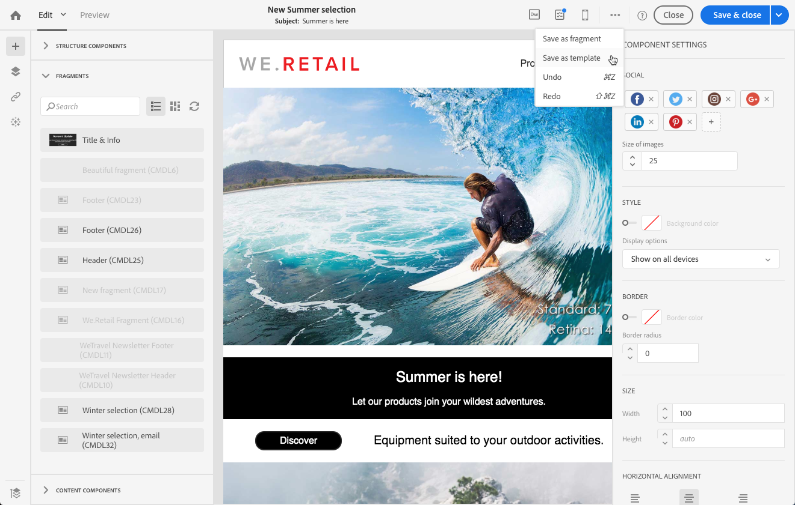

# Criação e uso de conteúdo reutilizável {#using-reusable-content}

Saiba como principal a edição de conteúdo de email. Com o Email Designer, você pode criar modelos e fragmentos com seu próprio conteúdo predefinido e reutilizá-los para os seguintes delivery.

## Criar e-mails usando modelos {#designing-templates}

>[!NOTE]
>
> No Adobe Campaign Standard, você pode criar diferentes tipos de modelos acessíveis no menu **Recursos** > **Modelos** . Os modelos usados no Designer de email são modelos de conteúdo. Para obter mais informações, consulte [Sobre modelos](../../start/using/marketing-activity-templates.md).

### Sobre templates de conteúdo {#content-templates}

Você pode gerenciar o conteúdo HTML oferecido na **[!UICONTROL Templates]** guia do home page [Email Designer](../../designing/using/designing-content-in-adobe-campaign.md) .

Os modelos prontos para uso de conteúdo de email incluem dezoito layouts otimizados para dispositivos móveis e quatro modelos responsivos melhores do setor, projetados por artistas da Behance. Eles correspondem aos usos mais atuais, como mensagens de boas-vindas ao cliente, boletins informativos e e-mails de reenvolvimento, entre outros. Eles podem ser facilmente personalizados com o conteúdo de suas marcas para facilitar o processo de criação de e-mails do zero.

Os modelos de conteúdo HTML podem ser acessados na tela **[!UICONTROL Resources]** > **[!UICONTROL Content templates & fragments]** do menu Avançado. A partir daí, você pode gerenciar modelos de conteúdo de landing page, modelos de conteúdo de email e também fragmentos.

Os modelos de conteúdo prontos para uso são somente leitura. Para editar um deles, é necessário primeiro duplicado o modelo desejado.

Você pode criar novos modelos ou fragmentos e definir seu próprio conteúdo. Para obter mais informações, consulte [Criar um modelo](#creating-a-content-template) de conteúdo e [Criar um fragmento](#creating-a-content-fragment)de conteúdo.

Ao editar conteúdo com o Designer de email, você também pode criar modelos de conteúdo salvando o conteúdo como fragmento ou modelo. Para obter mais informações, consulte [Salvar conteúdo como modelo](#saving-content-as-template) e [Salvar conteúdo como fragmento](../../designing/using/using-reusable-content.md#saving-content-as-a-fragment).

**Tópicos relacionados:**

* Saiba como personalizar modelos de conteúdo [neste vídeo](https://docs.adobe.com/content/help/en/campaign-learn/campaign-standard-tutorials/designing-content/email-designer/email-content-templates.html).
* Para obter mais informações sobre edição de conteúdo, consulte [Sobre design](../../designing/using/designing-content-in-adobe-campaign.md)de conteúdo de email.

### Creating a content template {#creating-a-content-template}

Você pode criar seus próprios modelos de conteúdo para usá-los quantas vezes forem necessárias.

O exemplo a seguir mostra como criar um modelo de conteúdo de email.

1. Go to **[!UICONTROL Resources]** > **[!UICONTROL Content templates & fragments]** and click **[!UICONTROL Create]**.
1. Clique no rótulo do email para acessar a **[!UICONTROL Properties]** guia do Designer de email.
1. Especifique um rótulo reconhecível e selecione os seguintes parâmetros para poder usar este modelo em emails:

   * Selecione **[!UICONTROL Shared]** ou **[!UICONTROL Delivery]** na lista **[!UICONTROL Content type]** suspensa.
   * Selecione **[!UICONTROL Template]** na lista **[!UICONTROL HTML type]** suspensa.

   

1. Se necessário, é possível definir uma imagem que será usada como miniatura do modelo. Selecione-o na **[!UICONTROL Thumbnail]** guia das propriedades do modelo.

   

   Essa miniatura será exibida na **[!UICONTROL Templates]** guia do home page [Email Designer](../../designing/using/designing-content-in-adobe-campaign.md) .

1. Feche a **[!UICONTROL Properties]** guia para retornar à área de trabalho principal.
1. Adicione componentes de estrutura e componentes de conteúdo que podem ser personalizados conforme necessário.
   >[!NOTE]
   >
   > Não é possível inserir campos de personalização ou conteúdo condicional dentro de um modelo de conteúdo.
1. Depois de editado, salve o modelo.

Esse modelo agora pode ser usado em qualquer email criado com o Designer de email. Selecione-o na **[!UICONTROL Templates]** guia do home page [Email Designer](../../designing/using/designing-content-in-adobe-campaign.md) .

### Salvar conteúdo como modelo {#saving-content-as-template}

Ao editar um email com o Designer de email, você pode salvar diretamente o conteúdo desse email como um modelo.

<!--[!CAUTION]
>
>You cannot save as template a structure containing personalization fields or dynamic content.-->

1. Selecione **[!UICONTROL Save as template]** na barra de ferramentas principal do Email Designer.

   

1. Adicione um rótulo e uma descrição, se necessário, e clique em **[!UICONTROL Save]**.

   

1. Para encontrar o modelo que você acabou de criar, vá para **[!UICONTROL Resources]** > **[!UICONTROL Content templates & fragments]**.

1. Para usar seu novo modelo, selecione-o na **[!UICONTROL Templates]** guia do home page [Email Designer](../../designing/using/designing-content-in-adobe-campaign.md) .

   

### Criação de um modelo com fragmentos e componentes {#template-fragments-components}

Agora você pode criar um modelo de email com o Designer de email. Use os componentes de conteúdo para refletir as diferentes seções do seu email e ajustar as configurações para torná-las o mais próximas possível do seu boletim informativo original. Por fim, insira os fragmentos que você acabou de criar.

1. Usando o Designer de email, crie um modelo. Para obter mais informações, consulte Modelos [de](#content-templates)conteúdo.
1. Insira vários componentes de estrutura no modelo - correspondentes ao cabeçalho, rodapé e corpo do email. Para obter mais informações sobre como adicionar componentes de estrutura, consulte [Editar a estrutura de e-mail com o Designer](../../designing/using/designing-from-scratch.md#defining-the-email-structure)de e-mail.
1. Insira quantos componentes de conteúdo forem necessários para criar o corpo de seu boletim informativo. Este será o conteúdo editável do seu email que você atualizará todos os meses.

   

   Se você estiver familiarizado com o código HTML, o Adobe recomenda aproveitar **[!UICONTROL Html]** os componentes onde você pode copiar e colar os elementos mais complexos do email original. Use outros componentes, como **[!UICONTROL Button]**, **[!UICONTROL Image]** ou **[!UICONTROL Text]** para o restante do conteúdo. For more on this, see [About content components](../../designing/using/designing-from-scratch.md#about-content-components).

   >[!NOTE]
   >
   >O uso do **[!UICONTROL Html]** componente resulta na criação de componentes editáveis com opções limitadas. Certifique-se de saber como lidar com o código HTML antes de selecionar esse componente.

1. Ajuste os componentes de conteúdo para corresponder ao seu email original o máximo possível.

   

   Para obter mais informações sobre como gerenciar configurações de estilo e atributos incorporados, consulte [Edição de estilos](../../designing/using/styles.md)de email.

1. Insira os dois fragmentos (cabeçalho e rodapé) criados anteriormente nos componentes de estrutura desejados.

   

1. Salve o template.

Agora você pode gerenciar totalmente esse modelo no Email Designer para criar e atualizar o boletim informativo que você enviará mensalmente aos seus recipient.

Para usá-lo, crie um email e selecione o modelo de conteúdo que você acabou de criar.

**Tópicos relacionados**:

* [Criação de email](../../channels/using/creating-an-email.md)
* [Vídeo de introdução ao Email Designer](https://video.tv.adobe.com/v/22771/?autoplay=true&hidetitle=true&captions=por_br)
* [Criar um conteúdo de email do zero](../../designing/using/designing-from-scratch.md#designing-an-email-content-from-scratch)

## Sobre fragmentos {#about-fragments}

>[!CONTEXTUALHELP]
>id="ac_fragments"
>title="Sobre fragmentos"
>abstract="Um fragmento é um bloco de conteúdo reutilizável que pode ser referenciado em um ou mais emails."

Um fragmento é um componente reutilizável que pode ser referenciado em um ou mais emails.
Eles podem ser encontrados na interface em **Recursos** > Fragmentos e modelos **** de conteúdo.

Para usar melhor os fragmentos no Designer de email:

* Crie seus próprios fragmentos. Consulte [Criar um fragmento](#creating-a-content-fragment) de conteúdo e [Salvar conteúdo como um fragmento](#saving-content-as-a-fragment).
* Use-os quantas vezes forem necessárias em seus e-mails. Consulte [Inserir elementos em um email](#inserting-elements-into-an-email).
* Ao editar um fragmento, as alterações são sincronizadas: são propagados automaticamente para todos os emails (desde que ainda não tenham sido preparados ou enviados) que contenham esse fragmento.

Quando adicionados a um email, os fragmentos são bloqueados por padrão. Se quiser modificar um fragmento para um email específico, você pode interromper a sincronização com o fragmento original desbloqueando-o no email em que ele é usado. As alterações não serão mais sincronizadas.

Para desbloquear um fragmento dentro de um email, selecione-o e clique no ícone de cadeado na barra de ferramentas contextual.

Esse fragmento se torna um componente independente que não está mais vinculado ao fragmento original. Em seguida, ele pode ser editado como qualquer outro componente de conteúdo. Consulte [Sobre componentes](../../designing/using/designing-from-scratch.md#about-content-components)de conteúdo.

### Inserir fragmentos em um email {#inserting-elements-into-an-email}

Para definir o conteúdo de seu email, é possível adicionar elementos de conteúdo nos componentes de estrutura que você colocou anteriormente. Consulte [Editar a estrutura](../../designing/using/designing-from-scratch.md#defining-the-email-structure)de email.

1. Acesse os elementos de conteúdo selecionando o ícone **+** à esquerda. Selecione [Fragmentos](#about-fragments) ou componentes de conteúdo.
1. Se você já souber o rótulo ou parte do rótulo do fragmento que deseja adicionar, poderá pesquisá-lo.

   

1. Arraste e solte um fragmento ou componente de conteúdo da paleta para um componente de estrutura do email.

   

   Depois que um elemento é adicionado ao email, ele pode ser movido dentro do componente de estrutura ou para outro componente de estrutura no email.

   

1. Edite o elemento para corresponder às necessidades exatas deste email. Você pode adicionar texto, links, imagens e assim por diante.

   >[!NOTE]
   >
   >Os fragmentos são bloqueados por padrão quando adicionados a um email. Você pode interromper a sincronização com o fragmento original se quiser modificar o fragmento para um email específico ou fazer a alteração diretamente no fragmento. Consulte [Sobre fragmentos](#about-fragments).

1. Repita este procedimento para todos os elementos que você precisa adicionar ao seu email.
1. Salve seu email.

Agora que sua estrutura de email está preenchida, você pode editar o estilo de cada elemento de conteúdo. Consulte [Edição de um elemento](../../designing/using/styles.md).

>[!NOTE]
>
>Se um fragmento for modificado, as alterações serão propagadas automaticamente nos e-mails em que são usadas. For more on this, see [About fragments](#about-fragments).

### Creating a content fragment {#creating-a-content-fragment}

Você pode criar seus próprios fragmentos de conteúdo para usá-los conforme necessário em um ou mais emails.

1. Go to **[!UICONTROL Resources]** > **[!UICONTROL Content templates & fragments]** and click **[!UICONTROL Create]**.
1. Clique no rótulo do email para acessar a **[!UICONTROL Properties]** guia do Designer de email.
1. Especifique um rótulo reconhecível e selecione os seguintes parâmetros para localizar o fragmento ao editar o conteúdo de email:

   * Como os fragmentos são compatíveis apenas com e-mails, selecione **[!UICONTROL Delivery]** na lista **[!UICONTROL Content type]** suspensa.
   * Selecione **[!UICONTROL Fragment]** na lista **[!UICONTROL HTML type]** suspensa para poder usar esse conteúdo como um fragmento.

   

1. Se necessário, é possível definir uma imagem que será usada como miniatura do fragmento. Selecione-o na **[!UICONTROL Thumbnail]** guia das propriedades do modelo.

   

   Essa miniatura será exibida ao lado do rótulo do fragmento ao editar um email.

1. Feche a **[!UICONTROL Properties]** guia para retornar à área de trabalho principal.
1. Adicione componentes de estrutura e componentes de conteúdo que podem ser personalizados conforme necessário.

   >[!CAUTION]
   >
   >Os fragmentos não podem incluir campos de personalização, conteúdo dinâmico ou outro fragmento.
   >
   >Evite salvar como um conteúdo de fragmento com componentes de estrutura vazios. Depois que o fragmento >for inserido, eles não poderão ser editados.
   >
   >A visualização  móvel não está disponível em fragmentos.

1. Depois de editado, salve o fragmento.

Esse fragmento agora pode ser usado em qualquer email criado com o Designer de email. Ela é exibida sob a **[!UICONTROL Fragments]** seção Paleta.

>[!NOTE]
>
>Não é possível inserir campos de personalização dentro de um fragmento, a menos que ele seja usado em um email e desbloqueado. Consulte [Sobre fragmentos](#about-fragments).

### Salvar conteúdo como um fragmento {#saving-content-as-a-fragment}

Ao editar um email com o Designer de email, você pode salvar diretamente parte desse email como um fragmento.

* Não é possível salvar como fragmento uma estrutura que contenha campos de personalização, conteúdo dinâmico ou outro fragmento.
* Você só pode selecionar estruturas adjacentes.
<!-- - You cannot select an empty structure.-->

1. Ao editar um email no Designer de email, selecione **[!UICONTROL Save as fragment]** na barra de ferramentas principal.

   

1. No espaço de trabalho, selecione as estruturas que irão compor o fragmento.

   

   >[!NOTE]
   >
   >Certifique-se de selecionar estruturas adjacentes e que não incluem campos de personalização, conteúdo dinâmico ou outro fragmento.
   <!--You cannot select an empty structure.-->

1. Clique em **[!UICONTROL Create]**.

1. Adicione um rótulo e uma descrição, se necessário, e clique em **[!UICONTROL Save]**.

   

1. Para localizar o fragmento que você acabou de criar, vá para **[!UICONTROL Resources]** > **[!UICONTROL Content templates & fragments]**.

   

1. Para usar o novo fragmento, abra qualquer conteúdo de email e selecione-o na lista do fragmento.

>[!NOTE]
>A visualização  móvel não está disponível em fragmentos. Se quiser editar uma visualização para dispositivos móveis de email, faça-a antes de salvar seu conteúdo como um fragmento.

<!--You need to copy-paste the HTML corresponding to the section that you want to save into a new fragment.

>[!NOTE]
>
>To do this, you need to be familiar with HTML code.

To save as a fragment some email content that you created, follow the steps below.

1. When editing an email in the Email Designer, select **[!UICONTROL Edit]** > **[!UICONTROL HTML]** to open the HTML version of that email.
1. Select and copy the HTML corresponding to the part that you want to save.
1. Go to **[!UICONTROL Resources]** > **[!UICONTROL Content templates & fragments]** and click **[!UICONTROL Create]**.
1. Click the email label to access the **[!UICONTROL Properties]** tab of the Email Designer and select **[!UICONTROL Fragment]** from the **[!UICONTROL HTML type]** drop-down list.
1. Select **[!UICONTROL Edit]** > **[!UICONTROL HTML]** to open the HTML version of the fragment.
1. Paste the HTML that you copied where appropriate.
1. Switch back to the **[!UICONTROL Edit]** view to check the result and save the new fragment.-->

## Criação de cabeçalhos e rodapés reutilizáveis usando fragmentos {#header-footer-fragments}

Usando o Designer de email, crie um fragmento para cada seção reutilizável. Neste exemplo, você criará dois fragmentos: um para o cabeçalho e outro para o rodapé. Em seguida, é possível copiar as partes relevantes do conteúdo existente nesses fragmentos.

Para fazer isso, siga as etapas abaixo:

1. No Adobe Campaign, vá até **[!UICONTROL Resources]** > **[!UICONTROL Content templates & fragments]** e crie um fragmento para seu cabeçalho. Para obter mais informações, consulte [Criação de um fragmento](#creating-a-content-fragment)de conteúdo.
1. Adicione quantos componentes de estrutura forem necessários ao fragmento.

   

1. Insira componentes de imagem e texto na sua estrutura.

   

1. Carregue a imagem correspondente, insira o texto e ajuste as configurações.

   

1. Salve o fragmento.
1. Proceda de forma semelhante para criar seu rodapé e salvá-lo.

   

Seus fragmentos estão prontos para serem usados em um modelo.
