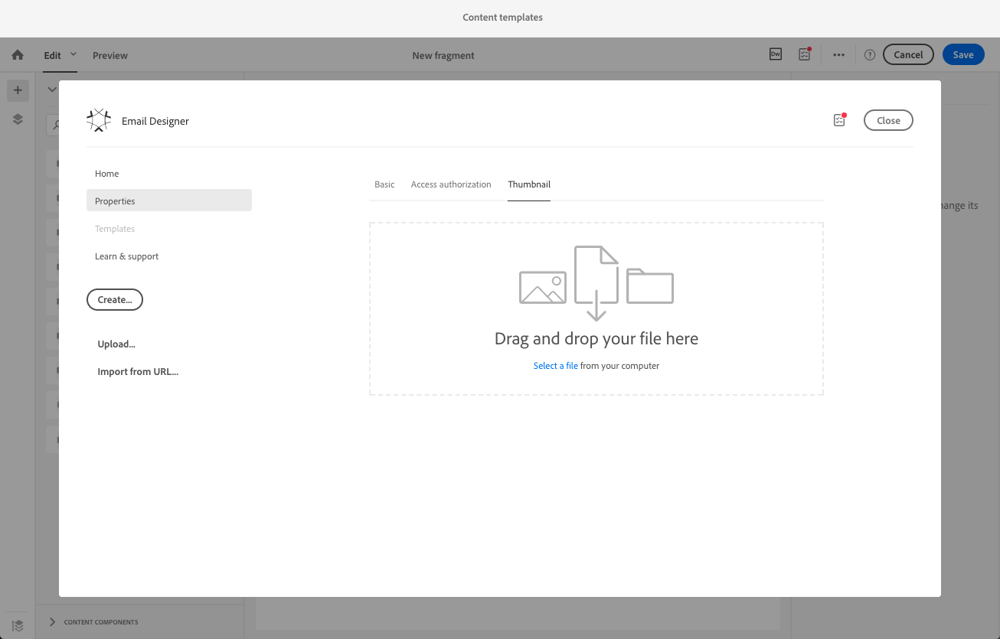

# Criar e usar conteúdo reutilizável {#using-reusable-content}

Saiba como principal a edição de conteúdo de email. Com o Email Designer, você pode criar modelos e fragmentos com seu próprio conteúdo predefinido e reutilizá-los para os seguintes deliveries.

## Criar emails usando modelos {#designing-templates}

>[!NOTE]
>
> No Adobe Campaign Standard, você pode criar diferentes tipos de modelos acessíveis a partir do menu **Resources** > **Templates**. Os modelos usados no Designer de email são Modelos de conteúdo. Para obter mais informações, consulte [Sobre templates](../../start/using/marketing-activity-templates.md).

 [Descubra como criar modelos em vídeo](#video)

### Sobre templates de conteúdo {#content-templates}

Você pode gerenciar o conteúdo HTML oferecido na guia **[!UICONTROL Templates]** da página inicial do [Email Designer](../../designing/using/designing-content-in-adobe-campaign.md).

Os modelos de conteúdo de email prontos para uso incluem dezoito layouts otimizados para dispositivos móveis e quatro melhores modelos responsivos projetados pelos artistas do Behance. Elas correspondem aos usos mais atuais, como mensagens de boas-vindas ao cliente, informativos e emails de reengajamento, entre outros. Eles podem ser facilmente personalizados com o conteúdo de suas marcas para facilitar o processo de criação de emails do zero.

Os templates de conteúdo HTML podem ser acessados na tela **[!UICONTROL Resources]** > **[!UICONTROL Content templates & fragments]** do [Menu avançado](../../start/using/interface-description.md#advanced-menu). A partir daí, é possível gerenciar modelos de conteúdo de página de aterrissagem, modelos de conteúdo de email e também fragmentos.

Os templates de conteúdo prontos para uso são somente leitura. Para editar um deles, primeiro você deve duplicar o template desejado.

Você pode criar novos modelos ou fragmentos e definir seu próprio conteúdo. Para obter mais informações, consulte [Criação de um modelo de conteúdo](#creating-a-content-template) e [Criação de um fragmento de conteúdo](#creating-a-content-fragment).

Ao editar o conteúdo com o Designer de email, também é possível criar modelos de conteúdo salvando o conteúdo como fragmento ou modelo. Para obter mais informações, consulte [Salvar conteúdo como modelo](#saving-content-as-template) e [Salvar conteúdo como fragmento](../../designing/using/using-reusable-content.md#saving-content-as-a-fragment).

**Tópicos relacionados:**

* Para obter mais informações sobre edição de conteúdo, consulte [Sobre design de conteúdo de email](../../designing/using/designing-content-in-adobe-campaign.md).

### Criação de um template de conteúdo {#creating-a-content-template}

Você pode criar seus próprios modelos de conteúdo para usá-los quantas vezes forem necessárias.

O exemplo a seguir mostra como criar um template de conteúdo de email.

1. Vá para **[!UICONTROL Resources]** > **[!UICONTROL Content templates & fragments]** e clique em **[!UICONTROL Create]**.
1. Clique no rótulo do email para acessar a guia **[!UICONTROL Properties]** do Designer de email.
1. Especifique um rótulo reconhecível e selecione os seguintes parâmetros para usar este modelo em emails:

   * Selecione **[!UICONTROL Shared]** ou **[!UICONTROL Delivery]** na lista suspensa **[!UICONTROL Content type]**.
   * Selecione **[!UICONTROL Template]** na lista suspensa **[!UICONTROL HTML type]**.

   

1. Se necessário, é possível definir uma imagem que será usada como miniatura do modelo. Selecione-o na guia **[!UICONTROL Thumbnail]** das propriedades do modelo.

   

   Essa miniatura será exibida na guia **[!UICONTROL Templates]** da página inicial do [Email Designer](../../designing/using/designing-content-in-adobe-campaign.md).

1. Feche a guia **[!UICONTROL Properties]** para retornar ao espaço de trabalho principal.
1. Adicione componentes de estrutura e componentes de conteúdo que você pode personalizar conforme necessário.
   >[!NOTE]
   >
   > Não é possível inserir campos de personalização ou conteúdo condicional dentro de um template de conteúdo.
1. Depois de editado, salve o template.

Esse modelo agora pode ser usado em qualquer email criado com o Designer de email. Selecione na guia **[!UICONTROL Templates]** da página inicial do [Email Designer](../../designing/using/designing-content-in-adobe-campaign.md).

### Salvar conteúdo como modelo {#saving-content-as-template}

Ao editar um email com o Designer de email, você pode salvar diretamente o conteúdo desse email como modelo.

<!--[!CAUTION]
>
>You cannot save as template a structure containing personalization fields or dynamic content.-->

1. Selecione **[!UICONTROL Save as template]** na barra de ferramentas principal do Designer de email.

   

1. Adicione um rótulo e uma descrição, se necessário, e clique em **[!UICONTROL Save]**.

   

1. Para encontrar o modelo que acabou de criar, vá para **[!UICONTROL Resources]** > **[!UICONTROL Content templates & fragments]**.

1. Para usar seu novo modelo, selecione-o na guia **[!UICONTROL Templates]** da página inicial do [Email Designer](../../designing/using/designing-content-in-adobe-campaign.md).

   

### Criação de um modelo com fragmentos e componentes {#template-fragments-components}

Agora é possível criar um modelo de email com o Designer de email. Use componentes de conteúdo para refletir as diferentes seções do seu email e ajuste as configurações para torná-las o mais próximo possível do seu informativo original. Finalmente, insira os fragmentos que você acabou de criar.

1. Usando o Designer de email, crie um modelo. Para obter mais informações, consulte [Modelos de conteúdo](#content-templates).
1. Insira vários componentes de estrutura no modelo - correspondente ao cabeçalho, rodapé e corpo do email. Para obter mais informações sobre como adicionar componentes de estrutura, consulte [Edição da estrutura do email com o Designer de email](../../designing/using/designing-from-scratch.md#defining-the-email-structure).
1. Insira quantos componentes de conteúdo forem necessários para criar o corpo do informativo. Esse será o conteúdo editável do seu email que você atualizará todo mês.

   

   Se você estiver familiarizado com o código HTML, o Adobe recomenda o aproveitamento de componentes **[!UICONTROL Html]** onde é possível copiar e colar os elementos mais complexos do email original. Use outros componentes, como **[!UICONTROL Button]**, **[!UICONTROL Image]** ou **[!UICONTROL Text]** para o restante do conteúdo. Para obter mais informações, consulte [Sobre componentes de conteúdo](../../designing/using/designing-from-scratch.md#about-content-components).

   >[!NOTE]
   >
   >Usar o componente **[!UICONTROL Html]** resulta na criação de componentes que são editáveis com opções limitadas. Certifique-se de saber como lidar com o código HTML antes de selecionar esse componente.

1. Ajuste os componentes de conteúdo para corresponder ao seu email original o máximo possível.

   

   Para obter mais informações sobre gerenciamento de configurações de estilo e atributos em linha, consulte [Edição de estilos de email](../../designing/using/styles.md).

1. Insira os dois fragmentos (cabeçalho e rodapé) que você criou anteriormente nos componentes de estrutura desejados.

   

1. Salve o template.

Agora é possível gerenciar totalmente esse modelo no Designer de email para criar e atualizar o informativo que você enviará mensalmente para seus destinatários.

Para usá-lo, crie um email e selecione o template de conteúdo que você acabou de criar.

**Tópicos relacionados**:

* [Criar email](../../channels/using/creating-an-email.md)
* [Vídeo de introdução ao Email Designer](../../designing/using/designing-content-in-adobe-campaign.md#video)
* [Criar um conteúdo de email do zero](../../designing/using/designing-from-scratch.md#designing-an-email-content-from-scratch)

### Vídeo tutorial {#video}

Estes vídeos mostram como criar seu próprio modelo.

>[!VIDEO](https://video.tv.adobe.com/v/23106?quality=12)

Os vídeos de instruções adicionais do Campaign Standard estão disponíveis [aqui](https://experienceleague.adobe.com/docs/campaign-standard-learn/tutorials/overview.html?lang=pt-BR).

## Sobre fragmentos {#about-fragments}

>[!CONTEXTUALHELP]
>id="ac_fragments"
>title="Sobre fragmentos"
>abstract="Um fragmento é um bloco de conteúdo reutilizável que pode ser referenciado em um ou mais emails."

Um fragmento é um componente reutilizável que pode ser referenciado em um ou mais emails.
Eles podem ser encontrados na interface em **Resources** > **Content fragments and templates**.

Para fazer o melhor uso dos fragmentos no Designer de email:

* Crie seus próprios fragmentos. Consulte [Criação de um fragmento de conteúdo](#creating-a-content-fragment) e [Salvar conteúdo como um fragmento](#saving-content-as-a-fragment).
* Use-os quantas vezes forem necessárias em seus emails. Consulte [Inserir elementos em um email](#inserting-elements-into-an-email).
* Ao editar um fragmento, as alterações são sincronizadas: eles são propagados automaticamente para todos os emails (desde que ainda não tenham sido preparados ou enviados) que contêm esse fragmento.

Quando adicionados a um email, os fragmentos são bloqueados por padrão. Se quiser modificar um fragmento para um email específico, é possível interromper a sincronização com o fragmento original desbloqueando-o no email em que é usado. As alterações não serão mais sincronizadas.

Para desbloquear um fragmento dentro de um email, selecione-o e clique no ícone de bloqueio na barra de ferramentas contextual.

Esse fragmento se torna um componente independente que não está mais vinculado ao fragmento original. Ele pode ser editado como qualquer outro componente de conteúdo. Consulte [Sobre componentes de conteúdo](../../designing/using/designing-from-scratch.md#about-content-components).

### Inserir fragmentos em um email {#inserting-elements-into-an-email}

Para definir o conteúdo do seu email, você pode adicionar elementos de conteúdo nos componentes de estrutura que você colocou anteriormente. Consulte [Edição da estrutura do email](../../designing/using/designing-from-scratch.md#defining-the-email-structure).

1. Acesse os elementos de conteúdo selecionando o ícone **+** à esquerda. Selecione [Fragmentos](#about-fragments) ou [Componentes de conteúdo](../../designing/using/designing-from-scratch.md#about-content-components).
1. Se já souber o rótulo ou parte do rótulo do fragmento que deseja adicionar, procure-o.

   

1. Arraste e solte um fragmento ou componente de conteúdo da paleta em um componente de estrutura do email.

   

   Depois que um elemento é adicionado ao email, ele pode ser movido dentro do componente de estrutura ou para outro componente de estrutura no email.

   

1. Edite o elemento para corresponder às necessidades exatas deste email. Você pode adicionar texto, links, imagens e assim por diante.

   >[!NOTE]
   >
   >Os fragmentos são bloqueados por padrão quando adicionados a um email. Você pode quebrar a sincronização com o fragmento original se quiser modificar o fragmento para um email específico ou fazer a alteração diretamente no fragmento. Consulte [Sobre fragmentos](#about-fragments).

1. Repita esse procedimento para todos os elementos que você precisa adicionar ao seu email.
1. Salve seu email.

Agora que sua estrutura de email está preenchida, você pode editar o estilo de cada elemento de conteúdo. Consulte [Editar um elemento](../../designing/using/styles.md).

>[!NOTE]
>
>Se um fragmento for modificado, as alterações serão propagadas automaticamente nos emails em que forem usadas. Para obter mais informações, consulte [Sobre fragmentos](#about-fragments).

### Criação de um fragmento de conteúdo {#creating-a-content-fragment}

Você pode criar seus próprios fragmentos de conteúdo para usá-los conforme necessário em um ou mais emails.

1. Vá para **[!UICONTROL Resources]** > **[!UICONTROL Content templates & fragments]** e clique em **[!UICONTROL Create]**.
1. Clique no rótulo do email para acessar a guia **[!UICONTROL Properties]** do Designer de email.
1. Especifique um rótulo reconhecível e selecione os seguintes parâmetros para localizar o fragmento ao editar o conteúdo de email:

   * Como os fragmentos são compatíveis apenas com emails, selecione **[!UICONTROL Delivery]** na lista suspensa **[!UICONTROL Content type]**.
   * Selecione **[!UICONTROL Fragment]** na lista suspensa **[!UICONTROL HTML type]** para poder usar esse conteúdo como um fragmento.

   

1. Se necessário, é possível definir uma imagem que será usada como miniatura do fragmento. Selecione-o na guia **[!UICONTROL Thumbnail]** das propriedades do modelo.

   

   Essa miniatura será exibida ao lado do rótulo do fragmento ao editar um email.

1. Feche a guia **[!UICONTROL Properties]** para retornar ao espaço de trabalho principal.
1. Adicione componentes de estrutura e componentes de conteúdo que você pode personalizar conforme necessário.

   >[!CAUTION]
   >
   >Os fragmentos não podem incluir campos de personalização, conteúdo dinâmico ou outro fragmento.
   >
   >Evite salvar como um conteúdo de fragmento com componentes de estrutura vazios. Uma vez inserido o fragmento, ele não será editável.
   >
   >A [visualização móvel](../../designing/using/plain-text-html-modes.md#switching-to-mobile-view) não está disponível em fragmentos.

1. Depois de editado, salve o fragmento.

Esse fragmento agora pode ser usado em qualquer email criado com o Designer de email. Ela é exibida na seção **[!UICONTROL Fragments]** da Paleta.

>[!NOTE]
>
>Não é possível inserir campos de personalização dentro de um fragmento, a menos que ele seja usado em um email e desbloqueado. Consulte [Sobre fragmentos](#about-fragments).

### Salvar conteúdo como um fragmento {#saving-content-as-a-fragment}

Ao editar um email com o Designer de email, você pode salvar diretamente parte desse email como um fragmento.

* Não é possível salvar como fragmento uma estrutura contendo campos de personalização, conteúdo dinâmico ou outro fragmento.
* Você só pode selecionar estruturas adjacentes umas às outras.
<!-- - You cannot select an empty structure.-->

1. Ao editar um email no Designer de email, selecione **[!UICONTROL Save as fragment]** na barra de ferramentas principal.

   

1. No espaço de trabalho, selecione as estruturas que comporão o fragmento.

   

   >[!NOTE]
   >
   >Selecione as estruturas adjacentes que não incluem campos de personalização, conteúdo dinâmico ou outro fragmento.
   <!--You cannot select an empty structure.-->

1. Clique em **[!UICONTROL Create]**.

1. Adicione um rótulo e uma descrição, se necessário, e clique em **[!UICONTROL Save]**.

   

1. Para encontrar o fragmento que acabou de criar, vá para **[!UICONTROL Resources]** > **[!UICONTROL Content templates & fragments]**.

   

1. Para usar o novo fragmento, abra qualquer conteúdo de email e selecione-o na lista de fragmentos.

>[!NOTE]
>A [visualização móvel](../../designing/using/plain-text-html-modes.md#switching-to-mobile-view) não está disponível em fragmentos. Se quiser editar uma visualização móvel de email, faça isso antes de salvar o conteúdo como um fragmento.

<!--You need to copy-paste the HTML corresponding to the section that you want to save into a new fragment.

>[!NOTE]
>
>To do this, you need to be familiar with HTML code.

To save as a fragment some email content that you created, follow the steps below.

1. When editing an email in the Email Designer, select **[!UICONTROL Edit]** > **[!UICONTROL HTML]** to open the HTML version of that email.
1. Select and copy the HTML corresponding to the part that you want to save.
1. Go to **[!UICONTROL Resources]** > **[!UICONTROL Content templates & fragments]** and click **[!UICONTROL Create]**.
1. Click the email label to access the **[!UICONTROL Properties]** tab of the Email Designer and select **[!UICONTROL Fragment]** from the **[!UICONTROL HTML type]** drop-down list.
1. Select **[!UICONTROL Edit]** > **[!UICONTROL HTML]** to open the HTML version of the fragment.
1. Paste the HTML that you copied where appropriate.
1. Switch back to the **[!UICONTROL Edit]** view to check the result and save the new fragment.-->

## Criação de cabeçalhos e rodapés reutilizáveis usando fragmentos {#header-footer-fragments}

Usando o Designer de email, crie um fragmento para cada seção reutilizável. Neste exemplo, você criará dois fragmentos: um para o cabeçalho e um para o rodapé. Em seguida, é possível copiar as partes relevantes do conteúdo existente nesses fragmentos.

Para fazer isso, siga as etapas abaixo:

1. No Adobe Campaign, vá para **[!UICONTROL Resources]** > **[!UICONTROL Content templates & fragments]** e crie um fragmento para o cabeçalho. Para obter mais informações, consulte [Criação de um fragmento de conteúdo](#creating-a-content-fragment).
1. Adicione quantos componentes da estrutura forem necessários ao seu fragmento.

   

1. Insira componentes de imagem e texto na estrutura.

   

1. Carregue a imagem correspondente, insira o texto e ajuste as configurações.

   

1. Salve o fragmento.
1. Continue de forma semelhante para criar o rodapé e salvá-lo.

   

Seus fragmentos agora estão prontos para serem usados em um modelo.
