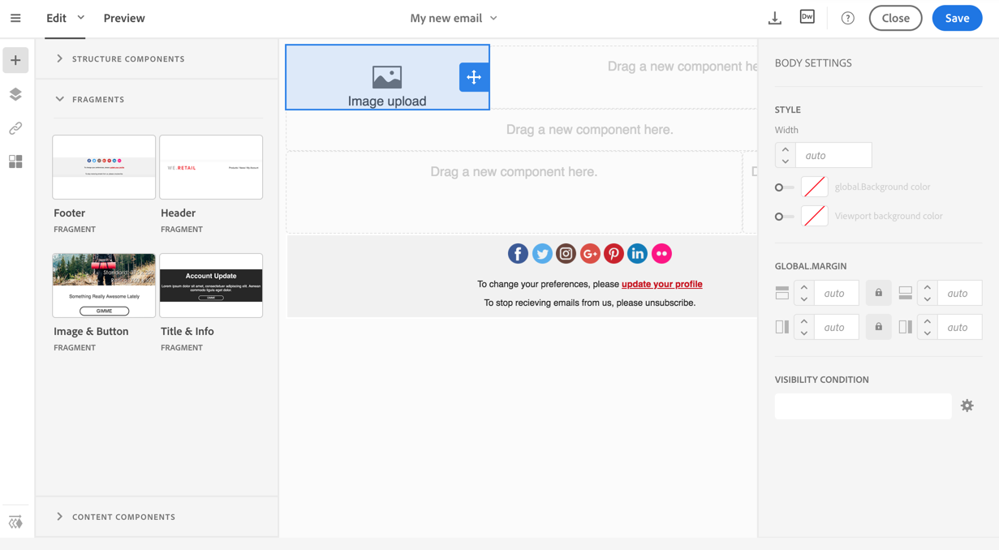

# Criação e uso de conteúdo reutilizável {#using-reusable-content}

Saiba como dominar a edição de conteúdo de email. Com o Designer de email, você pode criar modelos e fragmentos com seu próprio conteúdo predefinido e reutilizá-los para os próximos deliveries.

## Criar emails usando modelos {#designing-templates}

>[!NOTE]
>
> No Adobe Campaign Standard, você pode criar diferentes tipos de modelos acessíveis no **Recursos** > **Modelos** menu. Os modelos usados no Designer de email são modelos de Conteúdo. Para obter mais informações, consulte [Sobre modelos](../../start/using/marketing-activity-templates.md).

 [Saiba como criar modelos em vídeo](#video)

### Sobre modelos de conteúdo {#content-templates}

Você pode gerenciar o conteúdo de HTML que é oferecido no **[!UICONTROL Templates]** guia do [Email Designer](../../designing/using/designing-content-in-adobe-campaign.md) página inicial.

Os modelos de conteúdo de email prontos para uso incluem dezoito layouts otimizados para dispositivos móveis e quatro dos melhores modelos responsivos criados por artistas do Behance. Eles correspondem aos usos mais atuais, como mensagens de boas-vindas de clientes, boletins informativos e emails de reengajamento, entre outros. Elas podem ser facilmente personalizadas com o conteúdo de suas marcas para facilitar o processo de criação de emails do zero.

Os templates de conteúdo de HTML podem ser acessados no **[!UICONTROL Resources]** > **[!UICONTROL Content templates & fragments]** tela do [Menu avançado](../../start/using/interface-description.md#advanced-menu). A partir daí, você pode gerenciar modelos de conteúdo de páginas de aterrissagem, modelos de conteúdo de email e também fragmentos.

Os templates de conteúdo prontos para uso são somente leitura. Para editar um deles, primeiro duplique o template desejado.

Você pode criar novos modelos ou fragmentos e definir seu próprio conteúdo. Para obter mais informações, consulte [Criação de um template de conteúdo](#creating-a-content-template) e [Criação de um fragmento de conteúdo](#creating-a-content-fragment).

Ao editar conteúdo com o Designer de email, você também pode criar modelos de conteúdo salvando seu conteúdo como fragmento ou modelo. Para obter mais informações, consulte [Salvar conteúdo como modelo](#saving-content-as-template) e [Salvar conteúdo como fragmento](../../designing/using/using-reusable-content.md#saving-content-as-a-fragment).

**Tópicos relacionados:**

* Para obter mais informações sobre edição de conteúdo, consulte [Sobre o design de conteúdo de email](../../designing/using/designing-content-in-adobe-campaign.md).

### Criação de um template de conteúdo {#creating-a-content-template}

Você pode criar seus próprios modelos de conteúdo para usá-los quantas vezes forem necessárias.

O exemplo a seguir mostra como criar um template de conteúdo de email.

1. Ir para **[!UICONTROL Resources]** > **[!UICONTROL Content templates & fragments]** e clique em **[!UICONTROL Create]**.
1. Clique no rótulo do email para acessar a **[!UICONTROL Properties]** do Designer de email.
1. Especifique um rótulo reconhecível e selecione os seguintes parâmetros para poder usar esse modelo em emails:

   * Selecionar **[!UICONTROL Shared]** ou **[!UICONTROL Delivery]** do **[!UICONTROL Content type]** lista suspensa.
   * Selecionar **[!UICONTROL Template]** do **[!UICONTROL HTML type]** lista suspensa.

   

1. Se necessário, você pode definir uma imagem que será usada como miniatura do modelo. Selecione-o no **[!UICONTROL Thumbnail]** das propriedades do template.

   

   Esta miniatura será exibida no **[!UICONTROL Templates]** guia do [Email Designer](../../designing/using/designing-content-in-adobe-campaign.md) página inicial.

1. Feche o **[!UICONTROL Properties]** para retornar ao espaço de trabalho principal.
1. Adicione componentes de estrutura e componentes de conteúdo que podem ser personalizados conforme necessário.
   >[!NOTE]
   >
   > Não é possível inserir campos de personalização ou conteúdo condicional dentro de um template de conteúdo.
1. Depois de editado, salve o template.

Esse modelo agora pode ser usado em qualquer email criado com o Designer de email. Selecione-o no **[!UICONTROL Templates]** guia do [Email Designer](../../designing/using/designing-content-in-adobe-campaign.md) página inicial.

### Salvar conteúdo como modelo {#saving-content-as-template}

Ao editar um email com o Designer de email, você pode salvar diretamente o conteúdo desse email como um modelo.

<!--[!CAUTION]
>
>You cannot save as template a structure containing personalization fields or dynamic content.-->

1. Selecionar **[!UICONTROL Save as template]** na barra de ferramentas principal do Designer de email.

   

1. Adicione um rótulo e uma descrição, se necessário, e clique em **[!UICONTROL Save]**.

   

1. Para localizar o modelo que acabou de criar, acesse **[!UICONTROL Resources]** > **[!UICONTROL Content templates & fragments]**.

1. Para usar o novo modelo, selecione-o na caixa suspensa **[!UICONTROL Templates]** guia do [Email Designer](../../designing/using/designing-content-in-adobe-campaign.md) página inicial.

   

### Criação de um modelo com fragmentos e componentes {#template-fragments-components}

Agora você pode criar um modelo de email com o Designer de email. Use componentes de conteúdo para refletir as diferentes seções do seu email e ajuste as configurações para deixá-los o mais próximo possível do seu informativo original. Por fim, insira os fragmentos que você acabou de criar.

1. Usando o Designer de email, crie um modelo. Para obter mais informações, consulte [Modelos de conteúdo](#content-templates).
1. Insira vários componentes de estrutura no modelo - correspondendo ao cabeçalho, rodapé e corpo do email. Para obter mais informações sobre a adição de componentes de estrutura, consulte [Edição da estrutura de email com o Designer de email](../../designing/using/designing-from-scratch.md#defining-the-email-structure).
1. Insira quantos componentes de conteúdo forem necessários para criar o corpo do informativo. Esse será o conteúdo editável do seu email que você atualizará todos os meses.

   

   Se você estiver familiarizado com o código HTML, o Adobe recomenda aproveitar **[!UICONTROL Html]** componentes em que você pode copiar e colar os elementos mais complexos do email original. Use outros componentes, como **[!UICONTROL Button]**, **[!UICONTROL Image]** ou **[!UICONTROL Text]** para o restante do conteúdo. Para obter mais informações, consulte [Sobre componentes de conteúdo](../../designing/using/designing-from-scratch.md#about-content-components).

   >[!NOTE]
   >
   >Usar o **[!UICONTROL Html]** componente resulta na criação de componentes editáveis com opções limitadas. Certifique-se de saber como lidar com o código HTML antes de selecionar este componente.

1. Ajuste os componentes de conteúdo para corresponder ao seu email original o máximo possível.

   

   Para obter mais informações sobre como gerenciar configurações de estilo e atributos em linha, consulte [Edição de estilos de email](../../designing/using/styles.md).

1. Insira os dois fragmentos (cabeçalho e rodapé) criados anteriormente nos componentes da estrutura desejados.

   

1. Salve o template.

Agora é possível gerenciar totalmente esse template no Designer de email para criar e atualizar o informativo que você enviará mensalmente para os recipients.

Para usá-lo, crie um email e selecione o template de conteúdo que você acabou de criar.

**Tópicos relacionados**:

* [Criação de um email](../../channels/using/creating-an-email.md)
* [Vídeo de introdução ao Email Designer](../../designing/using/designing-content-in-adobe-campaign.md#video)
* [Criar um conteúdo de email do zero](../../designing/using/designing-from-scratch.md#designing-an-email-content-from-scratch)

### Tutorial em vídeo {#video}

Estes vídeos mostram como criar seu próprio modelo.

>[!VIDEO](https://video.tv.adobe.com/v/23106?quality=12)

Vídeos extras explicativos sobre o Campaign Standard estão disponíveis [aqui](https://experienceleague.adobe.com/docs/campaign-standard-learn/tutorials/overview.html?lang=pt-BR).

## Sobre fragmentos {#about-fragments}

>[!CONTEXTUALHELP]
>id="ac_fragments"
>title="Sobre fragmentos"
>abstract="Um fragmento é um bloco de conteúdo reutilizável que pode ser referenciado em um ou mais emails."

Um fragmento é um componente reutilizável que pode ser referenciado em um ou mais emails.
Eles podem ser encontrados na interface em **Recursos** > **Fragmentos de conteúdo e modelos**.

Para aproveitar ao máximo os fragmentos no Designer de email:

* Crie seus próprios fragmentos. Consulte [Criação de um fragmento de conteúdo](#creating-a-content-fragment) e [Salvar conteúdo como um fragmento](#saving-content-as-a-fragment).
* Use-os quantas vezes forem necessárias em seus emails. Consulte [Inserir elementos em um email](#inserting-elements-into-an-email).
* Ao editar um fragmento, as alterações são sincronizadas: elas são propagadas automaticamente para todos os emails (desde que ainda não tenham sido preparados ou enviados) que contenham esse fragmento.

Quando adicionados a um email, os fragmentos são bloqueados por padrão. Se quiser modificar um fragmento para um email específico, você pode interromper a sincronização com o fragmento original desbloqueando-o no email em que é usado. As alterações não serão mais sincronizadas.

Para desbloquear um fragmento dentro de um email, selecione-o e clique no ícone de bloqueio na barra de ferramentas contextual.

Esse fragmento se torna um componente independente que não é mais vinculado ao fragmento original. Ele pode ser editado como qualquer outro componente de conteúdo. Consulte [Sobre componentes de conteúdo](../../designing/using/designing-from-scratch.md#about-content-components).

### Inserir fragmentos em um email {#inserting-elements-into-an-email}

Para definir o conteúdo do seu email, você pode adicionar elementos de conteúdo nos componentes da estrutura inseridos anteriormente. Consulte [Edição da estrutura do email](../../designing/using/designing-from-scratch.md#defining-the-email-structure).

1. Acesse os elementos de conteúdo selecionando o **+** ícone à esquerda. Selecionar [Fragmentos](#about-fragments) ou [Componentes do conteúdo](../../designing/using/designing-from-scratch.md#about-content-components).
1. Se já souber o rótulo ou parte do rótulo do fragmento que deseja adicionar, você pode pesquisá-lo.

   

1. Arraste e solte um componente de fragmento ou conteúdo da paleta para um componente de estrutura do email.

   

   Depois que um elemento é adicionado ao email, ele pode ser movido para dentro do componente de estrutura ou para outro componente de estrutura no email.

   

1. Edite o elemento para corresponder às necessidades exatas desse email. Você pode adicionar texto, links, imagens e assim por diante.

   >[!NOTE]
   >
   >Os fragmentos são bloqueados por padrão quando adicionados a um email. Você pode interromper a sincronização com o fragmento original se quiser modificar o fragmento para um email específico ou fazer a alteração diretamente no fragmento. Consulte [Sobre fragmentos](#about-fragments).

1. Repita esse procedimento para todos os elementos que precisam ser adicionados ao email.
1. Salve o email.

Agora que sua estrutura de email está preenchida, você pode editar o estilo de cada elemento de conteúdo. Consulte [Editar um elemento](../../designing/using/styles.md).

>[!NOTE]
>
>Se um fragmento for modificado, as alterações serão propagadas automaticamente nos emails em que é usado. Para obter mais informações, consulte [Sobre fragmentos](#about-fragments).

### Criação de um fragmento de conteúdo {#creating-a-content-fragment}

Você pode criar seus próprios fragmentos de conteúdo para usá-los conforme necessário em um ou mais emails.

1. Ir para **[!UICONTROL Resources]** > **[!UICONTROL Content templates & fragments]** e clique em **[!UICONTROL Create]**.
1. Clique no rótulo do email para acessar a **[!UICONTROL Properties]** do Designer de email.
1. Especifique um rótulo reconhecível e selecione os seguintes parâmetros para localizar o fragmento ao editar o conteúdo de email:

   * Como os fragmentos são compatíveis somente com emails, selecione **[!UICONTROL Delivery]** do **[!UICONTROL Content type]** lista suspensa.
   * Selecionar **[!UICONTROL Fragment]** do **[!UICONTROL HTML type]** para poder usar esse conteúdo como um fragmento.

   

1. Se necessário, você pode definir uma imagem que será usada como miniatura do fragmento. Selecione-o no **[!UICONTROL Thumbnail]** das propriedades do template.

   

   Esta miniatura será exibida ao lado do rótulo do fragmento ao editar um email.

1. Feche o **[!UICONTROL Properties]** para retornar ao espaço de trabalho principal.
1. Adicione componentes de estrutura e componentes de conteúdo que podem ser personalizados conforme necessário.

   >[!CAUTION]
   >
   >Os fragmentos não podem incluir campos de personalização, conteúdo dinâmico ou outro fragmento.
   >
   >Evite salvar como um conteúdo de fragmento com componentes de estrutura vazios. Depois que o fragmento >for inserido, ele não poderá ser editado.
   >
   >A variável [visualização móvel](../../designing/using/plain-text-html-modes.md#switching-to-mobile-view) não está disponível em fragmentos.

1. Após editar, salve o fragmento.

Esse fragmento agora pode ser usado em qualquer email criado com o Designer de email. Aparece sob o título **[!UICONTROL Fragments]** seção da Paleta.

>[!NOTE]
>
>Não é possível inserir campos de personalização dentro de um fragmento, a menos que ele seja usado em um email e desbloqueado. Consulte [Sobre fragmentos](#about-fragments).

### Salvar conteúdo como um fragmento {#saving-content-as-a-fragment}

Ao editar um email com o Designer de email, você pode salvar diretamente parte desse email como um fragmento.

* Não é possível salvar como fragmento uma estrutura que contém campos de personalização, conteúdo dinâmico ou outro fragmento.
* Você só pode selecionar estruturas adjacentes entre si.
  <!-- - You cannot select an empty structure.-->

1. Ao editar um email no Designer de email, selecione **[!UICONTROL Save as fragment]** na barra de ferramentas principal.

   

1. No espaço de trabalho, selecione as estruturas que compõem o fragmento.

   

   >[!NOTE]
   >
   >Selecione estruturas adjacentes entre si que não incluam campos de personalização, conteúdo dinâmico ou outro fragmento.
   <!--You cannot select an empty structure.-->

1. Clique em **[!UICONTROL Create]**.

1. Adicione um rótulo e uma descrição, se necessário, e clique em **[!UICONTROL Save]**.

   

1. Para encontrar o fragmento recém-criado, acesse **[!UICONTROL Resources]** > **[!UICONTROL Content templates & fragments]**.

   

1. Para usar o novo fragmento, abra qualquer conteúdo de email e selecione-o na lista de fragmentos.

>[!NOTE]
>A variável [visualização móvel](../../designing/using/plain-text-html-modes.md#switching-to-mobile-view) não está disponível em fragmentos. Se quiser editar uma visualização de email para dispositivos móveis, faça-a antes de salvar o conteúdo como um fragmento.

<!--You need to copy-paste the HTML corresponding to the section that you want to save into a new fragment.

>[!NOTE]
>
>To do this, you need to be familiar with HTML code.

To save as a fragment some email content that you created, follow the steps below.

1. When editing an email in the Email Designer, select **[!UICONTROL Edit]** > **[!UICONTROL HTML]** to open the HTML version of that email.
1. Select and copy the HTML corresponding to the part that you want to save.
1. Go to **[!UICONTROL Resources]** > **[!UICONTROL Content templates & fragments]** and click **[!UICONTROL Create]**.
1. Click the email label to access the **[!UICONTROL Properties]** tab of the Email Designer and select **[!UICONTROL Fragment]** from the **[!UICONTROL HTML type]** drop-down list.
1. Select **[!UICONTROL Edit]** > **[!UICONTROL HTML]** to open the HTML version of the fragment.
1. Paste the HTML that you copied where appropriate.
1. Switch back to the **[!UICONTROL Edit]** view to check the result and save the new fragment.-->

## Criação de cabeçalhos e rodapés reutilizáveis usando fragmentos {#header-footer-fragments}

Usando o Designer de email, crie um fragmento para cada seção reutilizável. Neste exemplo, você criará dois fragmentos: um para o cabeçalho e um para o rodapé. Em seguida, você pode copiar as partes relevantes do conteúdo existente nesses fragmentos.

Para fazer isso, siga as etapas abaixo:

1. No Adobe Campaign, acesse **[!UICONTROL Resources]** > **[!UICONTROL Content templates & fragments]** e crie um fragmento para o cabeçalho. Para obter mais informações, consulte [Criação de um fragmento de conteúdo](#creating-a-content-fragment).
1. Adicione quantos componentes de estrutura forem necessários ao fragmento.

   

1. Insira componentes de imagem e texto na estrutura.

   

1. Carregue a imagem correspondente, insira o texto e ajuste as configurações.

   

1. Salve o fragmento.
1. Continue da mesma forma para criar seu rodapé e salvá-lo.

   

Seus fragmentos agora estão prontos para serem usados em um modelo.
