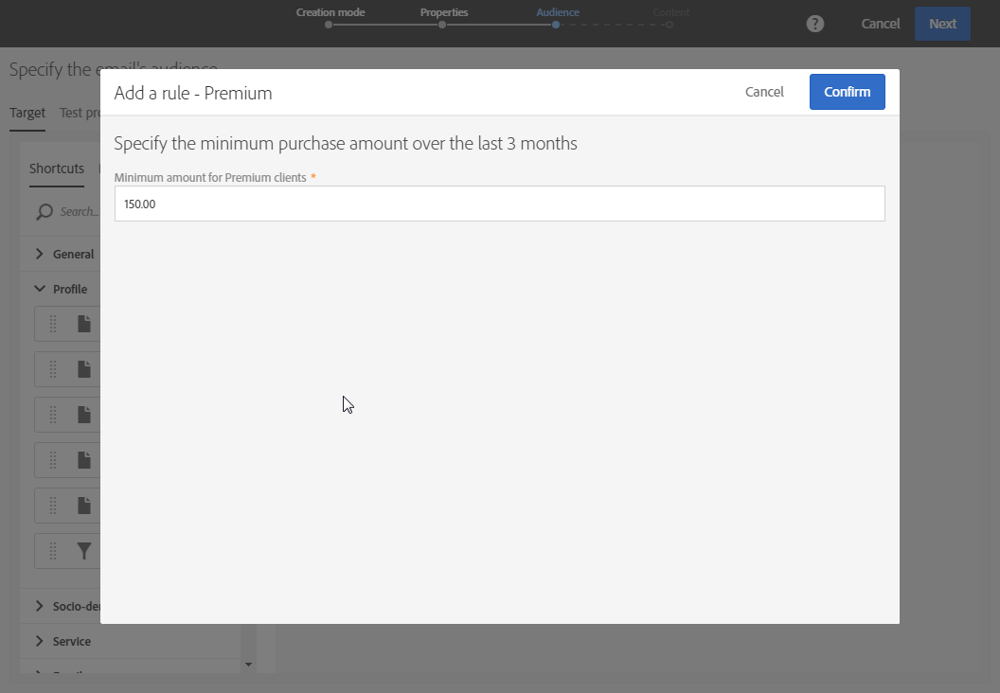

# Configuração da definição de filtro{#configuring-filter-definition}

Na guia **[!UICONTROL Filter definition]**, é possível criar filtros avançados que os usuários acessam diretamente ao criar consultas complexas, por exemplo, ao definir um público.

Essa etapa não é obrigatória, pois você ainda poderá preencher o recurso e acessar os dados por meio de workflows, público-alvo e API REST.

Esses filtros são usados no Editor de consultas na forma de regras pré-configuradas. Eles permitem limitar as etapas necessárias para obter a configuração desejada, o que pode ser particularmente útil para segmentações repetitivas.

Por exemplo, você pode criar um filtro que permita selecionar todas as transações maiores que um determinado valor nos últimos três meses.

Para isso, é necessário estender o recurso **[!UICONTROL Profiles]** e definir um filtro vinculado a uma tabela de transações (criada anteriormente) com uma regra indicando que o preço da transação deve ser maior ou igual a um parâmetro específico e que a data da transação deve estar dentro de um intervalo correspondente aos últimos três meses.

1. Crie e publique uma tabela de transações. Consulte [Criação ou extensão do recurso](../../developing/using/creating-or-extending-the-resource.md).

   >[!NOTE]
   >
   >Este procedimento usa o exemplo de uma tabela de transações personalizada. No seu caso, ajuste-a às suas necessidades comerciais.

1. Antes de definir um filtro relacionado à tabela de transações no recurso **[!UICONTROL Profiles]**, defina o link para essa tabela e publique suas alterações. Consulte [Definição de links com outros recursos](../../developing/using/configuring-the-resource-s-data-structure.md#defining-links-with-other-resources) e [Atualização da estrutura do banco de dados](../../developing/using/updating-the-database-structure.md).
1. Na guia **[!UICONTROL Definition]** da tela de definição do novo filtro, selecione a tabela de transações.

   

1. Na janela **[!UICONTROL Add a rule - Profiles/Transactions]**, arraste e solte a tabela de transações no espaço de trabalho. Na próxima janela exibida, selecione o campo que deseja usar.

   

1. Nas **[!UICONTROL Optional parameter settings]** da janela **[!UICONTROL Add a rule - Transactions]**, marque a caixa **[!UICONTROL Switch to parameters]**.

   Nas **[!UICONTROL Filter conditions]**, selecione o operador **[!UICONTROL Greater than or equal to]**. No campo **[!UICONTROL Parameters]**, insira um nome e clique no sinal de mais para criar o novo parâmetro.

   

1. Confirme as alterações. Essa definição corresponde a um campo configurável que o usuário deverá preencher posteriormente para executar o query.

   

1. Combine essa regra com outra especificando que a data da transação deve estar dentro de um intervalo correspondente aos últimos três meses.

   

1. Escolha a categoria em que o filtro será exibido.

   

1. Na guia **[!UICONTROL Parameters]** da tela de definição do filtro, modifique a descrição e o rótulo para indicar claramente o assunto do filtro para os usuários. Essas informações serão exibidas no Editor de consultas.

   

   Se você definir vários campos configuráveis, poderá modificar a ordem de exibição deles na interface.

1. Salve as alterações e publique os recursos. Para obter mais informações, consulte a seção [Atualização da estrutura do banco de dados](../../developing/using/updating-the-database-structure.md).

Assim que a extensão do recurso **[!UICONTROL Profiles]** for publicada, os usuários verão esse filtro na guia de atalhos da interface do [Editor de consultas](../../automating/using/editing-queries.md).

O usuário poderá definir facilmente o público ao criar um email para enviar a todos os clientes que gastaram mais do que um determinado valor nos últimos três meses.

Em vez de configurá-lo, eles precisarão apenas inserir o valor desejado na caixa de diálogo exibida.

Depois que um filtro é configurado, você pode usá-lo das APIs de Campaign Standard usando esta sintaxe:

`GET https://mc.adobe.io/<ORGANIZATION>/campaign/profileAndServicesExt/<resourceName>/by<customFilterName>?<customFilterparam>=<customFilterValue>`

Para obter mais informações, consulte a documentação [das APIs de](../../api/using/filtering.md#custom-filters)Campaign Standard.
