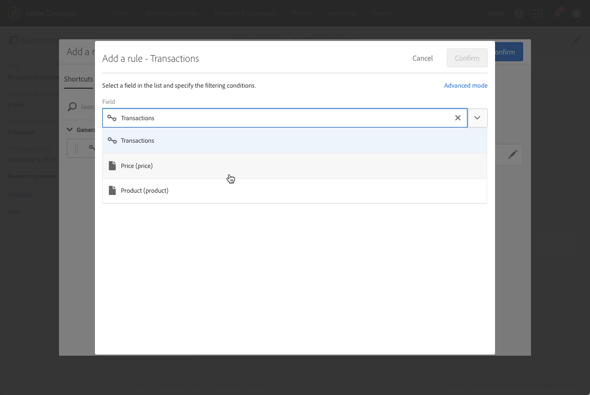

# Configuração da definição de filtro{#configuring-filter-definition}

Na **[!UICONTROL Filter definition]** guia, é possível criar filtros avançados que os usuários podem acessar diretamente ao criar query complexos, como ao definir uma audiência.

Esta etapa não é obrigatória, pois você ainda poderá preencher seu recurso e acessar seus dados por meio de workflows, audiência e REST API.

Esses filtros são usados no editor de query na forma de regras pré-configuradas. Elas permitem limitar o número de etapas necessárias para obter a configuração desejada, que pode ser particularmente benéfica para segmentações repetitivas.

Por exemplo, você pode criar um filtro que permite selecionar todas as transações maiores que um determinado valor nos últimos três meses.

Para fazer isso, é necessário estender o **[!UICONTROL Profiles]** recurso e definir um filtro vinculado a uma tabela de transação (criada anteriormente) com uma regra indicando que o preço da transação deve ser maior ou igual a um determinado parâmetro e que a data da transação deve estar dentro de um intervalo correspondente aos últimos três meses.

1. Certifique-se de criar e publicar uma tabela de transações. See [Creating or extending the resource](../../developing/using/creating-or-extending-the-resource.md).

   >[!NOTE]
   >
   >Este procedimento usa o exemplo de uma tabela de transação personalizada. Para o seu caso, ajuste-o às suas necessidades comerciais.

1. Antes de definir um filtro relacionado à tabela de transações no **[!UICONTROL Profiles]** recurso, certifique-se de definir o link para essa tabela e publicar suas alterações. Consulte [Definição de links com outros recursos](../../developing/using/configuring-the-resource-s-data-structure.md#defining-links-with-other-resources) e [Atualização da estrutura](../../developing/using/updating-the-database-structure.md)do banco de dados.
1. Na **[!UICONTROL Definition]** guia da tela de definição do novo filtro, selecione a tabela de transações.

   

1. Na **[!UICONTROL Add a rule - Profiles/Transactions]** janela, arraste e solte a tabela de transações no espaço de trabalho. Na próxima janela que é exibida, selecione o campo que deseja usar.

   

1. Na parte **[!UICONTROL Optional parameter settings]** da **[!UICONTROL Add a rule - Transactions]** janela, marque a **[!UICONTROL Switch to parameters]** caixa.

   No **[!UICONTROL Filter conditions]**, selecione o **[!UICONTROL Greater than or equal to]** operador. No **[!UICONTROL Parameters]** campo, digite um nome e clique no sinal de mais para criar o novo parâmetro.

   

1. Confirme suas alterações. Essa definição corresponde a um campo configurável que o usuário deve preencher posteriormente para executar o query.

   

1. Combine essa regra com outra regra especificando que a data da transação deve estar dentro de um intervalo correspondente aos últimos três meses.

   

1. Escolha a categoria na qual o filtro será exibido.

   

1. Na **[!UICONTROL Parameters]** guia da tela de definição do filtro, modifique a descrição e o rótulo para indicar claramente o assunto do filtro para os usuários. Essas informações serão exibidas no editor de query.

   

   Se você definir vários campos configuráveis, poderá modificar a ordem em que eles aparecem na interface.

1. Salve as alterações e publique os recursos. Para obter mais informações, consulte a seção [Atualização da estrutura](../../developing/using/updating-the-database-structure.md) do banco de dados.

Assim que a extensão de **[!UICONTROL Profiles]** recursos for publicada, os usuários verão esse filtro na guia atalhos na interface do editor [de](../../automating/using/editing-queries.md) query.

Isso permitirá que o usuário defina facilmente sua audiência ao criar um e-mail para enviar a todos os clientes que gastaram mais de uma determinada quantia nos últimos três meses.

Em vez de configurá-lo eles mesmos, eles precisam apenas digitar a quantidade desejada na caixa de diálogo exibida.

Depois que um filtro é configurado, você pode usá-lo das APIs de Campaign Standard usando esta sintaxe:

`GET https://mc.adobe.io/<ORGANIZATION>/campaign/profileAndServicesExt/<resourceName>/by<customFilterName>?<customFilterparam>=<customFilterValue>`

Para obter mais informações, consulte a documentação [das APIs de](../../api/using/filtering.md#custom-filters)Campaign Standard.
