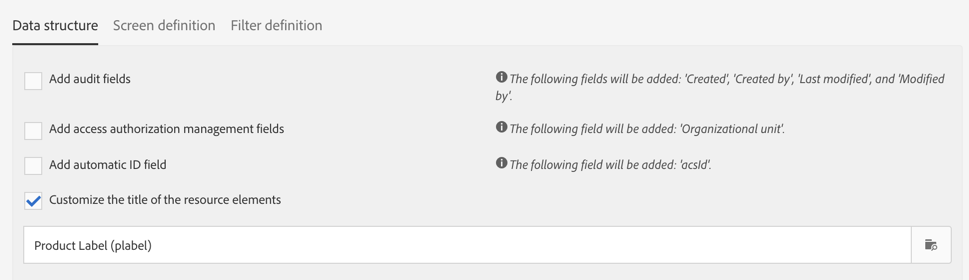

# Configuração da estrutura de dados do recurso{#configuring-the-resource-s-data-structure}

Depois de criar um novo recurso personalizado, você deve configurar a estrutura de dados.

Ao editar o recurso, na **[!UICONTROL Data structure]** guia, é possível adicionar:

* [Campos](#adding-fields-to-a-resource)
* [Teclas de identificação](#defining-identification-keys)
* [Índices](#defining-indexes)
* [Links](#defining-links-with-other-resources)
* [Envio de logs](#defining-sending-logs-extension)

## Adicionar campos a um recurso {#adding-fields-to-a-resource}

É possível adicionar novos campos a um recurso para armazenar dados que não fazem parte do modelo de dados predefinido.

1. Use o **[!UICONTROL Create element]** botão para criar um campo.
1. Especifique um rótulo, uma ID, um tipo de campo e defina o comprimento máximo autorizado para esse campo.

   O **[!UICONTROL ID]** campo é obrigatório e deve ser exclusivo para cada campo adicionado.

   >[!NOTE]
   >
   >Use no máximo 30 caracteres.

   

1. Para modificar um dos campos, marque o **[!UICONTROL Edit Properties]** botão.

   

1. Na **[!UICONTROL Field definition]** tela, é possível definir uma categoria que será usada para a audiência e a definição de metas ou até mesmo adicionar uma descrição.

   

1. Marque a **[!UICONTROL Specify a list of authorized values]** opção se precisar definir valores que serão oferecidos ao usuário (valores de lista discriminada).

   Em seguida, clique em **[!UICONTROL Create element]** e especifique um **[!UICONTROL Label]** e **[!UICONTROL Value]**. Adicione quantos valores forem necessários.

1. Depois de adicionar seus campos, marque a **[!UICONTROL Add audit fields]** caixa para incluir campos detalhando a data de criação, o usuário que criou o recurso, a data e o autor da última modificação.
1. Marque a **[!UICONTROL Add access authorization management fields]** caixa para incluir os campos que indicam quem tem direitos de acesso a esse recurso específico.

   Esses campos aparecem nos dados e metadados que podem ser exibidos depois que a atualização do banco de dados é realizada. Para obter mais informações, consulte a seção [Atualização da estrutura](../../developing/using/updating-the-database-structure.md) do banco de dados.

1. Marque o **[!UICONTROL Add automatic ID]** campo para gerar automaticamente uma ID. Observe que as entidades existentes permanecerão vazias. Para obter mais informações, consulte a seção [Geração de uma ID exclusiva para perfis e recursos](../../developing/using/configuring-the-resource-s-data-structure.md#generating-a-unique-id-for-profiles-and-custom-resources)personalizados.
1. Para modificar a forma como o nome dos elementos do recurso aparecerá nas etapas de listas e criação, marque a **[!UICONTROL Customize the title of the resource elements]** caixa. Selecione um campo dentre os que você criou para este recurso.

   

   >[!NOTE]
   >
   >Se você não marcar essa opção, a chave primária automática (que é criada automaticamente sempre que uma entidade é adicionada à tabela) será usada quando você lista todas as entidades desta tabela.

Os campos do seu recurso agora estão definidos.

## Definindo chaves de identificação {#defining-identification-keys}

Cada recurso deve ter pelo menos uma chave exclusiva. Por exemplo, você pode especificar uma chave para que dois produtos não possam ter a mesma ID em uma tabela de compra.

1. Especifique-o na **[!UICONTROL Automatic primary key]** seção o tamanho do armazenamento se desejar que uma chave técnica seja gerada automaticamente e incrementalmente.

   

1. Use o **[!UICONTROL Create element]** botão para criar uma tecla.

   Os campos **[!UICONTROL Label]** e **[!UICONTROL ID]** são preenchidos por padrão, mas você pode editá-los.

   >[!NOTE]
   >
   >Use no máximo 30 caracteres.

1. Para definir os elementos que compõem essa chave, clique **[!UICONTROL Create element]** e selecione os campos criados para esse recurso.

   

   As teclas criadas são exibidas na **[!UICONTROL Custom keys]** seção.

Suas chaves de identificação para o recurso agora são criadas.

>[!NOTE]
>
>Para saber mais sobre as práticas recomendadas ao criar chaves de identificação, consulte esta [seção](../../developing/using/data-model-best-practices.md#keys).

## Definindo índices {#defining-indexes}

Um índice pode fazer referência a um ou vários campos de recurso. Os índices permitem que o banco de dados classifique os registros para recuperá-los mais facilmente. Eles otimizam o desempenho de query SQL.

A definição de índices é recomendada, mas não é obrigatória.

1. Use o **[!UICONTROL Create element]** botão para criar um índice.

   

1. Os campos **[!UICONTROL Label]** e **[!UICONTROL ID]** são preenchidos por padrão, mas você pode editá-los.

   >[!NOTE]
   >
   >Use no máximo 30 caracteres.

1. Para definir os elementos que compõem esse índice, selecione os campos dos que você criou para esse recurso.

   

1. Clique em **[!UICONTROL Confirm]**.

Os índices criados aparecem na lista na seção **[!UICONTROL Index]** .

>[!NOTE]
>
>Para saber mais sobre as práticas recomendadas ao criar índices, consulte esta [seção](../../developing/using/data-model-best-practices.md#indexes).

## Definição de links com outros recursos {#defining-links-with-other-resources}

Um link detalha a associação que uma tabela tem com outras tabelas.

1. Use o **[!UICONTROL Create element]** botão para criar um link para um recurso de público alvo.
1. Clique em **[!UICONTROL Select a target resource]**.

   

1. Os recursos são mostrados em ordem alfabética e podem ser filtrados por nome. O nome técnico é exibido entre parênteses.

   Selecione um elemento na lista e clique em **[!UICONTROL Confirm]**.

   

1. Selecione o **[!UICONTROL Link type]** de acordo com a cardinalidade. Dependendo do tipo de cardinalidade selecionado, o comportamento se os registros forem excluídos ou duplicados pode variar.

   Os vários tipos de links são os seguintes:

   * **[!UICONTROL 1 cardinality simple link]**: uma ocorrência da tabela de origem pode ter no máximo uma ocorrência correspondente da tabela de públicos alvos.
   * **[!UICONTROL N cardinality collection link]**: uma ocorrência da tabela de origem pode ter várias ocorrências correspondentes da tabela de públicos alvos, mas uma ocorrência da tabela de públicos alvos pode ter no máximo uma ocorrência correspondente da tabela de origem.
   * **[!UICONTROL 0 or 1 cardinality simple link]**: uma ocorrência da tabela de origem pode ter no máximo uma ocorrência correspondente da tabela de públicos alvos ou nenhuma. Observe que esse tipo de problema **[!UICONTROL Link type]** pode causar problemas de desempenho.
   

1. Na **[!UICONTROL New link]** tela, os campos **[!UICONTROL Label]** e **[!UICONTROL ID]** são preenchidos por padrão, mas você pode editá-los.

   >[!NOTE]
   >
   >Use no máximo 30 caracteres.

   >[!IMPORTANT]
   >
   >Não é possível renomear um link após a criação. Para renomear um link, você deve excluí-lo e criá-lo novamente.

1. A **[!UICONTROL Category for the audience and targeting]** lista permite atribuir esse link a uma categoria, tornando-a mais visível na ferramenta do editor de query.
1. Se necessário, a **[!UICONTROL Reverse link definition]** seção permite exibir o rótulo e a ID do recurso no recurso direcionado.
1. Defina o comportamento dos registros referenciados pelo link na **[!UICONTROL Behavior if deleted/duplicated]** seção.

   Por padrão, o registro de públicos alvos será excluído assim que não for mais referenciado pelo link.

   

1. Na **[!UICONTROL Join definition]** seção, a opção padrão **[!UICONTROL Use the primary keys to make the join]** é selecionada, mas você pode escolher entre duas opções:

   * **[!UICONTROL Use the primary key to make the join]**: Essa definição de junção permite usar a chave primária de perfis para reconciliar com a chave primária de compras.
   * **[!UICONTROL Define specific join conditions]**: Essa definição de junção permite que você selecione manualmente os campos que unirão ambos os recursos. Observe que, se os dados não estiverem configurados corretamente, o registro **Compra** não estará visível.
   

Os links criados são exibidos na lista da seção **[!UICONTROL Links]** .

>[!NOTE]
>
>Para saber mais sobre as práticas recomendadas ao criar índices, consulte esta [seção](../../developing/using/data-model-best-practices.md#links).

**Exemplo: Vincular um recurso criado ao recurso &#39;Perfis&#39;**

Neste exemplo, queremos vincular uma nova **Compra** de recurso ao recurso personalizado **Perfis** :

1. Crie seu novo recurso de **Compra** .
1. Para vinculá-lo ao recurso personalizado de **Perfis** , desdobre a **[!UICONTROL Links]** seção na **[!UICONTROL Data structure]** guia e clique em **[!UICONTROL Create element]**.
1. Selecione o recurso do público alvo, aqui **[!UICONTROL Profiles (profile)]**.
1. Neste exemplo, mantenha o tipo padrão de **[!UICONTROL 1 cardinality simple link]** Link selecionado.

   

1. Escolha uma definição de junção, aqui mantenha o padrão **[!UICONTROL Use the primary key to make the join]**.

   

1. Se necessário, você pode definir uma tela de detalhes para poder editar **Compra** e vinculá-la a um perfil.

   Desdobre a **[!UICONTROL Detail screen configuration]** seção e marque a tela **[!UICONTROL Define a detail screen]** para configurar a tela que corresponde a cada elemento do recurso. Se você não marcar essa caixa, a visualização detalhada dos elementos deste recurso não estará acessível.

1. Clique em **[!UICONTROL Create element]**.
1. Selecione o recurso vinculado e clique em **[!UICONTROL Add]**.

   Seu novo recurso estará disponível no menu avançado selecionando **[!UICONTROL Client data]** > **[!UICONTROL Purchase]**.

   

1. Quando a configuração estiver concluída, clique em **[!UICONTROL Confirm]**.

   Agora você pode publicar seu novo recurso.

Ao adicionar esse link, uma guia **Compra** é adicionada à tela de detalhes perfis do menu **[!UICONTROL Profiles & audiences]** > **[!UICONTROL Profiles]** . Observe que isso é específico para o **[!UICONTROL Profile]** recurso.

## Definição da extensão de logs de envio {#defining-sending-logs-extension}

A extensão do log de envio permite:

* para estender os recursos dinâmicos do relatório ao **adicionar campos personalizados do perfil**
* para estender os dados dos registros de envio com os dados do **código de segmento e do perfil**

**Estender com um código de segmento**

O usuário pode estender os registros com o código de segmento vindo do motor de workflow.

O código de segmento deve ser definido no fluxo de trabalho.

Para ativar essa extensão, marque a opção **[!UICONTROL Add segment code]**.

Para obter mais informações sobre o código de segmento, consulte a seção [Segmentação](../../automating/using/segmentation.md) .

**Estender com um campo de perfil**

>[!NOTE]
>
>O administrador deve ter estendido o recurso de Perfil com um campo personalizado.

Clique **[!UICONTROL Add field]** e selecione qualquer campo personalizado no recurso do perfil.

Para gerar uma nova subdimensão vinculada à dimensão do Perfil, marque a **[!UICONTROL Add this field in Dynamic reporting as a new dimension]** opção.

No Relatórios dinâmico, é possível arrastar e soltar a dimensão de campo personalizado em uma tabela de forma livre.

Para obter mais informações sobre o Relatórios dinâmico, consulte a [Lista dos componentes](../../reporting/using/list-of-components-.md).

>[!IMPORTANT]
>
>O número de campos enviados para o Relatórios dinâmico está limitado a 20.

## Editar propriedades de recursos {#editing-resource-properties}

Na tela de recurso personalizado, o **[!UICONTROL Summary]** painel indica o status do recurso recém-criado. Você pode gerenciar seu acesso e suas propriedades gerais.

1. Clique no **[!UICONTROL Edit properties]** botão para adicionar uma descrição.

   

1. Se necessário, modifique o rótulo e a ID do recurso.

   >[!NOTE]
   >
   >Use no máximo 30 caracteres.

1. Se você precisar restringir o acesso a esse recurso a determinadas unidades organizacionais, especifique-as aqui. Somente usuários de unidades autorizadas poderão trabalhar com esse recurso no aplicativo.
1. Salve as modificações.

Suas modificações são salvas. É necessário publicar o recurso novamente para aplicá-lo.

## Geração de uma ID exclusiva para perfis e recursos personalizados {#generating-a-unique-id-for-profiles-and-custom-resources}

Por padrão, perfis e recursos personalizados não têm ID comercial quando são criados. Você pode ativar uma opção que gera automaticamente uma ID exclusiva quando os elementos são criados. Essa ID pode ser usada para:

* Identifique facilmente os registros exportados em uma ferramenta externa.
* Reconciliar registros ao importar dados atualizados processados em outro aplicativo.

Ele pode ser ativado apenas para perfis e recursos personalizados.

1. Crie uma extensão para o recurso perfis ou crie um novo recurso.
1. Na definição da estrutura de dados, marque a **[!UICONTROL Add automatic ID field]** opção, na **[!UICONTROL Fields]** seção.

   

   >[!NOTE]
   >
   >Somente novos registros terão uma ID ACS. O **[!UICONTROL ACS ID]** campo permanecerá vazio para perfis ou elementos criados antes de ativar essa opção.

1. Salve e publique a modificação feita no recurso. Se desejar que esse mecanismo seja aplicado a elementos criados por meio da API, marque a opção para estender a API.

O **[!UICONTROL ACS ID]** campo agora está disponível e automaticamente preenchido quando novos elementos são criados manualmente, da API ou inseridos de um fluxo de trabalho de importação. O campo ID ACS é um campo UUID e é indexado.

Ao exportar perfis ou recursos personalizados, agora é possível adicionar a **[!UICONTROL ACS ID]** coluna se ela tiver sido ativada para esse recurso. Você pode reutilizar essa ID em suas ferramentas externas para identificar registros.

Ao reimportar dados que foram processados/atualizados em outro aplicativo (por exemplo, um CRM), é possível reconciliá-los facilmente com essa ID exclusiva.

>[!NOTE]
>
>O **[!UICONTROL ACS ID]** campo não é atualizado para perfis ou elementos criados antes de ativar a opção. Somente novos registros terão uma ID ACS.
>
>Este campo está no modo somente leitura. Não é possível modificá-la.
