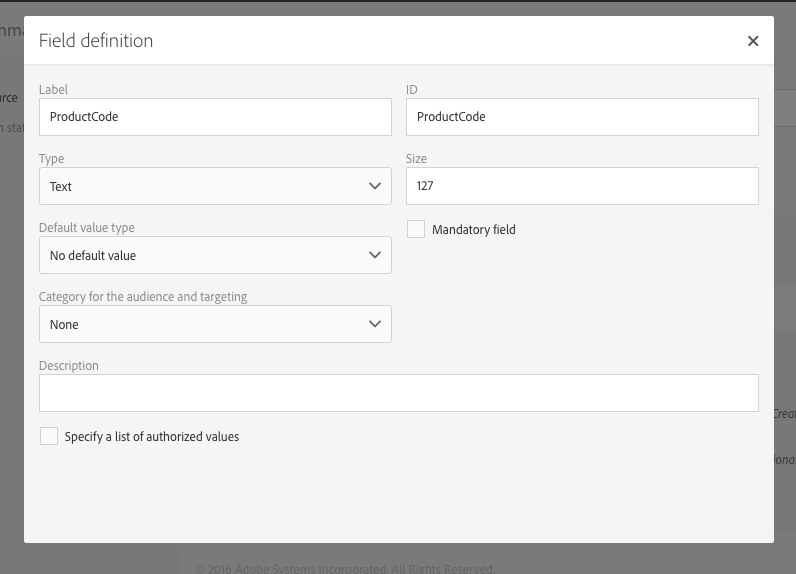
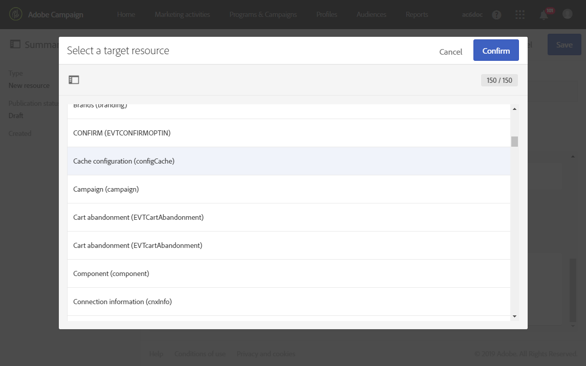

# Configuração da estrutura de dados do recurso{#configuring-the-resource-s-data-structure}

Depois de criar um novo recurso personalizado, você deve configurar a estrutura dos dados.

Ao editar o recurso, na **[!UICONTROL Data structure]** guia, você pode adicionar:

* [Campos](../../developing/using/configuring-the-resource-s-data-structure.md#adding-fields-to-a-resource)
* [Teclas de identificação](../../developing/using/configuring-the-resource-s-data-structure.md#defining-identification-keys)
* [Índices](../../developing/using/configuring-the-resource-s-data-structure.md#defining-indexes)
* [Links](../../developing/using/configuring-the-resource-s-data-structure.md#defining-links-with-other-resources)
* [Envio de logs](../../developing/using/configuring-the-resource-s-data-structure.md#defining-sending-logs-extension)

## Adicionar campos a um recurso {#adding-fields-to-a-resource}

É possível adicionar novos campos a um recurso para armazenar dados que não fazem parte do modelo de dados da caixa.

1. Use o **[!UICONTROL Create element]** botão para criar um campo.
1. Especifique um rótulo, uma ID, um tipo de campo e defina o comprimento máximo autorizado para esse campo.

   **[!UICONTROL ID]** O campo é obrigatório e deve ser exclusivo para cada campo adicionado.

   >[!NOTE]
   >
   >Se você deixar o **[!UICONTROL Label]** campo vazio, ele será preenchido automaticamente da ID.
   >Recomendamos usar o máximo de 30 caracteres.

   

1. Para modificar um dos campos, verifique o **[!UICONTROL Edit Properties]** botão.

   

1. Na **[!UICONTROL Field definition]** tela, você pode definir uma categoria que será usada para o público-alvo e a definição de metas, ou até mesmo adicionar uma descrição.

   

1. Verifique a **[!UICONTROL Specify a list of authorized values]** opção se você precisar definir valores que serão oferecidos ao usuário (valores de enumeração).

   Em seguida, clique **[!UICONTROL Create element]** em e especifique um **[!UICONTROL Label]** e **[!UICONTROL Value]**. Adicione quantos valores forem necessários.

1. Após adicionar os campos, marque **[!UICONTROL Add audit fields]** a caixa para incluir campos detalhando a data de criação, o usuário que criou o recurso, a data e o autor da última modificação.
1. Marque a **[!UICONTROL Add access authorization management fields]** caixa para incluir os campos que estão informando quem tem direitos de acesso a esse recurso específico.

   Esses campos aparecem nos dados e metadados que podem ser exibidos depois que a atualização do banco de dados é realizada. Para obter mais informações sobre isso, consulte [a seção Atualizar a estrutura da estrutura](../../developing/using/updating-the-database-structure.md) do banco de dados.

1. Verifique o **[!UICONTROL Add automatic ID]** campo para gerar automaticamente uma ID. Observe que as entidades existentes permanecerão vazias.
1. Para modificar a forma como o nome dos elementos de recurso aparecerá nas listas e nas etapas de criação, marque a **[!UICONTROL Personalize the resource title]** caixa. Selecione um campo dos que você criou para este recurso.

   

Os campos de seu recurso agora são definidos.

## Definição de chaves de identificação {#defining-identification-keys}

Cada recurso deve ter pelo menos uma chave exclusiva. Por exemplo, você pode especificar uma chave para que dois produtos não possam ter a mesma ID em uma tabela de compra.

1. Especifique na **[!UICONTROL Automatic primary key]** seção o tamanho do armazenamento se você desejar ter uma chave técnica automaticamente e gerada automaticamente.

   

1. Use o **[!UICONTROL Create element]** botão para criar uma chave.

   Os **[!UICONTROL Label]** campos e os **[!UICONTROL ID]** campos são concluídos por padrão, mas você pode editá-los.

   >[!NOTE]
   >
   >Recomendamos usar o máximo de 30 caracteres.

1. Para definir os elementos que compõem essa chave, clique **[!UICONTROL Create element]** em e selecione os campos criados para esse recurso.

   

   As teclas criadas são exibidas na **[!UICONTROL Custom keys]** seção.

Suas chaves de identificação para o recurso são criadas agora.

## Definição de índices {#defining-indexes}

Um índice pode fazer referência a um ou vários campos de recursos. Os índices permitem que o banco de dados classifique registros para recuperá-los com mais facilidade. Otimizam o desempenho das consultas SQL.

A definição de índices é recomendada, mas não obrigatória.

1. Use o **[!UICONTROL Create element]** botão para criar um índice.

   

1. Os **[!UICONTROL Label]** campos e os **[!UICONTROL ID]** campos são concluídos por padrão, mas você pode editá-los.

   >[!NOTE]
   >
   >Recomendamos usar o máximo de 30 caracteres.

1. Para definir os elementos que compõem esse índice, selecione os campos que você criou para este recurso.

   

1. Click **[!UICONTROL Confirm]**.

Os índices criados aparecem na lista na **[!UICONTROL Index]** seção.

## Definição de links com outros recursos {#defining-links-with-other-resources}

Um link detalha a associação que uma tabela possui com outras tabelas.

1. Use o **[!UICONTROL Create element]** botão para criar um link para um recurso de destino.
1. Click **[!UICONTROL Select a target resource]**.

   

1. Os recursos são mostrados em ordem alfabética e podem ser filtrados por nome. Seu nome técnico é exibido entre parênteses.

   Selecione um elemento na lista e clique **[!UICONTROL Confirm]** em.

   

1. Selecione o **[!UICONTROL Link type]** de acordo com a cardinalidade. Dependendo do tipo de cardinalidade selecionado, o comportamento se os registros forem excluídos ou duplicados poderá variar.

   Os vários tipos de links são:

   * **[!UICONTROL 1 cardinality simple link]**: uma ocorrência da tabela de origem pode ter no máximo uma ocorrência correspondente da tabela de destino.
   * **[!UICONTROL N cardinality collection link]**: uma ocorrência da tabela de origem pode ter várias ocorrências correspondentes da tabela de destino, mas uma ocorrência da tabela de destino pode ter no máximo uma ocorrência correspondente da tabela de origem.
   * **[!UICONTROL 0 or 1 cardinality simple link]**: uma ocorrência da tabela de origem pode ter no máximo uma ocorrência correspondente da tabela de destino ou nenhum. Observe que este tipo de **[!UICONTROL Link type]** pode causar problemas de desempenho.
   

1. Na **[!UICONTROL New link]** tela, os campos **[!UICONTROL Label]** e **[!UICONTROL ID]** os campos são concluídos por padrão, mas você pode editá-los.

   >[!NOTE]
   >
   >Recomendamos usar o máximo de 30 caracteres.

   >[!CAUTION]
   >
   >Não é possível renomear um link após a criação. Para renomear um link, você deve excluí-lo e criar novamente.

1. A **[!UICONTROL Category for the audience and targeting]** lista permite atribuir esse link a uma categoria tornando-a mais visível na ferramenta do editor de consulta.
1. Se necessário, a **[!UICONTROL Reverse link definition]** seção permite exibir o rótulo e a ID do recurso no recurso direcionado.
1. Defina o comportamento dos registros referenciados pelo link na **[!UICONTROL Behavior if deleted/duplicated]** seção.

   Por padrão, o registro de destino será excluído depois que não for mais mencionado pelo link.

   

1. Na **[!UICONTROL Join definition]** seção, a opção padrão **[!UICONTROL Use the primary keys to make the join]** é selecionada, mas é possível escolher entre duas opções:

   * **[!UICONTROL Use the primary key to make the join]**: Essa definição de junção permite usar a chave primária dos perfis para se reconciliar com a chave primária das compras.
   * **[!UICONTROL Define specific join conditions]**: Essa definição de junção permite selecionar manualmente os campos que associarão ambos os recursos. Observe que, se os dados não estiverem configurados corretamente, o registro **de Compra** não estará visível.
   

Os links criados são exibidos na lista na **[!UICONTROL Links]** seção.

**Exemplo: Vincular um recurso criado com o recurso "Perfis"**

Neste exemplo, queremos vincular um novo recurso **Compra** com **o recurso** personalizado Perfis:

1. Crie o novo **recurso de Compra** .
1. Para vinculá-lo com o **recurso** personalizado Perfis, desbloqueie a **[!UICONTROL Links]** seção na **[!UICONTROL Data structure]** guia e clique **[!UICONTROL Create element]** em.
1. Selecione o recurso de destino aqui **[!UICONTROL Profiles (profile)]**.
1. Neste exemplo, mantenha o tipo **[!UICONTROL 1 cardinality simple link]** de Link padrão selecionado.

   

1. Escolha uma definição de junção, aqui mantém o padrão **[!UICONTROL Use the primary key to make the join]**.

   

1. Se necessário, você pode definir uma tela de detalhes para poder editar **a Compra** e vinculá-la a um perfil.

   Desdobre a **[!UICONTROL Detail screen configuration]** seção e verifique para **[!UICONTROL Define a detail screen]** configurar a tela que corresponde a cada elemento do recurso. Se você não marcar esta caixa, a exibição detalhada dos elementos desse recurso não estará acessível.

1. Click **[!UICONTROL Create element]**.
1. Selecione o recurso vinculado e clique **[!UICONTROL Add]** em.

   O novo recurso estará disponível no menu avançado selecionando **[!UICONTROL Client data]** &gt; **[!UICONTROL Purchase]**.

   

1. Após a configuração ser feita, clique **[!UICONTROL Confirm]** em.

   Agora você pode publicar seu novo recurso.

Ao adicionar esse link, uma **guia Compra** é adicionada à tela de detalhes do perfil no menu **[!UICONTROL Profiles & audiences]** &gt; **[!UICONTROL Profiles]** . Observe que isso é específico para **[!UICONTROL Profile]** o recurso.

## Definição de extensão de logs {#defining-sending-logs-extension}

A extensão do log de envio permite:

* para estender os recursos dinâmicos do relatório **adicionando campos personalizados de perfil**
* para estender os dados de registros de envio com **código de segmento e dados de perfil**

**Estender com um código de segmento**

O usuário pode estender os registros com o código do segmento vindo do mecanismo de fluxo de trabalho.

O código do segmento deve ser definido no fluxo de trabalho.

Para ativar essa extensão, verifique a opção **[!UICONTROL Add segment code]**.

Para obter mais informações sobre o código do segmento, consulte a [seção Segmentação](../../automating/using/segmentation.md) .

**Estender com um campo de perfil**

>[!NOTE]
>
>O administrador deve ter estendido o recurso de Perfil com um campo personalizado.

Clique **[!UICONTROL Add field]** em e selecione qualquer campo personalizado do recurso de perfil.

Para gerar uma nova subdimensão vinculada à dimensão Perfil, verifique a **[!UICONTROL Add this field in Dynamic reporting as a new dimension]** opção.

Em Relatórios dinâmicos, você pode arrastar e soltar a dimensão de campo personalizado em uma tabela de forma livre.

Para obter mais informações sobre Relatórios dinâmicos, consulte [a Lista de componentes](../../reporting/using/list-of-components-.md).

>[!CAUTION]
>
>O número de campos enviados para Relatórios dinâmicos é limitado a 20.

## Editar propriedades de recursos {#editing-resource-properties}

Na tela de recurso personalizada, o **[!UICONTROL Summary]** painel indica o status do recurso criado recentemente. Você pode gerenciar seu acesso e suas propriedades gerais.

1. Clique no **[!UICONTROL Edit properties]** botão para adicionar uma descrição.

   

1. Se necessário, modifique a etiqueta e a ID do recurso.

   >[!NOTE]
   >
   >Recomendamos usar o máximo de 30 caracteres.

1. Caso precise restringir o acesso a esse recurso em determinadas unidades organizacionais, especifique-as aqui. Somente usuários de unidades autorizadas poderão trabalhar com esse recurso no aplicativo.
1. Salve as modificações.

Suas modificações são salvas. É necessário publicar o recurso novamente para aplicá-los.

## Geração de uma ID exclusiva para perfis e recursos personalizados {#generating-a-unique-id-for-profiles-and-custom-resources}

Por padrão, perfis e recursos personalizados não têm ID de negócios quando são criados. Você pode habilitar uma opção que gera automaticamente uma ID exclusiva quando os elementos forem criados. Essa ID pode ser usada para:

* Identifique os registros exportados facilmente em uma ferramenta externa.
* Concilie registros ao importar dados atualizados processados em outro aplicativo.

Ele pode ser ativado apenas para perfis e recursos personalizados.

1. Crie uma extensão para o recurso de perfis ou crie um novo recurso.
1. Na definição da estrutura de dados, verifique a **[!UICONTROL Add automatic ID field]** opção na **[!UICONTROL Fields]** seção.
1. Salve e publique a modificação feita no recurso. Se você quiser que esse mecanismo seja aplicado aos elementos criados pela API, verifique a opção para estender a API.

O **[!UICONTROL ACS ID]** campo agora está disponível e automaticamente preenchido quando novos elementos são criados manualmente, da API ou inseridos de um fluxo de trabalho de importação. O campo ID do ACS é um campo UUID e é indexado.

Ao exportar perfis ou recursos personalizados, você pode adicionar **[!UICONTROL ACS ID]** a coluna se ela estiver habilitada para esse recurso. Você pode reutilizar essa ID em suas ferramentas externas para identificar registros.

Ao re-importar dados que foram processados/atualizados em outro aplicativo (por exemplo, um CRM), você pode reconciliá-lo facilmente com essa ID exclusiva.

>[!NOTE]
>
>**[!UICONTROL ACS ID]** O campo não é atualizado para perfis ou elementos criados antes de ativar a opção. Apenas novos registros terão uma ID ACS. Este campo está no modo somente leitura. Não é possível modificá-lo.

