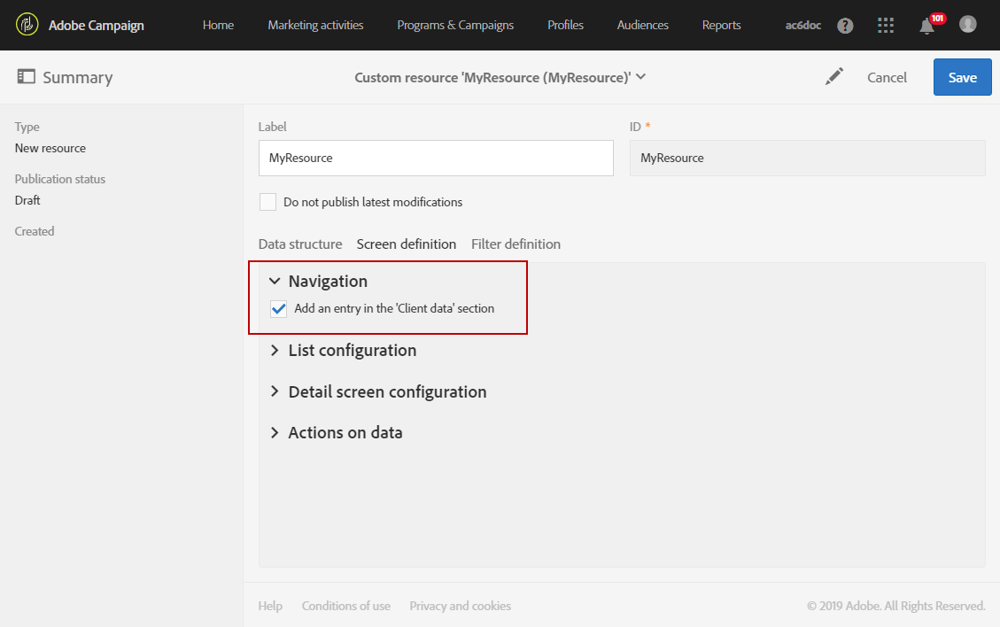
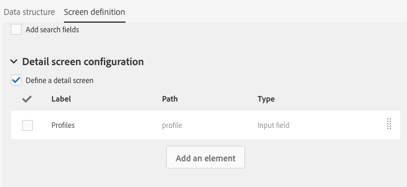
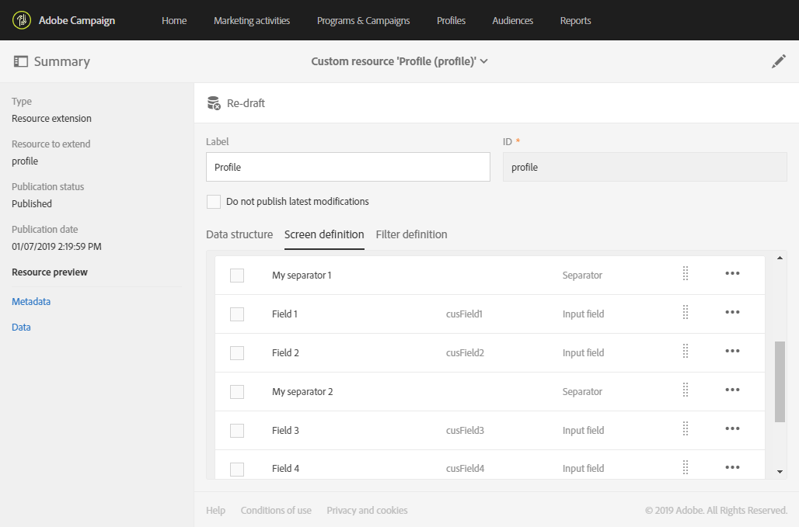
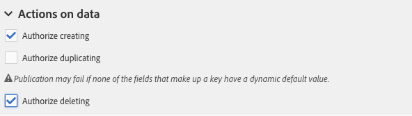

# Configuração da definição da tela{#configuring-the-screen-definition}

Ao criar um recurso ou ao adicionar novos campos a um recurso existente, você pode definir como deseja que eles apareçam na interface.

Essa etapa não é obrigatória, pois você ainda poderá preencher o recurso e acessar os dados por meio de workflows, público-alvo e API REST.

Na guia **[!UICONTROL Screen definition]**, é possível:

* Adicionar acesso ao recurso personalizado no painel de navegação
* Personalizar a forma como a lista de elementos que compõem o recurso é apresentada
* Definir a forma como a exibição detalhada de cada elemento do recurso é exibida

## Ativação do acesso pelo menu de navegação {#enabling-access-from-the-navigation-menu}

Se quiser que seu recurso tenha uma tela dedicada, você poderá disponibilizá-la no menu de navegação.

1. Na guia **[!UICONTROL Screen definition]** do recurso, abra a seção **[!UICONTROL Navigation]**.
1. Marque a caixa **[!UICONTROL Add an entry in the 'Client data' section]** para permitir o acesso a esse recurso pelo painel de navegação.

   

O recurso será exibido como uma subentrada na seção **[!UICONTROL Client data]**.

## Definição da configuração da lista padrão {#defining-the-default-list-configuration}

A seção **[!UICONTROL List configuration]** da definição de tela permite definir as colunas e as informações que serão exibidas por padrão na visão geral de um recurso.

1. Marque a caixa **[!UICONTROL Customize the list configuration]** para definir a forma como as colunas do recurso são exibidas.
1. Use o botão **[!UICONTROL Create element]** para selecionar um campo entre aqueles que você criou.
1. O campo criado é exibido na lista. Você pode editar seu rótulo e sua largura.

   

1. Na seção **[!UICONTROL Simple search]**, marque **[!UICONTROL Specify the fields to be taken into account in the search]** para definir quais campos serão incluídos na pesquisa.

   >[!IMPORTANT]
   >
   >Essa configuração substitui os campos usados na pesquisa padrão.

1. Na seção **[!UICONTROL Advanced filtering]**, marque a caixa **[!UICONTROL Add search fields]** para adicionar campos adicionais além do campo de pesquisa simples. Por exemplo, se você selecionar o campo &quot;datr&quot; nos campos criados, o usuário poderá fazer uma pesquisa que faz referência apenas à data.
1. É possível modificar a ordem dos campos para os dois tipos de pesquisa.
1. Para uma pesquisa avançada, você pode adicionar campos que se associam a um recurso vinculado. Esses filtros são exibidos no menu **[!UICONTROL Search]** da tela gerada.

A tela de visão geral do recurso agora está definida.

## Definição da configuração detalhada da tela {#defining-the-detail-screen-configuration}

A seção **[!UICONTROL Detail screen configuration]** da definição de tela permite definir as colunas e as informações que serão exibidas na tela de detalhes de cada elemento do recurso.

1. Abra a seção **[!UICONTROL Detail screen configuration]** e marque **[!UICONTROL Define a detail screen]** para configurar a tela que corresponde a cada elemento do recurso. Se você não marcar essa caixa, a visualização detalhada dos elementos deste recurso não estará acessível.
1. É possível adicionar todos os campos do recurso personalizado com um único clique. Para fazer isso, clique no ícone  ou use o botão **[!UICONTROL Add an element]**.
1. Selecione um elemento entre os criados para esse recurso e especifique um tipo de campo:

   * **[!UICONTROL Input field]**: é um campo editável.
   * **[!UICONTROL Value]**: é um campo somente leitura.
   * **[!UICONTROL List]**: é uma tabela.
   * **[!UICONTROL Separator]**: divide os elementos em categorias.

   

1. O elemento adicionado é exibido na lista. Você pode editar seu rótulo.

   

1. Adicione quantos **[!UICONTROL Separator]** forem necessários para dividir seus elementos em categorias diferentes.

   Você pode exibir separadores para organizar melhor suas janelas.

   

A tela de detalhes do recurso agora está configurada.

## Ações na seção de dados {#actions-on-data-section}

Essas configurações permitem exibir uma barra de controle na tela de recursos personalizados. Há três opções disponíveis:

* **[!UICONTROL Authorize creating]**: essa opção permite ativar a criação de elementos do recurso. O usuário pode, portanto, adicionar outros registros.

   >[!NOTE]
   >
   >Primeiro, ative a tela de detalhes vinculada ao recurso para disponibilizar essa opção.

* **[!UICONTROL Authorize duplicating]**: essa opção permite ativar registros duplicados vinculados ao recurso personalizado.
* **[!UICONTROL Authorize deleting]**: essa opção permite ativar a exclusão de registros vinculados ao recurso personalizado.
