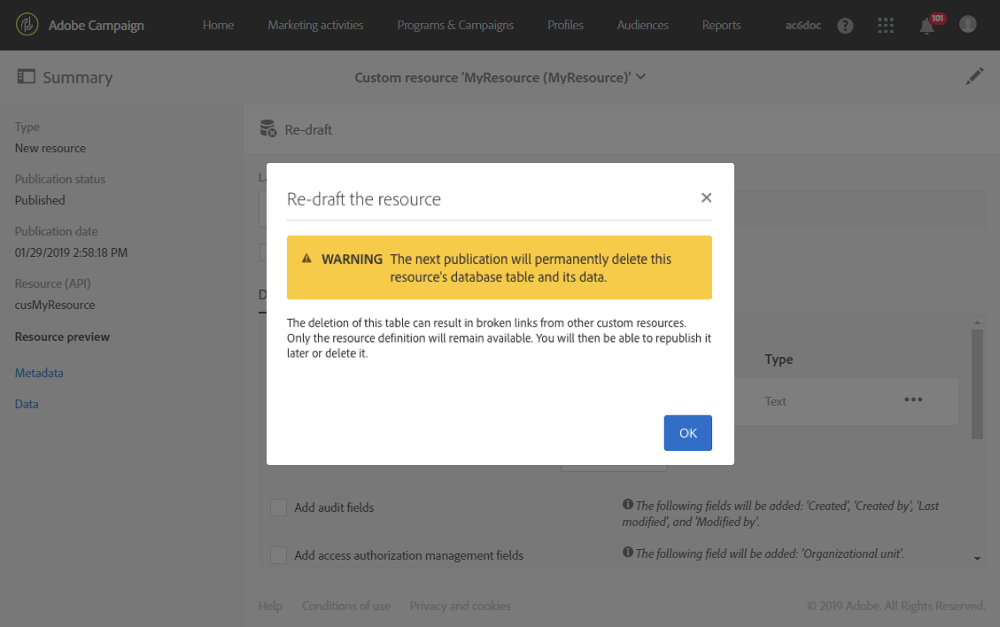

# Excluir um recurso{#deleting-a-resource}

Para excluir um recurso, o recurso em questão deve ser um **[!UICONTROL Draft]**. O recurso está em **[!UICONTROL Draft]** status se:

* Acabou de ser criada e ainda não foi publicada.
* Se já foi publicado, o recurso tem de ser reformulado.

>[!IMPORTANT]
>
>A reformulação e exclusão de um recurso personalizado são operações confidenciais que podem afetar outros recursos. Essas ações devem ser executadas somente por um usuário especialista.

Para redesenhar e excluir um recurso publicado:

1. Selecione o recurso que deseja redesenhar.
1. Clique no **[!UICONTROL Re-draft]** botão na barra de ações.

   

1. Clique em **[!UICONTROL Ok]**.

   >[!IMPORTANT]
   >
   >Esta ação é definitiva: a tabela ou colunas do banco de dados do recurso e seus dados serão permanentemente excluídos quando a modificação for publicada, o que pode resultar em links quebrados de outros recursos personalizados. Somente a definição do recurso permanecerá disponível.

   

   >[!NOTE]
   >
   >Se você redesenhar uma extensão do recurso predefinido de **Perfis (perfil)** , também será necessário redesenhar qualquer extensão de perfil **de teste (sementeMember)** que você tenha definido. Para obter mais informações sobre a extensão do recurso de perfil, consulte [esta seção](../../developing/using/extending-the-profile-resource-with-a-new-field.md).

1. Publique o recurso. Para obter etapas mais detalhadas, consulte [Publicação de um recurso](../../developing/using/updating-the-database-structure.md#publishing-a-custom-resource)personalizado.

   O recurso então entra no modo **Rascunho** e seu status de ativação é **[!UICONTROL Inactive]**.

1. No **[!UICONTROL List]** modo, marque o recurso a ser excluído e clique no  ícone **[!UICONTROL Delete element]** .

   

Seu recurso é excluído do modelo de dados.

>[!NOTE]
>
>Se um campo de um recurso personalizado usado em um evento for modificado ou excluído, a publicação do evento correspondente será automaticamente cancelada. See [Configuring transactional messaging](../../administration/using/configuring-transactional-messaging.md).

