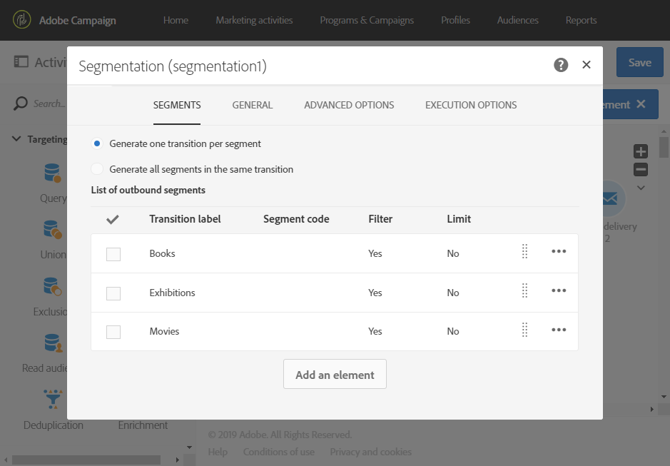

# Extending the profile resource with a new field{#extending-the-profile-resource-with-a-new-field}

## About extending profiles {#about-extending-profiles}

Esse caso de uso de caso de uso como estender um perfil e um perfil de teste com um campo dedicado.

Aqui, queremos atualizar nossos perfis com o novo campo usando uma página de aterrissagem em seguida, segmentar perfis com um boletim informativo específico para seus interesses.

Para isso, siga as etapas abaixo:

* [Etapa 1: Estender o recurso de perfil](../../developing/using/extending-the-profile-resource-with-a-new-field.md#step-1--extend-the-profile-resource)
* [Etapa 2: Estender o perfil de teste](../../developing/using/extending-the-profile-resource-with-a-new-field.md#step-2--extend-the-test-profile)
* [Etapa 3: Publicar seu recurso personalizado](../../developing/using/extending-the-profile-resource-with-a-new-field.md#step-3--publish-your-custom-resource)
* [Etapa 4: Atualização e perfis de destino com um fluxo de trabalho](../../developing/using/extending-the-profile-resource-with-a-new-field.md#step-4--update-and-target-profiles-with-a-workflow)

O seguinte campo será adicionado a nossos perfis e poderá ser direcionado a uma entrega:

Tópicos relacionados:

* [Sobre recursos personalizados](../../developing/using/data-model-concepts.md)
* [Gerenciamento de perfis](../../audiences/using/about-profiles.md)
* [Gerenciamento de perfis de teste](../../sending/using/managing-test-profiles-and-sending-proofs.md#managing-test-profiles)

## Step 1: Extend the profile resource {#step-1--extend-the-profile-resource}

To create the new **Interest** field for our profiles, you first need to extend the out-of-the-box **[!UICONTROL Profiles (profile)]** resource.

1. From the advanced menu, via the Adobe Campaign logo, select **[!UICONTROL Administration]** &gt; **[!UICONTROL Development]**, then **[!UICONTROL Custom resources]**.
1. If you have not extended the **[!UICONTROL Profiles]** resource yet, click **[!UICONTROL Create]**.
1. Choose the **[!UICONTROL Extend an existing resource]** option.
1. Select the **[!UICONTROL Profile (profile)]** resource.
1. Click **[!UICONTROL Create]**.

   

1. In the **[!UICONTROL Fields]** category of the **[!UICONTROL Data structure]** tab, click **[!UICONTROL Create element]**.

   >[!NOTE]
   >
   >Note that if you already extended the **[!UICONTROL Profile]** resource for previous purposes, you can start at this step by clicking **[!UICONTROL Add field]**.

   

1. Add a **[!UICONTROL Label]** and an **[!UICONTROL ID]**. Select the **[!UICONTROL Text]** type and click **[!UICONTROL Add]**.

   

1. Para configurar o campo, na guia **[!UICONTROL Data structure]** no menu suspenso **[!UICONTROL Fields]**, clique em  e em  do seu campo criado anteriormente.
1. In this example we want to add specific values, to do so click **[!UICONTROL Specify a list of authorized values]**.

   

1. Click **[!UICONTROL Add an element]** then add as many value as needed by adding a **[!UICONTROL Label]** and an **[!UICONTROL ID]** and clicking **[!UICONTROL Add]**.

   Aqui, nós criaremos os valores de Livros, Exposições, Filmes e N/A para perfis escolher entre essas opções.

   

1. To add this field in the **[!UICONTROL Profile]** screen, click the **[!UICONTROL Screen definition]** tab.
1. In the **[!UICONTROL Detail screen configuration]** drop-down, click **[!UICONTROL Add a personalized fields section]** and click **[!UICONTROL Create element]**.

   

1. Select a **[!UICONTROL Type]**. Aqui queremos adicionar um campo de entrada. Then, select your previously created field and click **[!UICONTROL Add]**.

   

1. To add a separator to better organize your profile window, click **[!UICONTROL Create an element]** and select **[!UICONTROL Separator]** from the **[!UICONTROL Type]** drop-down.

   

O campo agora está configurado. Agora, é necessário estendê-la para o perfil de teste.

>[!NOTE]
>
>Se você não precisar estender o recurso de perfil de teste, poderá pular para a etapa de publicação.

## Step 2: Extend the test profile {#step-2--extend-the-test-profile}

Para testar se o novo campo criado está corretamente configurado, você pode testá-lo enviando sua entrega para os perfis de teste. Primeiro, o novo campo também precisa ser executado nos perfis de teste.

1. From the advanced menu, via the Adobe Campaign logo, select **[!UICONTROL Administration]** &gt; **[!UICONTROL Development]**, then **[!UICONTROL Custom resources]**.
1. If you have not extended the **[!UICONTROL Profiles]** resource yet, click **[!UICONTROL Create]**.
1. Choose the **[!UICONTROL Extend an existing resource]** option.
1. Select the **[!UICONTROL Test profile (seedMember)]** resource.
1. Click **[!UICONTROL Create]**.

   

1. In the **[!UICONTROL Data structure]** tab, click **[!UICONTROL Create element]**.

   

1. Select your previously created resource field and click **[!UICONTROL Add]**.

   

1. Carry out the same steps from step 11 to 13 as the extend profile walkthrough above to add this field in the **[!UICONTROL Test profile]** screen.
1. Click **[!UICONTROL Save]**.

Os perfis e perfis de teste agora terão o novo campo disponível. Para que seja corretamente configurado, você precisa publicar seu recurso personalizado.

## Step 3: Publish your custom resource {#step-3--publish-your-custom-resource}

Para aplicar as alterações realizadas nos recursos e usá-las, você deve executar uma atualização de banco de dados.

1. From the advanced menu, select **Administration** &gt; **Development**, then **Publishing**.
1. By default, the option **[!UICONTROL Determine modifications since the last publication]** is checked, which means that only the changes carried out since the last update will be applied.

   

1. Click **[!UICONTROL Prepare publication]** to start the analysis which will update your database.
1. Once the publication has been carried out, click the **Publish** button to apply your new configurations.

   

1. Once published, the **Summary** pane of each resource indicates that the status is now **Published** and specifies the date of the last publication.

   

1. Select the **[!UICONTROL Profiles]** tab and click **[!UICONTROL New]** to see if your changes have been correctly implemented.

   

O novo campo de recurso está pronto para ser usado e direcionado para uma entrega por exemplo.

## Step 4: Update and target profiles with a workflow {#step-4--update-and-target-profiles-with-a-workflow}

To update profiles with data for the new custom field, you can create a landing page using the **[!UICONTROL Profile acquisition]** template. For more information on landing pages, refer to this [page](../../channels/using/about-landing-pages.md).

Aqui, queremos direcionar os perfis de fluxo de trabalho que não preencheram este campo. Eles receberão um email solicitando que atualizem seus perfis para receber informativos e ofertas personalizadas. Cada perfil receberá um boletim informativo personalizado, dependendo dos interesses escolhidos.

First, we need to create a landing page that will update the **Interest** fields of the targeted profiles:

1. From the **[!UICONTROL Marketing activities]**, click **[!UICONTROL Create]** then select **[!UICONTROL Landing page]**.
1. Selecione um tipo de página de aterrissagem. Here, since we want to update our profiles, select **[!UICONTROL Profile acquisition]**.
1. Click **[!UICONTROL Create]**.
1. Click the **[!UICONTROL Content]** block to start editing the content of your landing page.

   

1. Personalize a página de aterrissagem conforme necessário.
1. Clique no campo configurado para seus perfis para escolher entre a seleção de Interesses. In the left pane, select your previously created **Interest** custom resource.

   

1. Salve a página de aterrissagem e teste-a para verificar se os campos estão configurados corretamente.
1. Click **[!UICONTROL Publish]** when your landing page is ready.

Sua página inicial agora está pronta. Para atualizar os perfis, você pode criar um fluxo de trabalho que enviará uma oferta especial, dependendo do interesse escolhido.

1. From the **[!UICONTROL Marketing activities]** tab, click **[!UICONTROL Create]** then select **[!UICONTROL Workflow]**.
1. Drag and drop a **[!UICONTROL Query]** activity to target the profiles or audiences you need.
1. Drag and drop an **[!UICONTROL Email delivery]** activity to start configuring your email which will contain a link to the landing page. Select the **[!UICONTROL Add an outbound transition with the population]**.

   

1. Crie e desenvolva seu e-mail conforme necessário. For more information on email personalization, refer to this [page](../../designing/using/designing-content-in-adobe-campaign.md).
1. Adicione um botão ao seu e-mail que redirecionará os perfis para a página de aterrissagem.
1. Select the added button and click  in the **[!UICONTROL Link]** section in the left pane.

   

1. In the **[!UICONTROL Insert link]** window, select **[!UICONTROL Landing page]** from the **[!UICONTROL Link type]** drop-down then select the previously created landing page.

   

1. Click **[!UICONTROL Save]**. Seu email agora está pronto, você pode retornar ao seu fluxo de trabalho.
1. Add a **[!UICONTROL Wait]** activity to let some time for your profiles to fill the landing page.
1. Add a **[!UICONTROL Segmentation]** activity to split the outbound transition depending on their **Interests**.
1. Create an outbound segment for each **Interest**.

   

1. Add an **[!UICONTROL Email delivery]** activity after each transition and create a personalized email depending on the chosen **Interest**.
1. Inicie o fluxo de trabalho quando a configuração for feita.

   

Os perfis receberão agora o email solicitando que preencha este campo de Interesse seguido por um email personalizado, dependendo do valor escolhido.
