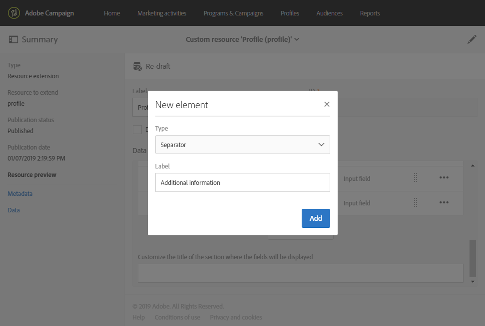

# Extensão do recurso de perfil com um novo campo{#extending-the-profile-resource-with-a-new-field}

## Sobre a extensão de perfis {#about-extending-profiles}

Este caso de uso detalha como estender um perfil e um perfil de teste com um campo dedicado.

Aqui, queremos atualizar nossos perfis com o novo campo usando uma landing page e depois direcionar os perfis com um informativo específico aos interesses deles.

Para isso, siga as etapas abaixo:

* [Etapa 1: estender o recurso de perfil](#step-1--extend-the-profile-resource)
* [Etapa 2: estender o perfil de teste](#step-2--extend-the-test-profile)
* [Etapa 3: publicar o recurso personalizado](#step-3--publish-your-custom-resource)
* [Etapa 4: atualizar e direcionar perfis com um fluxo de trabalho](#step-4--update-and-target-profiles-with-a-workflow)

O campo a seguir será adicionado aos nossos perfis e poderá ser direcionado em um delivery:

Tópicos relacionados:

* [Sobre recursos personalizados](../../developing/using/data-model-concepts.md)
* [Gerenciamento de perfis](../../audiences/using/about-profiles.md)
* [Gerenciamento de perfis de teste](../../audiences/using/managing-test-profiles.md)

## Etapa 1: estender o recurso de perfil {#step-1--extend-the-profile-resource}

Para criar o novo campo **Interest** para os perfis, primeiro estenda o recurso **[!UICONTROL Profiles (profile)]** predefinido.

1. No menu avançado, selecione **[!UICONTROL Administration]** > **[!UICONTROL Development]** e **[!UICONTROL Custom resources]** pelo logotipo do Adobe Campaign.
1. Se você ainda não tiver estendido o recurso **[!UICONTROL Profiles]**, clique em **[!UICONTROL Create]**.
1. Escolha a opção **[!UICONTROL Extend an existing resource]**.
1. Selecione o recurso **[!UICONTROL Profile (profile)]**.
1. Clique em **[!UICONTROL Create]**.

   

1. Na categoria **[!UICONTROL Fields]** da guia **[!UICONTROL Data structure]**, clique em **[!UICONTROL Create element]**.

   >[!NOTE]
   >
   >Observe que, se você já tiver estendido o recurso **[!UICONTROL Profile]** para fins anteriores, poderá iniciar nesta etapa clicando em **[!UICONTROL Add field]**.

   

1. Adicione um **[!UICONTROL Label]** e um **[!UICONTROL ID]**. Selecione o tipo **[!UICONTROL Text]** e clique em **[!UICONTROL Add]**.

   

1. Para configurar o campo, na guia **[!UICONTROL Data structure]** do menu suspenso **[!UICONTROL Fields]**, clique em  e em  do campo criado anteriormente.
1. Neste exemplo, queremos adicionar valores específicos. Para isso, clique em **[!UICONTROL Specify a list of authorized values]**.

   

1. Clique em **[!UICONTROL Add an element]** e inclua quantos valores forem necessários adicionando um **[!UICONTROL Label]** e um **[!UICONTROL ID]** e clicando em **[!UICONTROL Add]**.

   Aqui, criaremos os valores de Books, Exhibitions, Movies e N/A para que os perfis escolham entre essas opções.

   

1. Para adicionar esse campo à tela **[!UICONTROL Profile]**, clique na guia **[!UICONTROL Screen definition]**.
1. Na lista suspensa de **[!UICONTROL Detail screen configuration]**, clique em **[!UICONTROL Add a personalized fields section]** e em **[!UICONTROL Create element]**.

   

1. Selecione um **[!UICONTROL Type]**. Aqui, queremos adicionar um campo de entrada. Em seguida, selecione o campo criado anteriormente e clique em **[!UICONTROL Add]**.

   

1. Para adicionar um separador para organizar melhor a janela do perfil, clique em **[!UICONTROL Create an element]** e selecione **[!UICONTROL Separator]** no menu suspenso **[!UICONTROL Type]**.

   

A página agora está configurada. Precisamos agora estendê-la ao perfil de teste.

>[!NOTE]
>
>Se você não precisar estender o recurso de perfil de teste, vá para a etapa Publicação.

## Etapa 2: estender o perfil de teste {#step-2--extend-the-test-profile}

Para testar se o novo campo criado está configurado corretamente, você pode testá-lo enviando o delivery aos seus perfis de teste. Primeiro, o novo campo também precisa ser executado para os perfis de teste.

1. No menu avançado, selecione **[!UICONTROL Administration]** > **[!UICONTROL Development]** e **[!UICONTROL Custom resources]** pelo logotipo do Adobe Campaign.
1. Se você ainda não tiver estendido o recurso **[!UICONTROL Profiles]**, clique em **[!UICONTROL Create]**.
1. Escolha a opção **[!UICONTROL Extend an existing resource]**.
1. Selecione o recurso **[!UICONTROL Test profile (seedMember)]**.
1. Clique em **[!UICONTROL Create]**.

   

1. Na guia **[!UICONTROL Data structure]**, clique em **[!UICONTROL Create element]**.

   

1. Selecione o campo de recurso criado anteriormente e clique em **[!UICONTROL Add]**.

   

1. Execute os mesmos passos das etapas 11 a 13 da descrição detalhada de extensão de perfil acima para adicionar esse campo à tela **[!UICONTROL Test profile]**.
1. Clique em **[!UICONTROL Save]**.

Os perfis e os perfis de teste agora terão seu novo campo disponível. Para que ele seja configurado corretamente, publique o recurso personalizado.

## Etapa 3: publicar o recurso personalizado {#step-3--publish-your-custom-resource}

Para aplicar as alterações realizadas no recurso e usá-lo, faça uma atualização do banco de dados.

1. No menu avançado, selecione **Administração** > **Desenvolvimento** e **Publicação**.
1. Por padrão, a opção **[!UICONTROL Determine modifications since the last publication]** está marcada, o que significa que somente as alterações feitas desde a última atualização serão aplicadas.

   

1. Clique em **[!UICONTROL Prepare publication]** para iniciar a análise que atualizará o banco de dados.
1. Depois que a publicação for feita, clique no botão **Publish** para aplicar as novas configurações.

   

1. Após a publicação, o painel **Summary** de cada recurso indicará que o status agora é **Published** e especificará a data da última publicação.

   

1. Selecione a guia **[!UICONTROL Profiles]** e clique em **[!UICONTROL New]** para ver se as alterações foram implementadas corretamente.

   

O novo campo de recurso agora está pronto para ser usado e direcionado em um delivery, por exemplo.

## Etapa 4: atualizar e direcionar perfis com um fluxo de trabalho {#step-4--update-and-target-profiles-with-a-workflow}

Para atualizar perfis com dados para o novo campo personalizado, você pode criar uma landing page usando o template **[!UICONTROL Profile acquisition]**. Para saber mais sobre landing pages, consulte esta [página](../../channels/using/getting-started-with-landing-pages.md).

Aqui, queremos direcionar os perfis em um fluxo de trabalho que não preencheram esse campo. Eles receberão um email solicitando a atualização dos perfis para receber ofertas e informativos personalizados. Cada perfil receberá um boletim personalizado, dependendo dos interesses escolhidos.

Primeiro, precisamos criar uma landing page que atualizará os campos **Interest** dos perfis direcionados:

1. Nas **[!UICONTROL Marketing activities]**, clique em **[!UICONTROL Create]** e selecione **[!UICONTROL Landing page]**.
1. Selecione um tipo de landing page. Como queremos atualizar nossos perfis, selecione **[!UICONTROL Profile acquisition]**.
1. Clique em **[!UICONTROL Create]**.
1. Clique no bloco **[!UICONTROL Content]** para começar a editar o conteúdo da landing page.

   

1. Personalize a landing page, conforme necessário.
1. Clique no campo configurado para seus perfis para escolher entre a seleção de Interests. No painel esquerdo, selecione o recurso personalizado **Interest** criado anteriormente.

   

1. Salve a landing page e teste-a para verificar se os campos estão configurados corretamente.
1. Clique em **[!UICONTROL Publish]** quando a landing page estiver pronta.

A landing page agora está pronta. Para atualizar os perfis, você pode criar um fluxo de trabalho que enviará uma oferta especial, dependendo do Interest escolhido.

1. Na guia **[!UICONTROL Marketing activities]**, clique em **[!UICONTROL Create]** e selecione **[!UICONTROL Workflow]**.
1. Arraste e solte uma atividade **[!UICONTROL Query]** para direcionar os perfis ou os públicos-alvo necessários.
1. Arraste e solte uma atividade **[!UICONTROL Email delivery]** para iniciar a configuração do seu email que conterá um link para a landing page. Selecione **[!UICONTROL Add an outbound transition with the population]**.

   

1. Crie e elabore seu email conforme necessário. Para saber mais sobre personalização de email, consulte esta [página](../../designing/using/quick-start.md).
1. Adicione um botão ao seu email que redirecionará perfis para sua landing page.
1. Selecione o botão adicionado e clique em  na seção **[!UICONTROL Link]** no painel esquerdo.

   

1. Na janela **[!UICONTROL Insert link]**, selecione **[!UICONTROL Landing page]** no menu suspenso **[!UICONTROL Link type]** e selecione a landing page criada anteriormente.

   

1. Clique em **[!UICONTROL Save]**. Seu email agora está pronto, e você pode voltar para o fluxo de trabalho.
1. Adicione uma atividade **[!UICONTROL Wait]** para que seus perfis possam preencher a landing page.
1. Adicione uma atividade **[!UICONTROL Segmentation]** para dividir a transição de saída, dependendo de seus **Interests**.
1. Crie um segmento de saída para cada **Interest**.

   

1. Adicione uma atividade **[!UICONTROL Email delivery]** após cada transição e crie um email personalizado dependendo do **Interest** escolhido.
1. Inicie o fluxo de trabalho quando a configuração for concluída.

   

Os perfis agora receberão o email solicitando que eles preencham esse campo Interest seguido de um email personalizado, dependendo do valor escolhido.
