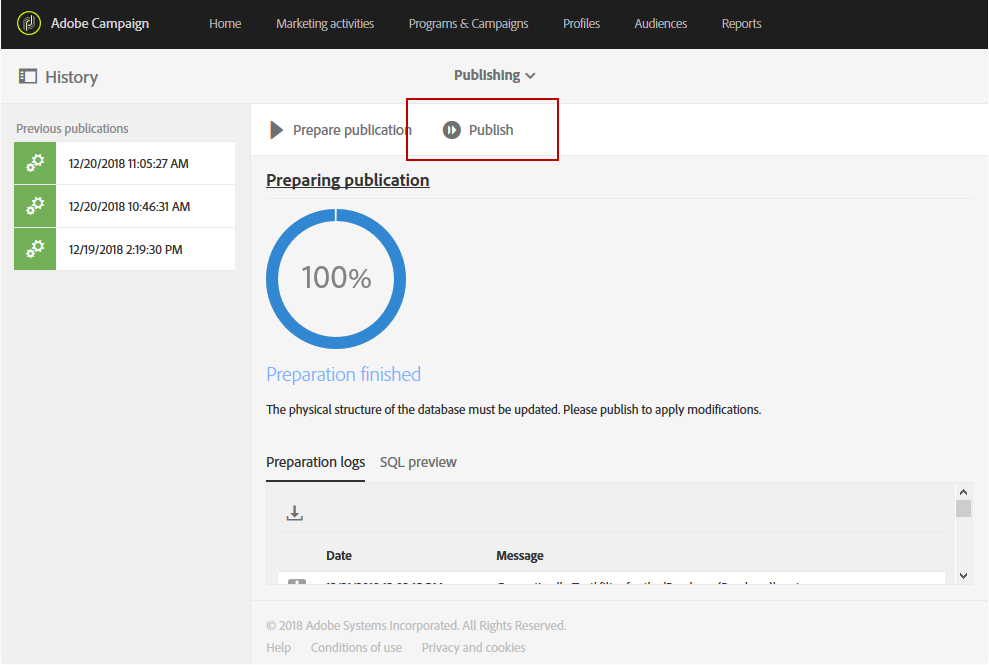

# Extensão do recurso de perfil com um novo campo{#extending-the-profile-resource-with-a-new-field}

## Sobre a extensão de perfis {#about-extending-profiles}

Este caso de uso detalha como estender um perfil e um perfil de teste com um campo dedicado.

Aqui, queremos atualizar nossos perfis com o novo campo usando uma página de aterrissagem e, em seguida, direcionar perfis com um boletim informativo específico para seus interesses.

Para isso, siga as etapas abaixo:

* [Etapa 1: Estender o recurso de perfil](../../developing/using/extending-the-profile-resource-with-a-new-field.md#step-1--extend-the-profile-resource)
* [Etapa 2: Estender o perfil de teste](../../developing/using/extending-the-profile-resource-with-a-new-field.md#step-2--extend-the-test-profile)
* [Etapa 3: Publicar seu recurso personalizado](../../developing/using/extending-the-profile-resource-with-a-new-field.md#step-3--publish-your-custom-resource)
* [Etapa 4: Atualizar e direcionar perfis com um fluxo de trabalho](../../developing/using/extending-the-profile-resource-with-a-new-field.md#step-4--update-and-target-profiles-with-a-workflow)

O seguinte campo será então adicionado aos nossos perfis e poderá ser direcionado em uma entrega:

Tópicos relacionados:

* [Sobre recursos personalizados](../../developing/using/data-model-concepts.md)
* [Gerenciamento de perfis](../../audiences/using/about-profiles.md)
* [Gerenciamento de perfis de teste](../../sending/using/managing-test-profiles-and-sending-proofs.md#managing-test-profiles)

## Etapa 1: Estender o recurso de perfil {#step-1--extend-the-profile-resource}

Para criar o novo campo **Interesse** para nossos perfis, é necessário estender o recurso **[!UICONTROL Profiles (profile)]** pronto para uso.

1. No menu avançado, por meio do logotipo do Adobe Campaign, selecione **[!UICONTROL Administration]** &gt; **[!UICONTROL Development]** e, em seguida, **[!UICONTROL Custom resources]**.
1. Se você ainda não tiver estendido o **[!UICONTROL Profiles]** recurso, clique em **[!UICONTROL Create]**.
1. Escolha a **[!UICONTROL Extend an existing resource]** opção.
1. Selecione o **[!UICONTROL Profile (profile)]** recurso.
1. Click **[!UICONTROL Create]**.

   

1. Na **[!UICONTROL Fields]** categoria da **[!UICONTROL Data structure]** guia, clique em **[!UICONTROL Create element]**.

   >[!NOTE]
   >
   >Observe que se você já estendeu o **[!UICONTROL Profile]** recurso para fins anteriores, é possível começar nesta etapa clicando em **[!UICONTROL Add field]**.

   

1. Adicione um **[!UICONTROL Label]** e um **[!UICONTROL ID]**. Selecione o **[!UICONTROL Text]** tipo e clique em **[!UICONTROL Add]**.

   

1. Para configurar o campo, na guia **[!UICONTROL Data structure]** no menu suspenso **[!UICONTROL Fields]**, clique em  e em  do seu campo criado anteriormente.
1. Neste exemplo, queremos adicionar valores específicos, para fazer isso, clique em **[!UICONTROL Specify a list of authorized values]**.

   

1. Clique em **[!UICONTROL Add an element]** e adicione quantos valores forem necessários adicionando um **[!UICONTROL Label]** e um **[!UICONTROL ID]** e clicando em **[!UICONTROL Add]**.

   Aqui, criaremos os valores de Livros, Exposições, Filmes e N/A para que os perfis escolham entre essas opções.

   

1. Para adicionar esse campo na **[!UICONTROL Profile]** tela, clique na **[!UICONTROL Screen definition]** guia.
1. Na **[!UICONTROL Detail screen configuration]** lista suspensa, clique em **[!UICONTROL Add a personalized fields section]** e em **[!UICONTROL Create element]**.

   

1. Selecione um **[!UICONTROL Type]**. Aqui, queremos adicionar um campo de entrada. Em seguida, selecione o campo criado anteriormente e clique em **[!UICONTROL Add]**.

   

1. Para adicionar um separador para melhor organizar a janela do perfil, clique **[!UICONTROL Create an element]** e selecione **[!UICONTROL Separator]** no **[!UICONTROL Type]** menu suspenso.

   

Seu campo agora está configurado. Precisamos agora estendê-lo ao perfil de teste.

>[!NOTE]
>
>Se você não precisar estender o recurso de perfil de teste, poderá ir para a etapa Publicação.

## Etapa 2: Estender o perfil de teste {#step-2--extend-the-test-profile}

Para testar se o novo campo criado está configurado corretamente, você pode testá-lo enviando sua entrega para seus perfis de teste. Primeiro, o novo campo também precisa ser realizado para os perfis de teste.

1. No menu avançado, por meio do logotipo do Adobe Campaign, selecione **[!UICONTROL Administration]** &gt; **[!UICONTROL Development]** e, em seguida, **[!UICONTROL Custom resources]**.
1. Se você ainda não tiver estendido o **[!UICONTROL Profiles]** recurso, clique em **[!UICONTROL Create]**.
1. Escolha a **[!UICONTROL Extend an existing resource]** opção.
1. Selecione o **[!UICONTROL Test profile (seedMember)]** recurso.
1. Click **[!UICONTROL Create]**.

   

1. Na **[!UICONTROL Data structure]** guia, clique em **[!UICONTROL Create element]**.

   

1. Selecione o campo de recurso criado anteriormente e clique em **[!UICONTROL Add]**.

   

1. Execute as mesmas etapas da etapa 11 a 13 que a passagem estender perfil acima para adicionar esse campo à **[!UICONTROL Test profile]** tela.
1. Click **[!UICONTROL Save]**.

Os perfis e os perfis de teste agora terão seu novo campo disponível. Para que ele seja configurado corretamente, é necessário publicar seu recurso personalizado.

## Etapa 3: Publicar seu recurso personalizado {#step-3--publish-your-custom-resource}

Para aplicar as alterações realizadas nos recursos e usá-las, é necessário executar uma atualização do banco de dados.

1. No menu avançado, selecione **Administração** &gt; **Desenvolvimento** e, em seguida, **Publicação**.
1. Por padrão, a opção **[!UICONTROL Determine modifications since the last publication]** está marcada, o que significa que somente as alterações realizadas desde a última atualização serão aplicadas.

   

1. Clique em **[!UICONTROL Prepare publication]** para iniciar a análise que atualizará seu banco de dados.
1. Depois que a publicação for realizada, clique no botão **Publicar** para aplicar suas novas configurações.

   

1. Depois de publicado, o painel **Resumo** de cada recurso indica que o status agora é **Publicado** e especifica a data da última publicação.

   

1. Selecione a **[!UICONTROL Profiles]** guia e clique **[!UICONTROL New]** para ver se as alterações foram implementadas corretamente.

   

Seu novo campo de recurso agora está pronto para ser usado e direcionado em uma entrega, por exemplo.

## Etapa 4: Atualizar e direcionar perfis com um fluxo de trabalho {#step-4--update-and-target-profiles-with-a-workflow}

Para atualizar perfis com dados para o novo campo personalizado, você pode criar uma página inicial usando o **[!UICONTROL Profile acquisition]** modelo. Para obter mais informações sobre páginas iniciais, consulte esta [página](../../channels/using/about-landing-pages.md).

Aqui, queremos direcionar para perfis de fluxo de trabalho que não preencheram este campo. Eles receberão um email solicitando que atualizem seus perfis para receber boletins informativos personalizados e ofertas. Cada perfil receberá um boletim personalizado, dependendo de seus interesses escolhidos.

Primeiro, precisamos criar uma página de aterrissagem que atualize os campos de **Interesse** dos perfis direcionados:

1. No **[!UICONTROL Marketing activities]**, clique em **[!UICONTROL Create]** e selecione **[!UICONTROL Landing page]**.
1. Selecione um tipo de página inicial. Aqui, como queremos atualizar nossos perfis, selecione **[!UICONTROL Profile acquisition]**.
1. Click **[!UICONTROL Create]**.
1. Clique no **[!UICONTROL Content]** bloco para começar a editar o conteúdo da sua página inicial.

   

1. Personalize sua página inicial, conforme necessário.
1. Clique no campo configurado para seus perfis para escolher entre a seleção de Interesses. No painel esquerdo, selecione o recurso personalizado **Interesse** criado anteriormente.

   

1. Salve a página de aterrissagem e teste-a para verificar se os campos estão configurados corretamente.
1. Clique **[!UICONTROL Publish]** quando sua página inicial estiver pronta.

Sua página de aterrissagem está pronta. Para atualizar os perfis, você pode criar um fluxo de trabalho que enviará uma oferta especial dependendo do Interesse escolhido.

1. Na **[!UICONTROL Marketing activities]** guia, clique em **[!UICONTROL Create]** e selecione **[!UICONTROL Workflow]**.
1. Arraste e solte uma **[!UICONTROL Query]** atividade para direcionar os perfis ou públicos necessários.
1. Arraste e solte uma **[!UICONTROL Email delivery]** atividade para começar a configurar seu email que conterá um link para a página de aterrissagem. Selecione o **[!UICONTROL Add an outbound transition with the population]**.

   

1. Crie e crie seu email conforme necessário. Para obter mais informações sobre personalização de email, consulte esta [página](../../designing/using/quick-start.md).
1. Adicione um botão ao seu email que redirecionará perfis para a sua página de aterrissagem.
1. Selecione o botão adicionado e clique  na seção **[!UICONTROL Link]** no painel esquerdo.

   

1. Na **[!UICONTROL Insert link]** janela, selecione **[!UICONTROL Landing page]** no **[!UICONTROL Link type]** menu suspenso e selecione a página inicial criada anteriormente.

   

1. Click **[!UICONTROL Save]**. Seu e-mail agora está pronto, você pode voltar para seu fluxo de trabalho.
1. Adicione uma **[!UICONTROL Wait]** atividade para que seus perfis possam preencher a página de aterrissagem.
1. Adicione uma **[!UICONTROL Segmentation]** atividade para dividir a transição de saída, dependendo de seus **interesses**.
1. Crie um segmento externo para cada **Interesse**.

   

1. Adicione uma **[!UICONTROL Email delivery]** atividade após cada transição e crie um email personalizado dependendo do **Interesse** escolhido.
1. Inicie o fluxo de trabalho quando a configuração estiver concluída.

   

Os perfis agora receberão o email solicitando que eles preencham esse campo de interesse seguido de um email personalizado dependendo do valor escolhido.
