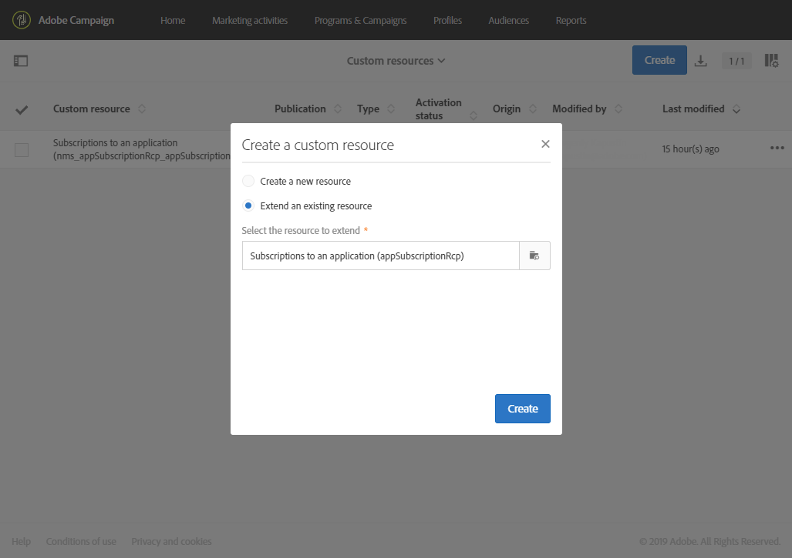
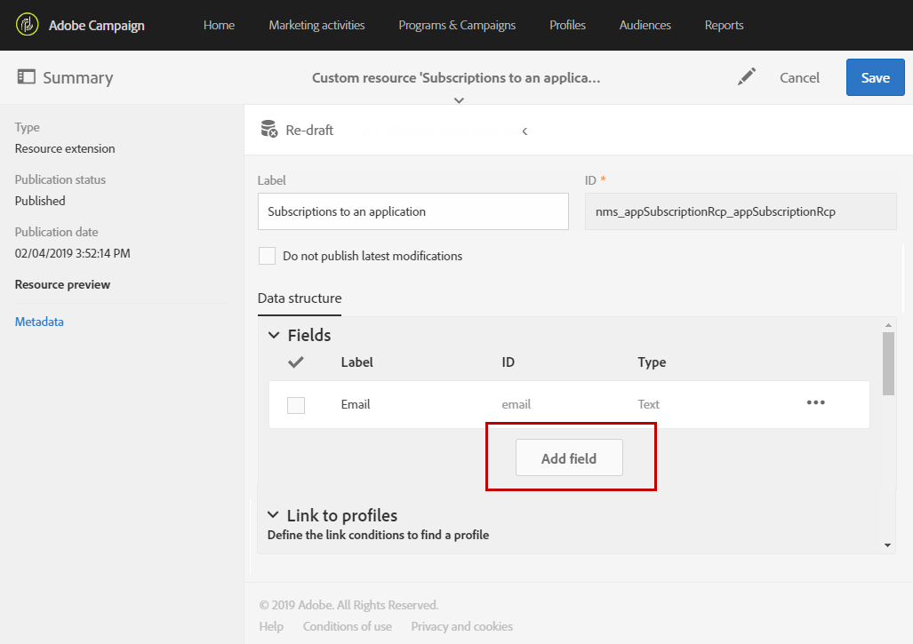
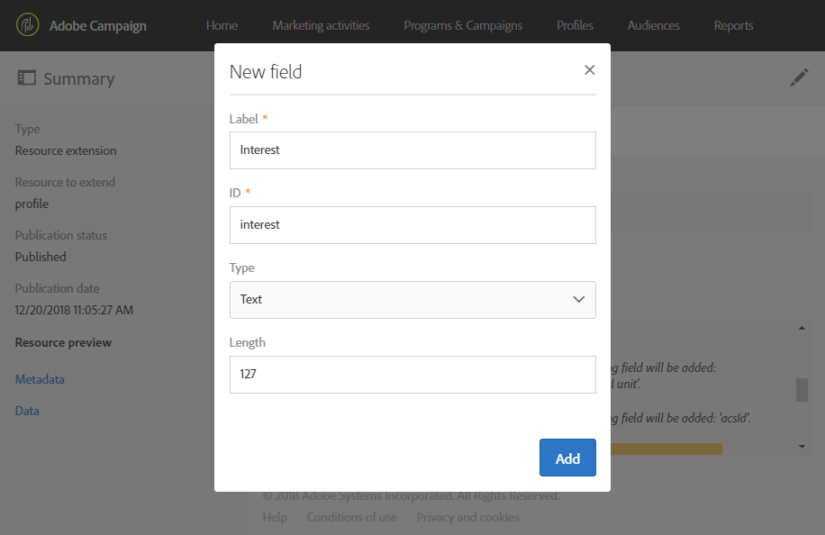
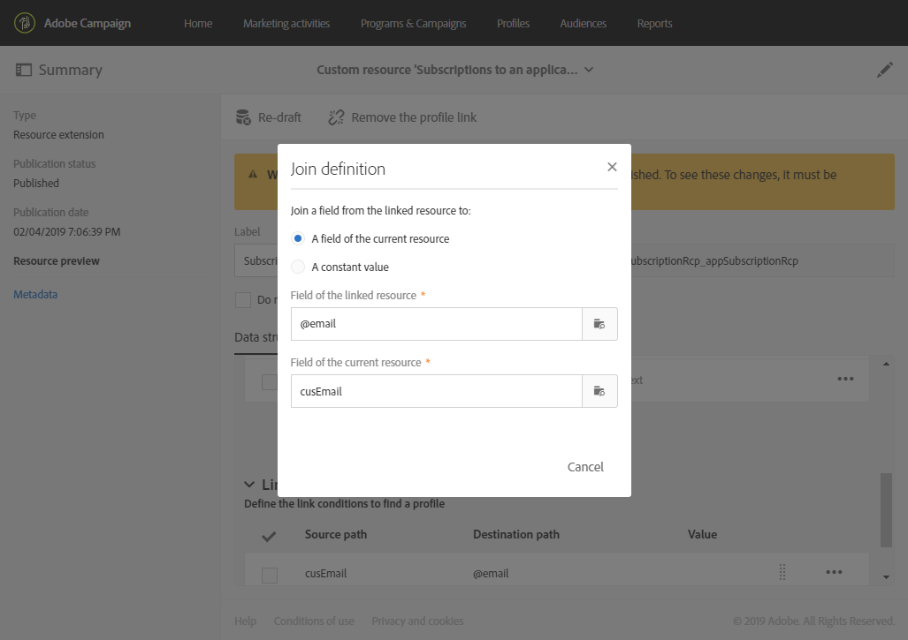

# Extensão das subscrições para um recurso de aplicativo{#extending-the-subscriptions-to-an-application-resource}

No Adobe Campaign, os dados de atributos do perfil móvel enviados de dispositivo móvel são armazenados no recurso **[!UICONTROL Subscriptions to an application (appSubscriptionRcp)]**, que permite definir os dados que você deseja coletar dos assinantes de aplicativos. Para obter mais informações sobre recursos personalizados, consulte [esta página](../../developing/using/key-steps-to-add-a-resource.md).

Esse recurso pode ser estendido para coletar dados que você pretende enviar do dispositivo móvel para o Adobe Campaign.

1. No menu avançado, selecione **[!UICONTROL Administration]** > **[!UICONTROL Development]** e **[!UICONTROL Custom resources]** pelo logotipo do Adobe Campaign.
1. Clique em **[!UICONTROL Create]** e escolha a opção **[!UICONTROL Extend an existing resource]**.
1. Selecione o recurso **[!UICONTROL Subscriptions to an application (appSubscriptionRcp)]** e clique em **[!UICONTROL Create]**.

   

1. Na categoria **[!UICONTROL Fields]** da guia **[!UICONTROL Data structure]**, defina os dados do cliente que deseja recuperar do aplicativo móvel clicando no botão **[!UICONTROL Add field]**.

   >[!NOTE]
   >
   >Se você estiver gerenciando vários aplicativos móveis, todos os campos usados por todos os aplicativos devem ser listados. A chamada de PII coletada pela iOS ou Android define quais campos são capturados por cada aplicativo.

   

1. Adicione um **[!UICONTROL Label]** e um **[!UICONTROL ID]** ao novo campo. Selecione o **[!UICONTROL Type]** do seu campo.

   

1. Na categoria **[!UICONTROL Link to profiles]**, configure a chave de reconciliação usada para vincular os perfis do banco de dados do Adobe Campaign aos assinantes de seus aplicativos, como o email.

   Observe que, para suas mensagens no aplicativo, você só pode definir uma chave de reconciliação para todos os aplicativos móveis.

   

1. **[!UICONTROL Save]** e publique seu recurso personalizado. Para obter mais informações sobre publicação de recursos personalizados, consulte esta [página](../../developing/using/updating-the-database-structure.md#publishing-a-custom-resource).
