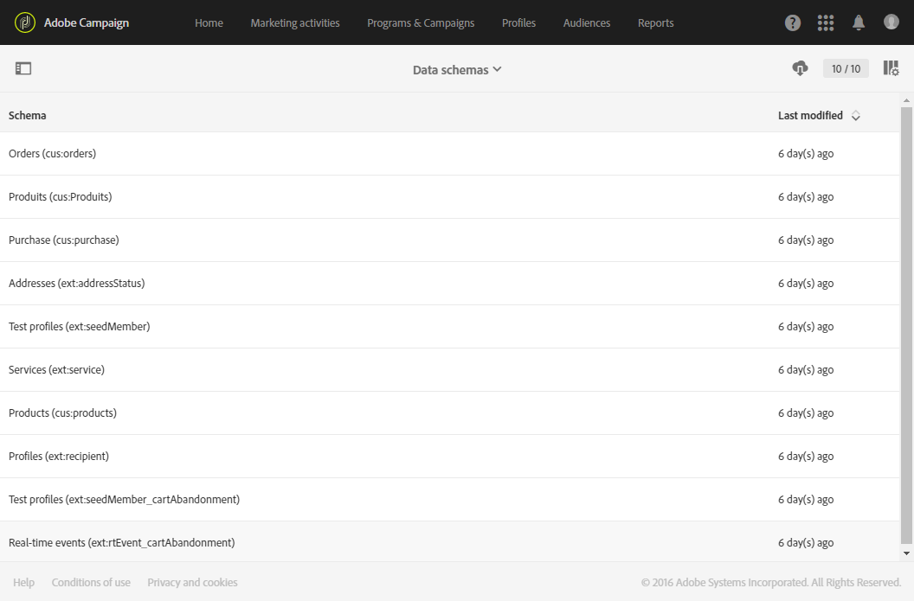
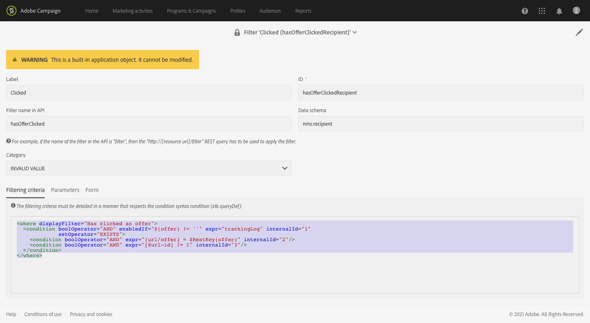

# Monitoramento de alterações no modelo de dados{#monitoring-data-model-changes}

No menu **[!UICONTROL Diagnosis]**, é possível exibir os objetos técnicos gerados pelo aplicativo para analisá-los.

>[!NOTE]
>
>As telas nesse menu são somente leitura.



Você pode exibir os seguintes tipos de objetos:

* Esquemas de dados
* Páginas da Web
* Filtros
* Navegação
* Componentes
* Processos em lote

É possível alterar a configuração da lista:

* Você pode adicionar e remover colunas.
* Você pode definir nomes de coluna.
* Você pode definir a ordem de exibição das colunas na lista.
* Você pode escolher a ordem de classificação dos valores na lista.

Você pode filtrar a lista:

* Você pode incluir ou excluir esquemas de dados nativos, páginas da Web, filtros e objetos de navegação.
* Você pode pesquisar objetos pelo nome deles.
* Você pode filtrar os trabalhos em lotes com base em seu status, data de início e data de término.

Você pode baixar a lista exibida em um arquivo no formato TXT com valores separados por vírgula.

Você pode exibir os detalhes do objeto selecionado.

Por exemplo, você pode usar esse recurso para exibir os critérios de filtragem de filtros prontos para uso. Este exemplo mostra o código exibido para os critérios de filtragem de um filtro pronto para uso:

```xml
<where displayFilter="Has clicked an offer">
  <condition boolOperator="AND" enabledIf="$(offer) != ''" expr="trackingLog" internalId="1" setOperator="EXISTS">
    <condition boolOperator="AND" expr="[url/offer] = $RestKey(offer)" internalId="2"/>
    <condition boolOperator="AND" expr="[@url-id] != 1" internalId="3"/>
  </condition>
</where>
```

