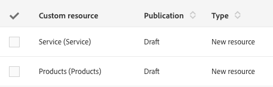

# Status dos recursos{#resource-statuses}

Dependendo do status de publicação ou ativação, os recursos podem ter status diferentes.

Há duas colunas dedicadas à exibição desses status na variável **[!UICONTROL Custom resources]** tela.

**Status da publicação**

* **Rascunho**: o recurso acabou de ser criado ou recriado. Para criar as tabelas do banco de dados, bem como as APIs correspondentes, o recurso deve ser republicado. Se um recurso estiver sendo recriado, ele se tornará inativo automaticamente após a etapa de publicação.
* **Rerascunho pendente**: o recurso foi reformulado. O processo de recriação de rascunho ocorrerá durante a próxima publicação. A reformulação é irreversível. Várias mensagens de aviso são exibidas para informar o usuário, tanto ao recriar quanto ao se preparar para publicar.

   Para obter mais informações sobre reformulação, consulte [Exclusão de um recurso](../../developing/using/deleting-a-resource.md).

   >[!NOTE]
   >
   >A variável **[!UICONTROL Cancel re-draft]** A opção está disponível quando o recurso que você deseja recriar ainda contém links por meio de outros recursos com o status &quot;Publicado&quot;. Essa opção permite reverter o processo de &quot;recriação de rascunho&quot;. Os recursos personalizados retornarão aos status originais.

* **Publicado**: o recurso foi publicado. Se o recurso for modificado após a última data de modificação, uma mensagem será exibida convidando você a republicar o recurso para considerar as modificações mais recentes.

A variável **[!UICONTROL Do not publish latest modifications]** impede que as modificações sejam consideradas durante publicações futuras.

Esse campo pode ser configurado na definição de recurso personalizado.
