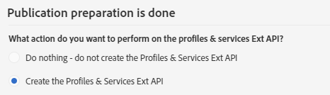
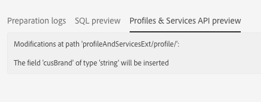

# Etapa 2: publicar a extensão{#step-publish-the-extension}

1. No menu avançado, selecione **[!UICONTROL Administration]** > **[!UICONTROL Development]** e **[!UICONTROL Publication]** pelo logotipo do Adobe Campaign.
1. Clique no botão **[!UICONTROL Prepare Publication]**.
1. Selecione a opção **[!UICONTROL Create the Profiles & Services Ext API]**.

   

   >[!NOTE]
   >
   >Se a API já tiver sido publicada (ou seja, se você já tiver marcado essa opção uma vez, para esse recurso ou outro recurso), a atualização da API será forçada.

1. Clique na guia **[!UICONTROL Profiles & Services API Preview]**.

   Isso mostrará as alterações que a publicação da API aplicará à versão atual da API profilesAndServicesExt.

   Aqui, o campo Código promocional (ID: cusBrand) será inserido na API.

   

1. Clique no botão **[!UICONTROL Publish]**.
